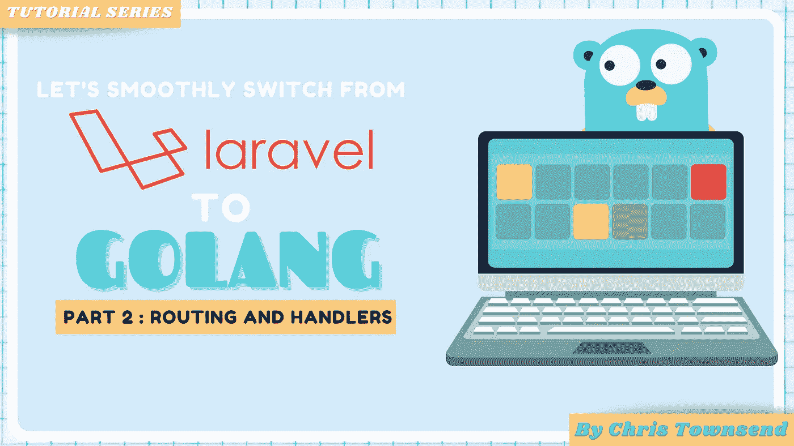
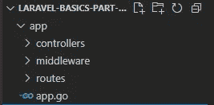
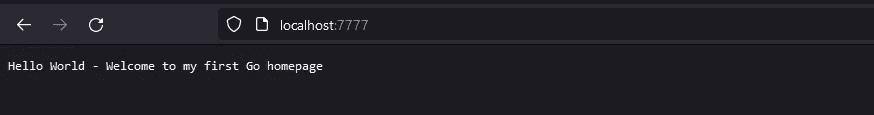

# Laravel to Go —第 2 部分—路由和处理程序

> 原文：<https://medium.com/geekculture/laravel-to-go-part-2-routing-and-handlers-1303d8f529a5?source=collection_archive---------4----------------------->



从 Laravel 的角度来看，是时候解决 Golang 中的路由和处理程序问题了。

> *这是该系列的第 2 部分，所以如果你还没有看过* [*第 1 部分*](/geekculture/laravel-to-go-part-1-basics-502fb236fdf0) *，那么请先访问那篇文章，别忘了关注我并为我鼓掌！*

*TL；DR:*[https://github . com/townsymush/laravel-to-go-series/tree/main/part-2-routing-and-handlers](https://github.com/townsymush/laravel-to-go-series/tree/main/part-2-routing-and-handlers)*链接到本练习的代码*

[](/geekculture/laravel-to-go-part-1-basics-502fb236fdf0) [## Laravel to Go -第 1 部分-基础知识

### 这是关于如何从 Laravel 迁移到 Go 的一组文章的第一部分。这第一部分非常基础，但是…

medium.com](/geekculture/laravel-to-go-part-1-basics-502fb236fdf0) 

# 控制器

在拉勒维尔，我们有控制器。这些控制器方法通常倾向于映射到一条路线。所以你可能会看到这样的东西

Controller method to route

在 Laravel 中，我们将为我们的路由编写控制器方法，然后在 routes 文件中声明该路由。我们可以通过创建 http.Handler 在 Go 中复制这种方法。

我们将在 Go 中展示相同的概念，让我们从创建文件夹结构开始。



Folder structure for demo

在我们的控制器目录下创建一个名为`home.go`的新文件。这将代表我们的 HomeController 类，就像在 Laravel 中一样。我们首先将第 1 部分中的代码移到这个控制器中，并修改 cmd/main.go 文件

你现在可以像在第一部分`go run cmd/main.go`中那样运行它，你应该会看到相同的结果



很好，现在我们已经将我们的处理程序从我们的`main.go`文件中分离出来，但是我们仍然没有充分利用 net/http 包中的可用资源。所以让我们改变这一点。

# JSON 响应

我们想把我们的应用程序在一个 JSON API，并开始返回 JSON 响应。为此，我们可以开始利用`net/http`包和`encoding/json`包的力量。这些都包含在 Go 的标准库中。

要点

*   我们使用`http.ResponseWriter`将我们的输出写到客户端
*   我们使用`w.Header().Add()`方法为我们的响应编写内容类型头
*   我们使用`json.Marshal`函数来创建一个 json 字节串
*   我们使用`w.Write(b)`将 json 字符串写到输出中
*   我们使用`w.WriteHeader`来设置我们响应的状态代码

如果我们运行`go run cmd/main.go`，我们将会看到相同的消息，但是是 json 输出。

# 重构

在上面的例子中，第 17 到 29 行将在我们创建的每个处理程序中重复，让我们看看如何简化我们的响应编写，类似于 Laravel

```
return response()->json(["message" => "Hello World"])';
```

我们首先在控制器目录中创建一个名为`response.go`的新文件，并创建一些结构来帮助我们在方法中更加[干燥](https://en.wikipedia.org/wiki/Don%27t_repeat_yourself)。

## 要点

*   我们创建了一个名为 responder 的接口。我们还没有使用它，但是它记录了一个 responder 结构(jsonResponse)的预期行为
*   jsonResponse 结构保存了需要写入 http 响应的消息和状态代码
*   WriteResponse 函数是我们处理程序中代码的重复。

下一步是将这个新功能添加到我们的处理程序中，简化它的使用。

# 综述

恭喜您，您现在已经在 Go 中创建了一个 json api 端点，并学会了如何像 Laravel 一样构建应用程序的 http 部分。

正如我在第 1 部分中所说的，这并不是我构建生产应用程序的必要方式，但是我认为这将有助于那些从 Laravel 过渡的人。

我们有:

*   使用了 [http。处理器接口](https://pkg.go.dev/net/http#Handler)创建一个处理器
*   创建了一个结构，我们可以像类一样使用它，并从它调用方法
*   在同一应用程序中创建了其他包

现在尝试制作一个错误响应，而不是日志。18 号线致命。

> *感谢您阅读这篇文章。请添加一些掌声，并给我一个后续通知第 3 部分。随着合作伙伴计划的变化，如果我能得到您的支持，这真的有助于我保持动力！我保证这次不会花这么长时间！*

## 第 3 部分将向我们的迷你应用程序添加中间件和请求验证。

[](https://townsyio.medium.com/larvel-to-go-part-3-middleware-and-requst-validation-610e57b6e85f) [## 第 3 部分——中间件和需求验证

### 这是该系列的第 3 部分，所以如果你还没有看过第 1 部分，请首先访问那篇文章，并请给我…

townsyio.medium.com](https://townsyio.medium.com/larvel-to-go-part-3-middleware-and-requst-validation-610e57b6e85f)