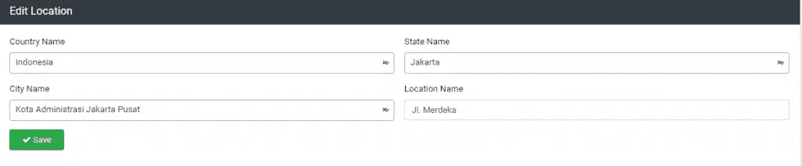

# Laravel 教程:使用 Select2 创建动态从属对象

> 原文：<https://medium.com/geekculture/laravel-tutorial-creating-dynamic-dependent-with-select2-e175ab8ed35a?source=collection_archive---------4----------------------->


你好，你们都好吗，又和泰曼·恩戈丁一起回来了。

这次我们将使用 Select2 创建一个动态依赖项，这个程序对于您创建使用多重选择的应用程序非常重要。例如这次我们将进行多级选择。

好吧，在我继续之前，让我们继续这个教程。您可以学习其他教程:

[拉勒维尔教程~拉勒维尔雄辩关系](https://temanngoding.com/tutorial-laravel-laravel-eloquent-relationships/)

[使用范围在 Laravel](https://temanngoding.com/menggunakan-scope-di-laravel/)

[使用 Laravel 中的软删除完成教程](https://temanngoding.com/tutorial-lengkap-menggunakan-soft-delete-di-laravel/)

[如何在 Laravel 使用播种机](https://temanngoding.com/cara-menggunakan-seeder-di-laravel/)

[教程用 Laravel 8 上传图片](https://temanngoding.com/tutorial-upload-gambar-dengan-laravel-8/)

前提条件:

*   已经安装了作曲家
*   已安装的终端(CMD、Cmder、Git bash)
*   虚拟网络服务器(XAMPP、拉里根等)
*   网络浏览器(Google Chrome、Mozilla Firefox、Opera 网络浏览器等)
*   数据库已经安装(MySQL，MariaDB 等)
*   创建一个名为 location 的新数据库

在我们继续之前，你们可以使用 **db:migration** 或通过 **phpmyadmin** 每天创建多个表。

1.  国家表

```
CREATE TABLE `loc_countries` (
  `id` mediumint(8) UNSIGNED NOT NULL,
  `name` varchar(100) COLLATE utf8mb4_unicode_ci NOT NULL,
  `created_at` timestamp NULL DEFAULT NULL,
  `updated_at` timestamp NOT NULL DEFAULT current_timestamp() ON UPDATE current_timestamp()
) ENGINE=InnoDB DEFAULT CHARSET=utf8mb4 COLLATE=utf8mb4_unicode_ci;INSERT INTO `loc_countries` (`id`, `name``created_at`, `updated_at` VALUES
(102, 'Indonesia','2018-07-20 13:11:03'),
```

2.状态表

```
CREATE TABLE `loc_states` (
  `id` mediumint(8) UNSIGNED NOT NULL,
  `name` varchar(255) COLLATE utf8mb4_unicode_ci NOT NULL,
  `country_id` mediumint(8) UNSIGNED NOT NULL,
  `created_at` timestamp NULL DEFAULT NULL,
  `updated_at` timestamp NOT NULL DEFAULT current_timestamp() ON UPDATE current_timestamp(),
) ENGINE=InnoDB DEFAULT CHARSET=utf8mb4 COLLATE=utf8mb4_unicode_ci;INSERT INTO `loc_states` (`id`, `name`, `country_id``created_at`, `updated_at`) VALUES
(1805, 'Jakarta', 102, '2019-10-05 10:48:44', '2020-12-21 08:50:22'0'),
(1806, 'Kalimantan', 102, '2019-10-05 10:48:44', '2020-12-21 08:50:22'),
```

3.城市表

```
CREATE TABLE `loc_cities` (
  `id` mediumint(8) UNSIGNED NOT NULL,
  `name` varchar(255) COLLATE utf8mb4_unicode_ci NOT NULL,
  `state_id` mediumint(8) UNSIGNED NOT NULL,
  `country_id` mediumint(8) UNSIGNED NOT NULL,
  `created_at` timestamp NOT NULL DEFAULT '2013-12-31 18:01:01',
  `updated_at` timestamp NOT NULL DEFAULT current_timestamp() ON UPDATE current_timestamp(),
) ENGINE=InnoDB DEFAULT CHARSET=utf8mb4 COLLATE=utf8mb4_unicode_ci;INSERT INTO `loc_cities` (`id`, `name`, `state_id`, `country_id`, `created_at`, `updated_at`, `flag`, `wikiDataId`) VALUES
(56722, 'Kota Administrasi Jakarta Barat', 1805, 102,'2019-10-05 11:53:39', '2019-10-05 11:53:39'),
(56723, 'Kota Administrasi Jakarta Pusat', 1805, 102, '2019-10-05 11:53:39', '2019-10-05 11:53:39'),
(56724, 'Kota Administrasi Jakarta Selatan', 1805, 102, '2019-10-05 11:53:39', '2019-10-05 11:53:39'),
(56725, 'Kota Administrasi Jakarta Timur', 1805, 102, '2019-10-05 11:53:39', '2019-10-05 11:53:39'),
(56726, 'Kota Administrasi Jakarta Utara', 1805, 102, '2019-10-05 11:53:39', '2019-10-05 11:53:39'),
```

4.地址表

```
CREATE TABLE `loc_address` (
  `id` int(10) UNSIGNED NOT NULL,
  `name` text COLLATE utf8_unicode_ci DEFAULT NULL,
  `city_id` int(10) UNSIGNED NOT NULL,
  `state_id` int(10) UNSIGNED NOT NULL,
  `country_id` int(10) UNSIGNED NOT NULL,
  `latitude` varchar(191) COLLATE utf8_unicode_ci DEFAULT NULL,
  `longitude` varchar(191) COLLATE utf8_unicode_ci DEFAULT NULL,
  `created_at` timestamp NULL DEFAULT NULL,
  `updated_at` timestamp NULL DEFAULT NULL
) ENGINE=InnoDB DEFAULT CHARSET=utf8 COLLATE=utf8_unicode_ci;INSERT INTO `loc_address` (`id`, `name`, `city_id`, `state_id`, `country_id`, `latitude`, `longitude`, `created_at`, `updated_at`) VALUES
(3, 'Jl. Merdeka', 56723, 1805, 102, NULL, NULL, '2022-06-13 00:49:27', '2022-06-13 00:49:27');
```

# Installasi laravel

通过作曲家安装

```
composer create-project laravel/laravel location
```

# 数据库配置

打开。env 文件并配置数据库，如下所示

```
DB_CONNECTION=mysql
DB_HOST=127.0.0.1
DB_PORT=3306
DB_DATABASE=location
DB_USERNAME=root
DB_PASSWORD=
```

# 制作模型

**国家型号**

```
php artisan make:model LocCountry
```

```
<?php

namespace App;

use Illuminate\Database\Eloquent\Model;

*class* LocCountry extends Model
{
    //------------------------------------ Attributes ---------------------------

    protected  $guarded = ['id'];
    protected $table = 'loc_countries';

    public *function* state()
    {
        return $this->hasMany('App\LocState');
    }

} /* end of class */
```

**模型状态**

```
php artisan make:model LocState
```

```
<?php

namespace App;

use Illuminate\Database\Eloquent\Model;

*class* LocState extends Model {

    protected  $guarded = ['id'];
    protected $table = 'loc_states';

    public *function* city()
    {
        return $this->hasMany('App\LocCity');
    }

    public *function* country()
    {
        return $this->belongsTo('App\LocCountry');
    }
}
```

**模范城市**

```
php artisan make:model LocCity
```

```
<?php

namespace App;

use Illuminate\Database\Eloquent\Model;

*class* LocCity extends Model
{

    protected  $guarded = ['id'];
    protected $table = 'loc_cities';

    public *function* state()
    {
        return $this->belongsTo('App\LocState','state_id');
    }
}
```

**车型地址**

```
php artisan make:model LocAddress
```

```
<?php

namespace App;

use App\Observers\LocationObserver;
use Illuminate\Database\Eloquent\Model;

*class* LocAddress extends Model
{
    protected $table = 'loc_address';

    protected static *function* boot() {
        parent::boot();
        static::observe(LocationObserver::*class*);
    }

    public *function* city()
    {
        return $this->belongsTo('App\LocCity','city_id');
    }

    public *function* state()
    {
        return $this->belongsTo('App\LocState','state_id');
    }

    public *function* country()
    {
        return $this->belongsTo('App\LocCountry','country_id');
    }
}
```

# **创建布局**

在 resources\views\文件夹中，创建一个名为 index.blade.php 的新文件，然后输入以下代码:

**index.blade.php**

```
@extends('layouts.master')

@section('content')
    <div *class*="row">
        <div *class*="col-md-12">
            <div *class*="card">
                <div *class*="card-body">
                    @permission('create_location')
                    <div *class*="d-flex justify-content-center justify-content-md-end mb-3">
                        <a href="{{ route('admin.locations.create') }}" *class*="btn btn-rounded btn-primary mb-1"><i *class*="fa fa-plus"></i> @lang('app.createNew')</a>
                    </div>
                    @endpermission
                    <div *class*="table-responsive">
                        <table id="myTable" *class*="table w-100">
                            <thead>
                                <tr>
                                    <th>#</th>
                                    <th>@lang('app.city')</th>
                                    <th>@lang('app.address')</th>
                                    <th>@lang('app.action')</th>
                                </tr>
                            </thead>
                        </table>
                    </div>
                </div>
            </div>
        </div>
    </div>
@endsection

@push('footer-js')
    <script>
        $(document).ready(*function*() {
            var table = $('#myTable').dataTable({
                responsive: true,
                // processing: true,
                serverSide: true,

                ajax: '{!! route('admin.locations.index') !!}',
                language: languageOptions(),
                "fnDrawCallback": *function*( oSettings ) {
                    $("body").tooltip({
                        selector: '[data-toggle="tooltip"]'
                    });
                },
                columns: [
                    { data: 'DT_RowIndex'},
                    // { data: 'image', name: 'image' },
                    { data: 'city.name', name: 'city.name' },
                    { data: 'name', name: 'name' },
                    // { data: 'status', name: 'status' },
                    { data: 'action', name: 'action', width: '20%' }
                ]
            });
            new $.fn.dataTable.FixedHeader( table );

            $('body').on('click', '.delete-row', *function*(){
                var id = $(this).data('row-id');
                console.log(id);
                swal({
                    icon: "warning",
                    buttons: ["@lang('app.cancel')", "@lang('app.ok')"],
                    dangerMode: true,
                    title: "@lang('errors.areYouSure')",
                    text: "@lang('errors.deleteWarning')",
                })
                    .then((willDelete) => {
                        if (willDelete) {
                            var url = "{{ route('admin.locations.destroy',':id') }}";
                            url = url.replace(':id', id);
                            var token = "{{ csrf_token() }}";

                            $.easyAjax({
                                type: 'POST',
                                url: url,
                                data: {'_token': token, 'id':id,'_method': 'DELETE'},
                                success: *function* (response) {
                                    if (response.status == "success") {
                                        $.unblockUI();
//                                    swal("Deleted!", response.message, "success");
                                        table._fnDraw();
                                    }
                                }
                            });
                        }
                    });
            });
        } );
    </script>
@endpush
```

**create.blade.php**

```
@extends('layouts.master')

@section('content')
    <div *class*="row">
        <div *class*="col-md-12">
            <div *class*="card card-dark">
                <div *class*="card-header">
                    <h3 *class*="card-title">@lang('app.add') @lang('app.location')</h3>
                </div>
                <!-- /.card-header -->
                <div *class*="card-body">
                    <form role="form" id="createForm"  *class*="ajax-form" method="POST" onkeydown="return event.key != 'Enter';">
                        @csrf

                        <input type="hidden" name="redirect_url" value="{{ url()->previous() }}">

                        <div *class*="row">
                              <div *class*="col-md-12 mx-auto">
                                <div *class*="form-group row">
                                    <div *class*="col-md-6">
                                       <label>@lang('app.country') @lang('app.name')</label>
                                       <select id="select_country" name="country" *class*="form-control">
                                       </select>
                                    </div>

                                 <div *class*="col-md-6">
                                    <label>@lang('app.state') @lang('app.name')</label>
                                    <select id="select_state" name="state" *class*="form-control">
                                    </select>
                                 </div>
                              </div>

                              <div *class*="form-group row">
                                 <div *class*="col-md-6">

                                    <label>@lang('app.city') @lang('app.name')</label>
                                    <select id="select_city" name="city" *class*="form-control">
                                    </select>

                                 </div>

                                 <div *class*="col-md-6">

                                  <!-- text input -->

                                    <label>@lang('app.address') @lang('app.name')</label>
                                    <input type="text" *class*="form-control" name="name" autocomplete="off">
                                 </div>
                              </div>

                                {{--<div *class*="form-group">--}}
                                    {{--<label for="exampleInputPassword1">@lang('app.image')</label>--}}
                                    {{--<div *class*="card">--}}
                                        {{--<div *class*="card-body">--}}
                                            {{--<input type="file" id="input-file-now" name="image" accept=".png,.jpg,.jpeg" *class*="dropify"--}}
                                            {{--/>--}}
                                        {{--</div>--}}
                                    {{--</div>--}}
                                {{--</div>--}}

                                <div *class*="form-group">
                                    <button type="button" id="save-form" *class*="btn btn-success btn-light-round"><i
                                                *class*="fa fa-check"></i> @lang('app.save')</button>
                                </div>
                        </div>

                    </form>
                </div>
                <!-- /.card-body -->
            </div>
            <!-- /.card -->
        </div>
    </div>
@endsection

@push('footer-js')

    <script>
        {{--$('.dropify').dropify({--}}
            {{--messages: {--}}
                {{--default: '@lang("app.dragDrop")',--}}
                {{--replace: '@lang("app.dragDropReplace")',--}}
                {{--remove: '@lang("app.remove")',--}}
                {{--error: '@lang('app.largeFile')'--}}
            {{--}--}}
        {{--});--}}

        $('#save-form').click(*function* () {

            $.easyAjax({
                url: '{{route('admin.address.store')}}',
                container: '#createForm',
                type: "POST",
                redirect: true,
                file:true,
                data: $('#createForm').serialize()
            })
        });

    </script>
      <script>
        $(document).ready(*function*() {

         var $element = $('#select_country').select2(); // the select element you are working with

         var $request = $.ajax({
            url: '{{route('admin.countries.select')}}' // wherever your data is actually coming from
         });

         $request.then(*function* (data) {
            // This assumes that the data comes back as an array of data objects
            // The idea is that you are using the same callback as the old `initSelection`

            for (var d = 0; d < data.length; d++) {
               var item = data[d];

               // Create the DOM option that is pre-selected by default
               var option = new Option(item.name, item.id, true, true);

               // Append it to the select
               $element.append(option);
            }

            // Update the selected options that are displayed
            $element.trigger('change');
         });

           $('#select_country').select2({
              placeholder: 'Search Country',
              allowClear: true,
              width: '100%',
              ajax: {
                 url:  '{{route('admin.countries.select')}}',
                 dataType: 'json',
                 delay: 250,
                 processResults: *function*(data) {
                    return {
                       results: $.map(data, *function*(item) {
                          return {
                             text: item.name,
                             id: item.id
                          }
                       })
                    };
                 }
              }
           }).on('select2:opening', *function*(e) {
               $(this).data('select2').$dropdown.find(':input.select2-search__field').attr('placeholder', 'Search Country')
           });

         $('#select_country').change(*function*() {
            //clear select
            $('#select_state').empty();
            $("#select_city").empty();
            //set id
            let countryID = $(this).val();
            if (countryID) {
               $('#select_state').select2({
                allowClear: true,
                width: '100%',
                  ajax: {
                     url: '{{route('admin.states.select')}}?countryID=' + countryID,
                     dataType: 'json',
                     delay: 250,
                     processResults: *function*(data) {
                        return {
                           results: $.map(data, *function*(item) {
                              return {
                                 text: item.name,
                                 id: item.id
                              }
                           })
                        };
                     }
                  }
               });
            } else {
               $('#select_state').empty();
               $("#select_city").empty();
            }
         });

        $('#select_state').change(*function*() {
            //clear select
            $("#select_city").empty();
            //set id
            let stateID = $(this).val();
            if (stateID) {
               $('#select_city').select2({
                  allowClear: true,
                  width: '100%',
                  ajax: {
                     url: '{{ route('admin.cities.select') }}?stateID=' + stateID,
                     dataType: 'json',
                     delay: 250,
                     processResults: *function*(data) {

                        console.log(data);
                        return {
                           results: $.map(data, *function*(item) {
                              return {
                                 text: item.name,
                                 id: item.id
                              }
                           })
                        };
                     }
                  }
               });
            }
         });

          // EVENT ON CLEAR
          $('#select_country').on('select2:clear', *function*(e) {
            $("#select_state").select2();
            $("#select_city").select2();
         });

         $('#select_state').on('select2:clear', *function*(e) {
            $("#select_city").select2();
         });
        });
   </script>

@endpush
```

**edit.blade.php**

```
@extends('layouts.master')

@section('content')
    <div *class*="row">
        <div *class*="col-md-12">
            <div *class*="card card-dark">
                <div *class*="card-header">
                    <h3 *class*="card-title">@lang('app.edit') @lang('app.location')</h3>
                </div>
                <!-- /.card-header -->
                <div *class*="card-body">
                    <form role="form" id="createForm"  *class*="ajax-form" method="POST" onkeydown="return event.key != 'Enter';">
                        @csrf
                        @method('POST')
                        <input type="hidden" name="id" value="{{ $location->id }}">
                        <div *class*="row">
                           <div *class*="col-md-12 mx-auto">
                                <div *class*="form-group row">
                                    <div *class*="col-md-6">
                                       <label>@lang('app.country') @lang('app.name')</label>
                                       <select id="select_country" name="country" *class*="form-control">
                                          <option value="{{ $location->country->id}}" selected>{{ $location->country->name }}</option>
                                       </select>
                                    </div>
                                    <div *class*="col-md-6">
                                       <label>@lang('app.state') @lang('app.name')</label>
                                       <select id="select_state" name="state" *class*="form-control">
                                          <option value="{{ $location->state->id}}" selected>{{ $location->state->name }}</option>
                                       </select>
                                    </div>
                                </div>
                                <div *class*="form-group row">
                                    <div *class*="col-md-6">
                                       <label>@lang('app.city') @lang('app.name')</label>
                                       <select id="select_city" name="city" *class*="form-control">
                                          <option value="{{ $location->city->id}}" selected>{{ $location->city->name }}</option>
                                       </select>
                                    </div>
                                    <!-- text input -->
                                    <div *class*="col-md-6">
                                       <label>@lang('app.location') @lang('app.name')</label>
                                       <input type="text" *class*="form-control" name="name" value="{{ $location->name }}" autocomplete="off">
                                    </div>
                                 </div>

                                <div *class*="form-group">
                                    <button type="button" id="save-form" *class*="btn btn-success btn-light-round"><i
                                                *class*="fa fa-check"></i> @lang('app.save')</button>
                                </div>

                            </div>
                        </div>

                    </form>
                </div>
                <!-- /.card-body -->
            </div>
            <!-- /.card -->
        </div>
    </div>
@endsection

@push('footer-js')

    <script>
        {{--$('.dropify').dropify({--}}
            {{--messages: {--}}
                {{--default: '@lang("app.dragDrop")',--}}
                {{--replace: '@lang("app.dragDropReplace")',--}}
                {{--remove: '@lang("app.remove")',--}}
                {{--error: '@lang('app.largeFile')'--}}
            {{--}--}}
        {{--});--}}

        $('#save-form').click(*function* () {
            $.easyAjax({
                url: '{{route('admin.address.update', $location->id)}}',
                container: '#createForm',
                type: "POST",
                redirect: true,
                file:true,
                data: $('#createForm').serialize()
            })
        });
    </script>
   <script>
    $(document).ready(*function*() {
       // set var id
       let countryID = $('#select_country').val();
       let stateID = $('#select_state').val();
       let cityID = $('#select_city').val();

       //  select province:start
       $('#select_country').select2({
          allowClear: true,
          width: '100%',
          ajax: {
            url:  '{{route('admin.countries.select')}}',
             dataType: 'json',
             delay: 250,
             processResults: *function*(data) {
                return {
                   results: $.map(data, *function*(item) {
                      return {
                         text: item.name,
                         id: item.id
                      }
                   })
                };
             }
          }
       });

       $('#select_state').select2({
            allowClear: true,
            width: '100%',
            ajax: {
                url: '{{route('admin.states.select')}}?countryID=' + countryID,
                     dataType: 'json',
                     delay: 250,
                     processResults: *function*(data) {
                        return {
                           results: $.map(data, *function*(item) {
                              return {
                                 text: item.name,
                                 id: item.id
                              }
                           })
                        };
                     }
            }
         });

          $('#select_city').select2({
            allowClear: true,
            width: '100%',
            ajax: {
                     url: '{{ route('admin.cities.select') }}?stateID=' + stateID,
                     dataType: 'json',
                     delay: 250,
                     processResults: *function*(data) {

                        console.log(data);
                        return {
                           results: $.map(data, *function*(item) {
                              return {
                                 text: item.name,
                                 id: item.id
                              }
                           })
                        };
                     }
                  }
         });

       $('#select_country').select2({
              allowClear: true,
              width: '100%',
              ajax: {
                 url:  '{{route('admin.countries.select')}}',
                 dataType: 'json',
                 delay: 250,
                 processResults: *function*(data) {
                    return {
                       results: $.map(data, *function*(item) {
                          return {
                             text: item.name,
                             id: item.id
                          }
                       })
                    };
                 }
              }
           });

         $('#select_country').change(*function*() {
            //clear select
            $('#select_state').empty();
            $("#select_city").empty();
            //set id
            let countryID = $(this).val();
            if (countryID) {
               $('#select_state').select2({
                  allowClear: true,
                  width: '100%',
                  ajax: {
                     url: '{{route('admin.states.select')}}?countryID=' + countryID,
                     dataType: 'json',
                     delay: 250,
                     processResults: *function*(data) {
                        return {
                           results: $.map(data, *function*(item) {
                              return {
                                 text: item.name,
                                 id: item.id
                              }
                           })
                        };
                     }
                  }
               });
            } else {
               $('#select_state').empty();
               $("#select_city").empty();
            }
         });

        $('#select_state').change(*function*() {
            //clear select
            $("#select_city").empty();
            //set id
            let stateID = $(this).val();
            if (stateID) {
               $('#select_city').select2({
                  allowClear: true,
                   width: '100%',
                  ajax: {
                     url: '{{ route('admin.cities.select') }}?stateID=' + stateID,
                     dataType: 'json',
                     delay: 250,
                     processResults: *function*(data) {

                        console.log(data);
                        return {
                           results: $.map(data, *function*(item) {
                              return {
                                 text: item.name,
                                 id: item.id
                              }
                           })
                        };
                     }
                  }
               });
            }
         });

          // EVENT ON CLEAR
          $('#select_country').on('select2:clear', *function*(e) {
            $("#select_state").select2();
            $("#select_city").select2();
         });

         $('#select_state').on('select2:clear', *function*(e) {
            $("#select_city").select2();
         });
    });
   </script>
@endpush
```

# **创建控制器**

LocationController.php

```
<?php

namespace App\Http\Controllers\Admin;

use App\Helper\Reply;
use App\Http\Controllers\Controller;
use App\Http\Requests\Location\StoreLocation;
use App\Location;
use App\LocCity;
use App\LocState;
use App\LocAddress;
use App\LocCountry;
use Illuminate\Http\Request;

*class* LocationController extends Controller
{

    public *function* __construct()
    {
        parent::__construct();
        view()->share('pageTitle', __('menu.locations'));
    }

    /**
     * Display a listing of the resource.
     *
     * @return \Illuminate\Http\Response
     */
    public *function* index()
    {
        abort_if(!$this->user->roles()->withoutGlobalScopes()->first()->hasPermission('read_location'), 403);
        if(request()->ajax()){
            $locations = LocAddress::with('city')->get();
            return datatables()->of($locations)
                ->addColumn('action', *function* ($row) {
                    $action = '';

                    if ($this->user->roles()->withoutGlobalScopes()->first()->hasPermission('update_location')) {
                        $action.= '<a href="' . route('admin.locations.edit', [$row->id]) . '" class="btn btn-primary btn-circle"
                          data-toggle="tooltip" data-original-title="'.__('app.edit').'"><i class="fa fa-pencil" aria-hidden="true"></i></a>';
                    }

                    if ($this->user->roles()->withoutGlobalScopes()->first()->hasPermission('delete_location')) {
                        $action.= ' <a href="javascript:;" class="btn btn-danger btn-circle delete-row"
                        data-toggle="tooltip" data-row-id="' . $row->id . '" data-original-title="'.__('app.delete').'"><i class="fa fa-times" aria-hidden="true"></i></a>';
                    }
                    return $action;
                })
                ->editColumn('name', *function* ($row) {
                    return ucfirst($row->name);
                })
                ->addIndexColumn()
                ->rawColumns(['action'])
                ->toJson();
        }
        return view('admin.location.index');
    }

    /**
     * Show the form for creating a new resource.
     *
     * @return \Illuminate\Http\Response
     */
    public *function* create()
    {
        abort_if(!$this->user->roles()->withoutGlobalScopes()->first()->hasPermission('create_location'), 403);

        return view('admin.location.create');
    }

        /**
     * Remove the specified resource from storage.
     *
     * @param  \App\Location  $location
     * @return \Illuminate\Http\Response
     */
    public *function* selectCountry(Request $request)
    {
        $countries = [];

        if ($request->has('q')) {
            $search = $request->q;
            $countries = LocCountry::select("id", "name")
                ->Where('name', 'LIKE', "%$search%")
                ->get();
        } else {
            $countries = LocCountry::select('id', 'name')->where('name', 'Indonesia')->get();
        }
        return response()->json($countries);
    }

        /**
     * Remove the specified resource from storage.
     *
     * @param  \App\Location  $location
     * @return \Illuminate\Http\Response
     */
    public *function* selectState(Request $request)
    {
        $regencies = [];
        $countryID = $request->countryID;
        if ($request->has('q')) {
            $search = $request->q;
            $regencies = LocState::select("id", "name")
                ->where('country_id', $countryID)
                ->Where('name', 'LIKE', "%$search%")
                ->get();
        } else {
            $regencies = LocState::where('country_id', $countryID)->limit(10)->get();
        }
        return response()->json($regencies);
    }

        /**
     * Remove the specified resource from storage.
     *
     * @param  \App\Location  $location
     * @return \Illuminate\Http\Response
     */
    public *function* selectCity(Request $request)
    {
        $city = [];
        $stateID = $request->stateID;
        if ($request->has('q')) {
            $search = $request->q;
            $city = LocCity::select("id", "name")
                ->where('state_id', $stateID)
                ->Where('name', 'LIKE', "%$search%")
                ->get();
        } else {
            $city = LocCity::where('state_id', $stateID)->limit(10)->get();
        }
        return response()->json($city);
    }

          /**
     * Remove the specified resource from storage.
     *
     * @param  \App\Location  $location
     * @return \Illuminate\Http\Response
     */
    public *function* selectAddress(Request $request)
    {
        $address = [];

        if ($request->has('q')) {
            $search = $request->q;
            $address = LocAddress::with('city')
                ->Where('name', 'LIKE', "%$search%")
                ->get();
        } else {
            $address = LocAddress::with('city')->limit(10)->get();
        }
        return response()->json($address);
    }

           /**
     * Remove the specified resource from storage.
     *
     * @param  \App\Location  $location
     * @return \Illuminate\Http\Response
     */
    public *function* storeAddress(Request $request)
    {
        abort_if(!$this->user->roles()->withoutGlobalScopes()->first()->hasPermission('create_location'), 403);

        $location = new LocAddress();
        $location->city_id = $request->city;
        $location->state_id = $request->state;
        $location->country_id = $request->country;
        $location->name = $request->name;

        $location->save();

        return Reply::redirect($request->redirect_url, __('messages.createdSuccessfully'));
    }

      /**
     * Update the specified resource in storage.
     *
     * @param  \Illuminate\Http\Request  $request
     * @param  \App\Location  $location
     * @return \Illuminate\Http\Response
     */
    public *function* updateAddress(Request $request)
    {
        abort_if(!$this->user->roles()->withoutGlobalScopes()->first()->hasPermission('update_location'), 403);

        $location = LocAddress::find($request->id);
        $location->city_id = $request->city;
        $location->state_id = $request->state;
        $location->country_id = $request->country;
        $location->name = $request->name;

        $location->save();

        return Reply::redirect(route('admin.locations.index'), __('messages.updatedSuccessfully'));
    }

    /**
     * Remove the specified resource from storage.
     *
     * @param  \App\Location  $location
     * @return \Illuminate\Http\Response
     */
    public *function* destroyAddress(Request $request)
    {
        abort_if(!$this->user->roles()->withoutGlobalScopes()->first()->hasPermission('delete_location'), 403);

        LocAddress::destroy($request->id);

        return Reply::success(__('messages.recordDeleted'));
    }

}
```

# **路线配置**

{projectName}\routes\web.php

```
<?php

/*
|--------------------------------------------------------------------------
| Web Routes
|--------------------------------------------------------------------------
|
| Here is where you can register web routes for your application. These
| routes are loaded by the RouteServiceProvider within a group which
| contains the "web" middleware group. Now create something great!
|
*/

Auth::routes();

        Route::resources(
            [
                'locations' => 'LocationController',
            ]
        );
        Route::get('countries', 'LocationController@selectCountry')->name('countries.select');
        Route::get('states', 'LocationController@selectState')->name('states.select');
        Route::get('cities', 'LocationController@selectCity')->name('cities.select');
        Route::get('adress', 'LocationController@selectAddress')->name('address.select');
        Route::post('storeAddress', 'LocationController@storeAddress')->name('address.store');
        Route::post('updateAddress', 'LocationController@updateAddress')->name('address.update');
        Route::post('deleteAddress', 'LocationController@destroyAddress')->name('address.destroy');
```



这就是我这次做的教程，希望对大家有用。

**谢谢。**