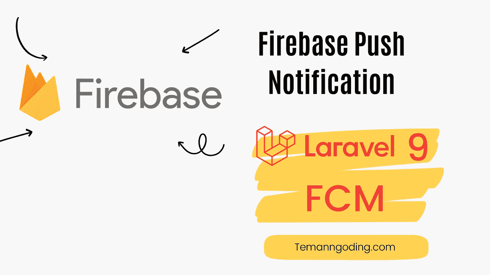
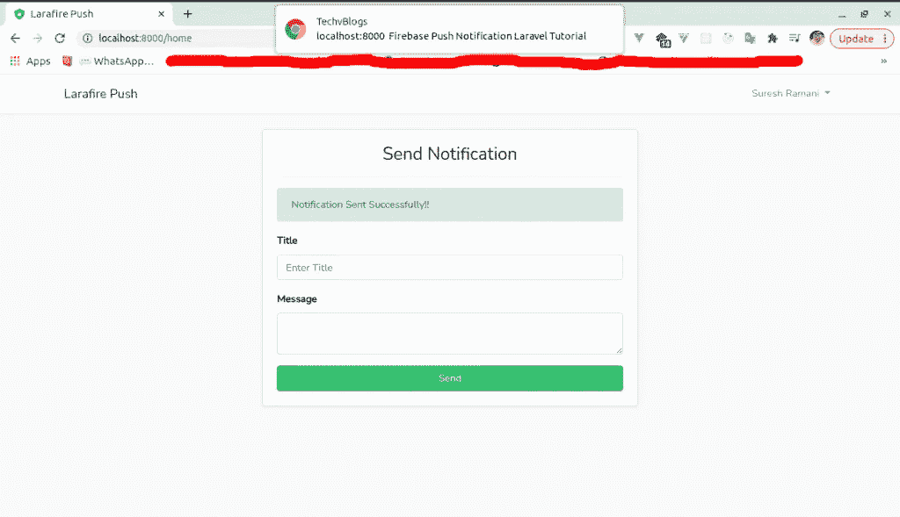
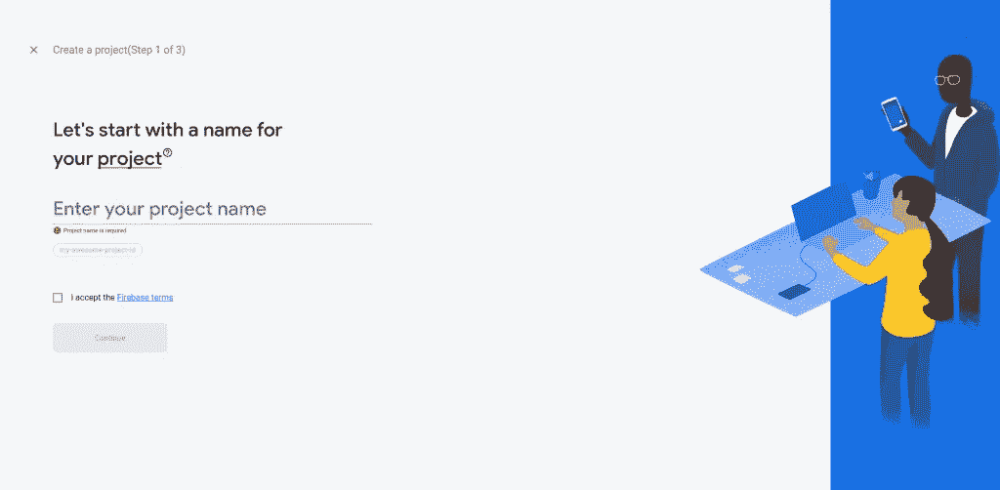
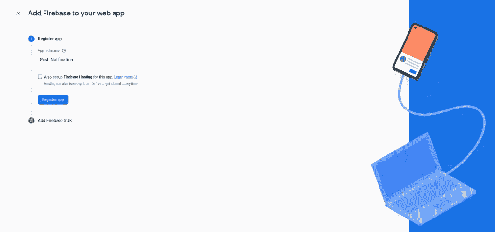
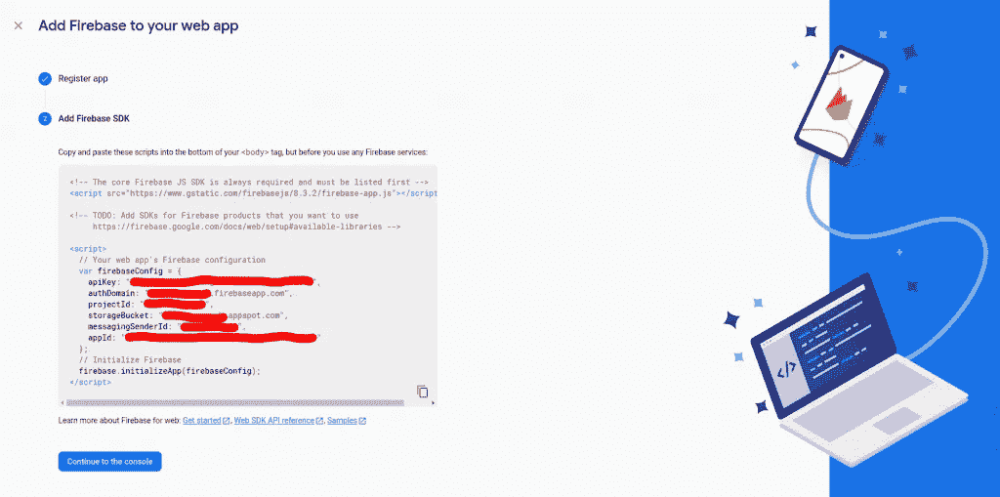
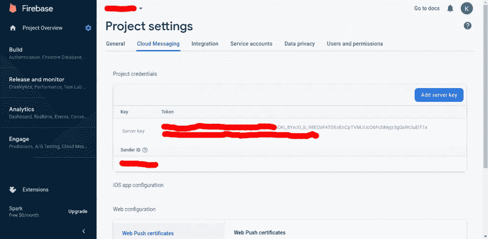

# Laravel 教程:使用 Firebase Laravel 9 推送通知

> 原文：<https://medium.com/geekculture/laravel-tutorial-push-notification-with-firebase-laravel-9-3095058c2155?source=collection_archive---------1----------------------->



你好，朋友们，这次我们将讨论如何使用 Laravel 创建通知。使用 Laravel firebase 的推送通知对于基于客户端的应用程序来说非常重要，因为当有新消息时，它对于通知非常有用。

推送通知是出现在用户浏览器中的可点击弹出消息，无论用户使用的是什么设备或浏览器。它们作为一种快速的沟通渠道，允许公司向客户传递信息、报价或其他信息。

朋友们可以学习其他教程:

[Laravel 教程:使用 Select2 创建动态依赖项](https://temanngoding.com/tutorial-laravel-membuat-dynamic-dependent-dengan-select2/)

[拉勒维尔教程~拉勒维尔口才关系](https://temanngoding.com/tutorial-laravel-laravel-eloquent-relationships/)

[使用范围在 Laravel](https://temanngoding.com/menggunakan-scope-di-laravel/)

# 重火力点

Firebase 是 Google 提供的一项服务，旨在为应用程序开发人员提供便利，甚至让他们更容易开发应用程序。Firebase 又名 BaaS(后端即服务)是 Google 提供的一个解决方案，用于加速开发人员的工作。

通过使用 Firebase，应用程序开发人员可以专注于开发应用程序，而无需在后端投入大量精力。

# FCM (Firebase 云消息传递)

FCM (Firebase Cloud Messaging)提供了可靠的连接，当然也节省了服务器之间和设备之间的电池。因此，你可以在 Android、iOS 和网络上免费收发信息和通知。

要定位高级消息，您可以使用人口统计和行为，通过预定义的细分轻松定位消息。您可以将消息发送到订阅了特定主题的设备。此外，您还可以只针对一个设备来获取详细的数据信息。通常这是为测试过程而做的。

这些通知消息与 Google Analytics for Firebase 完全集成，因此您可以获得详细的参与和转换跟踪。好吧，你可以从一个单一的仪表板上监控效果，而不需要编码或创建你自己的程序。



1.  **安装 Laravel**

我们将安装 laravel。打开终端，输入下面的命令。

```
composer create-project --prefer-dist laravel/laravel notif-push
```

**2。设置数据库**

完成安装后，现在我们将进行数据库连接。

```
DB_CONNECTION=mysql 
DB_HOST=127.0.0.1 
DB_PORT=3306 
DB_DATABASE=<DATABASE NAME>
DB_USERNAME=<DATABASE USERNAME>
DB_PASSWORD=<DATABASE PASSWORD>
```

**3。安装库授权**

现在，我们将创建登录、注册和仪表板。在所有朋友的终端中输入下面的命令。

```
composer require laravel/uiphp artisan ui bootstrap --authnpm install && npm run dev
```

**4。迁移**

这一次我们将迁移所有现有的表。

```
php artisan migrate
```

接下来，我们将创建一个迁移来添加 fcm_token kolom 列。

```
php artisan make:migration "add fcm_token column to users table"
```

**database/migrations/2022 _ 06 _ 28 _ 063655 _ add _ FCM _ token _ column _ to _ users _ table . PHP**

```
<?php

use Illuminate\Database\Migrations\Migration;
use Illuminate\Database\Schema\Blueprint;
use Illuminate\Support\Facades\Schema;

class AddFcmTokenColumnToUsersTable extends Migration
{
    /**
     * Run the migrations.
     *
     * @return void
     */
    public function up()
    {
        Schema::table('users', function (Blueprint $table) {
            Schema::table('users', function (Blueprint $table) {
                $table->dropColumn('fcm_token');
            });
        });
    }

    /**
     * Reverse the migrations.
     *
     * @return void
     */
    public function down()
    {
        Schema::table('users', function (Blueprint $table) {
            $table->dropColumn('fcm_token');
        });
    }
}
```

更新迁移后，再次运行迁移命令。

```
php artisan migrate
```

5.模型设置

打开并自定义 app/Models/Users.php 文件。

```
<?php

namespace App\Models;

use Illuminate\Contracts\Auth\MustVerifyEmail;
use Illuminate\Database\Eloquent\Factories\HasFactory;
use Illuminate\Foundation\Auth\User as Authenticatable;
use Illuminate\Notifications\Notifiable;
use Laravel\Sanctum\HasApiTokens;

class User extends Authenticatable
{
    use HasApiTokens, HasFactory, Notifiable;

    /**
     * The attributes that are mass assignable.
     *
     * @var array<int, string>
     */
    protected $fillable = [
        'name',
        'email',
        'password',
        'fcm_token'
    ];

    /**
     * The attributes that should be hidden for serialization.
     *
     * @var array<int, string>
     */
    protected $hidden = [
        'password',
        'remember_token',
        'remember_token',
    ];

    /**
     * The attributes that should be cast.
     *
     * @var array<string, string>
     */
    protected $casts = [
        'email_verified_at' => 'datetime',
    ];
}
```

**6。创建一个 Firebase 项目**

**a .创建 Firebase 项目**



**b.** **在已创建的项目中创建 Web App**



**c. Web App 配置详情**



**7。控制器**

**app \ Http \ Controllers \ home controller . PHP**

```
public function updateToken(Request $request){
    try{
        $request->user()->update(['fcm_token'=>$request->token]);
        return response()->json([
            'success'=>true
        ]);
    }catch(\Exception $e){
        report($e);
        return response()->json([
            'success'=>false
        ],500);
    }
}
```

在 **routes/web.php** 中添加一条路线

```
use App\Http\Controllers\HomeController;

Route::get('/', function () {
    return view('welcome');
});

Auth::routes();

Route::get('/home', [HomeController::class, 'index'])->name('home');
Route::patch('/fcm-token', [HomeController::class, 'updateToken'])->name('fcmToken');
Route::post('/send-notification',[HomeController::class,'notification'])->name('notification');
```

**8。Kode Firebase**

**资源/视图/布局/app.blade.php**

```
<!-- The core Firebase JS SDK is always required and must be listed first -->
<script src="https://www.gstatic.com/firebasejs/8.3.2/firebase-app.js"></script>
<script src="https://www.gstatic.com/firebasejs/8.3.2/firebase-messaging.js"></script>

<!-- TODO: Add SDKs for Firebase products that you want to use
    https://firebase.google.com/docs/web/setup#available-libraries -->

<script>
    // Your web app's Firebase configuration
    var firebaseConfig = {
        apiKey: "XXXXXXXXXXXXXXXXXXXXXXXXXX",
        authDomain: "XXXXXXX.firebaseapp.com",
        projectId: "XXXXXXXXXX",
        storageBucket: "XXXXXXXXXX.appspot.com",
        messagingSenderId: "XXXXXXXXXX",
        appId: "1:XXXXXXXXX:web:XXXXXXXXXXXXX"
    };
    // Initialize Firebase
    firebase.initializeApp(firebaseConfig);

    const messaging = firebase.messaging();

    function initFirebaseMessagingRegistration() {
        messaging.requestPermission().then(function () {
            return messaging.getToken()
        }).then(function(token) {

            axios.post("{{ route('fcmToken') }}",{
                _method:"PATCH",
                token
            }).then(({data})=>{
                console.log(data)
            }).catch(({response:{data}})=>{
                console.error(data)
            })

        }).catch(function (err) {
            console.log(`Token Error :: ${err}`);
        });
    }

    initFirebaseMessagingRegistration();

    messaging.onMessage(function({data:{body,title}}){
        new Notification(title, {body});
    });
</script>
```

在公共文件夹中创建一个 firebase-messaging-sw.js 文件。

```
importScripts('https://www.gstatic.com/firebasejs/8.3.2/firebase-app.js');
importScripts('https://www.gstatic.com/firebasejs/8.3.2/firebase-messaging.js');

firebase.initializeApp({
    apiKey: "XXXXXXXXXXXXXXXXXXXXXXXXX",
    projectId: "XXXXXXXX",
    messagingSenderId: "XXXXXXXXX",
    appId: "1:XXXXXXXX:web:XXXXXXXXXXX"
});

const messaging = firebase.messaging();
messaging.setBackgroundMessageHandler(function({data:{title,body,icon}}) {
    return self.registration.showNotification(title,{body,icon});
});
```

10。推送通知

为了获得通知，我们使用 Larafirebase 包。

安装 Larafirebase

```
composer require kutia-software-company/larafirebasephp artisan vendor:publish --provider="Kutia\Larafirebase\Providers\LarafirebaseServiceProvider"
```

中添加 Firebase 服务器密钥。环境文件。

```
FIREBASE_SERVER_KEY=XXXXXXXXXXXXXXXXXXXXX
```



**config/larafirebase . PHP**

```
return [
    'authentication_key' => env('FIREBASE_SERVER_KEY')
];
```

**app/Http/Controllers/home controller . PHP**

```
public function notification(Request $request){
    $request->validate([
        'title'=>'required',
        'message'=>'required'
    ]);

    try{
        $fcmTokens = User::whereNotNull('fcm_token')->pluck('fcm_token')->toArray();

        //Notification::send(null,new SendPushNotification($request->title,$request->message,$fcmTokens));

        /* or */

        //auth()->user()->notify(new SendPushNotification($title,$message,$fcmTokens));

        /* or */

        Larafirebase::withTitle($request->title)
            ->withBody($request->message)
            ->sendMessage($fcmTokens);

        return redirect()->back()->with('success','Notification Sent Successfully!!');

    }catch(\Exception $e){
        report($e);
        return redirect()->back()->with('error','Something goes wrong while sending notification.');
    }
}
```

我们使用以下命令创建通知:

```
php artisan make:notification SendPushNotification
```

**app \ Notifications \ sendphusnotification . PHP**

```
namespace App\Notifications;

use Illuminate\Bus\Queueable;
use Illuminate\Contracts\Queue\ShouldQueue;
use Illuminate\Notifications\Notification;
use Kutia\Larafirebase\Messages\FirebaseMessage;

class SendPushNotification extends Notification
{
    use Queueable;

    protected $title;
    protected $message;
    protected $fcmTokens;

    /**
     * Create a new notification instance.
     *
     * @return void
     */
    public function __construct($title,$message,$fcmTokens)
    {
        $this->title = $title;
        $this->message = $message;
        $this->fcmTokens = $fcmTokens;
    }

    /**
     * Get the notification's delivery channels.
     *
     * @param  mixed  $notifiable
     * @return array
     */
    public function via($notifiable)
    {
        return ['firebase'];
    }

    public function toFirebase($notifiable)
    {
        return (new FirebaseMessage)
            ->withTitle($this->title)
            ->withBody($this->message)
            ->withPriority('high')->asMessage($this->fcmTokens);
    }
}
```

可以使用该功能，例如:

```
use Notification;
use App\Notifications\SendPushNotification;

Notification::send(null,new SendPushNotification($title,$message,$fcmTokens));
```

现在运行命令:

```
php artisan serve
```

因此这次我给出的教程，希望有用。

***谢了。***