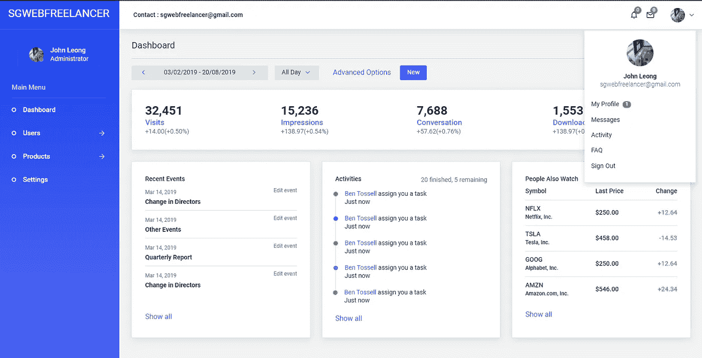

# 使用中间件对用户和管理员进行 Laravel v8 身份验证

> 原文：<https://medium.com/geekculture/laravel-v8-authentication-for-user-and-admin-using-middleware-f14171aa4efa?source=collection_archive---------0----------------------->

本教程的目的是，当用户通过登录页面登录时，如果用户的类型是管理员，他/她将被重定向到管理仪表板，否则将转到普通主页。除此之外，我们需要确保如果用户没有管理员角色登录，他/她就无法访问管理仪表板。