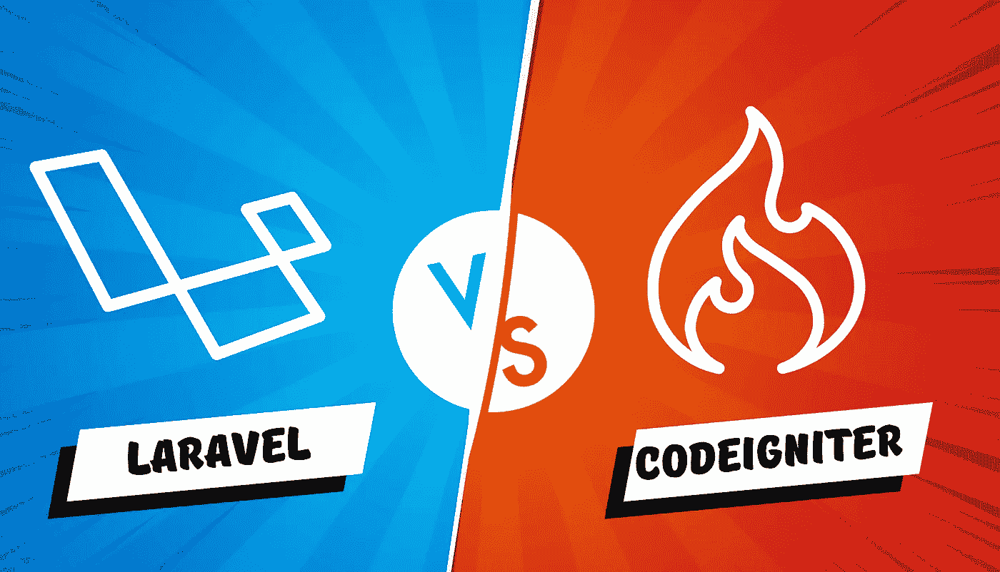
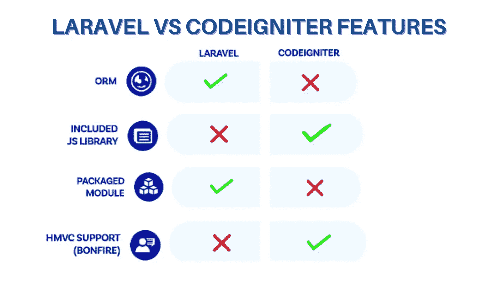

# Laravel vs CodeIgniter:有什么区别，应该用哪个？

> 原文：<https://medium.com/geekculture/laravel-vs-codeigniter-whats-the-difference-and-which-one-should-you-use-daf9cd270acc?source=collection_archive---------5----------------------->

后端开发人员经常选择 PHP 作为他们的首选语言，因为它在创建独特的应用程序时既灵活又易于使用。PHP 社区的使用数据证明了这一点。

为了减少花在网站开发上的时间，PHP 框架是必要的。现在有很多 PHP web 应用程序框架，其中 Laravel 和 CodeIgniter 是最流行的。

本文将比较 CodeIgniter 和 Laravel 这两个流行的 web 开发框架，以确定哪一个是[最佳 web 开发框架](https://jumpgrowth.com/top-10-web-development-frameworks/)。让我们仔细看看 Laravel 和 CodeIgniter，看看它们在概念上有什么不同。了解为什么您应该为您的下一个 web 应用程序开发项目选择 Laravel 或 CodeIgniter。

# **什么是 Laravel/CodeIgniter 框架？**

## **什么是 Laravel？**

Taylor Otwell 创建了开源 PHP web 框架 Laravel，以使用 Symfony 开创的模型-视图-控制器(MVC)设计模式创建健壮的 web 应用程序。它是一个可靠的 PHP 框架，因为它遵循精确且富于表现力的语言规范，其源代码可在 GitHub 上获得，并在 MIT 许可下发布。

Laravel development 将 web 应用程序开发中需要的一些活动合理化，例如路由、认证、缓存和会话，以节省大量时间和资源。

Laravel 有几个有用的特性，比如从关系数据库访问数据的灵活方法，带有专用依赖管理器的集成打包系统，有助于应用程序维护和部署的特性，以及对语法糖的强调。Laravel 的灵活性意味着它可以用于许多 web 应用程序项目。

## **什么是 CodeIgniter？**

CodeIgniter PHP 框架是一个强大的工具。换句话说，这是一个为开发人员设计的工具包，他们更愿意使用一个干净的框架来构建复杂的 web 应用程序。当谈到开发动态网站的 PHP 框架时，CodeIgniter 是首选。

由于它消除了对模型-视图-控制器设计范例的依赖，它给了用户前所未有的灵活性。并且它支持外部插件，这在构建高级功能时非常有用。此外，它的加密和安全功能是一流的。

# **Laravel vs. CodeIgniter:有什么区别？**

## **1。数据库管理系统兼容性**

**Laravel:** 兼容 JDBC 标准和其他数据库管理系统，如 Oracle、Microsoft SQL Server、IBM DB2、MySQL 和 PostgreSQL。

**CodeIgniter:** 数据库管理系统，包括 MySQL、PostgreSQL、微软商业智能、MongoDB。然而，CodeIgniter 也可以与各种其他众所周知的数据库一起工作。

## **2。Laravel vs CodeIgniter 人气**

**拉勒韦尔:**现在正处于历史最好时期。它对代码表达的强调是经验丰富的程序员的最爱。

**CodeIgniter:** 因其 **2。X** 简单，它被大多数 web 开发者使用。

## **3。结构和更新**

**Laravel:** 它的结构和更新遵循模型-视图-控制器模式。您现在就可以使用附带的命令行实用程序。

**CodeIgniter:** 模型-视图-控制器(MVC)结构，特点是简单明了。这个框架很脆弱。面向对象编程。虽然许多程序员出于自己的目的使用它。

## **4。内置模块**

**Laravel:** 这个框架能够轻松地添加新模块。开发人员可以使用这个包将较大的项目分解成易于管理的块。

CodeIgniter:CodeIgniter 中没有内置的模块化选项。因此，开发人员必须使用模块化扩展来构建和管理独立的组件。

## **5。支持 RESTful API**

在 RESTful 控制器的帮助下，开发者可以快速轻松地创建各种各样的 REST APIs。

当 REST APIs 变得越来越流行时，CodeIgniter 并没有让它们的创建变得容易。

## 6。模板引擎和 API 构建

Laravel: 它有一个易于使用但功能强大的模板引擎，很像 Blade，以及一个可以在其上构建的 API 框架。为了提高 web 应用程序的性能，PHP 开发人员可以使用刀片模板引擎来修改和增强视图。

**CodeIgniter:** 与其他框架不同，CodeIgniter 没有提供专用的模板引擎。开发人员必须将它与模板引擎工具(如 smarty)结合起来。正因为如此，他们可以做日常工作，提升网站的功能。

## **7。在线帮助和库**

Laravel: 有大量的官方文档，可以在在线帮助和库中找到。

CodeIgniter :提供了许多预构建的特性，他们的网站上有一个有用的指南，不需要任何编程经验。

## **8。数据库型号**

**拉勒韦尔:**面向关系对象

**CodeIgniter:** 面向对象

## **9。模板语言**

**Laravel:** 刀片的模板引擎

**CodeIgniter:** PHP 专有

## **10。编程范例**

**面向组件**

**CodeIgniter:** 面向对象的事件驱动函数

## **11。HTTP 支持**

**Laravel:** 支持 HTTP 意味着开发者可以创建他们的 HTTPS 路线。每个 HTTPS 端点都可以有自己唯一的 URL，这是开发人员可以设定的。

**CodeIgniter:**CodeIgniter 不支持 HTTPS。这意味着编码人员可以采用 URL 安全措施，如建立 pat 来保证数据传输的安全。

## **12。认证**

**Laravel:** 认证类功能简化了应用程序的认证和授权规则的实现。

CodeIgniter: 缺乏任何内置的安全性。用户身份验证和授权需要开发人员创建的 CodeIgniter 扩展。

## 13。单元测试

**Laravel:** 感谢 PHPUnit 和其他单元测试工具，程序员可以确保他们的代码始终没有错误。

**CodeIgniter:**CodeIgniter 没有内置的单元测试工具。程序和代码的质量只能通过使用额外的单元测试工具来评估，开发人员必须使用这些工具。

## **14:学习曲线**

Laravel: 有如此多的高级选项，对于新手来说可能很难掌握。

**CodeIgniter:** 对于新手来说更容易上手和利用。

# **考虑 Laravel/CodeIgniter 的理由。**

## 为什么您应该考虑使用 Laravel？

*   Laravel 的内置版本控制系统简化了迁移管理。
*   基于 Composer 的依赖管理器和模块化打包
*   支持雄辩的 ORM(对象关系映射)，一种增强的活动记录实现。
*   兼容流行的数据库管理系统选项，如 MySQL、PostgreSQL 和 SQL Server
*   刀片模板引擎是提供的特性之一。
*   代码行接口和 artisan 命令支持
*   广泛且有据可查
*   Laravel 复杂的查询构建机制允许您对 DBM 对象集合施加限制。
*   框架自动加载，消除了繁琐的手动维护和包含路径创建的需要。
*   在 LOC 容器的帮助下，框架简化了新工具的创建。

## **使用 CodeIgniter 的好处**

*   CodeIgniter 有一个非常活跃的支持社区，它既有帮助，又能快速响应问题。
*   有条理清晰的记录
*   提供更多支撑和稳定性
*   它提供了一种简单的流量路由方式。
*   您的网站的性能和加载时间可以受益于此工具的缓存。

# **Laravel vs CodeIgniter 特点**

## **拉勒维尔的特征**

*   快速整合外部库
*   可堆叠的容器
*   一个完全基于 composer 的依赖管理器
*   可能通过查询生成器替换 ORM
*   易于操作的叶片建模软件
*   集成的安全功能，包括身份验证和缓存
*   无与伦比的出色会话管理
*   增加 IO 功能

## **CodeIgniter 的特点**

*   简单明了的 MVC 框架
*   超轻、紧凑的设计
*   输入和输出的验证
*   防范跨站点脚本和其他安全问题
*   允许会话管理
*   图像处理:一个库
*   提供分页和数据加密支持
*   上传文件课程
*   能够加密用户数据
*   错误记录
*   单元测试类，模板引擎类，日历类都有。
*   使用搜索引擎友好的 URL
*   挂钩和类扩展的结合
*   提供输入和表单的验证
*   从班级发送电子邮件的内置帮助

## **Laravel vs CodeIgniter 哪个更容易？**

两种 PHP 框架都很有用，都有一些优点。然而，一个是否是最好的取决于手头的任务。尽管如此，Laravel 圆滑而强大的特性使它比 CodeIgniter 稍有优势，许多人认为它是最好的 PHP 框架之一。

## **总结**

通过浏览上面的博客，我希望你能决定你的下一个项目是雇佣 Laravel 开发服务公司还是 CodeIgniter 开发服务公司。

你可以借助互联网的帮助，找到最好的提供软件和网络应用程序开发服务的 Laravel 开发公司，并轻松完成你的下一个网络开发项目。