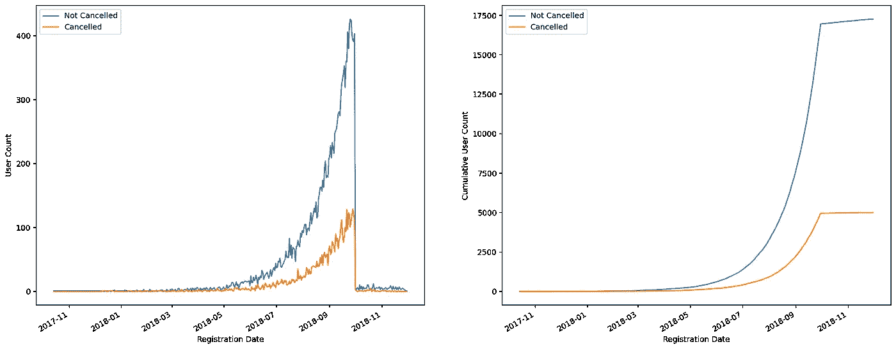
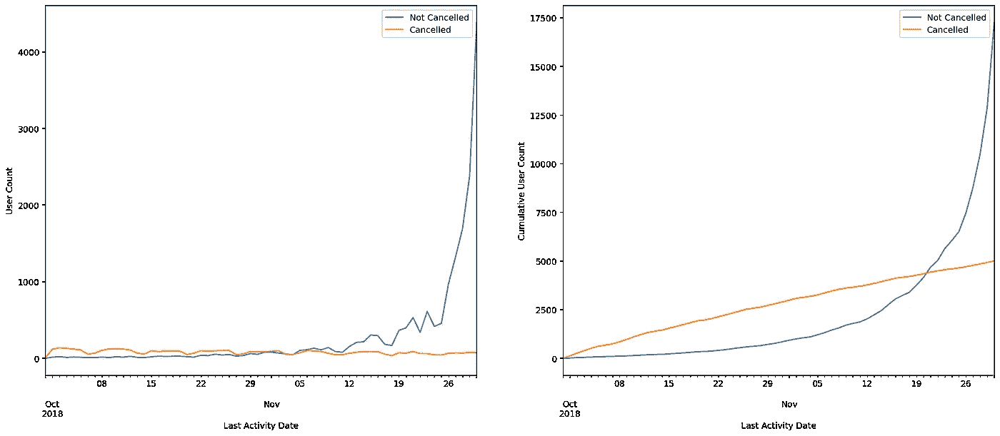
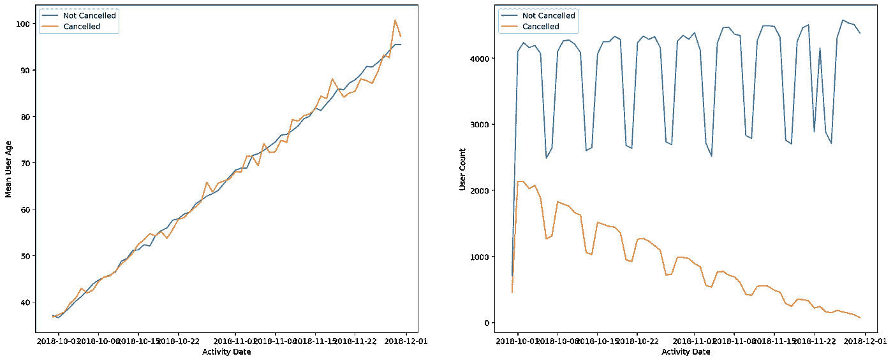
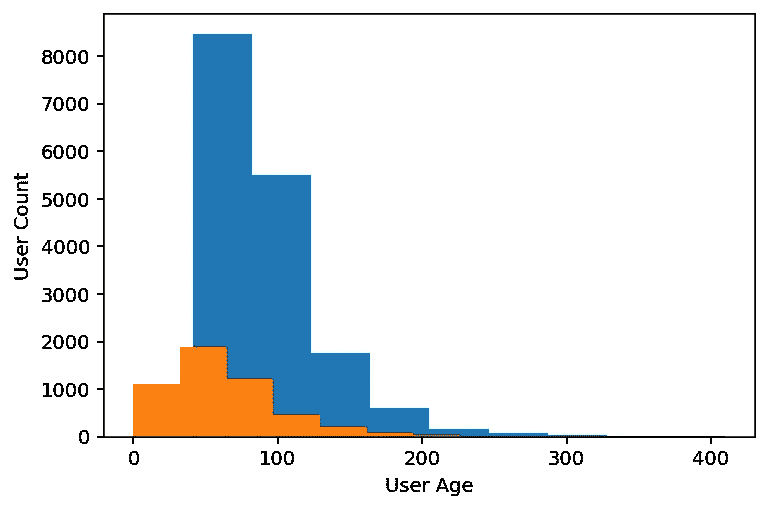
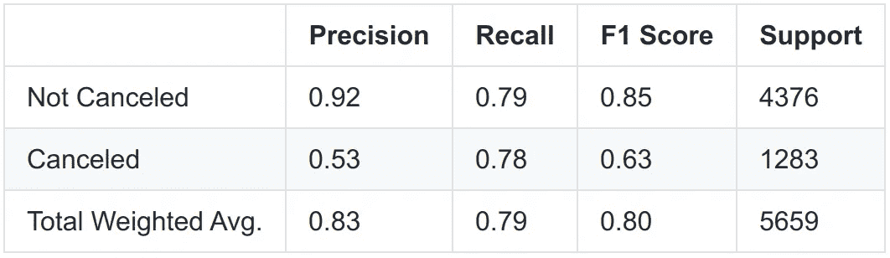

# 使用 Apache Spark 进行大规模流失预测

> 原文：<https://medium.com/geekculture/large-scale-churn-prediction-using-apache-spark-8d62febee52c?source=collection_archive---------12----------------------->

Photo by [Jez Timms](https://unsplash.com/@jeztimms?utm_source=medium&utm_medium=referral) on [Unsplash](https://unsplash.com?utm_source=medium&utm_medium=referral)

# 项目定义

## 项目概述

该项目将使用来自 Udacity 的大型 Sparkify 数据集。

这些数据是由 Spotify 等音频流媒体平台中的用户事件组成的。它显示了用户与系统的交互，比如播放歌曲或访问特定页面。

我们将分析数据，为每个用户创建特征，然后创建一个模型来预测用户是否会取消服务。

## 问题陈述

目的是理解用户交互，并根据这些数据训练一个模型来预测用户可能会取消服务的行为。

这一点很重要，因为提供折扣比失去客户要便宜得多。获取用户比留住客户更昂贵。

## 韵律学

我们的目标是正确预测客户是否会取消服务，并在服务取消之前采取措施，然后指标应该反映这一点。

因为取消服务的用户比不取消服务的用户少，所以使用准确性不是一个好的衡量标准。如果一个模型预测大家都不会取消，那么它的准确率会很高，但是不会衡量我们想要什么。

F1 分数对此更好，因为它是精确度和召回率之间的折衷。然后，它会考虑误报和漏报。而准确性本身，只需要真正的积极和消极。

# 分析

## 数据探索和数据可视化

原始数据集由以下各列组成:artist、auth、firstName、gender、itemInSession、lastName、length、level、location、method、page、registration、sessionId、song、status、ts、userAgent、userId。它记录了 26.259.199 个事件。

我们通过删除带有 null 或空白“userId”或“sessionId”的行来清理数据集。

我们还删除了在用户注册之前发生事件的行。因为分析将在用户注册后立即进行。

通过检查用户是否访问了“取消确认”页面来定义客户流失。流失率为 22.46%。

用户注册日期在 2017–10–14 和 2018–11–30 之间。并且记录事件的窗口在 2018–09–30 和 2018–11–30 之间。

首先，我们将检查用户注册的日期。我们看到大部分用户的注册时间是 2018 年 7 月到 2018 年 9 月，也就是事件窗口开始的日期。

Fig. 1\. User count by registration date. Image by the author.

大多数活跃用户的最后活动日期是接近事件窗口的末尾。而取消的用户在此期间不断取消。

Fig. 2\. User count by the user’s Last Activity Date. Image by the author.

在这里，我们检查平均用户年龄，这是特定用户在特定事件日期过去事件的平均年龄。一个事件的年龄是从注册到事件发生的时间，这里是天数。因此，很容易理解它随时间而增加。这里的思路是看两组用户的年龄是否大致相同，从而比较同年龄的用户。

我们还注意到，在此期间，活跃用户的数量几乎保持不变，而取消服务的用户数量减少了，这是意料之中的。

另一个有趣的行为是用户活动的季节性。周末的活跃用户数量会减少，这一点对两组用户都适用。我们甚至可以注意到 2018 年 11 月 22 日感恩节的活动量有所下降。

Fig. 3\. Mean User Age and User Count by Activity Date. Image by the author.

对于取消服务的用户，用户年龄和用户平均年龄(所有用户事件的平均值)也较低。第一次预计是 63 天对 89 天。平均用户年龄分别为 53 天和 67 天。它们的直方图如下图所示。

Fig. 4\. Histogram of User Age. Image by the author.

取消服务的用户平均播放的歌曲和页面交互次数更多，如下图所示。第 150 天之后的数据更加嘈杂，因为那个年龄的用户数量减少了。活动日期是自用户注册以来的某一天。

Fig. 5\. Average Songs Played and Page Interactions for each Activity Date.

# 方法学

## 数据预处理

数据集由包含事件的行组成。这不适合作为监督机器学习模型的输入。模型中必须输入的常用数据框对于每个用户都有一个唯一的行。每个用户必须有几个特征和一个标签。因此，要使用的数据框必须包含一个包含每个“用户 Id”的列、几个要素列和一个标签列。

第一步是处理我们将使用的唯一索引。在本例中，是“用户标识”和“艺术家”。

有几行的“artist”为空，因此我们让 Spark 索引器将它们作为具有单一标识号的单独类别来处理，这样就不会删除这些列。这是必要的，因为只有页面“NextSong”的事件有艺术家。

然后，我们创建列“timestamp”和“registration_date ”,这是“registration”和“ts”列到 Spark“timestamp”格式的转换。我们还创建了“elapsed”列，这是从注册到事件时间戳所经过的时间。“elapsed_days”列以天为单位显示经过的时间。

然后我们继续删除负的运行天数，因为我们将在用户注册后分析数据。

现在，我们继续进行特征工程，其中我们将这些事件行转换成合适的数据帧，以便输入到模型中。

我们选择的第一个特征是“艺术家”。如果我们要为用户播放的每个艺术家的计数创建列，我们将有 38.336 列。而且会很稀疏。对于大多数用户来说，它会被零填充。

这就是降维有用的时候。我们可以创建一些潜在的特征来描述用户喜欢哪种艺术家。

交替最小二乘算法通常被用作推荐系统中的协同过滤器。以一种简化的方式，它收集所有用户对一个项目的评价(在本例中是“艺术家”)，检查相似用户对其他项目的评价，并为第一个用户推荐新项目。

Spark 将训练模型，而预测将成为新的“艺术家”。然而，我们想要的不是建议，而是模型的潜在特征。

因为我们没有艺术家的用户评级，我们可以通过计算用户播放特定艺术家的歌曲的次数来估算。然后，对于每个用户，我们将所有计数除以具有最高计数的艺术家，以保持范围在 0-1 之间。直觉是用户更喜欢最受欢迎的艺术家。我们选择 20 作为潜在特征的数量，这是可以调整的，但是由于我们有几个其他参数要调整，这将需要很长时间。

我们向模型中添加了用户页面交互。对于每个用户，我们计算每个页面的交互，然后除以所有用户页面交互的总和。我们也只保留计数。对于这两组，我们有 17 个特征。我们删除了“取消”和“取消确认”，因为这些是我们试图预测的。

我们为一个用户的最后一级创建了一个栏目，可以是“免费”也可以是“付费”。我们还计算了该级别“已支付”时发生的事件的百分比。各有一个特点。第一个是 0 或 1，后者是“付费”事件的百分比。

我们添加了一个性别列，这也是一个值为 0–1 的列。我们还添加了每个用户的歌曲长度平均值和标准差。

我们创建了每小时播放的歌曲和 24 小时的平均长度。

我们添加了每个用户的年龄，这是该用户最后一次活动的年龄。以及用户的平均年龄，这是所有用户事件年龄的平均值。年龄是用户注册和事件时间戳之间经过的时间。

最后，我们汇总了每个用户的会话特征，比如会话数；页面交互的平均和标准偏差、艺术家的唯一计数、平均歌曲长度和会话时间。总共 9 个特征。

特征的总数是 116。

## 履行

我们训练了四个机器学习模型:随机森林、逻辑回归、GBT 分类器和线性 SVM。

我们首先以 75% - 25%的方式将数据分为训练集和测试集。

我们使用 Spark“maxabscaler”来缩放我们的特性，它基本上将一个特定的特性列除以它的最大绝对数，从而将范围保持在-1 到 1 之间。

然后，我们向四个模型提供缩放后的特征，并训练它们预测“标签”列，即 0–1。一个是取消服务的用户。

训练之后，我们在测试集上进行预测，并记录每个模型的 F1 分数。

我们首先在“迷你”数据集中进行所有这些训练。然后，我们挑选最好的两个模型，并训练完整的数据集。

## 精炼

我们试图通过两种技术来提高分数:增加特征的数量和增加每个模型例子的权重。

我们通过添加 ALS 潜在变量、页面百分比、页面计数、歌曲长度、每小时歌曲计数和每小时歌曲平均长度来增加功能的数量，仅在特定用户的最后一周活动中计算。直觉是，用户可能会在使用平台的最后一周改变他们的行为，并且模型可能会捕捉到与其他用户和自己用户的完整行为相比的改变。

在权衡模型示例时，我们对某些用户给予了比其他用户更高的重视。因为取消服务的用户数量比其他用户少，所以模型可能偏向于识别其他用户。因此，当增加权重时，我们对模型说偏向权重。或者，更具体地说，当模型在优化时，比较预测的和真实的标签，该模型受到比其他模型更大权重的误差的惩罚。

根据流失率计算权重。因此，取消服务的用户具有“1-客户流失率”权重，其他用户具有“客户流失率”权重。

# 结果

## 模型评估

我们用迷你数据集训练了四个模型。然后我们用上周的特征进行训练，然后用上周的特征加上重量进行训练。我们选择了两个最好的模型，并使用上周在完整数据集上的特征和权重进行训练。F1 分数如下图所示。

Fig. 6\. F1 scores for each model and chosen characteristics. Image by the author.

我们注意到数据的大小很重要，至少对于所选的特性是如此。在完整数据集上训练的模型表现更好。

另一个重要的发现是，对训练样本进行加权有助于提高分数。

然而，添加上周的功能并不能从总体上改善模型。GBT 分类器甚至变得更糟。

基于决策树的算法(随机森林和 GBT 分类器)也比其他两种模型得分低。

线性 SVM 在大多数情况下做得更好，尽管当使用完整的数据集时，它的得分与逻辑回归相当。

如果线性 SVM 和逻辑回归具有可比性，那么最好选择更简单的模型，即逻辑回归。

下表是完整数据集上逻辑回归的分类报告。总加权平均意味着它考虑整个数据集，并根据每个类别的支持度对得分进行平均(不取消和取消)。

Fig. 7\. Classification Report of the Logistic Regression on the full dataset. Image by the author.

查看逻辑回归模型的系数，我们观察到年龄、平均年龄和页面百分比是最相关的特征。而歌曲的每小时计数和长度以及潜在特征最不相关。

## 正当理由；辩解

使用更大的数据可以使模型更好地概括，从而导致模型在看不见的数据上得分更高。

示例权重的增加增加了分数，因为最少看到的标签在模型优化中更重要。因为我们测量的是 F1，所以它会增加，即使这可能会影响精度。

我们期望上周增加的功能会增加分数，但事实证明它并没有改善大多数模型，只是线性 SVM。原因可能与基于决策树的算法做得更差的相同:与用户数量相比的特征数量。

在迷你数据集中，我们大约有 200 个用户、100 个要素，如果包括上周的要素，则有 200 个要素。完整的数据集大约有 22，000 个用户。

当我们的用户数量与特征数量之比较小时，最好使用低偏差、高方差的算法，如逻辑回归和线性 SVM [1]。

高方差算法更容易过度拟合，特别是当我们有少量的例子时，因为大量的例子有助于泛化。这可能解释了为什么基于决策树的算法表现不佳。

# 结论

## 反射

我们创建了一个模型，对用户是否会取消订阅进行分类。我们从拥有一个由用户事件行组成的原始数据集开始，对其进行清理、分析，将事件聚合到特征中，这些特征将被提供给几个模型进行训练。然后，我们在测试集上进行预测并评估模型。

当进行特征工程时，我们期望那些喜欢基于潜在特征的艺术家“集群”的用户比其他人更有可能离开。至少，在潜在特征中，我们计算出，用户的艺术家偏好在取消订阅中没有起到作用。

因为从一开始用户的年龄就很重要，所以我们认为用户最近一周的活动很重要。基本上，我们希望模型能够理解用户开始表现出与他们的整体行为不同的行为。而且，它并没有改善模型。

看起来每小时的行为和喜欢的艺术家并不影响他们离开或不离开平台的决定。用户的年龄、事件的年龄(概括为用户的平均年龄)以及他们与页面交互的相对数量更为重要。

或许，更明智的做法是汇总更多的要素，因为尽管数据集本身很大，但用户数量并不多。

## 丰富

我们可以设计一个艺术家和潜在变量的研究来证实用户的艺术家偏好真的不重要。我们可以改变潜在变量的数量和学习率，然后用这些参数中的几个来训练模型。

我们还可以尝试去掉一些特征，简化训练数据集。我们还可以设计一些用户的通常行为与上周或两周相比的距离测量。

我们还可以对测试的模型进行参数选择。

*随意评论！带有代码的笔记本在* [*项目库中。*](https://github.com/reneoctavio/sparkify)

# 参考

*   [项目资源库](https://github.com/reneoctavio/sparkify)
*   [优达城星火课程](https://www.udacity.com/course/learn-spark-at-udacity--ud2002)
*   [Spark Python API](https://spark.apache.org/docs/latest/api/python/reference/index.html)
*   [火花毫升指南](https://spark.apache.org/docs/latest/ml-guide.html)
*   [火花独立模式](https://spark.apache.org/docs/latest/spark-standalone.html)
*   [Datacamp PySpark 备忘单](https://s3.amazonaws.com/assets.datacamp.com/blog_assets/PySpark_SQL_Cheat_Sheet_Python.pdf)
*   [【1】选择合适机器学习算法的简易指南——yogi ta Kinha](https://www.kdnuggets.com/2020/05/guide-choose-right-machine-learning-algorithm.html)