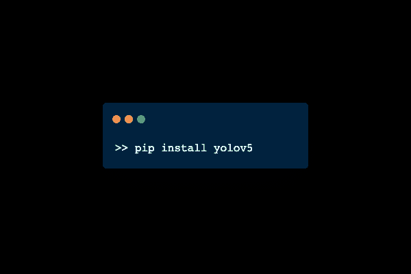
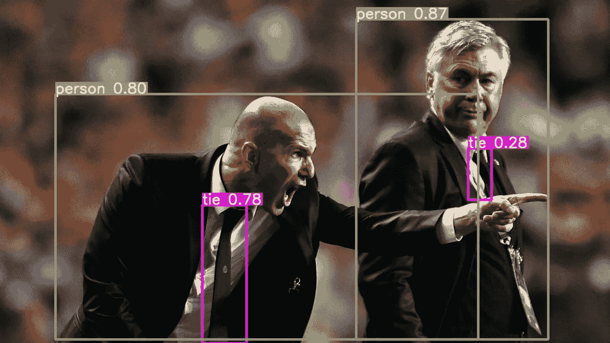
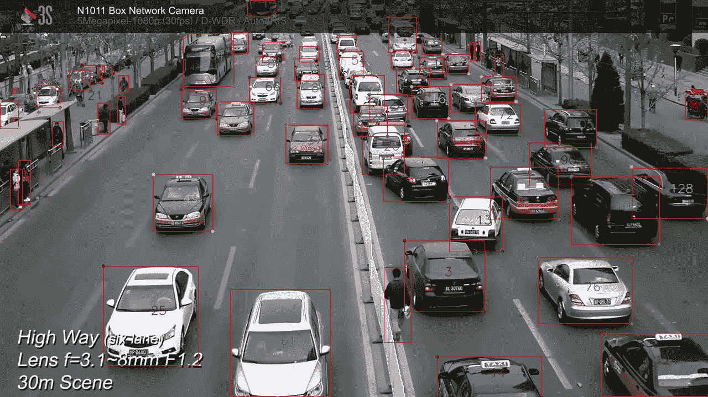
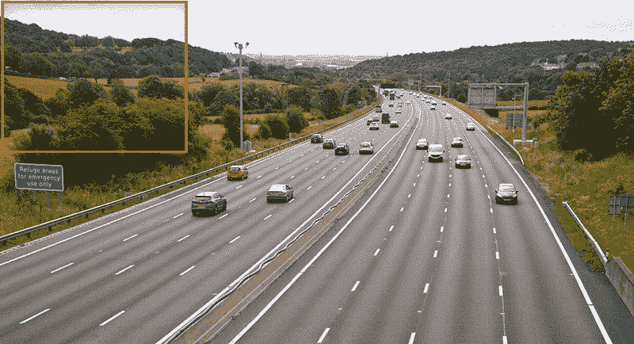

# 用 YOLOv5 软件包进行大规模目标检测和跟踪

> 原文：<https://medium.com/geekculture/large-scale-object-detection-tracking-with-yolov5-package-c8eca66b80b6?source=collection_archive---------3----------------------->

只有' [pip 安装 yolov5](https://pypi.org/project/yolov5/) '远离你…



Simple as that.

*   你在 Windows/Linux 下安装最新的 YOLO 物体探测器有困难吗？
*   在使用定制的 YOLOv5 模型进行训练/推理时，您是否会遇到错误？
*   你在寻找一个只有几行代码的实时物体跟踪器吗？
*   要不要一键进行大范围(无人机监控/卫星影像/广域监控)物体检测？

> 继续阅读这篇文章，你将能够在几秒钟内解决所有这些问题..

## [YOLOv5](https://pypi.org/project/yolov5/) 物体探测器


[https://ultralytics.com/yolov5](https://ultralytics.com/yolov5)

YOLOv5 是有史以来最快最精确的 YOLO，你可以用它来解决任何你需要的物体探测问题。

安装很简单:在 Windows/Linux 终端运行 [**pip 安装 yolov5**](https://pypi.org/project/yolov5/) 就可以了。



[https://ultralytics.com/yolov5](https://ultralytics.com/yolov5)

## 基本用法

```
import yolov5# load pretrained model
model = yolov5.load('yolov5s.pt')

# or load custom model
model = yolov5.load('train/best.pt')

# set model parameters
model.conf = 0.25  # NMS confidence threshold
model.iou = 0.45  # NMS IoU threshold
model.agnostic = False  # NMS class-agnostic
model.multi_label = False  # NMS multiple labels per box
model.max_det = 1000  # maximum number of detections per image# image
img = 'https://github.com/ultralytics/yolov5/raw/master/data/images/zidane.jpg'# inference
results = model(img)# inference with larger input size
results = model(img, size=1280)# inference with test time augmentation
results = model(img, augment=True)# parse results
predictions = results.pred[0]
boxes = predictions[:, :4] # x1, x2, y1, y2
scores = predictions[:, 4]
categories = predictions[:, 5]# show results
results.show()# save results
results.save(save_dir='results/')
```

## 培养

使用您的自定义`data.yaml`微调一个预调的 YOLOv5 模型。详细信息请参见:【https://pypi.org/project/yolov5/

```
$ yolov5 train --data coco.yaml --weights 'yolov5s6.pt' --batch-size 16 
```

通过海王星想象你的实验。艾:

```
$ yolov5 train --data data.yaml --weights yolov5s.pt --neptune_project NAMESPACE/PROJECT_NAME --neptune_token YOUR_NEPTUNE_TOKEN
```

## **推论**

`yolov5 detect`命令对各种来源进行推理，从[最新的 YOLOv5 版本](https://github.com/ultralytics/yolov5/releases)自动下载模型，并将结果保存到`runs/detect`:

```
$ yolov5 detect --source 0  # webcam
                         file.jpg  # image
                         file.mp4  # video
                         path/  # directory
                         path/*.jpg  # glob
```

## 出口

您可以将微调后的 YOLOv5 权重导出为任何格式，如`torchscript`、`onnx`、`coreml`、`pb`、`tflite`、`tfjs`:

```
$ yolov5 export --weights yolov5s.pt --include 'torchscript,onnx,coreml,pb,tfjs'
```

## 使用 YOLOv5 进行最先进的[目标跟踪](https://github.com/tryolabs/norfair/tree/master/demos/yolov5)

您可以用几行代码创建一个实时自定义多对象跟踪器，下面是一个简单的例子:

State-of-the-art YOLOv5 Object Tracker in few lines of code.

这是输出结果:



YOLOv5 Object Tracking Demo.

在这个 colab 笔记本中你可以找到一个 YOLOv5 物体追踪器。它可以从任何 YouTube 视频中执行高精度的行人和汽车跟踪！[参考这里获得完整的 YOLOv5 跟踪码](https://github.com/tryolabs/norfair/blob/master/demos/yolov5/yolov5demo.py)。

[**大规模物体检测用 YOLOv5**](https://github.com/obss/sahi/blob/main/demo/inference_for_yolov5.ipynb)

如果您正在处理巨大的卫星图像或广域监控图像，则无法使用标准输入大小进行推断。下面是 [SAHI](https://github.com/obss/sahi/blob/main/demo/inference_for_yolov5.ipynb) 包及其 [*切片推理*](https://github.com/obss/sahi/blob/main/resources/sliced_inference.gif) 特性:



[Sliced inference from SAHI.](/codable/sahi-a-vision-library-for-performing-sliced-inference-on-large-images-small-objects-c8b086af3b80)

[在本演示笔记本](https://github.com/obss/sahi/blob/main/demo/inference_for_yolov5.ipynb)中，您可以看到如何用 YOLOv5 用几行代码执行大规模切片推理！

或者您可以从 CLI 执行 YOLOv5 分片推理:

```
sahi predict --model_type yolov5 --source image/file/or/folder --model_path path/to/model
```

有关 CLI 参数[的详细信息，请参考此处](https://github.com/obss/sahi/blob/main/docs/CLI.md)。

## 结论

在这篇文章中，我们介绍了:

*   [YOLOv5 安装的最简单方法](https://github.com/fcakyon/yolov5-pip#installation)
*   最简单的训练/推理方法
*   最简单的方法 [YOLOv5 物体跟踪](https://github.com/tryolabs/norfair/blob/master/demos/yolov5/yolov5_demo.ipynb)
*   最简单的方法 [YOLOv5 切片推理](https://github.com/obss/sahi/blob/main/demo/inference_for_yolov5.ipynb)

如果你在任何一步有困难，请随时提问！