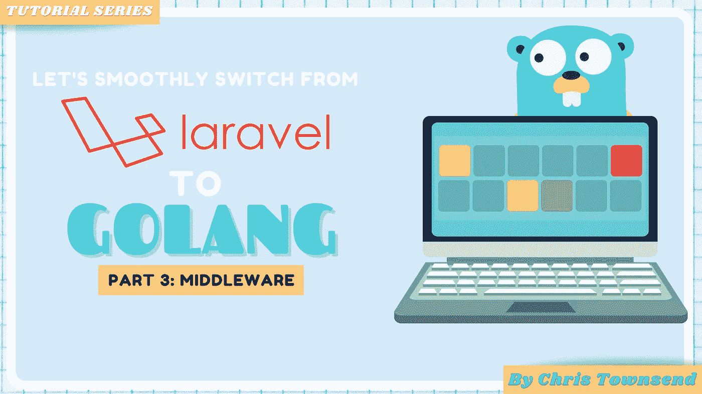

# Laravel to Go —第 3 部分—中间件

> 原文：<https://medium.com/geekculture/larvel-to-go-part-3-middleware-and-requst-validation-610e57b6e85f?source=collection_archive---------5----------------------->



Laravel to Go Series

> 👋这是该系列的第 3 部分，所以如果你还没有看过第 1 部分的话，请首先访问那篇文章，并请给我一个关注，这样你就可以得到下一篇文章的通知了！

[](/geekculture/laravel-to-go-part-1-basics-502fb236fdf0) [## Laravel to Go -第 1 部分-基础知识

### 这是关于如何从 Laravel 迁移到 Go 的一组文章的第一部分。这第一部分非常基础，但是…

medium.com](/geekculture/laravel-to-go-part-1-basics-502fb236fdf0) 

*TL；DR:*[https://github . com/townsymush/laravel-to-go-series/tree/main/part-3-middleware](https://github.com/townsymush/laravel-to-go-series/tree/main/part-3-middleware)*链接到本练习的代码*

## 什么是中间件？

本文上下文中的中间件是请求中间件，我指的是在 HTTP 请求的主要处理之前或之后做一些事情。我假设每个阅读这篇文章的人都熟悉 Laravel 的请求中间件。它有很多用途，从认证到应用程序拆除等等。这是它在拉勒维尔的样子。

这里我们创建一个名为 AuthMiddleware 的类，然后使用`middleware()`方法在 routes.php 文件中注册该类。中间件类可以访问`Request` 对象，让我们可以访问 HTTP 请求的所有细节，比如消息头。

## 我们如何在 Go 中做出同样的中间件？

Go 没有一个名为中间件的标准库，但它确实给了我们遵循相同模式的工具。给我们的工具是[处理器接口](https://pkg.go.dev/net/http#Handler)。这个接口声明了 HTTP 处理程序的行为，我们可以使用 [HandlerFunc](https://pkg.go.dev/net/http#HandlerFunc) 类型作为中间件的适配器。

让我们首先在我们的应用程序中创建一个中间件文件夹，并创建我们的认证中间件

为了满足`Handler`的行为要求，我们通过使用`http.HandlerFunc`适配器函数返回一个`http.Handler`。然后，我们可以执行我们的中间件逻辑，在这种情况下，它检查认证头。我们必须在提供的处理程序上调用`ServeHTTP()`来继续处理程序链。如果我们不调用这个方法，它就不是一个真正的中间件，对吗？

一旦我们创建了中间件，我们需要用刚刚创建的适配器更新我们的`main.go`文件。这里我们将启动方法从`HandlerFunc`改为`Handle`功能。我们通过直接调用来注入我们的处理程序，然后用`HandleFunc`适配器包装我们的原始处理程序。

现在运行您的应用程序，您应该会得到 401 响应👏

> ℹ️:注意，你可能注意到我已经改变了响应生成器的包，这在本文中没有提到，但是你可以随意使用上面的 github repo 来复制代码。

## 重构

假设我们希望在所有的处理程序上都有我们的 Auth 处理程序，我们不需要真的很冗长，也不需要包装我们的每个处理程序

```
// set up a routehttp.Handle("/", middleware.AuthMiddleware(http.HandlerFunc(controllers.HomeHandler),))// set up a routehttp.Handle("/profile", middleware.AuthMiddleware(http.HandlerFunc(controllers.ProfileHandler),))// set up a routehttp.Handle("/stats", middleware.AuthMiddleware(http.HandlerFunc(controllers.StatHandler),))
```

为了重构这一点，我们可以通过一个`ServeHTTP`方法创建一个实现了`http.Handler`接口行为的结构。

*   我们创建了一个名为`Auth`的新结构
*   我们给`Auth`添加了一个名为`ServeHTTP`的函数，这个方法实现了`http.Handler`接口
*   我们已经更新了我们的`main.go`文件，因此它创建了一个实现`ServeHTTP`的`Mux`的新实例
*   我们已经注册了两个训练员
*   我们已经启动了服务器，并向它提供了我们的`Auth`结构。

# 我们学到了什么？

*   我们怎样才能创造出像 Laravel 那样的中间件
*   如何制作一个全球中间件
*   如何**而不是**实现认证检查(请不要硬编码凭证！)😂

## 进一步学习

*   创建一个日志记录器全局中间件来记录请求动词、请求正文、请求时间戳

> *感谢阅读这篇文章。给我一些掌声，并给我一个关注，以获得第 4 部分的通知。随着合作伙伴计划的变化，它确实帮助我保持动力。抱歉，这不包括请求验证，但我试图保持这些小文章。我乐于接受反馈，所以如果你喜欢更长的，请告诉我。*

**第 4 部分将为我们的迷你应用添加请求验证**