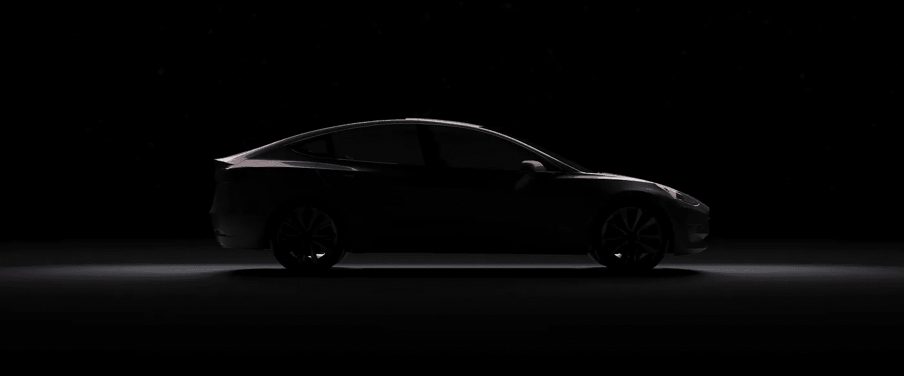
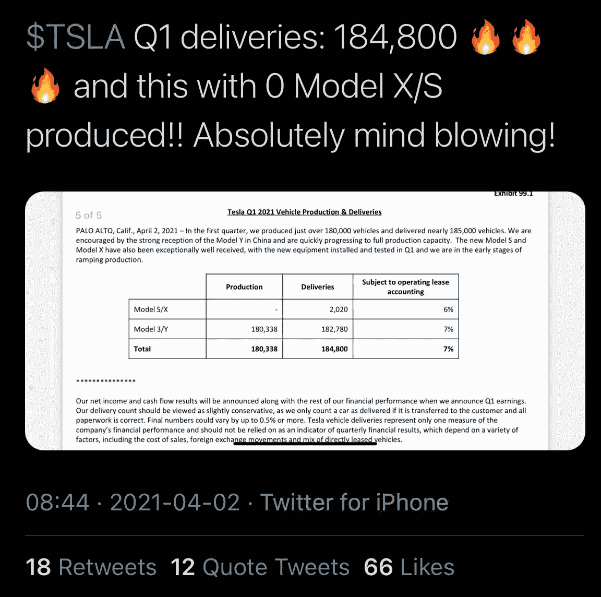

# 购买特斯拉的最后机会

> 原文：<https://medium.com/geekculture/last-chance-to-buy-tesla-fe5e8ca7b20a?source=collection_archive---------40----------------------->

## 埃隆·马斯克(Elon Musk)抛出了三颗关于特斯拉的重磅炸弹。

特斯拉已经经历了主流媒体的大量抹黑活动，我们这些另类分析师已经习惯了。我们紧随其后，无视噪音，持有特斯拉股票。

本季度，华尔街和媒体再次严重低估了特斯拉。又一次。我不明白这些人怎么每次都离题这么远。但这是题外话。

但是，让我从头说起。

特斯拉的 Q1 结果完全平淡无奇。然而，在这种无聊之中，埃隆·马斯克设法抛出了三个重磅炸弹。

让我带你走一遍。

# 超出预期

特斯拉几乎打破了所有记录，如收入、盈利能力和手头现金(如果包括其比特币头寸的话)。

华尔街的共识是每股 77 美分。他们在 Q1 看到了非常积极的交付数字，并得出了一个他们认为特斯拉永远无法达到的数字。

不可否认，每股 77 美分是一个乐观的数字。但是就像大卫和歌利亚的故事一样， **Tesla 以每股 93 美分和 74%的收入增长成功打破了普遍预期，在 Q1 的收入为 104 亿美元。**

他们在解决了停工问题，没有生产任何型号 S 或 X，以及解决了历史上最严重的半导体短缺之后，才做到了这一切。

# 模型 Y 预测

埃隆抛出的第二颗重磅炸弹令人瞠目结舌。他说，到 2022 年底，Y 型车将成为**全球最畅销的汽车。**我也不会赌埃隆输。他有兑现承诺的记录。不用说，埃隆刚刚把两名宇航员送上了太空。

从这个角度来看，最畅销的头衔目前掌握在丰田手中，一年售出 150 万辆卡罗拉。不要误会我；卡罗拉是好车。但埃隆打赌特斯拉只会生产 150 万辆 Model Y。更不用说，特斯拉正在销售 Models 3、S、X，不久还将销售 Cybertruck 和新款 Model Zero。**这意味着我们将在 2022 年看到大约 250 万辆交付，**这将是一个疯狂的增长。

# 分散能源

最后一颗重磅炸弹是巨大的，但从发射的方式来看却非常平淡无奇。**特斯拉能源业务在 Q1 的收入增长了 100%**。而在通话中，不能满足需求而拒绝客户。

我们知道特斯拉可以生产和储存电力。但这是伊隆第一次谈到电力的再分配。当然，这只是他在极端天气条件下重新分配权力的第一阶段。但是他说的是他们可以分配他们自己分散的能量。

这将意味着在这个最过时、最不公平的行业中的一场革命。这是特斯拉长期愿景的重要声明。

现在你必须意识到，所有这些突破都发生在特斯拉管理着 170 亿美元现金、偿还 12 亿美元贷款和建设两家新工厂的时候。

**这是一家平均复合增长率为 50%的公司**。

而这也是我要强调的一点。

特斯拉发展太快，无法准确估计他们今年将生产多少辆汽车。他们有两个工厂正在建设中，还有两个正在扩大和增加生产。它是世界上最大的公司之一，以创业的速度增长。

而且由于华尔街那帮人太短视，每次都错失良机。

此外，你必须记住，他们不仅仅是一家汽车公司。就像苹果从一家计算机公司变成了今天的样子，特斯拉至少正在转型成为一家人工智能、自主软件和能源公司。

因此，对于那些了解这个机会而忽视主流 FUD 的人来说，这是打折购物的最佳时机。华尔街的短视是我们的收获，因为它们提供了折扣机会。

韦德布什证券公司的丹·艾夫斯估计**的价格将在今年年底达到 1000 美元**，凯西·伍德对特斯拉**的目标价格是到 2024 年达到 7000 美元。**

最近的下跌可能是我们最后一次因为华尔街分析师的礼物而大幅回调。因此，买入并持有，待短期问题出现时再加仓。

这可能是你最后的机会。