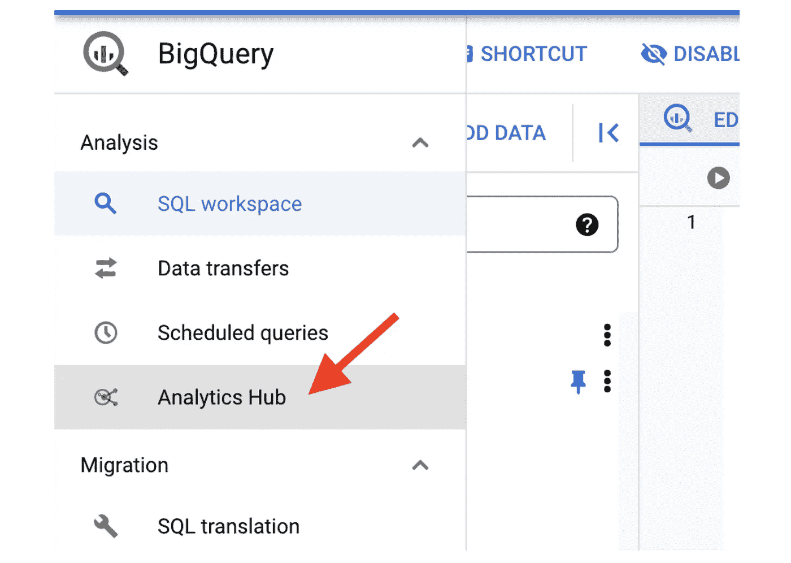
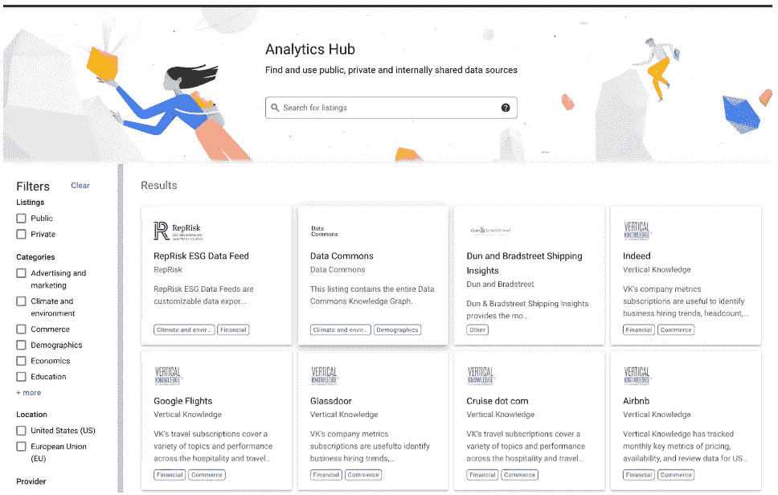
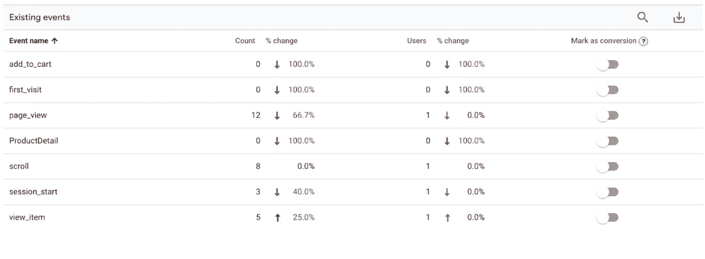
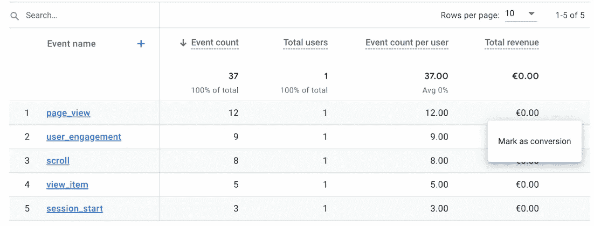

# 谷歌数据分析的最新更新(2022 年 4 月)

> 原文：<https://medium.com/geekculture/latest-updates-on-google-data-analytics-april-2022-7fae1654e94a?source=collection_archive---------14----------------------->

## BigQuery、Looker Studio(以前称为谷歌数据工作室)、谷歌分析(GA)和谷歌标签管理器(GTM)的更新亮点。亚历山大·柯俊

*Photo by* [*Meduana*](https://unsplash.com/@meduana) *on* [*Unsplash*](https://unsplash.com/)

在这篇博文中，我想总结一下我们每天在 [datadice](https://www.datadice.io/) 使用的谷歌工具的新版本。因此，我想概述一下 BigQuery、Looker Studio(以前称为 Google Data Studio)、Google Analytics 和 Google Tag Manager 的新功能。此外，我将重点介绍我认为最重要的几个版本，还会列举一些其他的改动。

如果你想仔细看看，在这里你可以找到来自，
Looker Studio(原名谷歌数据工作室)，[谷歌分析](https://support.google.com/analytics/answer/9164320?hl=en) & [谷歌标签管理器](https://support.google.com/tagmanager/answer/4620708?hl=en)的发布说明。

# BigQuery

## 比格莱克

BigLake 是一项与 BigQuery 高度相关的新服务。这是谷歌即将推出的数据湖解决方案:

*   查询来自不同提供商的数据湖和数据仓库
*   数据访问权限是细粒度级别的
*   支持所有常见的开放数据格式:Parquet、Avro、ORC、CSV、JSON

要获得更多信息并找到入门指南，您可以在此处查看。

## 分析中心

这是谷歌的一项全新服务，与 BigLake 一样，与 BigQuery 高度相关。值得写一篇自己的博客，但是我想给出这个工具的一个概述。

分析中心是关于以多种方式共享数据。该服务区分数据的发布者和订阅者。发布者可以将一组表或视图定义为共享数据集，订阅者可以获得数据的只读链接。数据的发布者也获得关于共享数据的使用度量。

在前端，它有自己的标签。

然后你可以在“市场”中创建一个交换或搜索。

菜单看起来像共享数据集。你可以在那里搜索感兴趣的数据集并订阅。

The available public shared datasets

进一步的信息，可以看看。

## 新搜索功能

Google 发布了一个可以在 BigQuery 中使用的新功能。SEARCH 函数需要两个输入参数，您想要调查的字符串和搜索词。这个函数有一些与 REGEXP_CONTAINS 函数相关的特性。

BigQuery 的官方文档中有一个关于这些特性的很好的概述(我只展示了最有趣的一个):

> SEARCH('foo-bar '，' foo bar ')--> true('-'和' '是断开符)
> 
> SEARCH('foo-bar '，' foobar ')--> false(SEARCH _ query 不拆分)
> 
> SEARCH('foo-bar '，' foo \ \ & bar ')--> true(双反斜杠转义& (& =分隔符)
> 
> SEARCH('foo-bar '，' bar foo ')--> true(术语的顺序无关紧要)
> 
> SEARCH('foo-bar '，' Foo Bar ')--> true(标记小写)
> 
> SEARCH(['foo '，' bar']，' foo bar ')--> false(没有单个数组条目匹配所有搜索项)

尤其是断路器的功能是一个有趣的。

## 新的元数据信息模式

BigQuery 为某种元数据获得了 3 种新的信息模式:

*   TABLE_STORAGE:表和实体化视图的当前存储使用情况的快照
*   TABLE _ STORAGE _ TIMELINE _ BY _ PROJECT:在项目级别获取表存储随时间的变化
*   TABLE _ STORAGE _ TIMELINE _ BY _ ORGANIZATION:在组织级别获取表存储随时间的变化

# Looker 工作室

## 完全支持某些连接器

以下连接器正在从其测试状态升级，现在完全受支持:

*   亚马逊红移
*   微软 SQL Server 2017
*   关系型数据库
*   一种数据库系统

## 来自谷歌广告的新数据

谷歌广告连接器从现在开始提供新的数据。对于已经连接了 GAds 数据的数据源，您必须刷新字段。

一些新的领域示例如下:

*   平均篮子尺寸
*   平均订单价值
*   品牌
*   产品名称
*   产品类型 L1
*   平均值。产品价格
*   销售国家
*   …

# 谷歌分析

## GA4 中的自动建议

谷歌改进了对你的 GA4 见解的搜索。当你开始输入一个搜索词时，你会得到一些自动建议。使用箭头键并按下 enter 按钮，您可以选择其中一个建议。

## 设置转换事件

GA4 中的每个事件都可以设置为一个转换。转换事件显示在其他(更详细的)报告中。谷歌使得将一个事件标记为转化变得更加容易。

在更改之前，您必须到配置区域将事件设置为转换。

现在，您还可以进入“报告”>“参与”>“活动”,并将活动标记为“转换”。

# 谷歌标签管理器

## 收集数据

在没有详细信息的情况下，很难对这一更新做出评价。因此，对于这一点，我将只列出一些主要元素:

*   对于服务器端跟踪，他们现在可以收集汇总信息
*   他们可以使用这些数据来改进、维护、保护和开发服务
*   未经您的同意，他们不会与任何其他 Google 产品共享这些数据

# 本月即将发布的 datadice 博客文章

*   Y42 中的拖放式数据建模(第一部分)——[此处](https://datadice.medium.com/drag-and-drop-data-modeling-in-y42-part-1-ef0332388b33)
*   像专家一样轻松处理 BigQuery 中的 Google Analytics 4 数据的方法— [这里](https://datadice.medium.com/effortless-ways-to-handle-google-analytics-4-data-in-bigquery-like-a-pro-f5e99ca0d2d3)
*   BigQuery (BQ)中的原始 Google Analytics 4 (GA4)数据— [此处](https://datadice.medium.com/raw-google-analytics-4-ga4-data-in-bigquery-bq-9cb776ce1f3d)

# 更多链接

*   这篇文章是来自 datadice 的谷歌数据分析系列的一部分，每月向你解释 BigQuery，Looker Studio，谷歌分析和谷歌标签管理器的最新功能。​
*   查看我们的 [LinkedIn](https://www.linkedin.com/company/datadice) 账户，深入了解我们的日常工作生活，并获得关于 BigQuery、Looker Studio 和营销分析的重要更新
*   我们也从我们自己的 YouTube 频道开始。我们谈论重要的 DWH，BigQuery，Looker Studio 和更多的话题。点击这里查看频道。​
*   如果你想了解更多关于如何使用 Google Looker Studio 并结合 BigQuery 更上一层楼，请在这里查看我们的 Udemy 课程。
*   如果您正在寻求帮助，以建立一个现代化的、经济高效的数据仓库或分析仪表板，请发送电子邮件至 [hello@datadice.io](mailto:hello@datadice.io) ，我们将安排一次通话。

*最初发布于*[*https://www . data dice . io*](https://www.datadice.io/new-features-april-2022)*。*