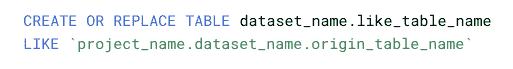
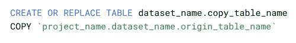
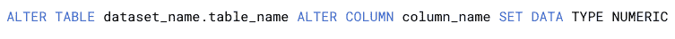
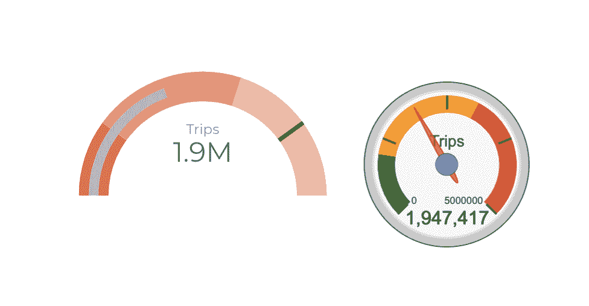
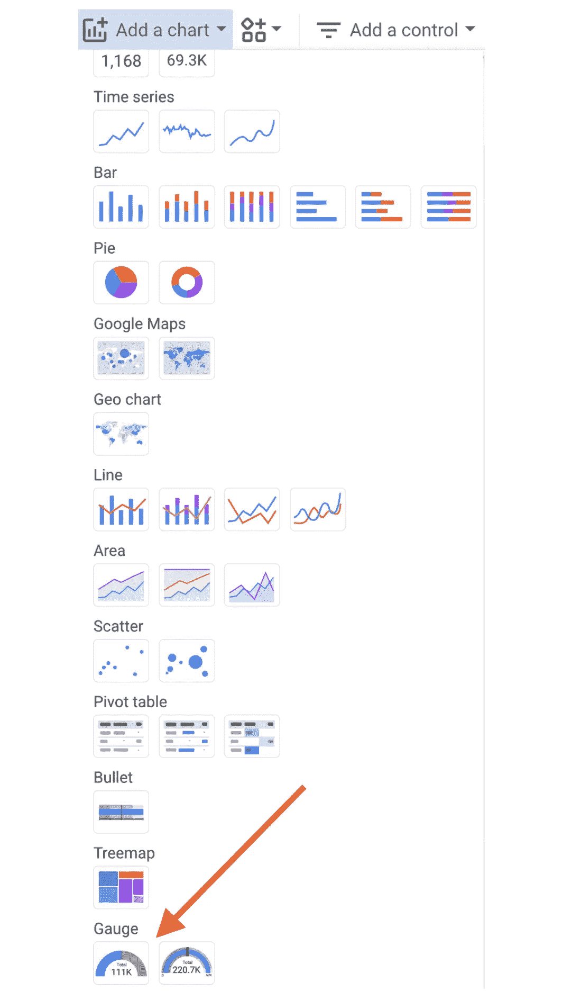
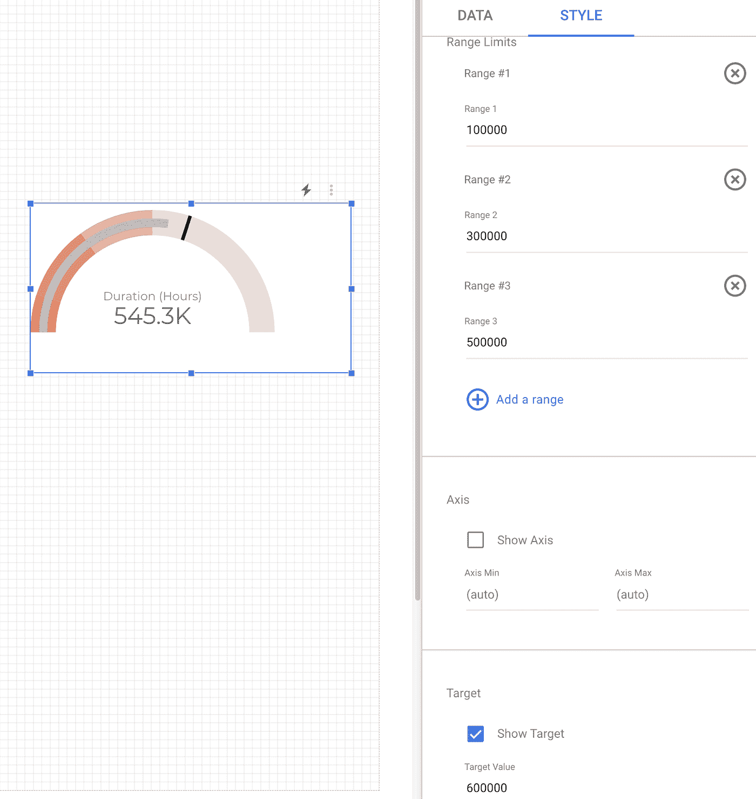
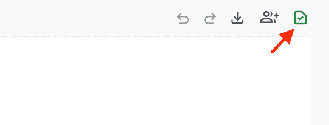

# 谷歌数据分析的最新更新(2021 年 8 月)

> 原文：<https://medium.com/geekculture/latest-updates-on-google-data-analytics-august-2021-e4154be882c5?source=collection_archive---------28----------------------->

## BigQuery、Data Studio、Google Analytics (GA)和 Google Tag Manager (GTM)的更新亮点。亚历山大·柯俊

Photo by [Dirk Pohlers](https://unsplash.com/@leipzigfreetours) on [Unsplash](https://unsplash.com/)

在这篇博文中，我想总结一下我们每天在 [datadice](https://www.datadice.io/) 使用的谷歌工具的新版本。因此，我想对 BigQuery、Data Studio、Google Analytics 和 Google Tag Manager 的新特性做一个概述。此外，我将重点介绍我认为最重要的几个版本，还会列举一些其他的改动。

如果你想仔细看看，这里可以找到来自 [BigQuery](https://cloud.google.com/bigquery/docs/release-notes) 、 [Data Studio](https://support.google.com/datastudio/answer/10331528?hl=en) 、[Google Analytics](https://support.google.com/analytics/answer/9164320?hl=en)&[Google Tag Manager](https://support.google.com/tagmanager/answer/4620708?hl=en)的发布说明。

# BigQuery

BigQuery 中有一些新特性可以发现:

## 新表创建语句

CREATE TABLE LIKE 和 CREATE TABLE COPY 是 BigQuery 中两个新的 DDL 语句。

*   创建表格:使用原始表格中的相同元数据和数据创建新表格
*   创建表副本:使用相同的元数据创建新表

让我们快速看一下这两个例子:

like 语句只是用表“origin_table_name”的结构创建表“like_table_name”。新桌子那时是空的。

copy 语句只是用表“origin_table_name”的结构和数据创建表“copy_table_name”。新表格与原始表格具有相同的内容。

## 更改现有列的数据类型

还有另一个新的 DDL 功能。使用函数“Alter column set data type ”,您可以将列的某些数据类型转换为限制较少的数据类型。

以下变化是可能的(不可逆)；

*   INT64 到 NUMERIC、BIGNUMERIC 或 FLOAT64
*   数字到大数字或浮点 64

**重要提示**:如果您更改物化视图中引用的列的数据类型，查询将会失败。因此，您必须删除物化视图并创建新视图。

## 新管理员视图

此外，BigQuery 中有两个新的管理视图可用。通过“BigQuery 管理资源图表”,您可以分析 BigQuery 插槽和作业的使用情况。要获得更多的见解，如何使用这个监测工具，你可以看看[这里](https://cloud.google.com/bigquery/docs/admin-resource-charts)。

“Slot estimator”视图通过预测 BigQuery 工作负载所需的插槽来提供帮助。基于历史性能数据，它估计未来对插槽的需求。你可以在这里找到[这个观点的指南。](https://cloud.google.com/bigquery/docs/slot-estimator)

# 数据工作室

## 新图表类型“仪表”

Data Studio 中提供了一种新的图表类型。使用仪表图，您可以定义度量值变化的范围和目标。在此更新之前，量表图仅作为社区可视化提供。

*Left: Data Studio visualization, right: community visualization*

要添加仪表图:

*Adding a gauge chart to the report*

此图表类型采用一个日期范围维度和一个指标。更有趣的部分是图表的样式选项卡。您可以在那里定义一个目标和最多 5 个范围。

*   范围定义了图表的背景区域
*   目标是图表中的一条线

该屏幕截图显示了仪表图的示例。它有三个范围到 100000，300000 和 500000。目标(黑线)600000。

这是一个很好的改进，但是它有一些限制。一些缺失的功能是:

*   给每个系列另一种颜色
*   定义半圆的完整范围
*   添加尺寸以分解测量

## 文本功能改进

Google 取消了函数创建计算字段的一个限制。对于许多文本函数，可以为起始索引或长度添加参数值。但问题是你只能输入文字值，而不能输入与另一个字段相关的值。现在这是可能的。

像 LEFT_TEXT(field_name，LENGTH(field_name_2)+1)这样的东西是有可能从一开始就得到字符的个数(取决于另一个字段值的长度)的。

## 新模板

Data Studio 提供了许多模板来查看创建仪表板的可能性。现在有一些新的模板可用。你可以在这里找到他们。

# 谷歌分析

## 获取未采样的数据

GA4 已经比 UA 具有更高的采样限制。如果 GA4 仍然对数据请求的结果进行采样，那么现在就可以得到一个未采样的结果。在 exploration 菜单中，当此报告中没有采样时，您会看到一个绿色勾号。

如果此符号有一个红叉，则数据已被采样，您可以点击“请求未采样的结果”。该数据在页面重新加载后 30 分钟内或在电子邮件中可用。

## 归档光盘和内容管理系统总结卡

当用户希望在 GA4 中归档自定义维度或指标时，可以更深入地了解结果。他/她将会看到受此变更影响的受众、探索……列表。

# 谷歌标签管理器

## 跨域服务器端跟踪

GTM 得到了一点改善。对于服务器端跟踪，跨域测量更容易/可能。您必须启用容器中的[设置，并且相关的服务器容器必须在同一个帐户中。](https://developers.google.com/tag-platform/devguides/cross-domain)

# 更多链接

这篇文章是来自 [datadice](https://www.datadice.io/) 的谷歌数据分析系列的一部分，每月向你解释 BigQuery、Data Studio、谷歌分析和谷歌标签管理器的最新功能。

如果你想了解更多关于如何使用 Google Data Studio 并结合 BigQuery 更上一层楼，请查看我们的 Udemy 课程[这里](https://www.udemy.com/course/bigquery-data-studio-grundlagen/?referralCode=49926397EAA98EEE3F48)

如果您正在寻求帮助，以建立一个现代化且经济高效的数据仓库，或者只是一些分析仪表板，请发送电子邮件至 hello@datadice.io，我们会安排一个电话。