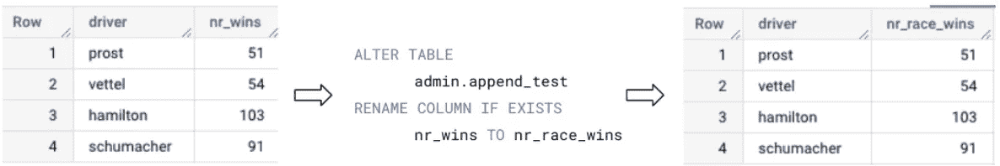
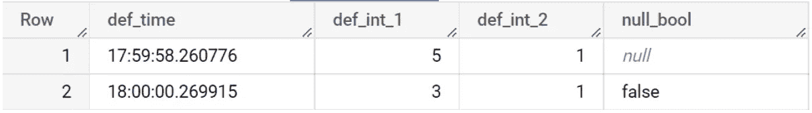
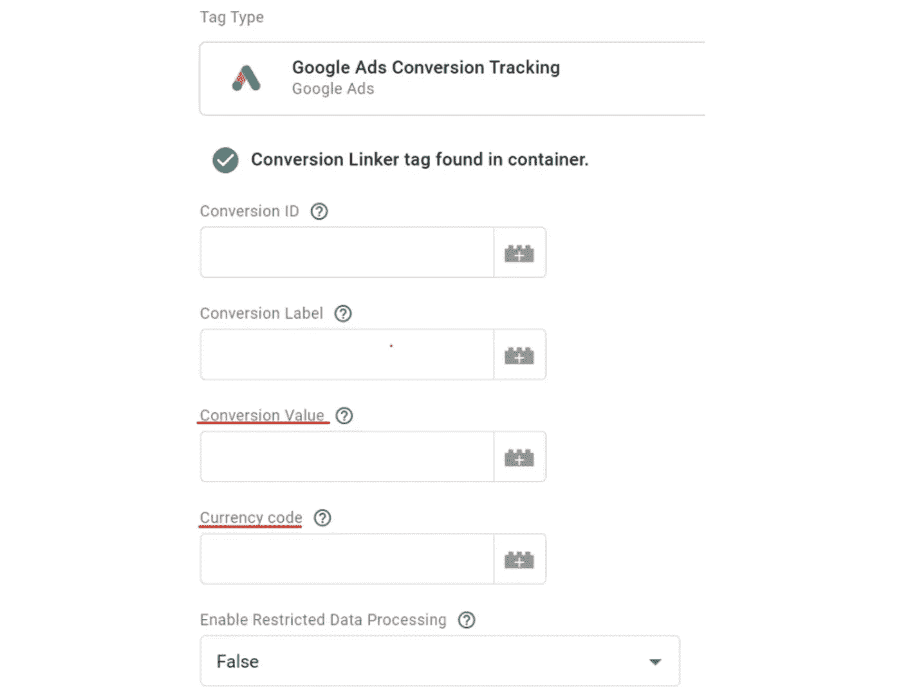
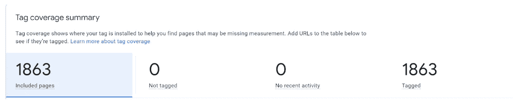
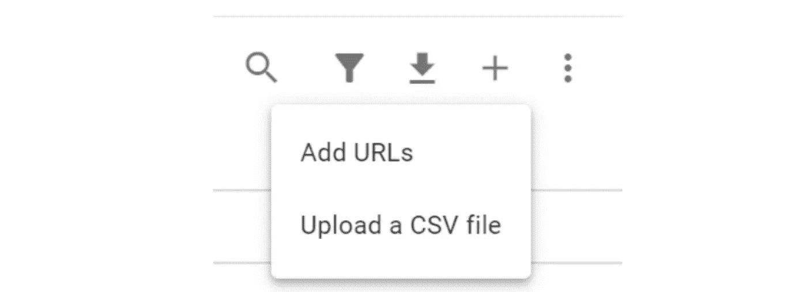

# 谷歌数据分析的最新更新(2022 年 8 月)

> 原文：<https://medium.com/geekculture/latest-updates-on-google-data-analytics-august-2022-5be3c178a75a?source=collection_archive---------9----------------------->

## BigQuery、Looker Studio(以前称为谷歌数据工作室)、谷歌分析(GA)和谷歌标签管理器(GTM)的更新亮点。亚历山大·柯俊

Photo by [Bruno Kelzer](https://unsplash.com/@bruno_kelzer) on [Unsplash](https://unsplash.com/)

在这篇博文中，我想总结一下我们每天在 [datadice](https://www.datadice.io/) 使用的谷歌工具的新版本。因此，我想概述一下 BigQuery、Looker Studio(以前称为 Google Data Studio)、Google Analytics 和 Google Tag Manager 的新功能。此外，我将重点介绍我认为最重要的几个版本，还会列举一些其他的改动。

如果你想仔细看看，这里可以找到来自 [BigQuery](https://cloud.google.com/bigquery/docs/release-notes) 、 [Looker Studio](https://support.google.com/datastudio/answer/11521624) 、[Google Analytics](https://support.google.com/analytics/answer/9164320?hl=en)&[Google Tag Manager](https://support.google.com/tagmanager/answer/4620708?hl=en)的发布说明。

# BigQuery

## 重命名列

使用新的 DDL 语句，可以更改现有列的名称。一个例子是:

您必须对想要更改的表进行寻址，然后是原始列名和新列名。

当您查询该表并更改列时，必须更改查询以使用新名称。

## 列的默认值

现在可以为新表或现有表中的列添加默认值。当新行没有具有默认赋值的值的数据时，它将获得默认值，而不是 NULL。例如，在 DML 语句中，您可以设置默认值:

> 创建表 admin.table_with_defaults(
> 
> def_time 时间默认 CURRENT_TIME()，
> 
> def_int_1 INT64 默认 5，
> 
> def_int_2 INT64 默认 1，
> 
> INSERT admin . table _ with _ defaults(def _ time，def_int_1，def_int_2，null_bool)值(默认值，默认值，默认值，默认值)；
> 
> INSERT admin . table _ with _ defaults(def _ time，def_int_1，def_int_2，null_bool)值(DEFAULT，3，1，FALSE)；

所以用默认参数选定数据类型后你可以设置一个默认值。之后，在插入中，您可以使用赋值新值或使用默认值。

作为默认值，您可以使用文字，也可以使用一些函数，如

*   当前时间戳
*   RAND(0 到 1 之间的随机数)
*   生成 _UUID(随机通用唯一标识符，如 cec8 df F9-d6ce-4d 66-a4 D5–458 a 8048043d)
*   …

不可能引用列来进行某种计算，如

> def_int_3 INT64 默认 def_int_1 — def_int_2

您也可以更改默认值或删除此设置。你可以查看文档[这里](https://cloud.google.com/bigquery/docs/default-values)的内容。

# Looker 工作室

## 可视化 GA4 子属性和汇总属性

Looker Studio 为 GA4 连接器增加了一些新功能。谷歌已经为 GA4 增加了两种新的属性。子属性和汇总属性。

子属性:

*   属性从另一个属性获取数据，但您可以按事件等方式筛选数据
*   更多信息[此处](https://support.google.com/analytics/answer/11525732?hl=en)

汇总属性:

*   属性从另一个属性获取数据，但您可以按事件等方式筛选数据
*   更多信息[此处](https://support.google.com/analytics/answer/11526039?hl=en)

在更改之前，只能连接默认属性。现在甚至可以向您的仪表板添加子属性和汇总属性。

# 谷歌分析

## 日志 API

Google Analytics 4 有了新的 API！

使用日志 API，您可以获得用于访问属性数据的数据。您可以看到查看不同报告的人的 IP 或电子邮件地址。还提供了其他信息，如被访问的报告类型或报告被访问时的时间戳。

## 对数据驱动属性的改进

谷歌的这个归因黑箱模型得到了改进。当资产没有太多的历史数据或者资产中没有太多的每日转换数据时，改进就开始起作用。那么归属地的最终数据应该是比较准确的。

# 谷歌标签管理器

## GAds 的转换值

GTM 服务器端跟踪仍然需要很多改进，这只是一小步。GAds 标签有单独的转换值字段和相应的货币字段。

如果没有选择转换值，它将采用您在标签中选择的所选事件数据的“值”参数。

有了这个配置，将你的转化数据发送到 Google Ads 就容易多了。

## 标签覆盖率

还有一个客户端跟踪的新特性。

使用新的“标签覆盖”系统，您可以观察哪些页面被 GTM 容器跟踪。这个特性是自动启用的，您可以在客户端容器的管理部分看到它。

在上面的截图中，所有页面都是跟踪的一部分。在摘要下的表格中，您可以滚动浏览发送跟踪信息的所有页面。

这四个指标如下:

*   包含的页面:标签覆盖范围内的所有页面
*   未标记:从不加载页面
*   最近没有活动:在过去 30 天内没有加载页面，但在此期间之前
*   已标记:过去 30 天内加载的所有页面

GTM 可能不知道您网站的所有页面。如果是这种情况，您可以手动添加 URL 或上传一个包含 URL 的 CSV。

如果你在追踪过程中发现一些不规则的地方，这是你可以做的第一个简单的检查，看看你的标签覆盖有多好。

# 本月即将发布的 datadice 博客文章

*   [通用分析与谷歌分析 4(第一部分)](/nerd-for-tech/universal-analytics-vs-google-analytics-4-part-1-dc1134d89e82?source=your_stories_page-------------------------------------)
*   [谷歌数据分析的最新更新(2022 年 9 月)](/geekculture/latest-updates-on-google-data-analytics-september-2022-bb24a6b0782e?source=your_stories_page-------------------------------------)

# 更多链接

这篇文章是来自 [datadice](https://www.datadice.io/) 的谷歌数据分析系列的一部分，每月向你解释 BigQuery、Looker Studio、谷歌分析和谷歌标签管理器的最新功能。

查看我们的 [LinkedIn](https://www.linkedin.com/company/datadice) 账户，深入了解我们的日常工作生活，并获得关于 BigQuery、Looker Studio 和营销分析的重要更新

我们也从我们自己的 YouTube 频道开始。我们谈论重要的 DWH，BigQuery，Looker Studio 和更多的话题。点击查看频道[。](https://www.youtube.com/channel/UCpyCm0Pb2fqu5XnaiflrWDg)

如果你想了解更多关于如何使用 Google Looker Studio 并结合 BigQuery 更上一层楼，请查看我们的 Udemy 课程[这里](https://www.udemy.com/course/bigquery-data-studio-grundlagen/)。

如果您正在寻求帮助，以建立一个现代化的、经济高效的数据仓库或分析仪表板，请发送电子邮件至 hello@datadice.io，我们将安排一次通话。

*最初发布于*[*https://www . data dice . io*](https://www.datadice.io/new-features-august-2022)*。*