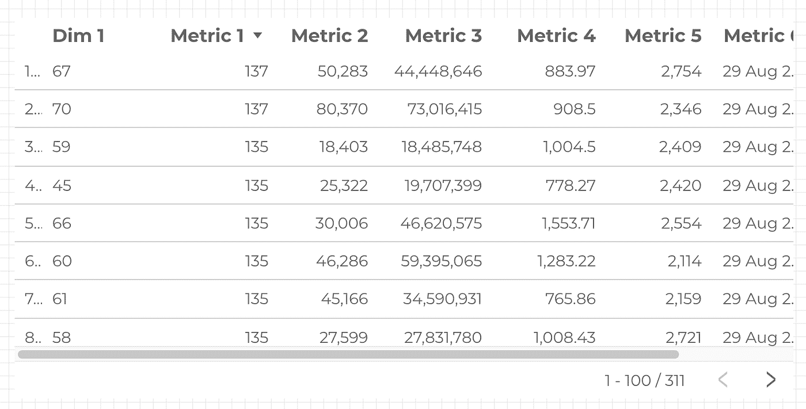
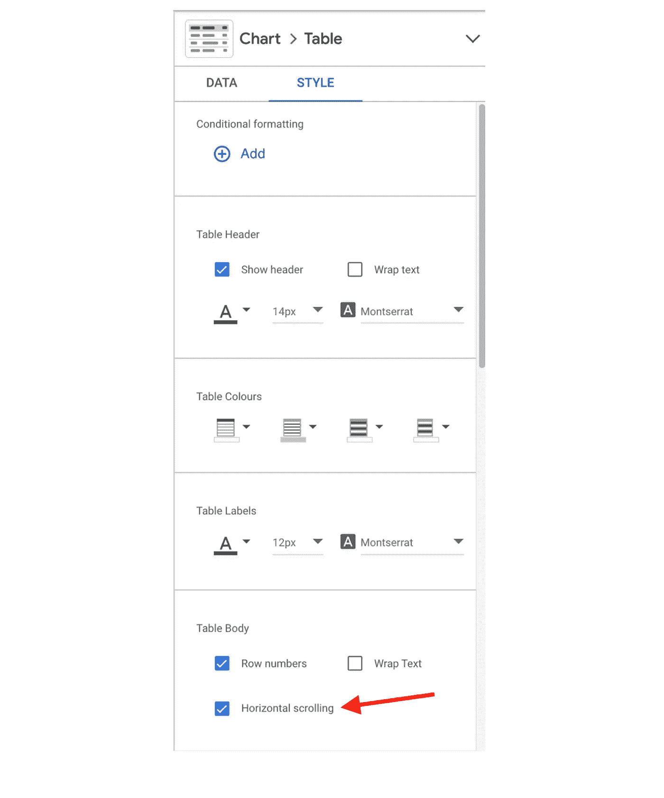
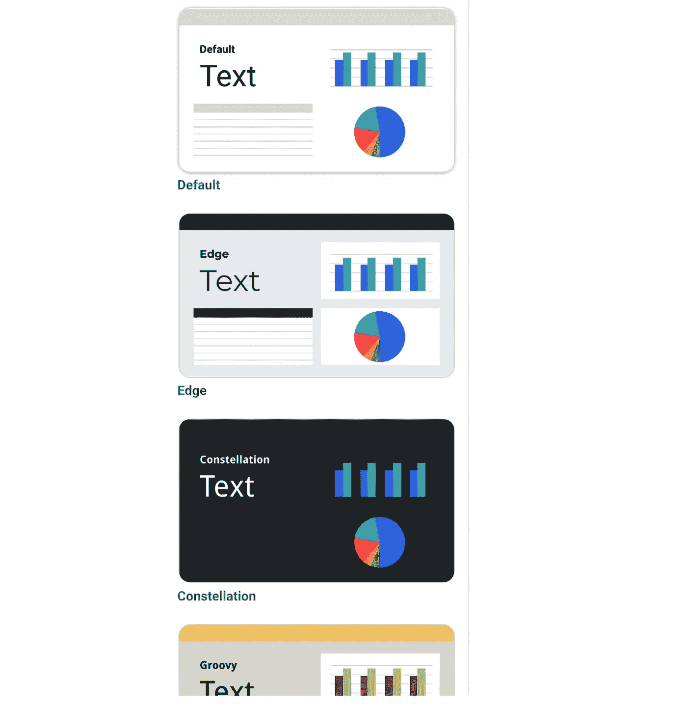
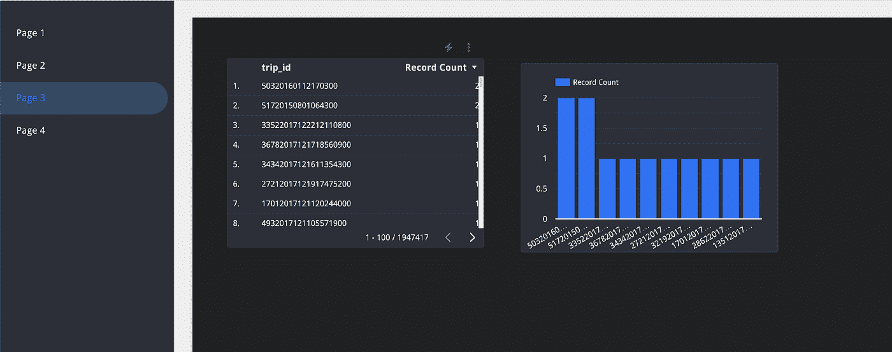

# 谷歌数据分析的最新更新(2021 年 12 月)

> 原文：<https://medium.com/geekculture/latest-updates-on-google-data-analytics-december-2021-b8b6cb80218f?source=collection_archive---------23----------------------->

## BigQuery、Looker Studio(以前称为谷歌数据工作室)、谷歌分析(GA)和谷歌标签管理器(GTM)的更新亮点。亚历山大·柯俊

Photo by [Stefan Widua](https://unsplash.com/@stewi) on [Unsplash](https://unsplash.com/)

在这篇博文中，我想总结一下我们每天在 [datadice](https://www.datadice.io/) 使用的谷歌工具的新版本。因此，我想概述一下 BigQuery、Looker Studio(以前称为 Google Data Studio)、Google Analytics 和 Google Tag Manager 的新功能。此外，我将重点介绍我认为最重要的几个版本，还会列举一些其他的改动。

如果你想仔细看看，这里可以找到来自 [BigQuery](https://cloud.google.com/bigquery/docs/release-notes) 、 [Looker Studio](https://support.google.com/looker-studio/answer/11521624?hl=en&ref_topic=6267740) 、[Google Analytics](https://support.google.com/analytics/answer/9164320?hl=en)&[Google Tag Manager](https://support.google.com/tagmanager/answer/4620708?hl=en)的发布说明。

# BigQuery

BigQuery 只获得了一些新的文档部分。

## 新文档页面

谷歌写了一些新的文档。对于一些 BigQuery 的基本要素有很好的解释，例如 BigQuery 如何组织[存储](https://cloud.google.com/bigquery/docs/storage_overview)。

# Looker 工作室

## 表格水平滚动

起初，Looker Studio 增加了表中的最大维度和度量数。他们在这里分为两种不同的数据源。

固定模式:

*   不能更改可用域的数量和种类的数据源
*   例如谷歌广告或谷歌分析数据
*   在一个表中最多显示 10 个维度和 20 个指标

灵活的模式:

*   您可以在其中更改可用字段的数量和种类的数据源
*   例如 BigQuery 或 Google Sheets 数据
*   在一个表中最多显示 100 个维度和 100 个指标

除此之外，Looker Studio 还增加了表格水平滚动的功能。因此，如果您在一个表格中显示太多列，您可以启用水平滚动。

*Table with horizontal scrolling*

因为现在可以在编辑模式下与报告交互，所以可以水平滚动并调整每一列的大小。

*Setting to enable “Horizontal Scrolling”*

## 更改页面导航主题

您可以为每个报告添加一个主题，为您的仪表板创建统一的样式。如果你想看一看，[这里的](/data-school/create-your-own-themes-in-data-studio-48da3fb669bb)是在 Looker Studio 中创建自己主题的指南。

Looker Studio 增加了改变页面导航样式的可能性。当您选择一个预定义的主题时，Looker Studio 的页面导航会对准设计。我会再写一篇博文在这里仔细看看。

*Report Navigation with the theme “Constellation”*

# 谷歌分析

## 搜索控制台集成

最后，你可以连接谷歌搜索控制台与你已经存在的谷歌分析 4 属性。然后，您在 GA4 属性中获得 2 个新报告:

*   谷歌有机搜索流量
*   问题

您可以在收购概述报告中找到这些报告。

# 谷歌标签管理器

谷歌标签管理器不再发布。

# 本月即将发布的 datadice 博客文章

*   新 Looker Studio 功能:导航中的报告主题— [此处](https://datadice.medium.com/new-data-studio-feature-report-theme-in-navigation-d98a76ef368f)

因为没有那么多新的公告，你可以看看我们新的 [YouTube 视频](https://youtu.be/uzTUkAZfn6U)。我们从我们的角度总结了 2021 年 BigQuery 和 Looker Studio 最重要的新功能。

# 更多链接

这篇文章是来自 [datadice](https://www.datadice.io/) 的谷歌数据分析系列的一部分，每月向你解释 BigQuery、Looker Studio、谷歌分析和谷歌标签管理器的最新功能。

如果你想了解更多关于如何使用 Google Looker Studio 并结合 BigQuery 更上一层楼，请查看我们的 Udemy 课程[这里](https://www.udemy.com/course/bigquery-data-studio-grundlagen/?referralCode=49926397EAA98EEE3F48)。

如果您正在寻求帮助，以建立一个现代化的、经济高效的数据仓库或分析仪表板，请发送电子邮件至 hello@datadice.io，我们将安排一次通话。