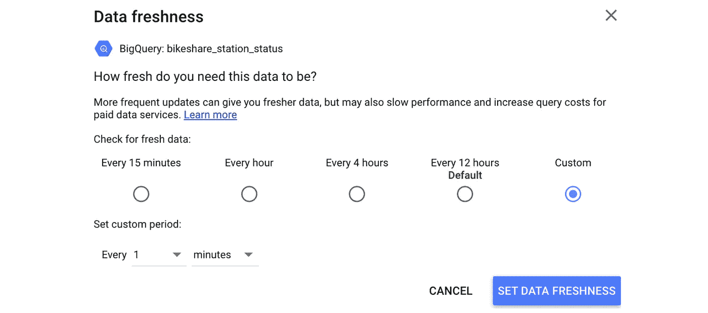
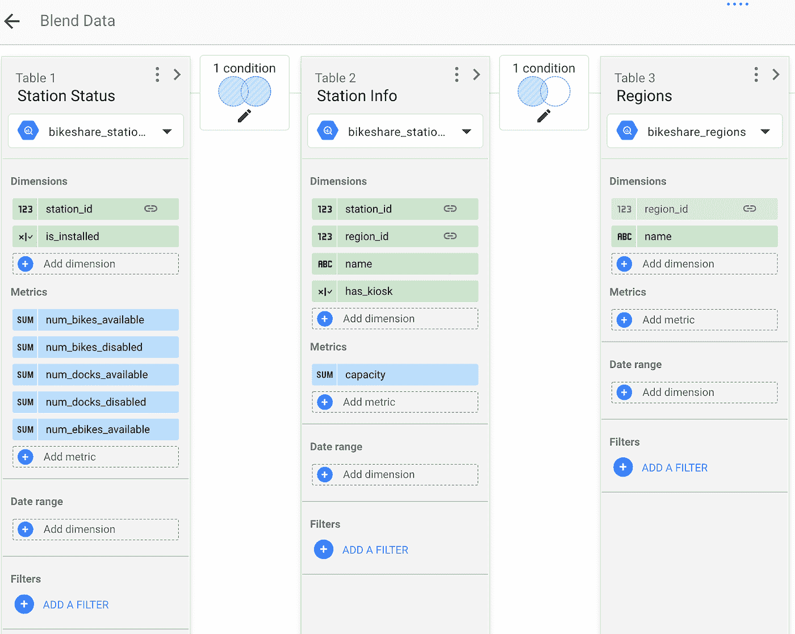
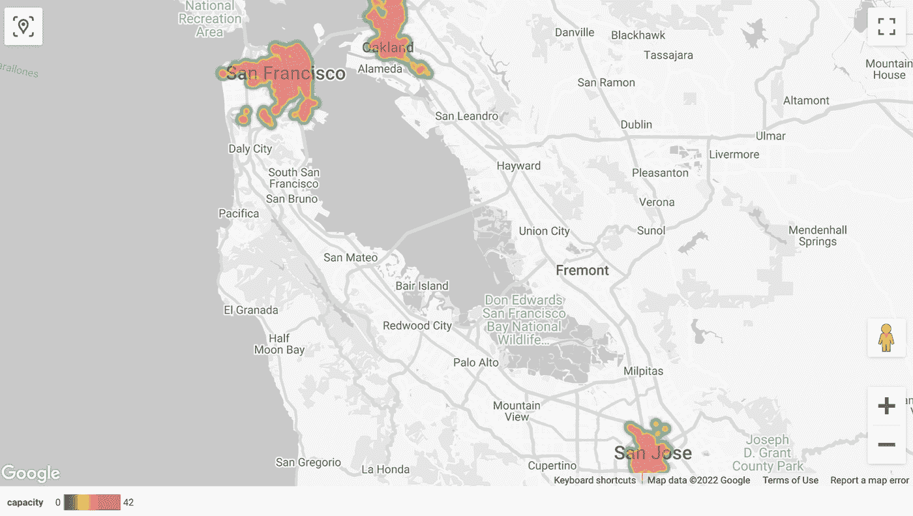
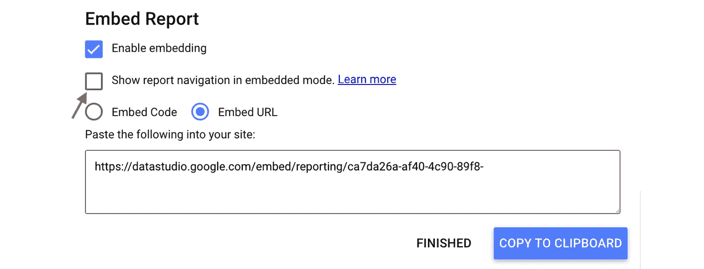
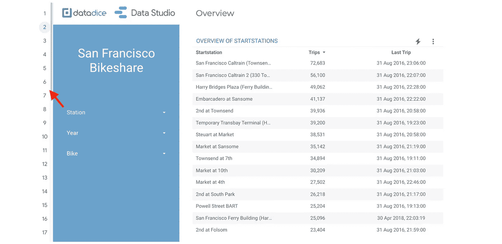
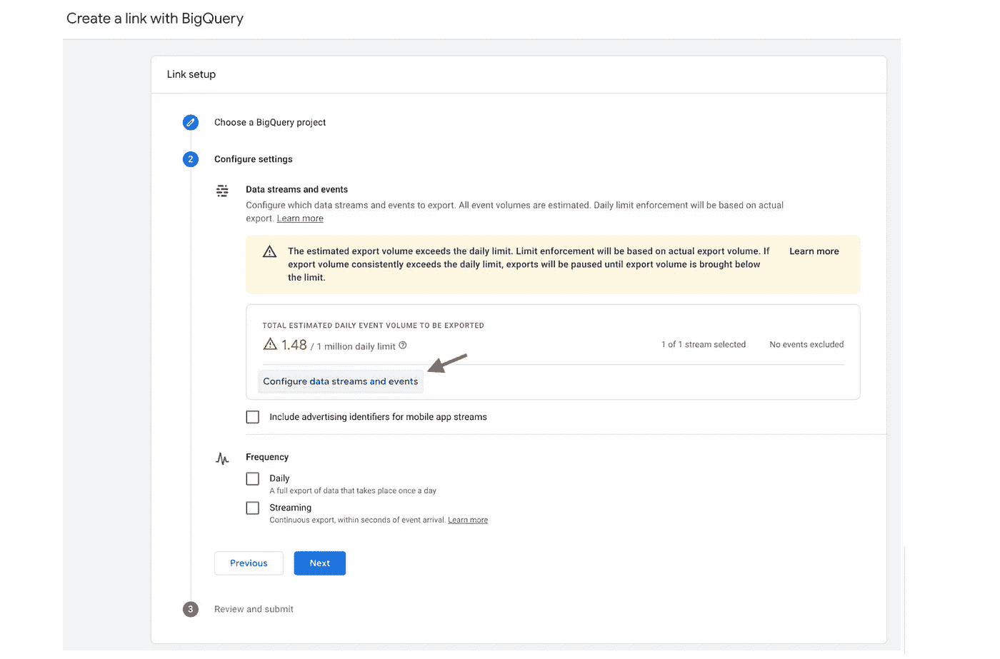
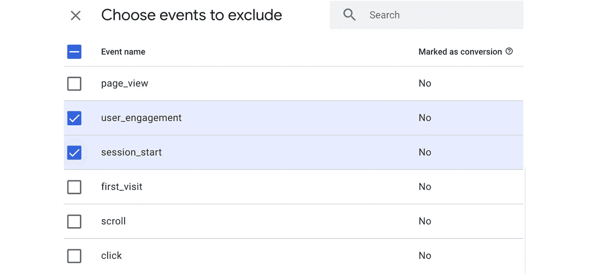
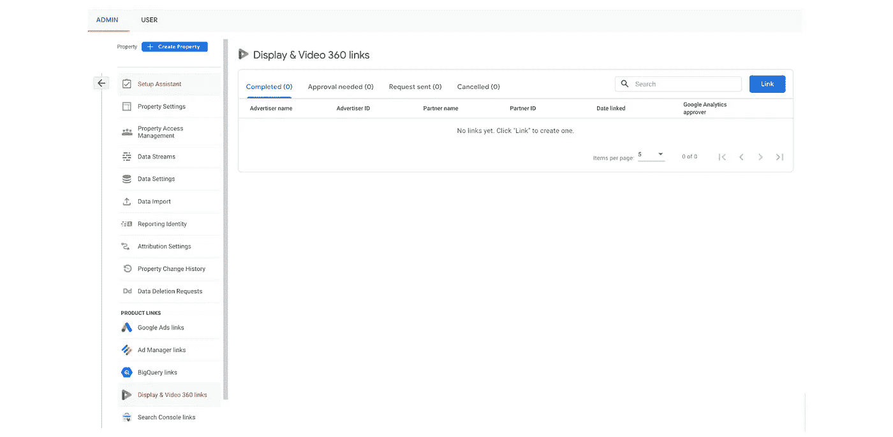

# 谷歌数据分析的最新更新(2022 年 2 月)

> 原文：<https://medium.com/geekculture/latest-updates-on-google-data-analytics-december-2021-d4cf91bacc03?source=collection_archive---------6----------------------->

## BigQuery、Looker Studio(以前称为谷歌数据工作室)、谷歌分析(GA)和谷歌标签管理器(GTM)的更新亮点。亚历山大·柯俊

Photo by [Serena Naclerio](https://unsplash.com/@serenaclerio) on [Unsplash](https://unsplash.com/)

在这篇博文中，我想总结一下我们每天在 [datadice](https://www.datadice.io/) 使用的谷歌工具的新版本。因此，我想概述一下 BigQuery、Looker Studio(以前称为 Google Data Studio)、Google Analytics 和 Google Tag Manager 的新功能。此外，我将重点介绍我认为最重要的几个版本，还会列举一些其他的改动。

如果你想仔细看看，这里可以找到来自 [BigQuery](https://cloud.google.com/bigquery/docs/release-notes) 、Looker Studio(原名谷歌数据工作室)[谷歌分析](https://support.google.com/analytics/answer/9164320?hl=en) & [谷歌标签管理器](https://support.google.com/tagmanager/answer/4620708?hl=en)的发布说明。

# BigQuery

## 使用递归

递归算法是编程语言中的标准方法。因此，现在在 BigQuery 中重复一个任务，每一步都有某种递增/递减的变化也是可能的。

让我们快速看一个例子:

> 递归生成日期为
> 
> ((SELECT CAST(' 2021–01–01 ' AS DATE)AS DATE)UNION ALL(SELECT DATE _ ADD(DATE，间隔 1 天)AS DATE FROM GENERATE _ dates WHERE DATE< ‘2021–01–31’))
> 
> SELECT date FROM generate_dates ORDER BY 1

When you are creating a WITH statement you can decide if it should be recursive or not. So in the first parenthesis, you are choosing the starting point of the algorithm. The second statement defines the incremental change of the data in every step and the condition when the recursion is finished.

With the example, we are creating a column for every day in January 2021\. The date 31.01.2021 is also part of the result because at first it calculates and writes the result in the table and then it checks the condition.

Note: There are even simpler approaches to generate this kind of data, e.g.using [GENERATE _ DATE _ ARRAY()](https://cloud.google.com/bigquery/docs/reference/standard-sql/array_functions#generate_date_array))。

# 表克隆

BigQuery 已经提供了很多复制表的可能性。在几个月的时间里，您还可以创建快照来保存或获取表的定义版本。

现在也可以从表中创建一个克隆。所以你也有一个基表和一个克隆表。与其他方法的最大区别是，如果在复制的表中不做任何更改，这个表就没有存储成本。对于基表和克隆表之间的所有差异，只有存储成本。

创建克隆表的语句如下:

> 创建表格
> 
> 项目名称.数据名称.表格克隆
> 
> 克隆项目名称.数据名称.表格

# 远程功能

BigQuery 已经有了用户定义函数(UDF ),可以用 SQL 或 Javascript 创建更复杂的算法，并在 ETL 中使用它们。

使用远程函数，您可以用 SQL 或 JS 之外的其他语言构建功能，并使用更多不同的库。为此，您必须在 Google Cloud Functions 中构建一个端点，在 BigQuery 中创建一个远程函数，并在查询中使用它。你可以看看这里的来获得更多的见解。

# Looker 工作室

## BigQuery 连接器数据新鲜度

消除了 Looker Studio 和 BigQuery 强连接的一大障碍。在更改之前，数据新鲜度至少为 15 分钟。这意味着报告中的数据每 15 分钟更新一次(除非您自己刷新数据)。

现在甚至可以把日程时间精确到每一分钟。这样，就有可能创建(接近)实时的报告。但可以肯定的是，当你一次又一次地更新数据时，你的成本会增加。要更改数据源的数据新鲜度，您必须执行以下操作:

*Inside the data source, change the data freshness*

*The data is getting refreshed every minute now*

## 改进的数据混合

Looker Studio 在很多方面改进了报告中的数据混合。我们将在接下来的几天里再写一篇关于这个话题的博文，因为有很多新的特性要介绍。这里你可以看到新的混合菜单:

*New Looker Studio blending menu*

我只想列出这篇博文中最重要的变化。更详细的信息将在下一篇博文中提供。

*   混合菜单的新外观
*   5 种不同的连接操作(以前总是左连接)
*   每个连接中的连接条件不同

## 谷歌地图热图

Looker Studio 增加了一种新的谷歌地图类型作为可能的图表类型。谷歌地图热图是新的好看的可视化。根据所选的指标，圆圈的颜色会发生变化。您可以更改三种不同强度的颜色(默认:绿色、黄色、红色)、圆圈的大小等等。

*New Google Maps Heatmap*

## 嵌入式报表中的页面导航

当您不在报表中提供自定义导航时，在嵌入式报表中导航并不直观。现在，您可以使用 3 种标准导航类型之一(左侧、左上角或制表符)。您还必须在嵌入式报告中激活它:

*Activate navigation for this embedded report*

*Left Navigation Type inside an embedded report*

# 谷歌分析

## GA4 中的 BigQuery 导出过滤

当您想要将 GA4 数据导出到 BigQuery 时，您可以选择应该在导出中排除的事件。当您超过每天 100 万个事件的限制时，这尤其有趣。

您可以键入您想要排除的事件名称(这对您将来拥有此事件很重要，但不应该是导出的一部分)，或者您可以获得所有可用事件的列表。

*Exclude Events from the BQ export*

*List of available events to exclude*

## GA4 带显示器和视频 360°数据

您现在可以将您的显示和视频 360 数据与您的 Google Analytics 4 属性相链接，以便在 GA4 报告中查看这些数据。您可以在 GA4 属性的 Admin 部分连接它。

*Linking Display & Video 360 advertisers with GA4*

# 谷歌标签管理器

谷歌标签管理器不再发布。

# 本月即将发布的 datadice 博客文章

*   新的 Looker 工作室混合菜单— [此处](https://datadice.medium.com/new-data-studio-feature-new-blending-menu-a9fd64cae492)
*   谷歌通用分析的终结有一个日期——这里是
*   友好介绍 Y42 — [此处](https://datadice.medium.com/friendly-intro-to-y42-15400f3f3963)

# 更多链接

这篇文章是来自 [datadice](https://www.datadice.io/) 的谷歌云系列的新功能的一部分，并给你关于 BigQuery 或 Looker Studio 的新功能的详细见解。

我们也从我们自己的 YouTube 频道开始。我们谈论重要的 DWH，BigQuery，Looker Studio 和更多的话题。点击查看频道[。](https://www.youtube.com/channel/UCpyCm0Pb2fqu5XnaiflrWDg)

如果你想了解更多关于如何使用 Google Looker Studio 并结合 BigQuery 更上一层楼，请查看我们的 Udemy 课程[这里](https://www.udemy.com/course/bigquery-data-studio-grundlagen/)。

如果您正在寻求帮助，以建立一个现代化的、经济高效的数据仓库或分析仪表板，请发送电子邮件至 hello@datadice.io，我们将安排一次通话。