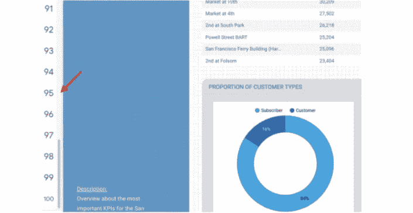
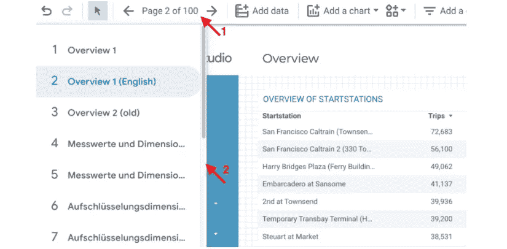
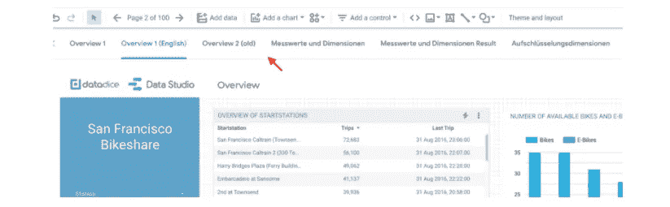
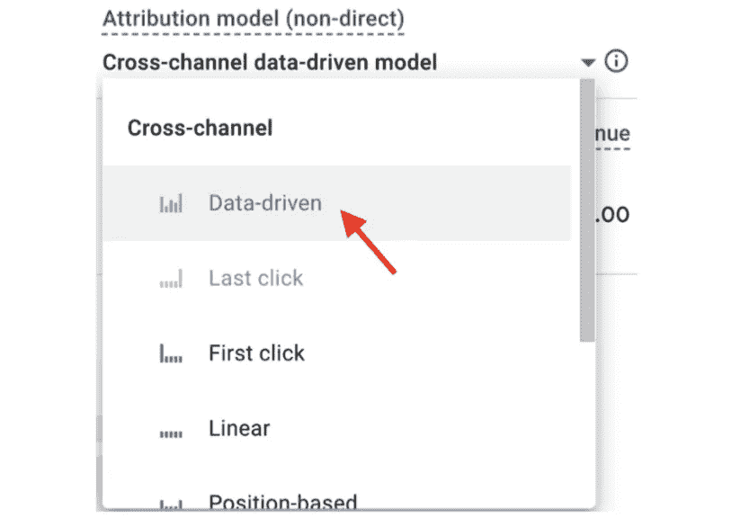
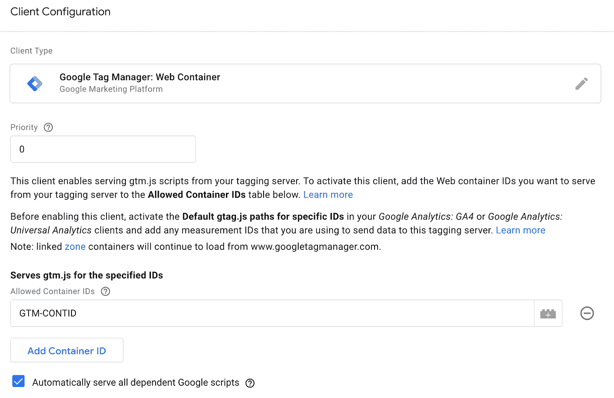

# 谷歌数据分析的最新更新(2022 年 1 月)

> 原文：<https://medium.com/geekculture/latest-updates-on-google-data-analytics-january-2022-90e5fba210e1?source=collection_archive---------8----------------------->

## BigQuery、Looker Studio(以前称为谷歌数据工作室)、谷歌分析(GA)和谷歌标签管理器(GTM)的更新亮点。亚历山大·柯俊

Photo by [Mathias Konrath](https://unsplash.com/@konni) on [Unsplash](https://unsplash.com/)

在这篇博文中，我想总结一下我们每天在 [datadice](https://www.datadice.io/) 使用的谷歌工具的新版本。因此，我想概述一下 BigQuery、Looker Studio(以前称为 Google Data Studio)、Google Analytics 和 Google Tag Manager 的新功能。此外，我将重点介绍我认为最重要的几个版本，还会列举一些其他的改动。

如果你想仔细看看，这里可以找到来自 [BigQuery](https://cloud.google.com/bigquery/docs/release-notes) 、Looker Studio(原名谷歌数据工作室)[谷歌分析](https://support.google.com/analytics/answer/9164320?hl=en) & [谷歌标签管理器](https://support.google.com/tagmanager/answer/4620708?hl=en)的发布说明。

# BigQuery

## 新数据类型

BigQuery 提供了 JSON 数据类型。正如你所期望的那样，它涵盖了 JSON 格式的数据。它还支持访问 JSON 内部数据的标准符号，如 person.name.first_name。Google 已经提供了一些处理 JSON 数据的功能，你可以看看这里的。

目前，至少有一个 JSON 列的表有一个很大的限制。您不能将这些表格与您的 Looker Studio 报告联系起来。

此时，我们不可能在 BigQuery 项目中使用这种新的 JSON 数据类型。我总是得到错误消息“当前项目没有启用 JSON”或“找不到类型:Json”。当我们可以使用 JSON 数据类型时，我将在另一篇博客文章中写一个关于它的快速概述。

# Looker 工作室

## 编辑模式下的导航菜单

谷歌带来了一项新功能，以更快的方式管理你的报告。在编辑模式下，您会在仪表板的左侧或顶部看到导航菜单。以前，在编辑期间更改报告页面有点笨拙。

导航菜单的外观取决于布局>导航类型。如果选择“左”型:

然后导航在左边，有页码。在我看来，这是最好的选择。例如，如果您选择导航类型“左上角”:

您仍然需要单击顶部的导航按钮(1。箭头)，然后就可以导航了。它在左侧显示菜单，并带有页码和页面名称。这里的问题是它与报告重叠。

当您选择“选项卡”类型时，它会出现在报告的顶部(页码+页面名称):

您可以在编辑模式下的视图>显示导航下激活(禁用)此选项。

# 谷歌分析

## GA4 中的新归因模式

在 Google Analytics 4 中，跨渠道数据驱动归因(DDA)现已推出。这是一个不同于其他模型(首次点击，最后点击，…)的属性，因为不同来源的流量分配不是基于一个特定的规则。它是一个黑匣子，背后有一个算法或机器学习。它试图将转换数据分配给不同的源，这取决于它(应该)有多大的影响。

您可以在 GA4 属性报告“型号比较”和“转换路径”中选择 DDA 属性。

# 谷歌标签管理器

## 在自己的域中加载客户端脚本

在大多数服务器端跟踪实现中，您仍然有一个客户端容器在运行，为了有更大的灵活性，使用已经存在的跟踪和跟踪，例如一些按钮点击。这种方法的问题是，根据定义，这种数据是第三方流量，因为它不像服务器端数据那样在您自己的域中运行。有了这项新功能，可以在客户端启用第一方跟踪。为此，您必须在网站上更改 GTM 代码片段，并在您的服务器端环境中创建一个客户端。

第三方的代码是:

> <脚本>(函数(w，d，s，l，I){ w[l]= w[l]| |[]；w[l]。push({'gtm.start':
> 新日期()。getTime()，event:' GTM . js ' })；var f = d . getelementsbytagname(s)[0]，
> j=d.createElement(s)，dl=l！= '数据层'？&l = '+l:' '；j.async = truej . src =
> '[https://**www.googletagmanager.com**/GTM . js？id = '+I+dl；f.parentNode.insertBefore(j，f)；})(窗口，文档，'脚本'，'数据层'，'**GTM-CONTID**)；](https://www.googletagmanager.com/gtm.js?id='+i+dl;f.parentNode.insertBefore(j,f);})(window,document,'script','dataLayer','GTM-CONTID);)</脚本>
> <！—结束谷歌标签管理器→

第一方的代码是:

> <脚本> (function(w，d，s，l，I){ w[l]= w[l]| |[]；w[l]。push({'gtm.start':
> 新日期()。getTime()，event:' GTM . js ' })；var f = d . getelementsbytagname(s)[0]，
> j=d.createElement(s)，dl=l！= '数据层'？&l = '+l:' '；j.async = truej . src =
> '[https://**sub.domain.com**/GTM . js？id = '+I+dl；f.parentNode.insertBefore(j，f)；](https://sub.domain.com/gtm.js?id='+i+dl;f.parentNode.insertBefore(j,f);)
> })(窗口，文档，'脚本'，'数据层'，'**GTM-CONTID**)；</剧本>
> <！—结束谷歌标签管理器→

这两个重要部分用粗体字表示。首先，您必须从服务器端设置进入跟踪域。在这两种实现中，您都必须添加 web 容器的 ID。

在服务器端容器中，您必须添加 GTM 客户机。

在这里，您还必须添加 web 容器 ID。
你也可以看看这个指南。
这是改善跟踪环境的一个好步骤

# 本月即将发布的 datadice 博客文章

*   [谷歌数据分析的最新更新(2022 年 2 月)](/geekculture/latest-updates-on-google-data-analytics-december-2021-d4cf91bacc03?source=your_stories_page-------------------------------------)
*   [谷歌通用分析的终结有了日期](/nerd-for-tech/the-end-of-googles-universal-analytics-has-a-date-9c636c0836f4?source=your_stories_page-------------------------------------)

# 更多链接

这篇文章是来自 [datadice](https://www.datadice.io/) 的谷歌云系列的新功能的一部分，并给你关于 BigQuery 或 Looker Studio 的新功能的详细见解。

如果你想了解更多关于如何使用 Google Looker Studio 并结合 BigQuery 更上一层楼，请查看我们的 Udemy 课程[这里](https://www.udemy.com/course/bigquery-data-studio-grundlagen/)。

我们也从我们自己的 YouTube 频道开始。我们谈论重要的 DWH，BigQuery，Looker Studio 和更多的话题。点击查看频道[。](https://www.youtube.com/channel/UCpyCm0Pb2fqu5XnaiflrWDg)

如果您正在寻求帮助，以建立一个现代化的、经济高效的数据仓库或分析仪表板，请发送电子邮件至 hello@datadice.io，我们将安排一次通话。