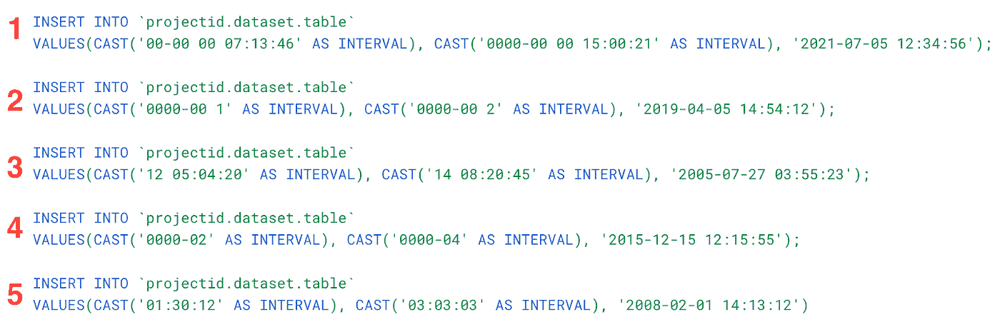
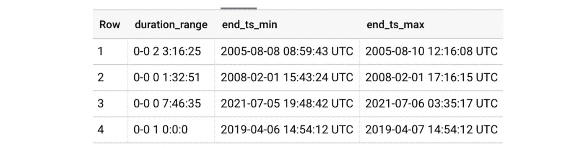
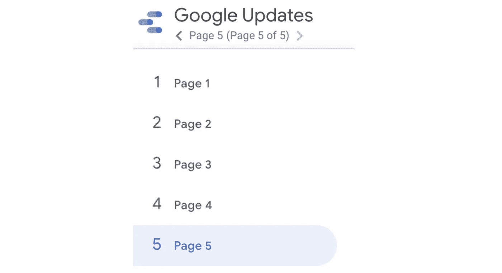
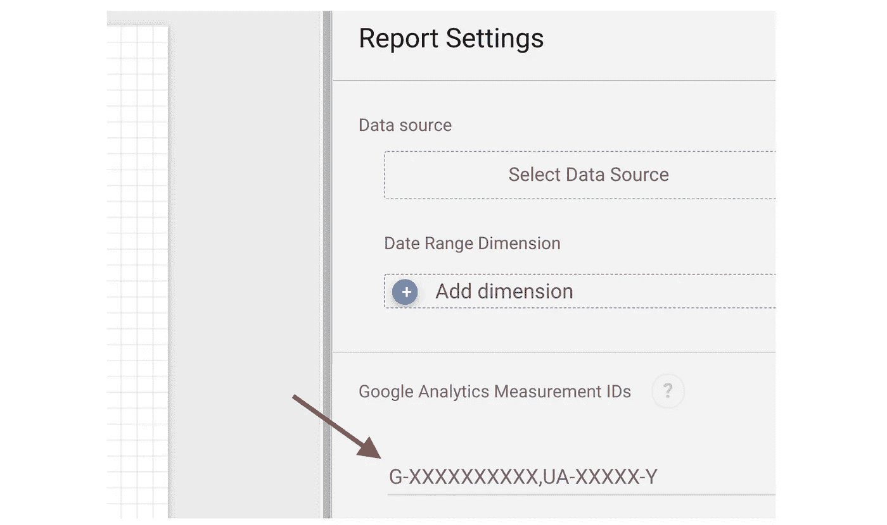

# 谷歌数据分析的最新更新(2021 年 7 月)

> 原文：<https://medium.com/geekculture/latest-updates-on-google-data-analytics-july-2021-90b83f5150f?source=collection_archive---------9----------------------->

BigQuery、Data Studio、Google Analytics (GA)和 Google Tag Manager (GTM)的更新亮点。亚历山大·柯俊

Photo by [Florian Wehde](https://unsplash.com/@florianwehde) on [Unsplash](https://unsplash.com/)

在这篇博文中，我想总结一下我们每天在 [datadice](https://www.datadice.io/) 使用的谷歌工具的新版本。因此，我想对 BigQuery、Data Studio、Google Analytics 和 Google Tag Manager 的新特性做一个概述。此外，我将重点介绍我认为最重要的几个版本，还会列举一些其他的改动。

如果你想仔细看看，这里可以找到来自 [BigQuery](https://cloud.google.com/bigquery/docs/release-notes) 、 [Data Studio](https://support.google.com/datastudio/answer/10331528?hl=en) 、[Google Analytics](https://support.google.com/analytics/answer/9164320?hl=en)&[Google Tag Manager](https://support.google.com/tagmanager/answer/4620708?hl=en)的发布说明

# BigQuery

BigQuery 获得了一种新的数据类型和一点改进。

## 区间数据类型

有一种新的数据类型可用。它被称为“间隔”，代表持续时间。数据必须是一段时间。这些值可以用毫秒、秒、分钟、小时、天、月和年来定义。它接受正或负的持续时间

将间隔插入表格的一些示例:

1.  全间隔对象
2.  年、月、日(考虑格式)
3.  天、小时、分钟、秒
4.  年，月
5.  小时、分钟、秒

也可以用这种类型计算。增加或减少 2 个间隔或一个带有日期或时间戳的间隔是可行的。

对于编号为 4 的 insert 语句中的条目，在执行查询后，我得到了以下错误代码:对于包含非零月份部分的时间间隔，不支持时间戳+/-时间间隔。看起来，当时间间隔只包含月份和年份时，不可能向时间戳添加时间间隔。

一些进一步改进的想法:

*   更多可选的日期格式(如季度、半年等)
*   目前非常严格的格式规定
*   不可能仅仅根据天数来定义时间间隔

## 改进的物化视图

Google 发布了物化视图的升级。过去，物化视图需要聚合。现在不再是这种情况，此外，物化视图内部的内部连接也是可能的。

# 谷歌数据工作室

数据工作室也有一些新的小功能。

# 更新的页面导航

导航类型“左上角”现在看起来更符合其他导航类型。

它几乎与“左”型相同。

*   “左侧”:导航始终显示在左侧
*   “左上”:用户必须点击左上角的页面导航按钮，以显示“左”导航类型

Left navigation menu

## 将报告与 GA4 连接

现在可以将报告的数据连接到 GA4。在这次更新之前，只能用 UA 来做。GA 将收集已连接报告的使用数据。连接 24 小时后，查看或推荐的数量是在谷歌分析中分析的数据。

Enter the GA4 or UA Tracking/Measurement ID

报告快照、实时报告或浏览部分可以包含 Data Studio 报告使用情况的数据。

## 谷歌地图图表容量

谷歌扩展了谷歌地图图表类型的一些界限:

*   限制 10.000 的经纬度值增加到 100.000
*   100.000 纬度、经度和 BQ 地理空间数据的限制增加到 1.000.000

# 谷歌分析

谷歌分析有一些不错的改进。

## 测试数据 API

以编程方式获取 GA4 报告数据的 API 现在处于测试阶段。它应该更加稳定，并且可以使用一些新的维度或指标。

## 归因变化

*   最后一次参与的模型现在已被弃用
*   在属性级别设置属性模型
*   管理部分的新属性设置页面
*   调整回看窗口

## GA4 360

360 for Google Analytics 4 仍处于测试阶段，因此它仍有新功能。有权访问 360 UA 属性的组织也可以将其 GA4 属性升级到 360 版本。此外，GA4 360 用户可以更深入地了解酒店的使用情况和整个计费流程。

# 谷歌标签管理器

谷歌仍在推进服务器端跟踪。

## 服务器端谷歌广告转换跟踪

他们将注意力转向了服务器端跟踪的一个主要问题，即谷歌广告。所以谷歌发布了一个谷歌广告转换标签来解决这个问题。实施指南位于[这里](https://developers.google.com/tag-manager/serverside/ads-setup)。

# 更多链接

这篇文章是来自 [datadice](https://www.datadice.io/) 的谷歌数据分析系列的一部分，每月向你解释 BigQuery、Data Studio、谷歌分析和谷歌标签管理器的最新功能。

如果你想了解更多关于如何使用 Google Data Studio 并结合 BigQuery 更上一层楼，请查看我们的 Udemy 课程[这里](https://www.udemy.com/course/bigquery-data-studio-grundlagen/?referralCode=49926397EAA98EEE3F48)