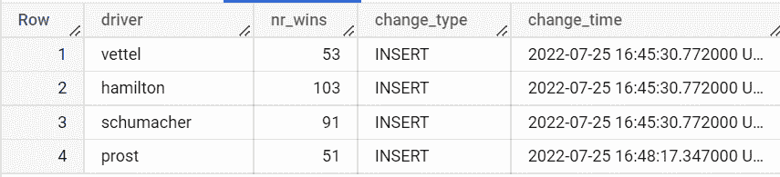
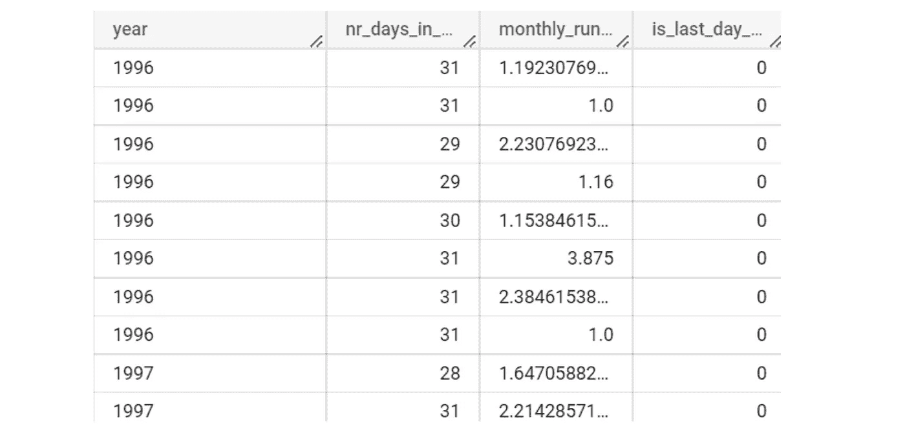
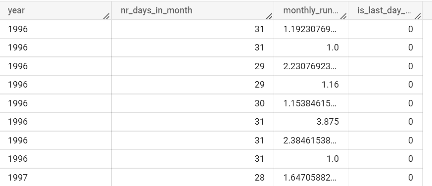
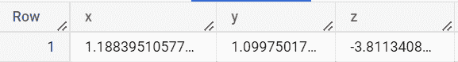
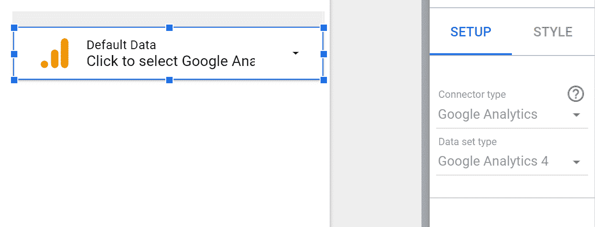
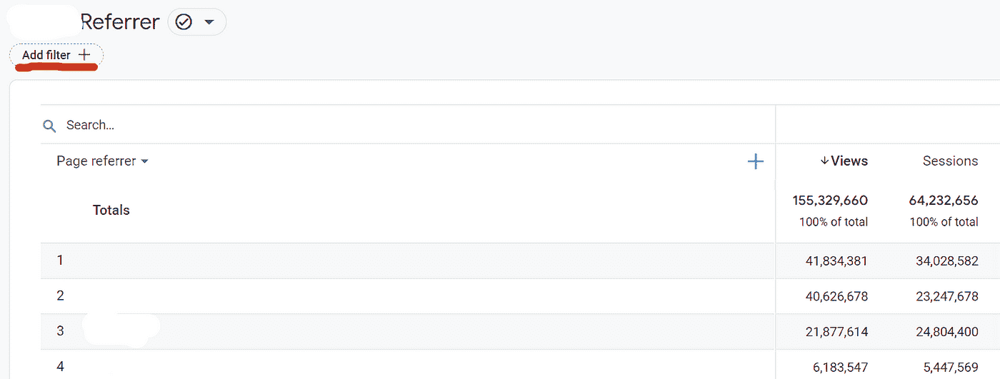
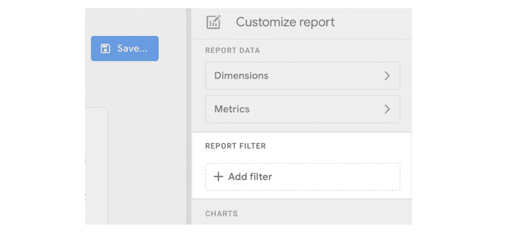

# 谷歌数据分析的最新更新(2022 年 7 月)

> 原文：<https://medium.com/geekculture/latest-updates-on-google-data-analytics-july-2022-e2959fa2b80a?source=collection_archive---------13----------------------->

## BigQuery、Looker Studio(以前称为谷歌数据工作室)、谷歌分析(GA)和谷歌标签管理器(GTM)的更新亮点。亚历山大·柯俊

Photo by [Samuel Svec](https://unsplash.com/@viewofsamu) on [Unsplash](https://unsplash.com/)

在这篇博文中，我想总结一下我们每天在 [datadice](https://www.datadice.io/) 使用的谷歌工具的新版本。因此，我想概述一下 BigQuery、Looker Studio(以前称为 Google Data Studio)、Google Analytics 和 Google Tag Manager 的新功能。此外，我将重点介绍我认为最重要的几个版本，还会列举一些其他的改动。

如果你想仔细看看，这里可以找到来自 [BigQuery](https://cloud.google.com/bigquery/docs/release-notes) 、Looker Studio(原名谷歌数据工作室)[谷歌分析](https://support.google.com/analytics/answer/9164320?hl=en) & [谷歌标签管理器](https://support.google.com/tagmanager/answer/4620708?hl=en)的发布说明。

# BigQuery

## 追加表格更改历史

一个很好的新功能，可以查看数据的历史变化。您可以选择一个表，并查看在何时向该表插入了哪些内容。

但是让我们看一个例子:

首先，让我们创建一个表并将一些数据放入其中。

> *创建或替换表格 admin.append_test*
> 
> *为*
> 
> *选择‘汉密尔顿’作为车手，103 作为 nr_wins*
> 
> *工会所有人*
> 
> *选择“舒马赫”为车手，91 为 nr_wins*
> 
> *联盟所有*
> 
> *选择‘维特尔’作为车手，53 作为 nr_wins*

然后，我想将下面的条目追加到同一个表中。

> *选择‘Prost’作为驱动程序，51 作为 nr_wins*

我们还可以在以后检查当我们更新表中的一行时得到了哪些信息。

> *更新管理追加测试*
> 
> *设置 nr_wins = nr_wins + 1*
> 
> *其中驾驶员=‘维特尔’*

最后，我们尝试了新的“附加”功能。您必须稍微修改一下 FROM 子句，并且可以在其中添加两个可选值(在我的示例中，这两个值都是 NULL)。

*   第一个值:要查看的数据更改的开始日期
*   第二个值:您要查看的数据更改的结束日期
*   当您将这两个值都设置为 NULL 时，您将获得完整的历史记录

此外，还有另外两列可以通过函数来处理。

*   _CHANGE_TYPE:进行的操作
*   _CHANGE_TIMESTAMP:执行操作的时间

> *选择*
> 
> *驱动程序，*
> 
> *nr_wins，*
> 
> *_CHANGE_TYPE AS change_type，*
> 
> *_ 更改时间戳作为更改时间*
> 
> *来自*
> 
> *APPENDS(TABLE admin . append _ test，NULL，NULL)*

因此，您可以从 APPENDS 函数中获得表中所有可用的字段+2 个附加字段。我认为最重要的限制是，目前只支持插入 change_type，所以我们看不到我们何时改变了维特尔的胜利数。

总的来说，这是一个很好的特性，当你需要添加数据时，例如，当你总是把最新的数据添加到表中，而你只需要最后添加的数据。

## 调整列大小

官方发行说明列表中没有条目，但是现在可以改变列的大小来查看完整的值。

这是一个不错的小调整，但是如果它总是显示完整的列名，并且我可以进一步扩展该列以查看完整的值，那就更好了。

## 新的三角 SQL 函数

BigQuery 获得了一些新的三角函数。

*   COT:计算角度的余切
*   COTH:计算一个角度的双曲余切
*   计算一个角度的余割
*   CSCH:计算一个角度的双曲余割
*   秒:计算角度的割线
*   SECH:计算角度的双曲割线

一个例子是:

> 选择 CSC(1)作为 x，CSC(2)作为 y，CSC(50)作为 z

提示:如果有可能导致错误的输入值，最好使用安全函数来避免中断查询。

# Looker 工作室

## GA4 数据控制

对于 Universal Analytics connector 数据，已经可以添加数据控件，在不同的数据集/属性之间切换。谷歌分析 4 连接器现在也可以做到这一点。

## 更改 IP 地址

这是一个小的变化，但是如果你使用一个即将推出的连接器，你必须看看。

当您使用下列连接器之一并且连接的数据库受防火墙保护时，您必须更改配置:

*   亚马逊红移
*   关系型数据库
*   一种数据库系统
*   微软 SQL Server 2017

需要打开以下 IP 地址才能与 Looker Studio still 建立有效连接:

*   142.251.74.0/23
*   142.251.74.0/23
*   2001:4860:4807::/48(可选)
*   74.125.0.0/16(需要在截止日期前打开)

以下 IP 地址可在截止日期后关闭:

*   64.18.0.0/20
*   64.233.160.0/19
*   66.102.0.0/20
*   66.249.80.0/20
*   72.14.192.0/18
*   108.177.8.0/21
*   173.194.0.0/16
*   207.126.144.0/20
*   209.85.128.0/17
*   216.58.192.0/19
*   216.239.32.0/19

本次变更的截止日期为 2023 年 6 月 21 日。

# 谷歌分析

## 新的 GA4 KPIs

谷歌在他们的报告中增加了一些新的指标。他们中的大多数都在庆祝环球分析的回归。​

**跳出率**又回来了！但它的计算方式与 UA 不同。在 Universal Analytics 中，这些是没有进一步交互的单页会话。在 GA4 中，它是订婚率的倒数。因此，当用户在网站上停留超过 10 秒钟，触发转换事件或第二次浏览量时，会话就开始了。所有其他会话都被计为退回会话。

此外，还提供了涵盖 UTM 参数 utm_content 和 utm_term 的新维度。通常，这些在会话和用户级别上可用:

*   **utm_content** :第一个用户手册广告内容，会话手册广告内容
*   **utm_term** :第一个用户手册术语。会话手动术语

谷歌还增加了可用字段的转换率:

*   **用户转化率**:用户触发转化事件的比率
*   **会话转化率**:会话触发转化事件的速率

## 过滤详细报告

GA4 高度关注定制报告。因此分析师可以在 GA4 前端创建他们自己的报告。老实说，构建全面报告的可能性仍然非常有限。

谷歌仍然在这些自定义报告中添加功能。现在，您可以在自定义报告中添加过滤器，以便为图表选择特定的一组数据。您可以通过创建报告来预筛选值，或者用户可以稍后设置筛选器。

*Add a filter to the report*

Prefilter the report

# 谷歌标签管理器

谷歌标签管理器不再发布。

# 本月即将发布的 datadice 博客文章

*   [用 Faker 生成虚拟数据](/nerd-for-tech/generate-dummy-data-with-faker-f4483934625f?source=your_stories_page-------------------------------------)
*   [新的 Looker Studio 特性:链接 API](/geekculture/new-data-studio-feature-linking-api-98b307a63661?source=your_stories_page-------------------------------------)

# 更多链接

这篇文章是来自 [datadice](https://www.datadice.io/) 的谷歌数据分析系列的一部分，每月向你解释 BigQuery、Looker Studio、谷歌分析和谷歌标签管理器的最新功能。

我们也从我们自己的 YouTube 频道开始。我们谈论重要的 DWH，BigQuery，Looker Studio 和更多的话题。点击查看频道[。](https://www.youtube.com/channel/UCpyCm0Pb2fqu5XnaiflrWDg)

如果你想了解更多关于如何使用 Google Looker Studio 并结合 BigQuery 更上一层楼，请查看我们的 Udemy 课程[这里](https://www.udemy.com/course/bigquery-data-studio-grundlagen/)。

如果您正在寻求帮助，以建立一个现代化的、经济高效的数据仓库或分析仪表板，请发送电子邮件至 hello@datadice.io，我们将安排一次通话。

*原载于*[*https://www . data dice . io*](https://www.datadice.io/new-features-july-2022)*。*