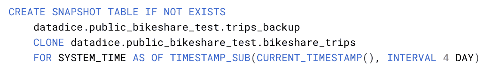
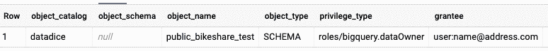
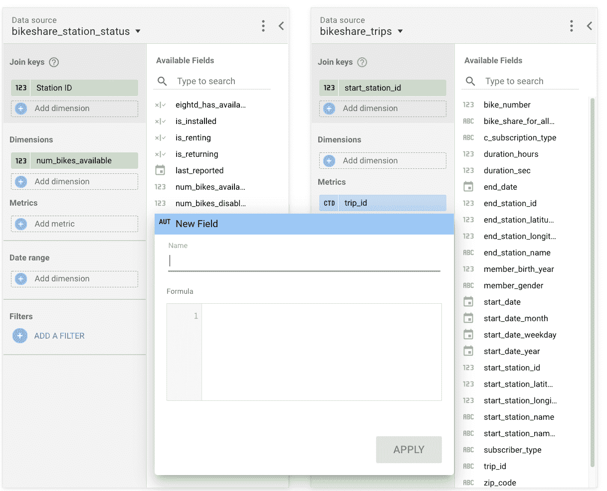
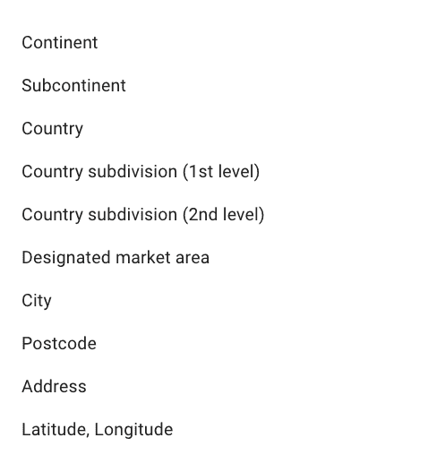
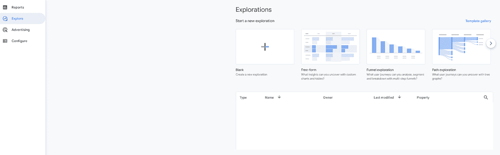

# 谷歌数据分析的最新更新(2021 年 6 月)

> 原文：<https://medium.com/geekculture/latest-updates-on-google-data-analytics-june-2021-7e669990a4b9?source=collection_archive---------45----------------------->

## BigQuery、Data Studio、Google Analytics (GA)和 Google Tag Manager (GTM)的更新亮点。亚历山大·柯俊

Photo by [Bharat Patil](https://unsplash.com/@bharat_patil_photography) on [Unsplash](https://unsplash.com/)

在这篇博文中，我想总结一下我们每天在 [datadice](https://www.datadice.io/) 使用的谷歌工具的新版本。因此，我想对 BigQuery、Data Studio、Google Analytics 和 Google Tag Manager 的新特性做一个概述。此外，我将重点介绍我认为最重要的几个版本，还会列举一些其他的改动。

如果你想仔细看看，这里可以找到来自 [BigQuery](https://cloud.google.com/bigquery/docs/release-notes) 、 [Data Studio](https://support.google.com/datastudio/answer/10331528?hl=en) 、[Google Analytics](https://support.google.com/analytics/answer/9164320?hl=en)&[Google Tag Manager](https://support.google.com/tagmanager/answer/4620708?hl=en)的发布说明

# BigQuery

BigQuery 有很多好看的新特性。

## 表快照

现在有可能创建表的快照。表快照拥有特定表的特定时间的数据。

*   定义最近 7 天内所需数据的时刻。
*   可以获取在过去 7 天内删除的已删除表的数据
*   您不能更改快照的数据
*   可以从快照创建新表

这是创建快照的一个示例:

我们从数据集 public_bikeshare_test 中的表 bikeshare_trips 创建快照 trips_backup。使用“FOR SYSTEM_TIME…”语句，您可以选择想要数据的时刻。

## 参数化数据类型

另一个新特性是参数化数据类型。可以为字符串或数字类型添加参数。例如，您可以定义字符串中字符的最大长度。关于这个话题的更多信息，你可以在这里找到。

## 新的铸造特征

此外，还有一些新的铸造特点。支持转换成不同的数字格式，通过转换，您可以从不同格式的日期字段中提取不同的日期部分。

提取日期的月份名称的示例(结果:六月):

在这里，你可以找到更多关于这个话题的信息。

## 新的 DCL 语句

BigQuery 的最后一个重要主题是使用 DCL 语句的访问控制。使用 GRANT 和 REVOKE 语句，您可以添加、编辑或删除某个人的项目权限。此外，您可以通过调用视图来查看当前的权限。如何使用这些语句，你可以在这里找到，在这里找到。

# 数据工作室

Data Studio 本月有了更多的小改进。

## 混合数据源中的计算字段

混合两个或更多数据源过程中的一个难点是创建计算字段。这终于有可能了。在创建混合数据的过程中，您现在可以创建计算字段。在创建混合数据源的过程中，不可能在自定义字段中使用属于混合的其他表中的字段。

Creating a custom field in a blended data source

## 地图图表改进

其他重要的新功能与地图图表相关。谷歌地图图表的默认自动缩放得到了改进。此外，地理图表的可用地理字段也有一些变化。

*Available geo fields for a geo chart*

*   国家细分(第二级)可以从不同的国家(例如，美国县、法国部门等)进行细分
*   旧字段区域现在命名为“国家/地区分部(第一级)”
*   国家、洲、…字段接受名称或相关代码

# 谷歌分析

只是对 GA 做了一些小改动。

## 菜单重命名

菜单“分析”现在被称为“探索”,而“探索”技术有了新的名称“从”。这边没有技术上的变化。

The exploration menu

## 离线事件数据

可以将离线事件数据添加到 GA 属性中。如果数据以定义好的格式保存在 CSV 文件中，那么你可以将它添加到 Google Analytics 中。[在本文档](https://support.google.com/analytics/answer/10325025)中，您可以找到更多信息和 CSV 导入事件数据的模板。

# 谷歌标签管理器

GTM 有一点改进。

## 初始容器版本

新的 GTM 预览模式有一个问题，即它只适用于已发布的容器版本。

当您现在创建一个新容器时，您可以从头开始调试，因为初始容器版本是自动创建的。

# 更多链接

这篇文章是来自 [datadice](https://www.datadice.io/) 的谷歌数据分析系列的一部分，每月向你解释 BigQuery、Data Studio、谷歌分析和谷歌标签管理器的最新功能。

如果你想了解更多关于如何使用 Google Data Studio 并结合 BigQuery 更上一层楼，请查看我们的 Udemy 课程[这里](https://www.udemy.com/course/bigquery-data-studio-grundlagen/?referralCode=49926397EAA98EEE3F48)