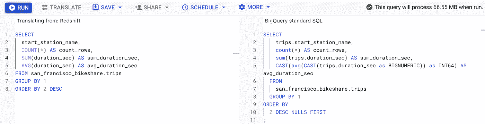
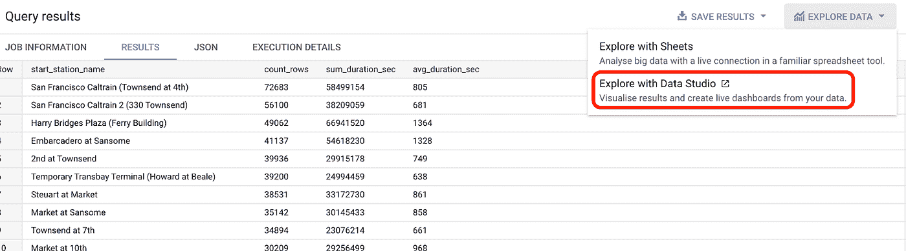
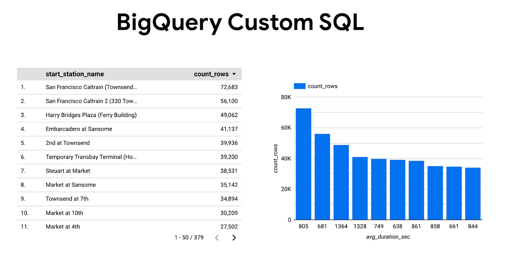
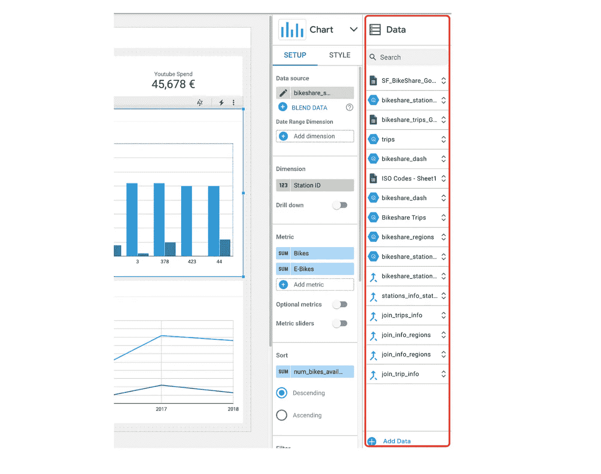
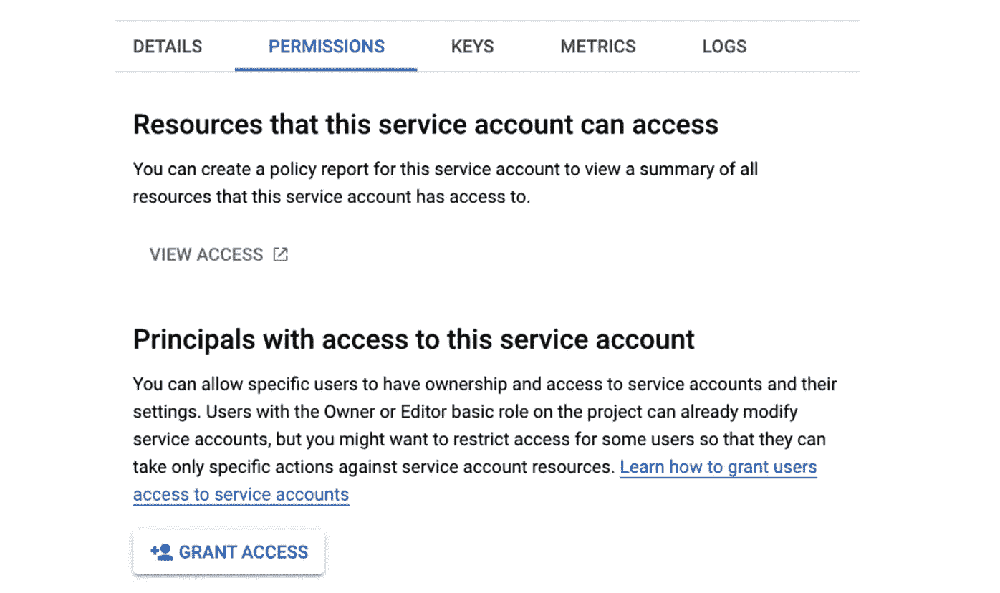
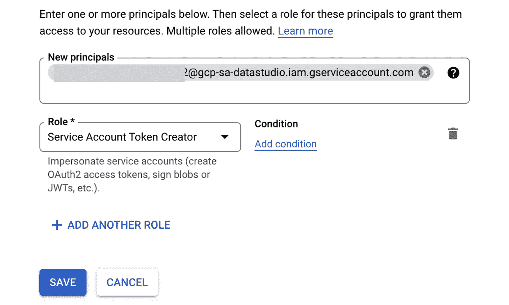
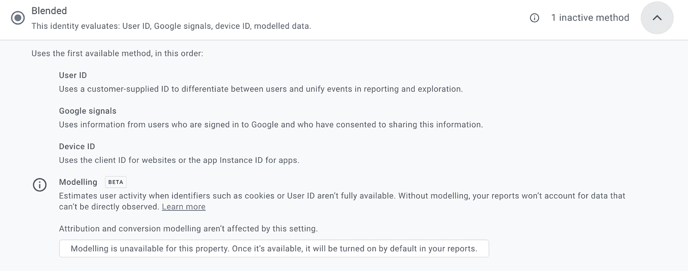
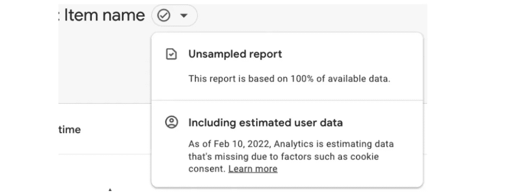

# 谷歌数据分析的最新更新(2022 年 6 月)

> 原文：<https://medium.com/geekculture/latest-updates-on-google-data-analytics-june-2022-cb46ae1914af?source=collection_archive---------13----------------------->

## BigQuery、Looker Studio(以前称为谷歌数据工作室)、谷歌分析(GA)和谷歌标签管理器(GTM)的更新亮点。亚历山大·柯俊

Photo by [Mika Baumeister](https://unsplash.com/@mbaumi) on [Unsplash](https://unsplash.com/)

在这篇博文中，我想总结一下我们每天在 [datadice](https://www.datadice.io/) 使用的谷歌工具的新版本。因此，我想概述一下 BigQuery、Looker Studio(以前称为 Google Data Studio)、Google Analytics 和 Google Tag Manager 的新功能。此外，我将重点介绍我认为最重要的几个版本，还会列举一些其他的改动。

如果你想仔细看看，这里可以找到来自 [BigQuery](https://cloud.google.com/bigquery/docs/release-notes) 、Looker Studio(原名谷歌数据工作室)[谷歌分析](https://support.google.com/analytics/answer/9164320?hl=en) & [谷歌标签管理器](https://support.google.com/tagmanager/answer/4620708?hl=en)的发布说明。

# BigQuery

## 设置默认配置

您可以在组织或项目级别设置一些配置。目前，支持三种设置:

*   default_time_zone:您可以选择一个默认时区，当依赖于时区的 SQL 函数没有指定时区值时，将采用该时区
*   Default_kms_key_name:是用于加密数据的默认云密钥管理服务密钥
*   default_query_job _timeout_ms:查询作业停止后的时间，以毫秒为单位(介于 10 分钟和 6 小时之间)

要进行这些设置，您必须执行以下操作:

> *改变组织设置选项(*
> 
> *` region-eu . default _ time _ zone ` =欧洲/柏林，*
> 
> *` region-eu . default _ kms _ KEY _ name `= KEY，*
> 
> *` region-eu . default _ query _ job _ time out _ ms ` = 1900000)；*

时区和超时参数是我们感兴趣的。我们有些项目使用不同的时区，通过超时参数，您可以控制您的查询运行时间。

## 查询队列

当您同时有很多查询时，这个新特性就会发挥作用。您可以对同时运行的查询数量设置限制，或者 BigQuery 为您计算一个合适的限制。

如果达到这个限制，当有空闲容量时，所有额外的查询都将进入队列并逐步执行。

更多信息，请点击查看[。](https://cloud.google.com/bigquery/docs/query-queues)

## SQL 翻译服务

SQL 翻译服务已经推出几个月了。谷歌仍在改进它，它现在已经普遍可用。Teradata SQL 和 Amazon Redshift SQL 已经可以翻译，一些翻译正在预览中，例如 Oracle SQL、雪花 SQL 和 Apache Spark SQL。

如果你想翻译 SQL 查询文件([批处理](https://cloud.google.com/bigquery/docs/batch-sql-translator#console))或者直接在 SQL 工作区([交互](https://cloud.google.com/bigquery/docs/interactive-sql-translator))的话，所有这些方言都是支持的。

*Select the needed SQL dialect*

An interactive SQL translation

## 使用 Looker Studio 探索数据

谷歌增加了一个新功能，再次展示了 BigQuery 和 Looker Studio 之间的良好连接。

当您查看查询的结果表时，您可以在 Looker Studio 报告中使用和可视化这些数据。

点击“使用 Looker Studio 探索”后，将打开一个新的 Looker Studio 报告，并显示一个表格和一个图表，其中包含一些已经设置的维度和指标。

*Automatically created report*

然后，您还可以更改报告并根据您的需要进行调整，以获得对数据的更多了解。

# Looker 工作室

## 链接 API

这是一个巨大的事情，我们仍然在检查，这种新的 API 的能力。因此，我很确定我会在接下来的几天里写一篇关于它的博文，但是让我们先来看看它。我特别想展示这个新功能背后的想法。

链接 API(在它被称为集成 API 之前)现在已经退出测试，并且有了很多新的特性。

总的想法是丰富你发送给另一个人的 Looker Studio 报告的访问链接，以定制这个人获得的体验。此外，您还可以使用您正在使用的 URL 来配置 Looker Studio 报告。

URL 具有以下结构:【https://datastudio.google.com/reporting/create?parameters】T5

所以路径总是相同的，所有的配置都是在参数中完成的。例如，参数 c.reportId 需要报告的 Id。此外，使用 c.pageId，您还可以定义起始页。

[https://datastudio.google.com/reporting/create?c . report id = 89431&c . pageid = fu 492 dk](https://datastudio.google.com/reporting/create?c.reportId=12345&c.pageId=fu492dk)

您还可以使用这些 URL 复制或创建新的仪表板。我们将在即将发布的 Linking API 博客文章中对此进行探讨。

更多信息，请点击查看[。](https://developers.google.com/datastudio/share/linking-api)

## 新数据面板

这是一个很好的新功能，它使您的日常工作流程更加简单。谷歌在编辑模式下右侧增加了一个新模块。

在这里，您可以看到与报告相关的所有数据源，您还可以轻松地添加新数据(按钮:添加数据)。您可以展开数据源以查看该数据源的所有可用字段，并且可以创建计算字段。

*The new data panel*

您还可以很容易地看到使用了哪种类型的连接器(在上面的截图中，使用了 GSheets、BQ 和混合数据源)。通过拖放操作，您可以将数据源中的字段添加到所选图表中。

## 数据访问的服务帐户

现在有可能使用服务帐户的凭证来访问数据源的数据。这种方法有一些好处，我认为最重要的是，如果一个人离开组织，您不会失去对数据的访问权。

你怎么能这样做？

*   首先，你必须去 [Looker Studio 服务代理](https://datastudio.google.com/serviceAgentHelp)并复制服务代理的电子邮件

*   然后，您必须在数据所在的同一项目中创建一个服务帐户
*   服务帐户需要 BigQuery 作业用户 IAM 角色
*   然后，在“服务帐户用户角色”字段中，添加应该有权访问服务帐户以及后来连接的数据的用户

*   在同一个地方，您还必须授予对 DS 服务代理的访问权限，并给它一个具有权限*iam . Service Account . getaccesstoken*的角色(例如服务帐户令牌创建者)

*   您可以授予服务帐户对项目、数据集和表级别的数据的访问权限

然后完成设置，使用此服务帐户进行数据访问。更详细的指南你可以在这里找到。

# 谷歌分析

## 在欧盟存储数据

对于欧盟的公司和用户来说，这是一个重要的变化！

对于 Google Analytics，还有其他域可以使用，跟踪数据存储在位于欧盟的服务器上。

我想你知道关于这个话题的大讨论，由于 GDPR 在欧盟的问题。谷歌开始着手解决这些问题。

为了确保这一点，您可能需要更新内容安全策略配置。具体怎么做，查看
[GA 发布说明](https://support.google.com/analytics/answer/9164320)。

## 同意模式的行为建模

此功能希望填补您的 GA 属性中的数据空白，例如，由于 Cookie 同意被拒绝。为了填补这一空白，谷歌试图根据现有数据估算缺失的用户行为数据。

重要提示:要使用此功能，您必须在您的网站上实现[谷歌同意模式](https://support.google.com/analytics/answer/9976101)功能。

要激活此建模，您必须转到管理>报告身份。对于我有权访问的所有属性，此功能不可用。当您激活它时，您可以在 GA 报告中检查它是否包括估计数据。

Check if behavioral modeling is activated

Report uses estimated data (picture taken from [here](https://support.google.com/analytics/answer/11161109))

更多信息，请点击查看[。](https://support.google.com/analytics/answer/11161109)

# 谷歌标签管理器

谷歌标签管理器不再发布。

# 本月即将发布的 datadice 博客文章

*   [如何在没有 Gmail 的情况下创建谷歌账户](/nerd-for-tech/how-to-create-a-google-account-without-gmail-863beeabec88?source=your_stories_page-------------------------------------)
*   [Y42 中的更多数据建模功能(第三部分)](/towardsdev/more-data-modeling-functions-in-y42-part-3-7f0ed123e0c1?source=your_stories_page-------------------------------------)

# 更多链接

这篇文章是来自 [datadice](https://www.datadice.io/) 的谷歌数据分析系列的一部分，每月向你解释 BigQuery、Looker Studio、谷歌分析和谷歌标签管理器的最新功能。

我们也从我们自己的 YouTube 频道开始。我们谈论重要的 DWH，BigQuery，Looker Studio 和更多的话题。点击查看频道[。](https://www.youtube.com/channel/UCpyCm0Pb2fqu5XnaiflrWDg)

如果你想了解更多关于如何使用 Google Looker Studio 并结合 BigQuery 更上一层楼，请查看我们的 Udemy 课程[这里](https://www.udemy.com/course/bigquery-data-studio-grundlagen/)。

如果您正在寻求帮助，以建立一个现代化的、经济高效的数据仓库或分析仪表板，请发送电子邮件至 hello@datadice.io，我们将安排一次通话。

*最初发布于*[*https://www . data dice . io*](http://datadice.io/new-features-june-2022)*。*