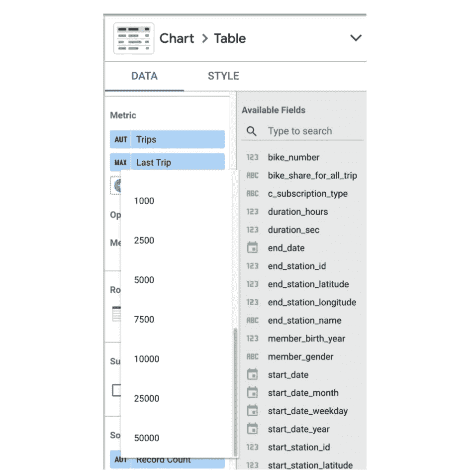
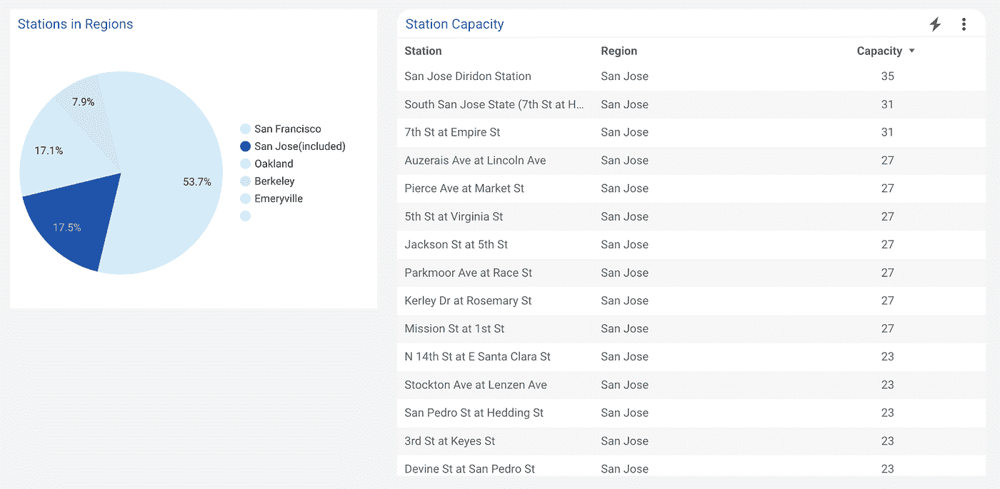
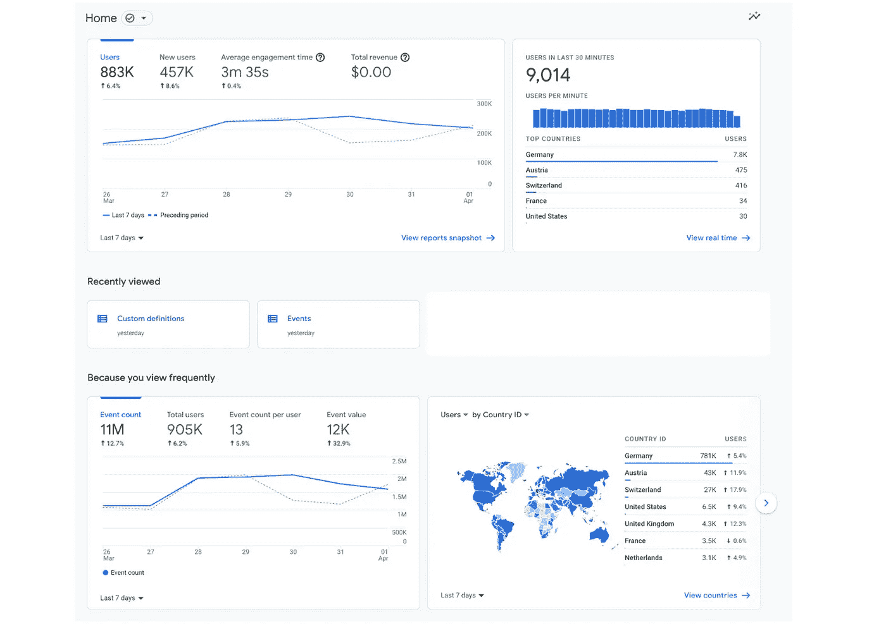
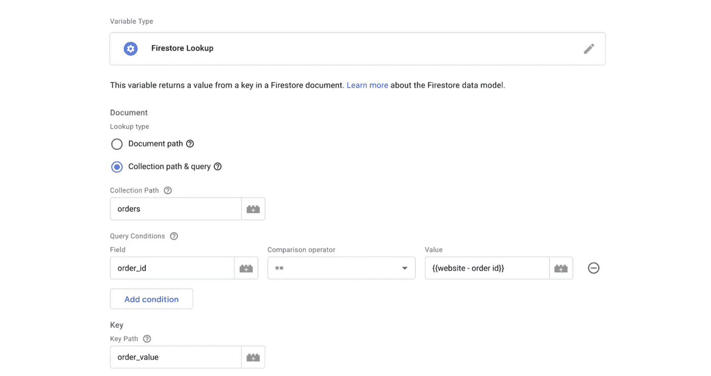

# 谷歌数据分析的最新更新(2022 年 3 月)

> 原文：<https://medium.com/geekculture/latest-updates-on-google-data-analytics-march-2022-decd0677c10a?source=collection_archive---------14----------------------->

## BigQuery、Looker Studio(以前称为谷歌数据工作室)、谷歌分析(GA)和谷歌标签管理器(GTM)的更新亮点。亚历山大·柯俊

*Photo by* [*Thomas Knorr*](https://www.linkedin.com/in/thomas-knorr-datadice/)

在这篇博文中，我想总结一下我们每天在 [datadice](https://www.datadice.io/) 使用的谷歌工具的新版本。因此，我想概述一下 BigQuery、Looker Studio(以前称为 Google Data Studio)、Google Analytics 和 Google Tag Manager 的新功能。此外，我将重点介绍我认为最重要的几个版本，还会列举一些其他的改动。

如果你想仔细看看，这里可以找到来自
[BigQuery](https://cloud.google.com/bigquery/docs/release-notes) 、Looker Studio(原名谷歌数据工作室)[谷歌分析](https://support.google.com/analytics/answer/9164320?hl=en) & [谷歌标签管理器](https://support.google.com/tagmanager/answer/4620708?hl=en)的发布说明。

# BigQuery

## 谷歌搜索公共数据集

BigQuery 提供了许多公共数据集，包含不同主题的数据。谷歌增加了一个新的谷歌搜索趋势数据集。你可以在这里找到数据集。

数据集有很多数据，看起来是学习 BigQuery、编写第一个 SQL 查询和构建仪表板的好方法。

## 槽推荐器

谷歌仍然试图帮助 BigQuery 的用户更深入地了解他们的 BigQuery 实例的支付行为。slot 推荐器会分析您对 BigQuery 的使用情况，并了解您当前的计费模式。

当您使用按需计费时，您将获得是否应该切换到统一费率定价以及可以节省多少钱的建议。对于资源的使用，其他洞察也是可能的。

## 指定外部表的模式

当您使用 Parquet、ORC 和 AVRO 文件在 BigQuery 中创建外部表时，您现在可以指定模式。以前只能使用自动检测模式选项。

# Looker 工作室

## 更多表格行

Looker Studio 做了很多小改动。例如，他们将一个页面上一个表的可能行数从 5，000 行增加到 50，000 行。我不确定什么时候一个表需要 50000 行，还要考虑到页面加载速度会随着显示的数据量而降低。

*Last possible steps for Rows per page*

## 默认交叉过滤

你应该记住的另一个小变化是交叉过滤的变化。使用交叉过滤，您可以单击图表中的一个维度值，报告将针对该值进行过滤。

*Filter for the region “San Jose”*

**快速提示**:使用 CMD +左键单击可以选择多个过滤器值。

从现在开始，默认情况下，新图表(对于大多数连接器)启用交叉筛选设置。您应该考虑何时向用户提供该选项是有意义的，因为可能会发生这样的情况，他们错误地点击了图表，然后报告被过滤。

## 改进的主页搜索

在 Looker Studio 的主页上，你可以找到你的报告、模板、数据源等等。你也可以搜索他们，这个搜索得到了改善。

*   搜索您与他人共享的报告(收件人:个人)
*   与您共享的报告或数据源(来自:个人)
*   按所有者搜索
*   用“我”做你自己的账户

此外，也可以使用“AND”或“or”来构建详细的搜索。

# 谷歌分析

## 通用分析的终结

这不是谷歌分析的发布说明的一部分，但我认为是过去几周最大的声明。我们写了我们自己的[博客文章](https://datadice.medium.com/the-end-of-googles-universal-analytics-has-a-date-9c636c0836f4)，所以简单总结一下。

到 2023 年年中，对通用分析的支持将停止，这些属性将不会收集任何数据。现在是开始使用谷歌分析的“新”版本谷歌分析 4 的时候了。它仍然不是完美的分析解决方案，但它正在变得越来越好。此外，没有办法将 UA 数据转换为 GA4 数据，因此您应该开始追踪以填充 GA4 属性。

## GA4 的新主页

GA4 平台的新起点是主页。总的来说，它显示了用户在你的网站或应用上的行为总结。显示的图表和 KPI 会随着时间的推移根据您在平台上的行为进行调整，例如，您大部分时间都在查看哪些报告。

*The new GA4 Home Page*

# 谷歌标签管理器

## Firestore API

Cloud Firestore 是谷歌云平台中的一个 NoSQL、事务性和基于文档的数据库。这是一个强大的数据库，特别是对于操作使用。通过服务器端跟踪和 Firestore 的结合，您可以丰富您的报告。

一个例子是在网站上购物。您只需将订单 id 发送给 GTM，当您使用 Firestore 作为运营数据库时，您可以从 Firestore 获得您需要的所有附加信息。要实现这一点，您必须在 GTM 中执行以下步骤:

*   在 GTM 中创建 Firestore 变量
*   将网站上的订单 id 添加到请求中
*   定义您想要的数据
*   用 Firestore 的信息丰富您的标签

这是展示服务器端跟踪优势的一个很好的例子。它可以很容易地与其他工具交互，并在详细的层次上定义请求。

# 本月即将发布的 datadice 博客文章

*   将数据源集成到一个全栈数据平台——此处[为](https://datadice.medium.com/integrating-data-sources-into-a-full-stack-data-platform-c595b942494e)
*   谷歌数据分析的最新更新(2022 年 4 月)——[此处](/geekculture/latest-updates-on-google-data-analytics-april-2022-7fae1654e94a?source=your_stories_page-------------------------------------)

# 更多链接

这篇文章是来自 datadice 的谷歌数据分析系列的一部分，每月向你解释 BigQuery，Looker Studio，谷歌分析和谷歌标签管理器的最新功能。

我们也从我们自己的 YouTube 频道开始。我们谈论重要的 DWH，BigQuery，Looker Studio 和更多的话题。点击这里查看频道。

如果你想了解更多关于如何使用 Google Looker Studio 并结合 BigQuery 更上一层楼，请在这里查看我们的 Udemy 课程。

如果您正在寻求帮助，以建立一个现代化和经济高效的数据仓库或分析仪表板，请发送电子邮件至 [hello@datadice.io](mailto:hello@datadice.io) ，我们将安排一个电话。

*最初发布于*[*https://www . data dice . io*](https://www.datadice.io/google-features-march-2022)*。*