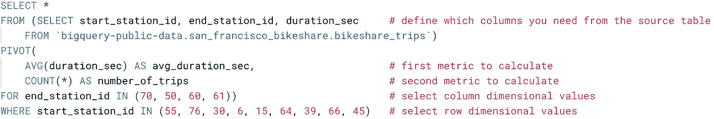
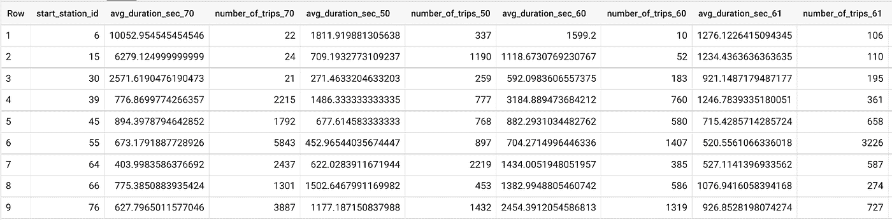
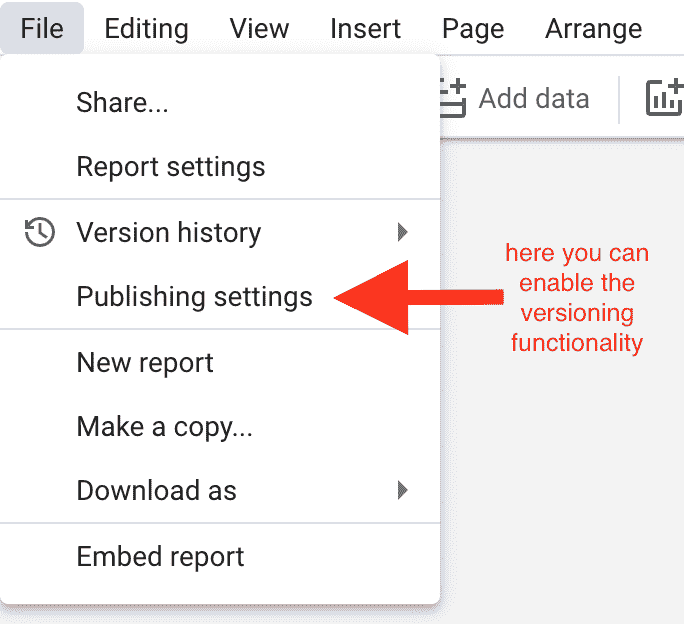
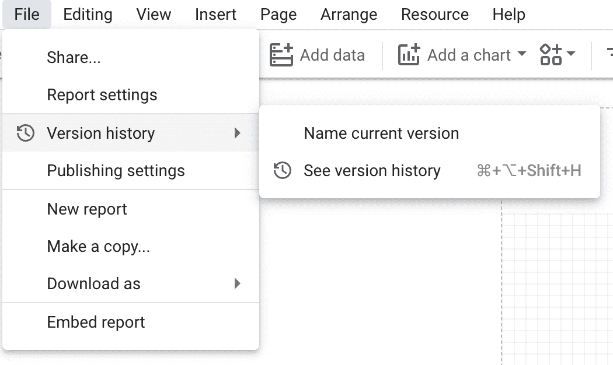
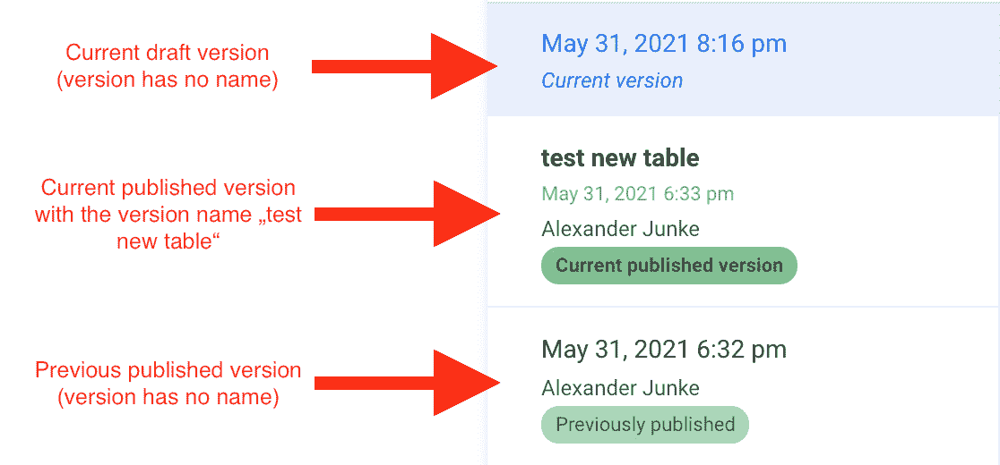
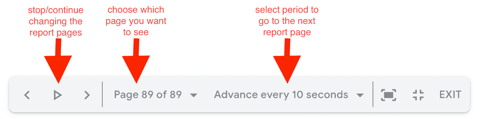
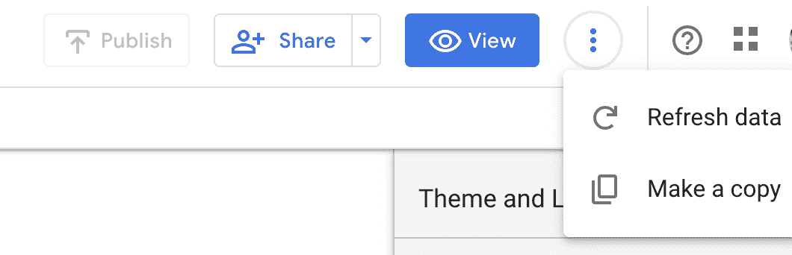

# 谷歌数据分析的最新更新(2021 年 5 月)

> 原文：<https://medium.com/geekculture/latest-updates-on-google-data-analytics-may-2021-1bb7b0e606a4?source=collection_archive---------51----------------------->

## BigQuery、Data Studio、Google Analytics (GA)和 Google Tag Manager (GTM)的更新亮点。亚历山大·柯俊

Photo by [Anthony Rosset](https://unsplash.com/@anthonyrosset) on [Unsplash](https://unsplash.com/)

在这篇博文中，我想总结一下我们每天在 [datadice](https://www.datadice.io/) 使用的谷歌工具的新版本。因此，我想对 BigQuery、Data Studio、Google Analytics 和 Google Tag Manager 的新特性做一个概述。此外，我将重点介绍我认为最重要的几个版本，还会列举一些其他的改动。

如果你想仔细看看，这里可以找到来自 [BigQuery](https://cloud.google.com/bigquery/docs/release-notes) 、 [Data Studio](https://support.google.com/datastudio/answer/10331528?hl=en) 、[Google Analytics](https://support.google.com/analytics/answer/9164320?hl=en)&[Google Tag Manager](https://support.google.com/tagmanager/answer/4620708?hl=en)的发布说明

# BigQuery

Google 最终宣布了在 BigQuery 中创建数据透视表的可能性。通过使用 PIVOT()函数，您可以选择最终表格的行和列尺寸。让我们来看一个示例查询:

结果表是:

通过这个查询，我们创建了一个数据透视表来获取一些始发站和终点站组合的旅行次数和每次旅行的平均持续时间。

示例:

*   列:行程数量 50
*   第一行(起点站 id = 6)
*   意味着 337 次旅行从车站 6 开始，在车站 50 结束

BigQuery 在这里提供了很多定制来创建这些数据透视表。使用 UNPIVOT 函数，您可以做同样的事情，反之亦然。

此外，BigQuery 为地理主题提供了一些新功能。你可以在这里查看它们[。新函数称为 ST_STARTPOINT、ST_ENDPOINT 和 ST_POINTN。](https://cloud.google.com/bigquery/docs/reference/standard-sql/geography_functions)

此外，现在可以用一个简单的 DDL 语句重命名现有的表。一个例子是:

> 如果存在 blog_data.blog_test_table，则更改表
> 
> 重命名为博客 _ 表格

# 数据工作室

Data Studio 带来了许多有趣的新特性。几周前，谷歌实施了一种版本控制。现在你也可以给每一个新版本起一个名字，来标识所做的改变。

首先简要介绍一下 Data Studio 中的当前版本控制。

报告的所有编辑都可以看到报告的当前草稿版本。报告的查看者只能看到发布的版本。在您做出正确的更改后，您将草稿版本设置为新的发布版本。

现在是如何使用新版本控制的快速指南:

*   首先，您必须为此报告启用版本发布。然后你处于草稿版本(只有编辑可以看到这个版本)

*   然后，您可以为仪表板的当前状态命名

*   在那之后，你可以进入版本历史并查看变化

这是一个很好的新特性，可以更好地控制对 Data Studio 仪表板所做的更改。

另一个新的实现是演示模式。在该模式的帮助下，您可以显示报告并选择显示报告下一页的时间段。

另外一个小变化是“刷新数据”按钮的新位置。现在你必须点击带有 3 个点的按钮，有可能刷新数据。

# 谷歌分析

谷歌本月没有为谷歌分析提供新功能。

# 谷歌标签管理器

谷歌本月没有为谷歌标签管理器提供新功能。

# 更多链接

这篇文章是来自 [datadice](https://www.datadice.io/) 的谷歌数据分析系列的一部分，每月向你解释 BigQuery、Data Studio、谷歌分析和谷歌标签管理器的最新功能。

如果你想了解更多关于如何使用 Google Data Studio 并结合 BigQuery 更上一层楼，请查看我们的 Udemy 课程[这里](https://www.udemy.com/course/bigquery-data-studio-grundlagen/?referralCode=49926397EAA98EEE3F48)