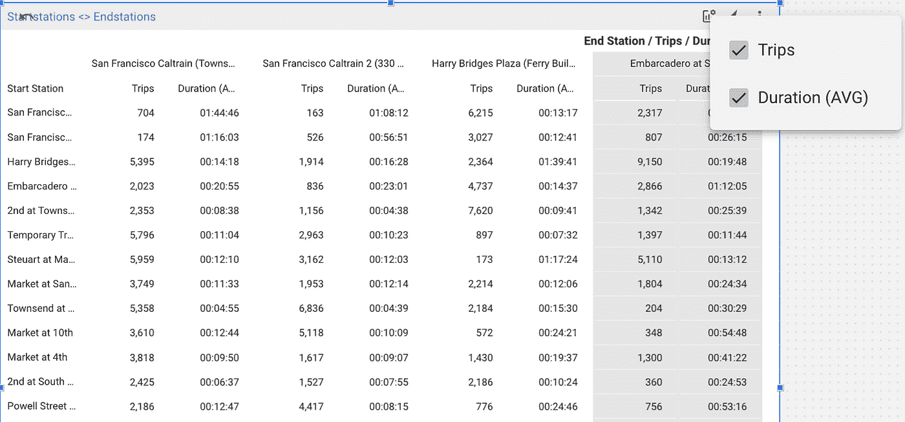
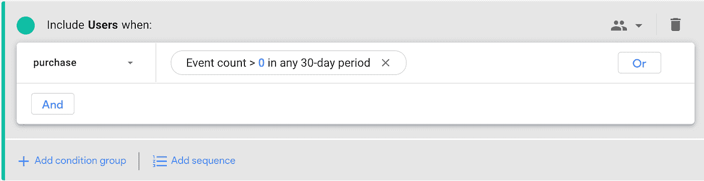
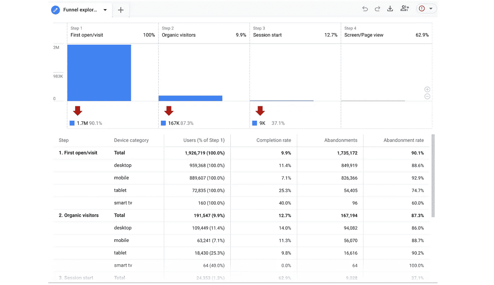

# 谷歌数据分析的最新更新(2022 年 5 月)

> 原文：<https://medium.com/geekculture/latest-updates-on-google-data-analytics-may-2022-dcc1968cf1ca?source=collection_archive---------10----------------------->

## BigQuery、Looker Studio(以前称为谷歌数据工作室)、谷歌分析(GA)和谷歌标签管理器(GTM)的更新亮点。亚历山大·柯俊

Photo by [Samuel Svec](https://unsplash.com/@viewofsamu) on [Unsplash](https://unsplash.com/)

在这篇博文中，我想总结一下我们每天在 [datadice](https://www.datadice.io/) 使用的谷歌工具的新版本。因此，我想概述一下 BigQuery、Looker Studio(以前称为 Google Data Studio)、Google Analytics 和 Google Tag Manager 的新功能。此外，我将重点介绍我认为最重要的几个版本，还会列举一些其他的改动。

如果你想仔细看看，这里可以找到来自
[BigQuery](https://cloud.google.com/bigquery/docs/release-notes) 、Looker Studio(原名谷歌数据工作室)[谷歌分析](https://support.google.com/analytics/answer/9164320?hl=en) & [谷歌标签管理器](https://support.google.com/tagmanager/answer/4620708?hl=en)的发布说明。

# BigQuery

## 校对功能

BigQuery 有了一个新功能，在某些特殊情况下非常有用。这个新函数叫做 COLLATE，它使用不同的条件对字符串进行排序。让我们看一个简单的例子，开始时没有校对功能:

选择*

来自 UNNEST([

x '，

y '，

z '

])作为字符

按字符排序

​

这里的结果是 Y，x，z 的顺序。所以首先它处理大写字母，然后是小写字母。collate 函数的对应示例如下:

​

选择*

来自 UNNEST([

COLLATE('x '，' und:ci ')，

y '，

z '

])作为字符

按字符排序

​

这是结果 x，Y，z，所以它忽略了字符的大小写，只按字母顺序排序。

其他重要事实包括:

*   该函数可用于字符串、结构中的字符串和数组中的字符串
*   目前唯一可用的规范是“und:ci”(排序不区分大小写)
*   像示例中一样，只需在一个元素上设置 COLLATE 规范，就可以对整列中的字符串进行排序
*   您也可以在表格上设定预设规格

你可以在这里找到更多信息[。](https://cloud.google.com/bigquery/docs/reference/standard-sql/collation-concepts)

## 列级数据屏蔽

BigQuery 仍然提高了整个数据的私密性和安全性。列级访问控制已经可用，这意味着一些用户无权访问所选的列。一个问题是，如果用户得到一个 SQL 查询，其中包含一个用户无权访问的列，那么查询在执行过程中会失败。

新的列级数据屏蔽提供了另一种方法。为用户选择的屏蔽列仍然可用，但不会显示真实数据。这具有很大的优势，即用户仍然可以访问表的完整结构。

对于屏蔽列中最重要的数据类型，显示了以下值:

*   整数:0
*   浮动:0.0
*   字符串: ""
*   时间戳:0001–01–01 00:00:00 UTC
*   数组:[]
*   JSON: {}

结构列有点特殊，因为不可能屏蔽一个完整的结构列，只能屏蔽叶字段。

您可以在此找到实施建议[。](https://cloud.google.com/bigquery/docs/column-data-masking-intro)

## 新的日期转换

BigQuery 已经有很多将日期转换成所需格式的可能性。他们基于 ISO-8601 格式添加了一种新的格式来获取一年中的某一天。需要的字符是%J。

此外，函数 PARSE_DATE、PARSE_TIME、PARSE_DATETIME 和 PARSE_TIMESTAMP 支持一些新的格式元素。你可以在这里获得更多关于[的见解。](https://cloud.google.com/bigquery/docs/release-notes#May_05_2022)

# Looker 工作室

## 数据透视表中的可选指标

我越来越喜欢这些可选的度量功能。这是一个很好的方法，让分析师有可能获得更详细的见解。但是对这些指标不感兴趣的人不必打开它们。

许多图表类型已经有了这些可选的指标。Google 现在也在数据透视表中加入了这一功能。例如，它与表的可选度量具有相同的处理方式。

## 提高了某些连接器的数据新鲜度

2022 年 2 月 10 日，Looker Studio 发布了一个新版本，可以将 BigQuery 数据的数据新鲜度设置为 1 分钟。这对我们来说是一个巨大的改变，因为几乎可以实时显示您的 BigQuery 数据。我们已经把它放在以前的博客文章[这里](/geekculture/latest-updates-on-google-data-analytics-december-2021-d4cf91bacc03)。

这种改进现在也适用于其他连接器。这些连接器是:

*   关系型数据库
*   一种数据库系统
*   MS SQL Server
*   亚马逊红移
*   适用于 MySQL 的 CloudSQL
*   谷歌云存储
*   云扳手

# 谷歌分析

## 观众回望

可以根据选定时间段内某个事件的事件计数来定义受众。您可以在配置>受众下创建受众。一个简单的例子是:

*   过去 30 天内在网站上购买过商品的用户

事件名称为“购买”,当事件计数在过去 30 天内大于 0 时，用户是受众的一部分。当然，这是一个滚动窗口，所以每天都有用户在窗口之外，而昨天的客户是窗口的一部分。

## 新漏斗报告 API

谷歌还改进了新的谷歌分析数据 API。使用 property.funnelreport 函数，您可以创建一个可视化全新漏斗报告的报告。

你可以在这里找到文档。

# 谷歌标签管理器

谷歌标签管理器不再发布。

# 本月即将发布的 datadice 博客文章

*   [Y42 中的拖放数据建模(第二部分)](/towardsdev/drag-and-drop-data-modeling-in-y42-part-2-9424a2b584f1?source=your_stories_page-------------------------------------)
*   [谷歌数据分析的最新更新(2022 年 6 月)](/geekculture/latest-updates-on-google-data-analytics-june-2022-cb46ae1914af?source=your_stories_page-------------------------------------)

# 更多链接

这篇文章是来自 [datadice](https://www.datadice.io/) 的谷歌数据分析系列的一部分，每月向你解释 BigQuery、Looker Studio、谷歌分析和谷歌标签管理器的最新功能。

我们也从我们自己的 YouTube 频道开始。我们谈论重要的 DWH，BigQuery，Looker Studio 和更多的话题。点击查看频道[。](https://www.youtube.com/channel/UCpyCm0Pb2fqu5XnaiflrWDg)

如果你想了解更多关于如何使用 Google Looker Studio 并结合 BigQuery 更上一层楼，请查看我们的 Udemy 课程[这里](https://www.udemy.com/course/bigquery-data-studio-grundlagen/)。

如果您正在寻求帮助，以建立一个现代化的、经济高效的数据仓库或分析仪表板，请发送电子邮件至 hello@datadice.io，我们将安排一次通话。

*最初发布于*[*https://www . data dice . io*](http://datadice.io/new-features-may-2022)*。*