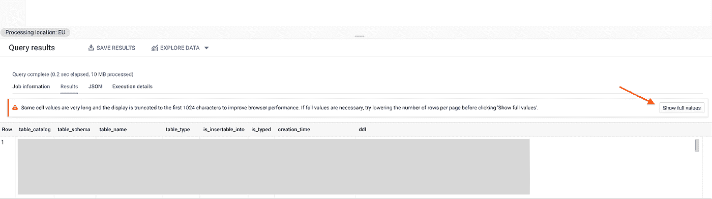
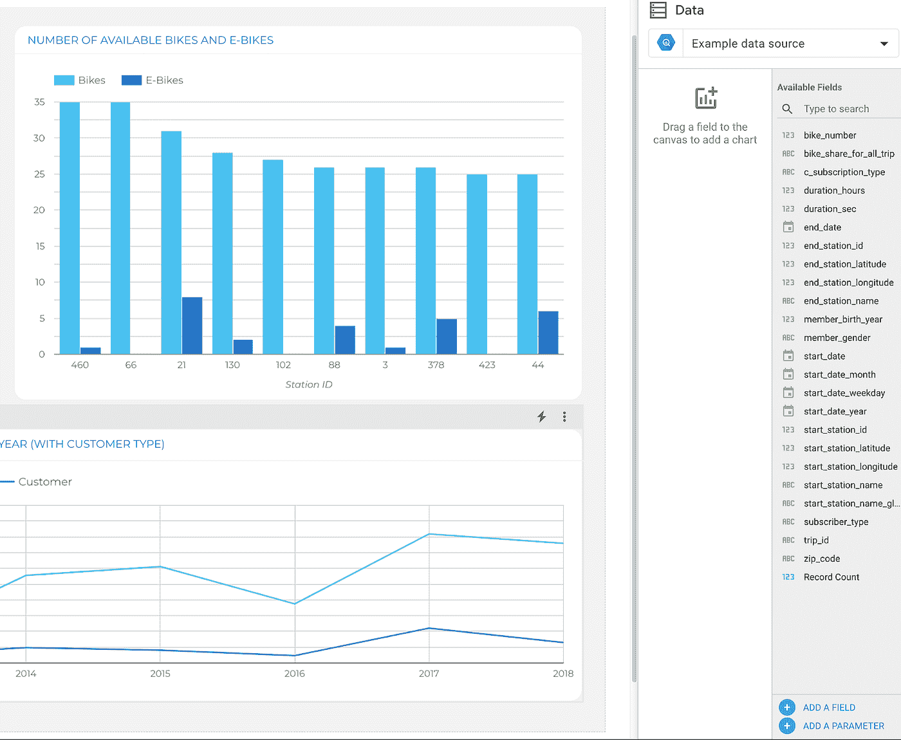
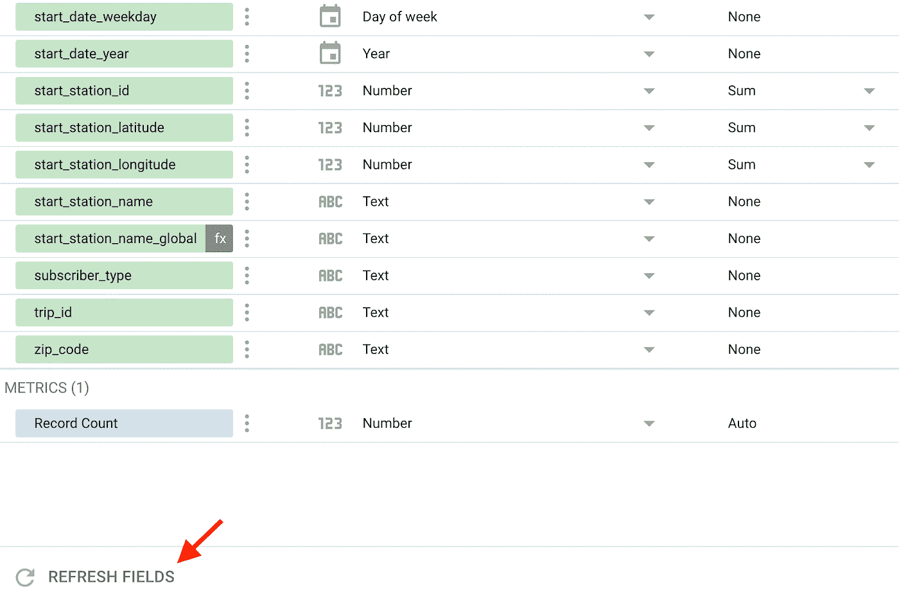

# 谷歌数据分析的最新更新(2021 年 11 月)

> 原文：<https://medium.com/geekculture/latest-updates-on-google-data-analytics-november-2021-4753b59cc268?source=collection_archive---------19----------------------->

## BigQuery、Looker Studio(以前称为谷歌数据工作室)、谷歌分析(GA)和谷歌标签管理器(GTM)的更新亮点。亚历山大·柯俊

Photo by [David Hertle](https://unsplash.com/@usa_reiseblogger_de) on [Unsplash](https://unsplash.com/)

在这篇博文中，我想总结一下我们每天在 [datadice](https://www.datadice.io/) 使用的谷歌工具的新版本。因此，我想概述一下 BigQuery、Looker Studio(以前称为 Google Data Studio)、Google Analytics 和 Google Tag Manager 的新功能。此外，我将重点介绍我认为最重要的几个版本，还会列举一些其他的改动。

如果你想仔细看看，这里可以找到来自 [BigQuery](https://cloud.google.com/bigquery/docs/release-notes) 、 [Looker Studio](https://support.google.com/looker-studio/answer/11521624?hl=en&ref_topic=6267740) 、[Google Analytics](https://support.google.com/analytics/answer/9164320?hl=en)&[Google Tag Manager](https://support.google.com/tagmanager/answer/4620708?hl=en)的发布说明。

# BigQuery

## 新脚本语句

谷歌在脚本中添加了一些功能。使用脚本，您可以在一个请求中发送多个语句。脚本有更多的可能性，如声明变量或循环。新的可用功能包括:

*   情况
*   标签
*   重复
*   为了…在

您可以在这里找到所有可用的功能。

## 信息模式中的新列

例程、模式和表的 INFORMATION_SCHEMA 视图有一个名为“DDL”的附加列。该列包含创建具有相同结构的表的 DDL 查询。

执行以下 SQL 语句后，您将获得数据集中表的元信息:

> SELECT * FROM dataset_name。信息 _ 模式。表格；

一行是数据集中的一个元素(表、视图等)，最后一列包含所描述的 DDL 语句:

> 创建表“项目名称.数据集名称.元素名称”
> 
> (
> 
> column_1 INT64
> 
> column_2 字符串
> 
> column_3 字符串，
> 
> 列 _4 浮动 64
> 
> );

提示:如果 DDL 语句太长，它会被缩短 3 个点。要查看完整的报表，您必须点击“显示完整值”

# Looker 工作室

## 在编辑模式下与报表交互

Looker Studio 在编辑模式下更改了与报告的交互行为。

一个很好的例子是使用过滤器。您可以在编辑模式下更改过滤器值。另一个副作用是，如果您在查看模式下更改过滤器，它们将保留在编辑模式下。

另一个效果是悬停在图表上后显示的标签。之前也只是在查看模式下可见。

所有这些更改确保更快地查看报告和图表设置中的更改。

## 新数据面板

在可用的编辑模式下，右侧有一个新面板。当在报告中没有选择元素时，所谓的“数据”面板是可见的。

*New “Data” panel*

您可以使用下拉菜单选择报告的所有连接数据源。此外，您可以看到所选数据源的所有字段。

如果您将一个字段拖放到页面上(图表之外)，Looker Studio 会创建一个包含该字段的新图表(主要是一个简单的记分卡)。如果将字段拖到现有的图表中，该字段将被添加到图表中。这取决于字段数据类型是作为维度还是度量添加，例如:

*   数字字段是指标
*   日期字段是维度

## 显示器和视频 360°连接器

显示和视频 360 的默认 Looker Studio 连接器现在有更多的字段。例如:

*   预算段名称
*   行项目开始日期
*   插入顺序目标类型

要在现有的数据源中获取这个新字段，必须刷新字段。

*Refresh the fields of a data source*

# 谷歌分析

## 更改频道分组(GA4)

谷歌在 GA4 中改变了默认的频道分组。

有很多新的渠道:有机购物、付费购物、付费的其他音频、短信等等。此外，YouTube 流量现在被分配到“有机视频”或“付费视频”(带有谷歌广告自动标记)。改变之前，这个流量的渠道是“社交”。

要查看 GA4 频道分组的当前状态，您可以查看[这里的](https://support.google.com/analytics/answer/9756891)。

# 谷歌标签管理器

谷歌标签管理器不再发布。

# 本月即将发布的 datadice 博客文章

*   云融合中的 Wrangler UI 和元数据—即将推出

# 更多链接

这篇文章是来自 [datadice](https://www.datadice.io/) 的谷歌数据分析系列的一部分，每月向你解释 BigQuery、Looker Studio、谷歌分析和谷歌标签管理器的最新功能。

如果你想了解更多关于如何使用 Google Looker Studio 并结合 BigQuery 更上一层楼，请查看我们的 Udemy 课程[这里](https://www.udemy.com/course/bigquery-data-studio-grundlagen/?referralCode=49926397EAA98EEE3F48)。

如果您正在寻求帮助，以建立一个现代化的、经济高效的数据仓库或分析仪表板，请发送电子邮件至 hello@datadice.io，我们将安排一次通话。