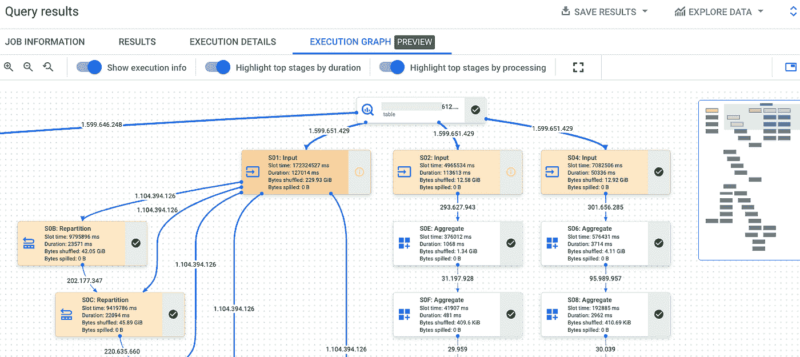
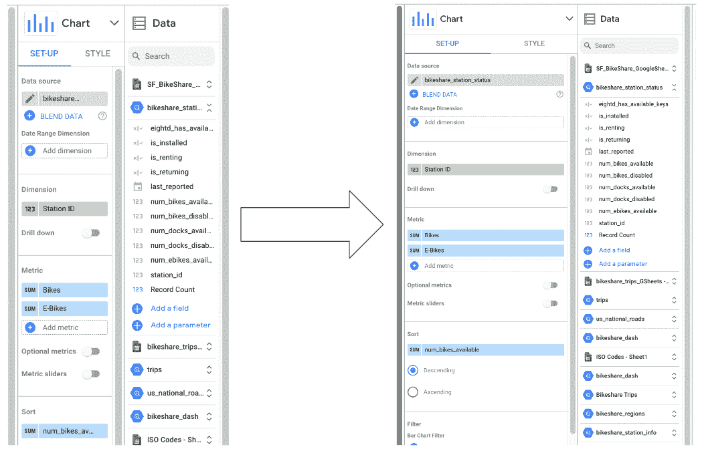
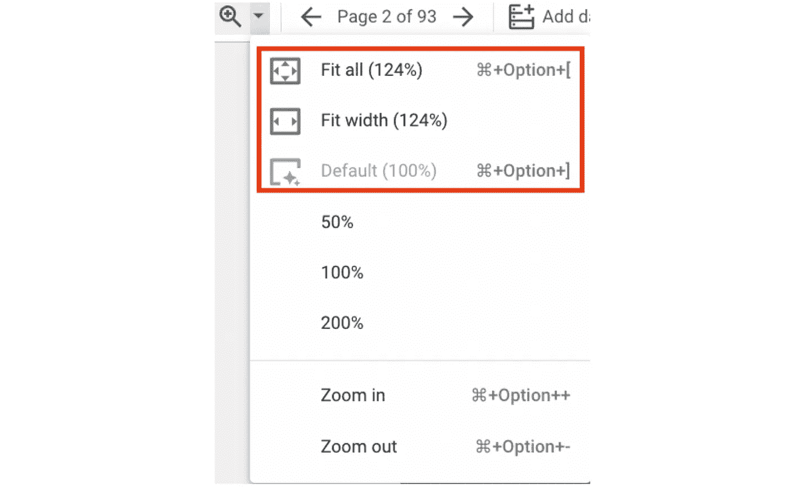

# 谷歌数据分析的最新更新(2022 年 11 月)

> 原文：<https://medium.com/geekculture/latest-updates-on-google-data-analytics-november-2022-48f32c9ce40a?source=collection_archive---------6----------------------->

## BigQuery、Looker Studio、Google Analytics (GA)和 Google Tag Manager (GTM)的更新亮点。亚历山大·柯俊

Photo by [Fabian](https://unsplash.com/@doc_fabi) on [Unsplash](https://unsplash.com/)

在这篇博文中，我想总结一下我们每天在 [datadice](https://www.datadice.io/) 使用的谷歌工具的新版本。因此，我想对 BigQuery、Looker Studio、Google Analytics 和 Google Tag Manager 的新功能做一个概述。此外，我将重点介绍我认为最重要的几个版本，还会列举一些其他的改动。

如果你想仔细看看，这里可以找到来自 [BigQuery](https://cloud.google.com/bigquery/docs/release-notes) 、 [Looker Studio](https://support.google.com/datastudio/answer/11521624) 、[Google Analytics](https://support.google.com/analytics/answer/9164320?hl=en)&[Google Tag Manager](https://support.google.com/tagmanager/answer/4620708?hl=en)的发布说明。

# BigQuery

## 查询执行图

当您在 BigQuery 中运行查询时，您可以在执行期间和执行之后查看一些执行细节。

Google 添加了“执行图”标签，以更直观的方式显示执行流程。

*The Execution Graph*

在上面的截图中，您可以看到执行的开始，在右边的窗口中，您可以看到总图和您正在查看的部分(蓝框)。使用上面的设置，例如按持续时间突出显示顶级阶段，BigQuery 会用不同的颜色显示哪些步骤需要更长时间，哪些是密集的处理步骤。

这是一个非常好的特性，特别有用，如果你需要设计高效的查询的话。

## 对象表

BigQuery 仍在建立与非结构化数据交互的新方式(在 BigLake 和 Google 云存储的帮助下)。

对象表是 BigQuery 中的只读表，在该表中，您可以找到位于 Google 云存储中的(非结构化)数据。其主要目的是分析非结构化数据，例如 ML 模型。

要创建一个对象表，首先必须将 BigQuery 与云存储连接起来。

然后，您可以编写一个查询来在 BigQuery 中创建一个外部表。

> 创建外部表` data_lake_test.name_of_table '
> 
> 带有连接“eu.test-data-lake”
> 
> object_metadata = '简单'，
> 
> uri =[' GS://name-of-the-bucket ']

这目前对我们不起作用，因为我们得到错误消息:“object_metadata 在这个项目中不受支持”，看起来这是一个常见的错误，Google 必须修复( [Ticket](https://issuetracker.google.com/issues/260412567?pli=1) )。

一个很好的视频来理解 BigQuery 中“对象表”背后的想法，你可以在这里找到。

这里的[你可以在文档中找到对象表的介绍(表的默认模式)。](https://cloud.google.com/bigquery/docs/object-table-introduction)

## 元数据缓存

另一个小的新特性是，您可以启用元数据缓存，以提高 BigLake 表和对象表的性能。当您创建表时，您必须启用这种缓存，还必须定义信息应该保存多长时间。

参数是 max_staleness。如果为 0(默认值)，则禁用元数据缓存。例如,“间隔 1 天”是一个有效值

> 创建外部表` data_lake_test.name_of_table '
> 
> 带有连接“eu.test-data-lake”
> 
> object_metadata = '简单'，
> 
> uri =[' GS://name-of-the-bucket ']，
> 
> max_staleness =间隔 1 天

# Looker 工作室

## 图表编辑面板

在我最近的一篇博客文章中，我抱怨过这个问题，现在它终于出现了:

您可以调整图表编辑面板的大小！

一个小但非常好的功能。如果你有很多长的列名，现在你可以直接看到(希望)全名，而不需要烦人的鼠标在字段上盘旋。

## 缩放控制

谷歌为你的报告增加了一些缩放控制选项。现在，您还可以从“适合全部”、“适合宽度”或“默认”(默认选择)选项中进行选择。使用这些选项，您可以轻松地将报告视图大小扩展到当前屏幕的最大潜力。

# 谷歌分析

## 作为主要维度的自定义字段

Google 仍在改进报告的可定制性，以便分析师可以构建自己的可视化效果。

已经可以在探索中添加自定义的维度和指标。现在，甚至可以向您的自定义报告添加自定义维度和指标。

在“报告”>“库”>“创建新报告”>“创建详细报告”下，您会看到可用自定义字段的列表。

## 新的日期和小时维度

GA4 中现在有更多的字段可用于您的定制报告，以便随时检查您的数据。

所以新的维度是

*   小时= 0–23
*   第 n 小时=所选日期范围开始后的小时数
*   日期+小时=格式:2022120512
*   week = 1–53(一周从周日开始)
*   月份= 1–12

Number of pageviews during the day (hourly steps)

# 谷歌标签管理器

## 压缩交通

现在默认情况下，新的服务器端容器正在压缩网络流量。这一变化改善了标记基础设施的延迟。

## 云运行服务器端标签实施指南

Google 提供了两种标准方法来在他们的云中实现你的服务器端跟踪基础设施。它开始的重点是使用应用引擎服务，现在云运行越来越多地出现在游戏中。

现在还有一个官方指南可以用来在云运行中设置你的服务器端跟踪环境。

# 本月即将发布的 datadice 博客文章

*   [RAWGraphs:一个免费的开源数据可视化工具](/nerd-for-tech/rawgraphs-a-free-and-open-source-tool-for-data-visualization-b79e337d750a?source=your_stories_page-------------------------------------)
*   [谷歌数据分析的最新更新(2022 年 12 月)](/geekculture/latest-updates-on-google-data-analytics-december-2022-3e1ab0122cb7?source=your_stories_page-------------------------------------)

更多链接

这篇文章是来自 [datadice](https://www.datadice.io/) 的谷歌数据分析系列的一部分，每月向你解释 BigQuery、Data Studio、谷歌分析和谷歌标签管理器的最新功能。

查看我们的 [LinkedIn](https://www.linkedin.com/company/datadice) 账户，深入了解我们的日常工作生活，并获得关于 BigQuery、Data Studio 和营销分析的重要更新

我们也从我们自己的 YouTube 频道开始。我们讨论了重要的 DWH、BigQuery、Data Studio 和许多其他主题。点击查看频道[。](https://www.youtube.com/channel/UCpyCm0Pb2fqu5XnaiflrWDg)

如果你想了解更多关于如何使用 Google Data Studio 并结合 BigQuery 更上一层楼，请查看我们的 Udemy 课程[这里](https://www.udemy.com/course/bigquery-data-studio-grundlagen/)。

如果您正在寻求帮助，以建立一个现代化的、经济高效的数据仓库或分析仪表板，请发送电子邮件至 hello@datadice.io，我们将安排一次通话。

*最初发布于*[*https://www . data dice . io*](https://www.datadice.io/new-features-november-2022)*。*