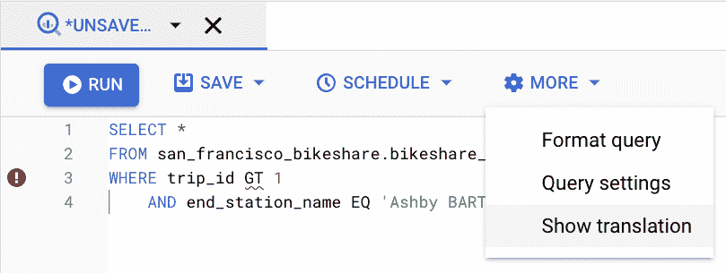
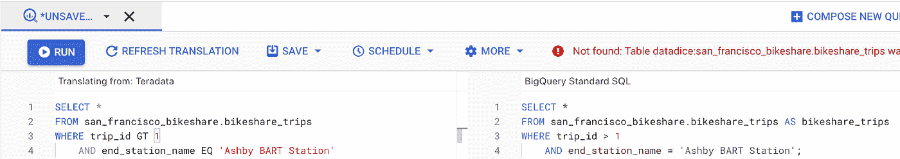
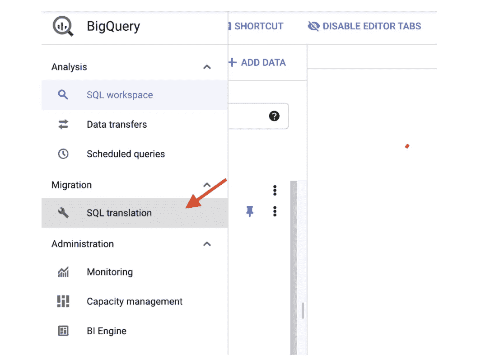
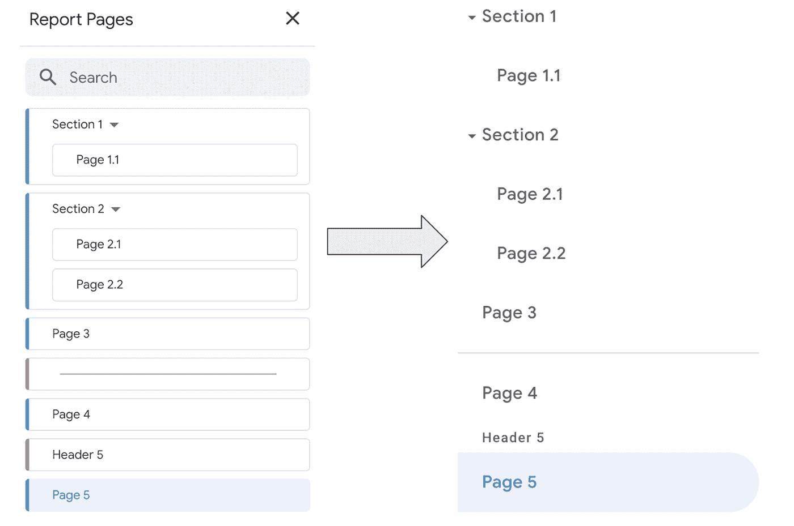
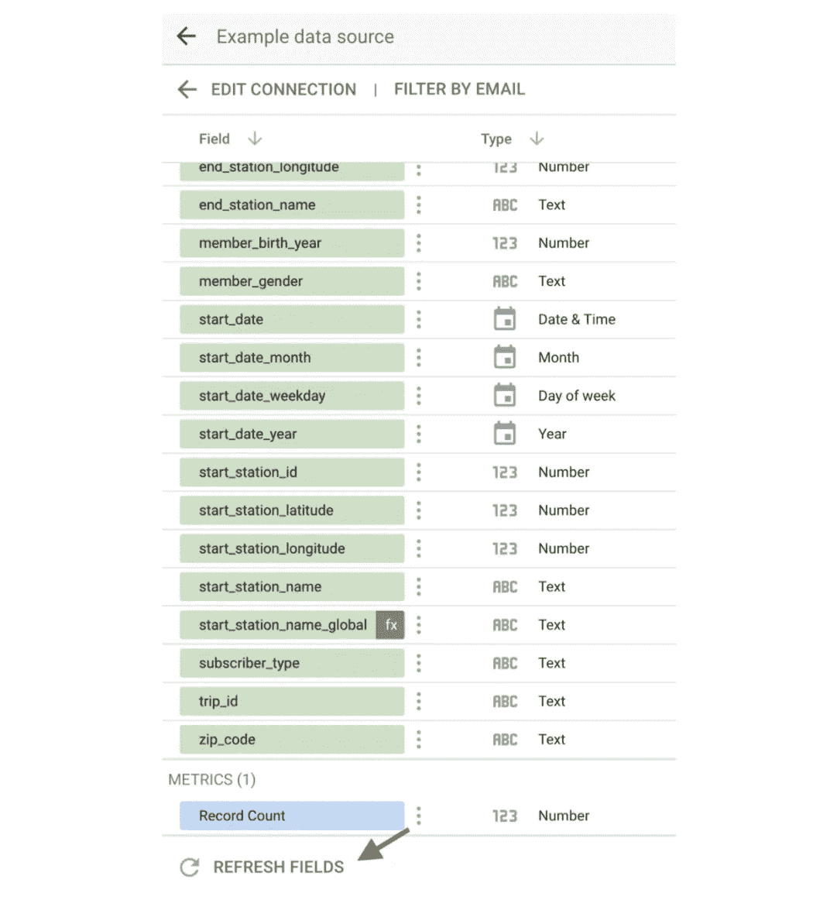
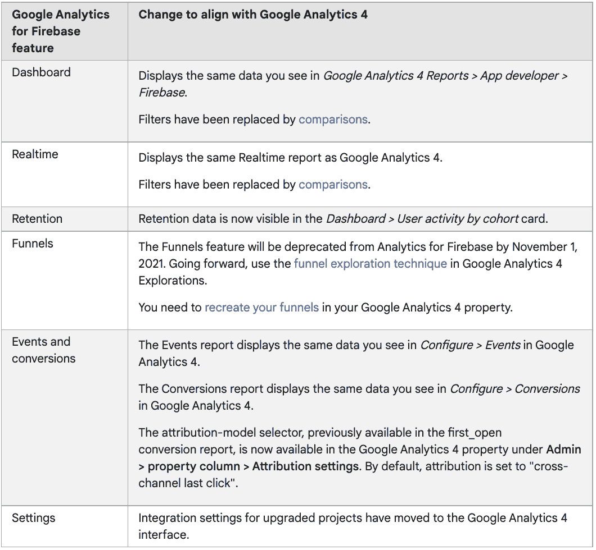

# 谷歌数据分析的最新更新(2021 年 10 月)

> 原文：<https://medium.com/geekculture/latest-updates-on-google-data-analytics-october-2021-e197fbc35f40?source=collection_archive---------14----------------------->

## BigQuery、Data Studio、Google Analytics (GA)和 Google Tag Manager (GTM)的更新亮点。亚历山大·柯俊

Photo by [hoch3media](https://unsplash.com/@hoch3media) on [Unsplash](https://unsplash.com/)

在这篇博文中，我想总结一下我们每天在 [datadice](https://www.datadice.io/) 使用的谷歌工具的新版本。因此，我想对 BigQuery、Data Studio、Google Analytics 和 Google Tag Manager 的新特性做一个概述。此外，我将重点介绍我认为最重要的几个版本，还会列举一些其他的改动。

如果你想仔细看看，这里可以找到来自 [BigQuery](https://cloud.google.com/bigquery/docs/release-notes) 、 [Data Studio](https://support.google.com/datastudio/answer/10331528?hl=en) 、[Google Analytics](https://support.google.com/analytics/answer/9164320?hl=en)&[Google Tag Manager](https://support.google.com/tagmanager/answer/4620708?hl=en)的发布说明。

# BigQuery

BigQuery 的新特性专注于与其他云分析解决方案的协作。

## BigQuery Omni

BigQuery Omni 提供了一个查询多云系统的平台。目前支持的三种云解决方案是 Google Cloud、Amazon AWS 和 Microsoft Azure。它是一个连接这些不同解决方案的数据的工具，但是数据仍然存储在原始系统上。要获得入门指南，您可以查看这里的。

## 交互式 SQL 转换器

这个新特性是 BigQuery 新迁移服务的一部分。使用 Interactive SQL 转换器，您可以:

*   将另一种 SQL 方言翻译成 BigQuery UI 中的标准 SQL
*   在当前版本中，只支持 Teradata SQL 语言，希望 BigQuery 在下一个版本中支持其他 SQL 方言。
*   不可能将标准 SQL 转换成 Teradata SQL

在 BigQuery UI 中，您可以在编辑器中键入 Teradata SQL 查询。然后你可以在“更多”菜单中选择“显示翻译”。

然后，它在左侧显示 Teradata 查询，在右侧显示翻译后的标准 SQL 查询。

有了这个特性，您可以快速地将 Teradata 查询转换成 BigQuery 可以执行的查询。但是它有已经提到的局限性。

## 批处理 SQL 转换器

使用 Batch SQL Translator，您可以从云存储中导入文件的内容，云存储中有一个 Teradata SQL 查询或基本 Teradata 查询(BTEQ ),并将其翻译为标准 SQL 语言。

因此，您必须转到 BigQuery 中的 SQL 翻译菜单。

然后你必须:

*   给作业起个名字
*   选择工作的地点
*   选择方言
*   输入查询的源路径和目标路径
*   如果需要，您可以添加一些[可选设置](https://cloud.google.com/bigquery/docs/batch-sql-translator#optional_settings)
*   单击创建

然后作业正在运行，您可以在那里看到状态。像 Interactive SQL Translator 一样，支持的方言还不多，而且您不能将标准 SQL 转换成其他方言。

# 数据工作室

Data Studio 获得了一些新功能和修复。

## 嵌入式报告中的谷歌地图

谷歌删除了 Data Studio 报告的一个恼人的限制。Data Studio 提供了两种不同类型的地图图表，geo 图表和 Google 地图图表。Google Maps 图表看起来更好，使用起来更直观，但问题是它在报告的嵌入模式中抛出了一个错误。

因此，如果您想将报告嵌入网站或使用嵌入模式的功能，您将无法显示谷歌地图图表。这个问题已经解决，因此可以在嵌入式报告中使用 Google Maps 图表的所有功能。

*A Google Maps chart in an embedded report*

## 改进的页面导航

这个新版本改变了管理报告导航的整个行为，并增加了许多可能性。正因为如此，我们将为这个话题单独发表一篇博文。

简单介绍一下:

*   现在有一个自己的菜单来管理导航
*   你可以添加区域、分隔线、标题来组织你的导航
*   剖面:向结构添加图层
*   分隔线:给你的导航添加一条水平线
*   标题:给你的导航添加标题

*Managing the new navigation*

## 新的 GA4 电子商务领域

如果您在 Data Studio 仪表板中使用 Google Analytics 连接器，您可以访问更多附加字段。例如，您会得到:

*   项目数据(类别、品牌、促销点击数等)
*   交易 ID
*   购物车到视图比率
*   不同的购买指标

如果您使用的是已经连接的 Google Analytics 数据源，您必须刷新字段。

*Refresh the structure of the data source*

# 谷歌分析

用于 Firebase 跟踪的 Google Analytics 版本与 GA4 和 UA 有很大不同。区别主要是表面上的，谷歌被鼓励调整 GA4 的风格和 Firebase 的谷歌分析(在 Firebase 分析之前)。在最新版本中，Google Analytics for Firebase 的一些视图与相关的 Google Analytics 4 视图有相似的外观。

*Changes of the Google Analytics for Firebase features*

# 谷歌标签管理器

谷歌标签管理器不再发布。

# 本月即将发布的 datadice 博客文章

*   数据工作室新报表导航— [此处](https://datadice.medium.com/new-data-studio-feature-new-navigation-3862189e30e)
*   云数据融合简介— [此处](https://datadice.medium.com/introduction-to-cloud-data-fusion-1e2a3c2bf5ca)

# 更多链接

这篇文章是来自 [datadice](https://www.datadice.io/) 的谷歌数据分析系列的一部分，每月向你解释 BigQuery、Data Studio、谷歌分析和谷歌标签管理器的最新功能。

如果你想了解更多关于如何使用 Google Data Studio 并结合 BigQuery 更上一层楼，请查看我们的 Udemy 课程[这里](https://www.udemy.com/course/bigquery-data-studio-grundlagen/?referralCode=49926397EAA98EEE3F48)

如果您正在寻求帮助，以建立一个现代化且经济高效的数据仓库，或者只是一些分析仪表板，请发送电子邮件至 hello@datadice.io，我们会安排一个电话。