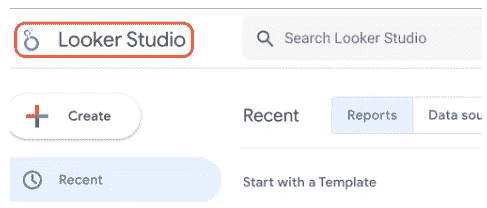
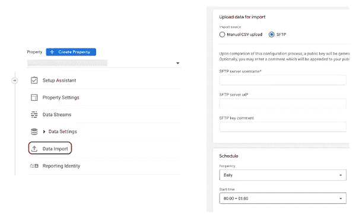

# 谷歌数据分析的最新更新(2022 年 10 月)

> 原文：<https://medium.com/geekculture/latest-updates-on-google-data-analytics-october-2022-54b82047112a?source=collection_archive---------11----------------------->

## BigQuery、Data Studio、Google Analytics (GA)和 Google Tag Manager (GTM)的更新亮点。亚历山大·柯俊

*Photo by Marcel Heil on Unsplash*

在这篇博文中，我想总结一下我们每天在 [datadice](https://www.datadice.io/) 使用的谷歌工具的新版本。因此，我想对 BigQuery、Data Studio、Google Analytics 和 Google Tag Manager 的新特性做一个概述。此外，我将重点介绍我认为最重要的几个版本，还会列举一些其他的改动。

如果你想仔细看看，这里可以找到来自 [BigQuery](https://cloud.google.com/bigquery/docs/release-notes) 、 [Data Studio](https://support.google.com/datastudio/answer/11521624) 、[Google Analytics](https://support.google.com/analytics/answer/9164320?hl=en)&[Google Tag Manager](https://support.google.com/tagmanager/answer/4620708?hl=en)的发布说明。

# BigQuery

## 小更新

说 BigQuery 没有新的更新是错误的，但至少没有大的新特性。所以我只想提一些变化:

*   两个新的地理函数:ST_ISCLOSED 和 ST_ISRING
*   为 Apache Spark 使用存储过程
*   用于云监控的新 BigQuery 仪表板指标(BI 引擎顶级表缓存字节、BI 引擎查询回退计数、查询执行计数)

# Looker Studio(以前称为数据工作室)

## 更名为 Looker Studio

当你去[https://datastudio.google.com](https://datastudio.google.com)时，你会看到工具的标识和名称都变了。

*   旧网址(仍在工作):[https://datastudio.google.com/](https://datastudio.google.com/)
*   新网址:[https://lookerstudio.google.com](https://lookerstudio.google.com)

谷歌希望将 Looker 品牌做大，并统一其商业智能系统。第一步是将可视化工具 Looker 和以前的 Data Studio 更紧密地结合在一起。

Looker Studio 仍然是免费的，但现在有一个付费版本，Looker Studio Pro。目前，它在管理仪表板方面只有优势(团队工作区、与 GCP 的链接等等)。此外，你必须联系谷歌的销售部门才能进入。

我们已经用[英语](https://datadice.medium.com/a-unified-bi-platform-with-google-data-studio-and-looker-96b07f3c8409)和[德语](https://datadice.medium.com/eine-einheitliche-bi-plattform-mit-google-data-studio-und-looker-813c54c8dbf2)发布了一篇更详细的博文。

# 谷歌分析

## 跨 GA4 和 UA 实施的兼容性

如果你已经有了一个适当的 UA 跟踪实现，那么在相同的质量水平上建立一个 GA4 跟踪生态系统肯定是令人讨厌的，而且需要做大量的工作。

Google 现在提供了一些方法来使从 UA 到 GA4 的转换更加容易和快速。

*   使用当前的 UA 电子商务实现甚至启动 GA4 电子商务事件
*   用类似的 GA4 实现替换 UA 实现，以获得 GA4 事件。此外，该解决方案还能够从 GA4 跟踪中获取 UA 事件。

目前，我们还没有这些新功能的实际操作经验，所以我们无法给出它的第一印象。

当然，仍然建议您为 GA4 构建自己的跟踪解决方案，但是要找到一个起点或收集已经存在的 GA4 数据，您可以尝试两种新方法中的一种。

## FTP 数据导入

对于 GA4，当数据格式正确时，已经可以将数据从 FTP 系统推送到您的 GA4 属性，以填充您的分析工具。

他们现在改进了这项服务，增加了一个定期向酒店添加数据的时间表。也可以按需添加数据。

起点是管理部分中的数据导入菜单。

*Scheduling the import*

# 谷歌标签管理器

谷歌标签管理器不再发布。

# 本月即将发布的 datadice 博客文章

*   [以正确的方式处理谷歌分析 4 (GA4)数据中的会话和约定](/nerd-for-tech/handle-sessions-and-engagements-in-the-google-analytics-4-ga4-data-in-a-correct-way-d55cc988efee?source=your_stories_page-------------------------------------)
*   RAWGraphs:一个免费的开源数据可视化工具

# 更多链接

这篇文章是来自 [datadice](https://www.datadice.io/) 的谷歌数据分析系列的一部分，每月向你解释 BigQuery、Data Studio、谷歌分析和谷歌标签管理器的最新功能。

查看我们的 [LinkedIn](https://www.linkedin.com/company/datadice) 账户，深入了解我们的日常工作生活，并获得关于 BigQuery、Data Studio 和营销分析的重要更新

我们也从我们自己的 YouTube 频道开始。我们讨论了重要的 DWH、BigQuery、Data Studio 和许多其他主题。点击查看频道[。](https://www.youtube.com/channel/UCpyCm0Pb2fqu5XnaiflrWDg)

如果你想了解更多关于如何使用 Google Data Studio 并结合 BigQuery 更上一层楼，请查看我们的 Udemy 课程[这里](https://www.udemy.com/course/bigquery-data-studio-grundlagen/)。

如果您正在寻求帮助，以建立一个现代化和经济高效的数据仓库或分析仪表板，请发送电子邮件至 [hello@datadice.io](mailto:hello@datadice.io) ，我们将安排一个电话。

*最初发布于*[*https://www . data dice . io*](https://www.datadice.io/new-features-october-2022)*。*