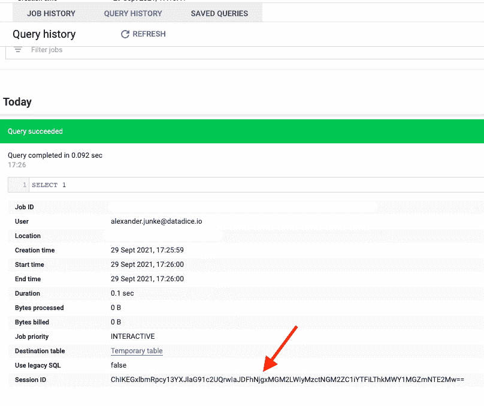
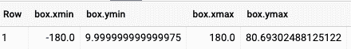
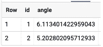
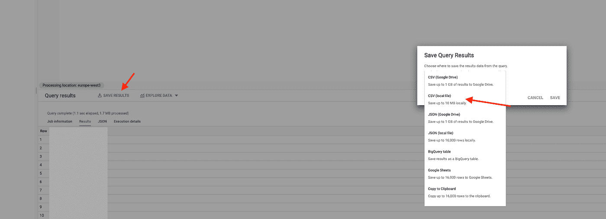
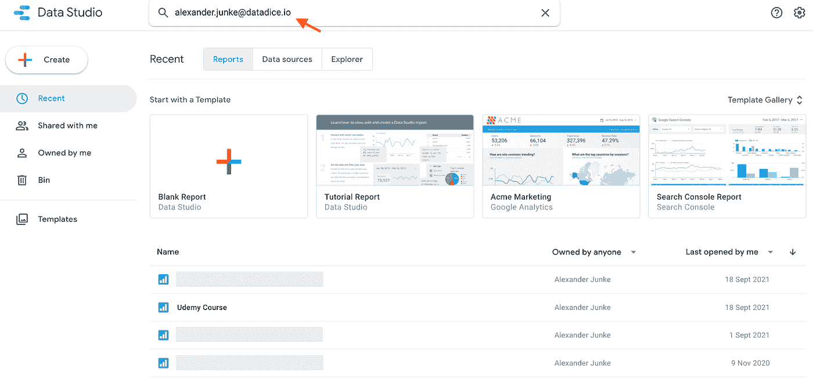
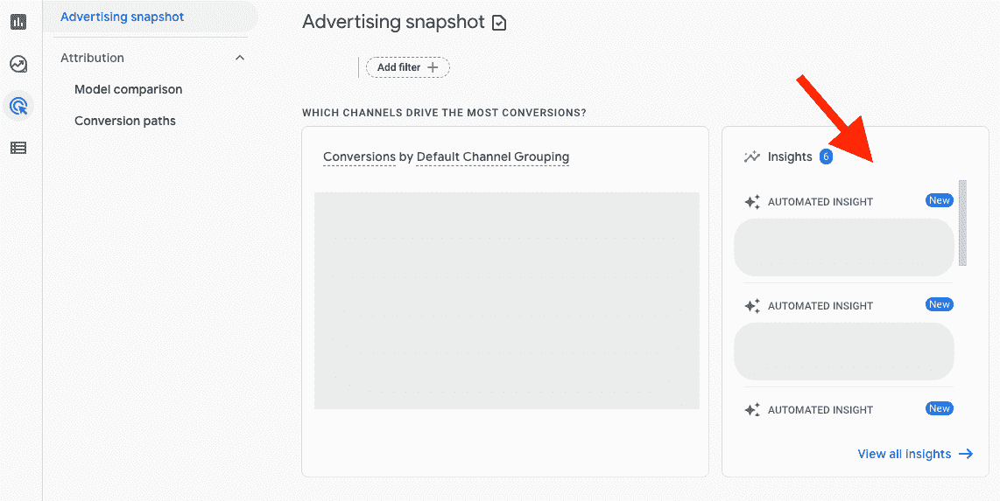

# 谷歌数据分析的最新更新(2021 年 9 月)

> 原文：<https://medium.com/geekculture/latest-updates-on-google-data-analytics-september-2021-d1a9fbd6bec8?source=collection_archive---------12----------------------->

## BigQuery、Data Studio、Google Analytics (GA)和 Google Tag Manager (GTM)的更新亮点。亚历山大·柯俊

Photo by [Lucas Carl](https://unsplash.com/@lucas_carl) on [Unsplash](https://unsplash.com/)

在这篇博文中，我想总结一下我们每天在 [datadice](https://www.datadice.io/) 使用的谷歌工具的新版本。因此，我想对 BigQuery、Data Studio、Google Analytics 和 Google Tag Manager 的新特性做一个概述。此外，我将重点介绍我认为最重要的几个版本，还会列举一些其他的改动。

如果你想仔细看看，这里可以找到来自 [BigQuery](https://cloud.google.com/bigquery/docs/release-notes) 、 [Data Studio](https://support.google.com/datastudio/answer/10331528?hl=en) 、[Google Analytics](https://support.google.com/analytics/answer/9164320?hl=en)&[Google Tag Manager](https://support.google.com/tagmanager/answer/4620708?hl=en)的发布说明。

# BigQuery

## 会议

Google 提供了一个与 BigQuery 合作的新概念。您可以创建进程来

*   构建临时表或使用临时变量。
*   当您查看查询历史记录时，会显示会话 id
*   您可以构建多语句事务，并在提交前进行测试

*Session ID inside the query history*

一些重要信息:

*   会话的查询总是在会话的位置内
*   会话在 24 小时不活动或创建 7 天后终止
*   会话变量的最大大小是 1 MB(会话中所有使用的变量的限制是 10MB)
*   使用会话不会导致额外的成本

要创建会话，您必须在云 Shell 中使用以下命令:

> *bq 查询-nouse _ legacy _ SQL-create _ session-location ' Europe-west 3 ' ' SELECT 1；'*

location 参数(用于设置会话的位置)是可选的。最后，您将第一个查询。

然后，可以在会话中创建一个临时表:

> *创建临时表 Temptable(test int 64)AS SELECT * FROM UNNEST([' Test1 '，' Test2 '，' Test3 '])AS a；*

并在以后使用该表:

> *SELECT * FROM Temptable；*

这是在 BigQuery 中使用会话的一种简单方法。

## 新的地理功能

BigQuery 有很多处理地理空间数据的新功能。我想展示一些函数用法的快速示例。

函数“ST_EXTENT”的示例:

> *以数据为(
> SELECT 1 id，ST _ geogfromtext(' polygon((-100 70，-130 40，-120 80，-10 10，-100 70))')g
> UNION ALL
> SELECT 2 id，ST _ geogfromtext(' polygon((120 35，-111 25，-110 30，120 35))')g* 
> 
> *从数据*中选择 ST_EXTENT(g)作为框

返回:

它返回一个具有 x 和 y 的最小值和最大值的结构。它计算边界框的坐标，其中包含每个地理位置。

函数“ST_ANGLE”的示例:

> *以角度为(
> 选择 1 个 id，ST_GEOGPOINT(50，30) geo1，ST_GEOGPOINT(10，4) geo2，ST_GEOGPOINT(20，15) geo3
> 联合所有
> 选择 2 个 id，ST_GEOGPOINT(10，0)，ST_GEOGPOINT(1，20)，ST_GEOGPOINT(35，15)*
> 
> *从按 id 排序的角度中选择 id，ST_ANGLE(geo1，geo2，geo3)作为角度；*

返回:

它计算三个给定点的两条相交线的角度。所以点 2 和 1 构建第一条线，点 2 和 3 构建第二条线。

这些只是许多新功能中的两个新功能。如果你对这里比较感兴趣，可以看看[发布说明](https://cloud.google.com/bigquery/docs/release-notes)。

## 将查询结果另存为 CSV

BigQuery 改变了将查询结果保存为 CSV 文件的行为。

*   之前:16000 行的限制
*   之后:10 MB 的限制

当然，当你只有几列时，你可以保存超过 16000 行。但是有一个转折点(随着列数量的增加),即保存的行数少于 16000。

*Save a query result as CSV*

# 数据工作室

## 混合错误修复

其中一个版本修复了当你使用基于混合数据源的图表时的一个小错误。

引用自发行说明:

*仅使用基于单个表的混合中可用字段的子集的图表不能正确地对维度进行分组或聚合度量，从而导致图表中出现重复行。*

现在，他们正在像预期的那样聚集和分组。如果仍然正确，您应该检查使用混合数据源的报表。

## 新的搜索可能性

可以使用人名或电子邮件搜索数据源和报告。如果此人是报告或数据源的所有者，它将出现在搜索结果列表中。

## 新数据源选择器

Data Studio 发布了新的数据源选择器。连接器的类型显示在左侧，然后是数据源的名称。

如果要更改图表的数据源，旧的数据源选择器仍然可用。我认为他们在不久的将来也会更新这个数据源选择器。

*Old vs. new data source picker*

# 谷歌分析

## 新的归因见解

谷歌分析 4 包含一些新的自动归因见解。他们关注的是用户的转化路径。

*Attribution insights*

# 谷歌标签管理器

## 用于服务器端跟踪的新标签

Google 还在推 GTM 中的服务器端追踪解决方案。他们添加了一些新的标签来改善你的服务器端基础设施。

7 月份，谷歌已经发布了一个谷歌广告转换标签。现在也有了谷歌广告再营销标签。下面是[指令](https://developers.google.com/tag-platform/tag-manager/server-side/ads-remarketing-setup)。

使用新的泛光灯标签，您可以将销售和柜台标签从客户端传输到服务器。在这里你可以找到[的进一步信息](https://developers.google.com/tag-platform/tag-manager/server-side/fl-setup)。

# 更多链接

这篇文章是来自 [datadice](https://www.datadice.io/) 的谷歌数据分析系列的一部分，每月向你解释 BigQuery、Data Studio、谷歌分析和谷歌标签管理器的最新功能。

如果你想了解更多关于如何使用 Google Data Studio，并结合 BigQuery 更上一层楼，请查看我们的 Udemy 课程[这里](https://www.udemy.com/course/bigquery-data-studio-grundlagen/?referralCode=49926397EAA98EEE3F48)

如果您正在寻求帮助，以建立一个现代化且经济高效的数据仓库，或者只是一些分析仪表板，请发送电子邮件至 hello@datadice.io，我们会安排一个电话。