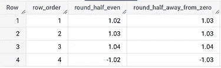
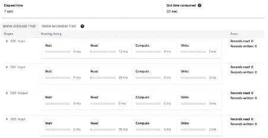
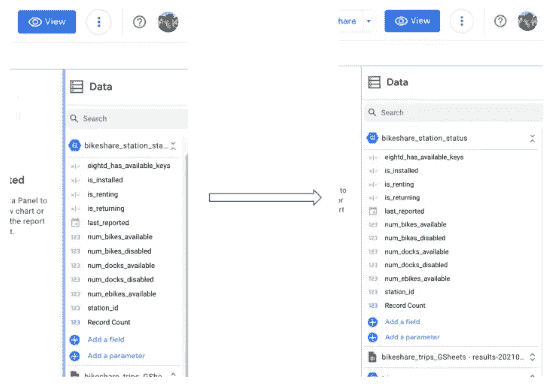
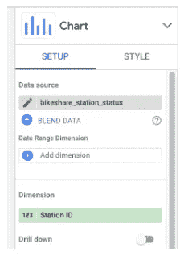

# 谷歌数据分析的最新更新(2022 年 9 月)

> 原文：<https://medium.com/geekculture/latest-updates-on-google-data-analytics-september-2022-bb24a6b0782e?source=collection_archive---------8----------------------->

## BigQuery、Looker Studio(以前称为谷歌数据工作室)、谷歌分析(GA)和谷歌标签管理器(GTM)的更新亮点。亚历山大·柯俊

Photo by [Alana Harris](https://unsplash.com/@alanaharris) on [Unsplash](https://unsplash.com/)

在这篇博文中，我想总结一下我们每天在 [datadice](https://www.datadice.io/) 使用的谷歌工具的新版本。因此，我想概述一下 BigQuery、Looker Studio(以前称为 Google Data Studio)、Google Analytics 和 Google Tag Manager 的新功能。此外，我将重点介绍我认为最重要的几个版本，还会列举一些其他的改动。

如果你想仔细看看，这里可以找到来自 [BigQuery](https://cloud.google.com/bigquery/docs/release-notes) 、 [Looker Studio](https://support.google.com/looker-studio/answer/11521624?hl=en&ref_topic=6267740) 、[Google Analytics](https://support.google.com/analytics/answer/9164320?hl=en)&[Google Tag Manager](https://support.google.com/tagmanager/answer/4620708?hl=en)的发布说明。

# BigQuery

## 新的舍入模式

BigQuery 已经有了一个可以设置小数位数的舍入方法。

> ROUND(column_name，2)作为 round_column_name

→将“列名”的值四舍五入到逗号后面两位数

现在甚至可以通过创建表格来设置舍入方法。

让我们看一个例子:

> 创建表 dataset_name.round_functions(
> 
> round_half_even 数字(5，2)选项(rounding_mode='ROUND_HALF_EVEN ')，
> 
> round_half_away_from_zero 数值型(5，2)选项(rounding _ mode = ' ROUND _ HALF _ AWAY _ FROM _ ZERO ')；
> 
> INSERT dataset _ name . round _ functions(row _ order，round_half_even，round_half_away_from_zero)
> 
> 价值观念
> 
> (1，数值“1.025”，数值“1.025”)，
> 
> (2，数值“1.0251”，数值“1.0251”)，
> 
> (3，数值“1.035”，数值“1.035”)，
> 
> (4，数字“-1.025”，数字“-1.025”)

这两种模式是:

“ROUND_HALF_EVEN”的示例如下:

ROUND_HALF_AWAY_FROM_ZERO:

*   默认模式
*   从零开始舍入中间的事例

ROUND _ HALF _ 偶数:

*   将中间的大小写向最接近的偶数舍入

“ROUND_HALF_EVEN”的示例如下:

0,15 → 0,2

0,25 → 0,2

0,35 → 0,3

## 不区分大小写的数据集和表

寻址数据集或表总是不区分大小写的操作。现在可以定义表和数据集的名称区分大小写。

通过创建数据集，您可以定义设置:

> 创建模式 case _ senstive _ dataset 选项(
> 
> location="eu "，
> 
> is_case_insensitive = FALSE
> 
> )

然后，我们在数据集内创建一个表:

> 创建表 case _ senstive _ dataset。测试用例(
> 
> 行顺序数字
> 
> )

那么下面的 SQL 查询是否有效:

> 选择*
> 
> 来自 Case_Sensitive_Dataset。测试案例

→ **错误**，因为数据集名称错误

> 选择*
> 
> 来自案例感知数据集测试案例

→ **错误**，因为表名不对

> 选择*
> 
> 来自 case _ senstive _ dataset。测试案例

→ **成功**，因为数据集和表格的案例是正确的

## 云控制台更新

一个微小但有益的变化。执行查询时，在查询运行几秒钟后，将显示执行的计时详细信息。然后，您可以观察不同查询阶段的执行时间是如何变化的。

# Looker 工作室

## 可调整大小的编辑器面板

对 Looker Studio 来说，这又是一个小变化，但影响更大，但仍然缺少一个部件来消除仪表板创建过程中的一个恼人的部分。

在编辑器模式下，现在有 3 个可调整大小的面板:

*   数据面板
*   左侧的页面导航
*   版本历史

Change the size of the data panel

但是缺少一个重要的部分:图表编辑面板。

谷歌已经增加了这个面板的宽度，但它仍然不能调整大小。问题是，在选择维度和指标时，一些维度/指标的名称太长，无法显示其全名。但是，如果有可能增加尺寸(只是一会儿)，您可以看到所有维度和指标的全名。

# 谷歌分析

## 新表单交互事件

谷歌增加了一个新的自动收集增强测量事件。新事件用于表单交互。此外，它还有两个参数以及更多信息:

*   form_start:当用户第一次在会话中与表单交互时
*   form_submit:当用户提交表单时

对于所有新创建的 web 流，这些数据会自动计算，对于所有现有的 web 流，此事件需要在增强测量部分手动启用一次。

注意(06.10.2022):对于我们可以访问的所有 GA4 属性，此选项仍然不可用。看起来，它仍然需要时间来适用于所有的属性(在欧盟)。

## 分析建议

谷歌把这些建议作为一种信息添加进来。建议显示更多新的技术特性或获得更准确数据的方法。

例如，它可以显示您应该将您的 Google Ads 帐户与 GA4 属性相关联。当然，这些建议也依赖于 GA4 前端的用户行为。

这些建议显示在酒店的主页上，以及顶部或右侧的一些试衣页面上。

# 谷歌标签管理器

谷歌标签管理器不再发布。

# 本月即将发布的 datadice 博客文章

*   [带有 Google Data Studio 和 Looker 的统一商务智能平台](/towardsdev/a-unified-bi-platform-with-google-data-studio-and-looker-96b07f3c8409?source=your_stories_page-------------------------------------)
*   [一个谷歌数据工作室和 Looker 的双平台](/@datadice/eine-einheitliche-bi-plattform-mit-google-data-studio-und-looker-813c54c8dbf2?source=your_stories_page-------------------------------------)

# 更多链接

这篇文章是来自 [datadice](https://www.datadice.io/) 的谷歌数据分析系列的一部分，每月向你解释 BigQuery、Looker Studio、谷歌分析和谷歌标签管理器的最新功能。

查看我们的 [LinkedIn](https://www.linkedin.com/company/datadice) 账户，深入了解我们的日常工作生活，并获得关于 BigQuery、Looker Studio 和营销分析的重要更新

我们也从我们自己的 YouTube 频道开始。我们谈论重要的 DWH，BigQuery，Looker Studio 和更多的话题。点击查看频道[。](https://www.youtube.com/channel/UCpyCm0Pb2fqu5XnaiflrWDg)

如果你想了解更多关于如何使用 Go ogle Looker Studio 并结合 BigQuery 更上一层楼，请查看我们的 Udemy 课程[这里](https://www.udemy.com/course/bigquery-data-studio-grundlagen/)。

如果您正在寻求帮助，以建立一个现代化的、经济高效的数据仓库或分析仪表板，请发送电子邮件至 hello@datadice.io，我们将安排一次通话。

*最初发布于*[*https://www . data dice . io*](https://www.datadice.io/new-features-september-2022)*。*