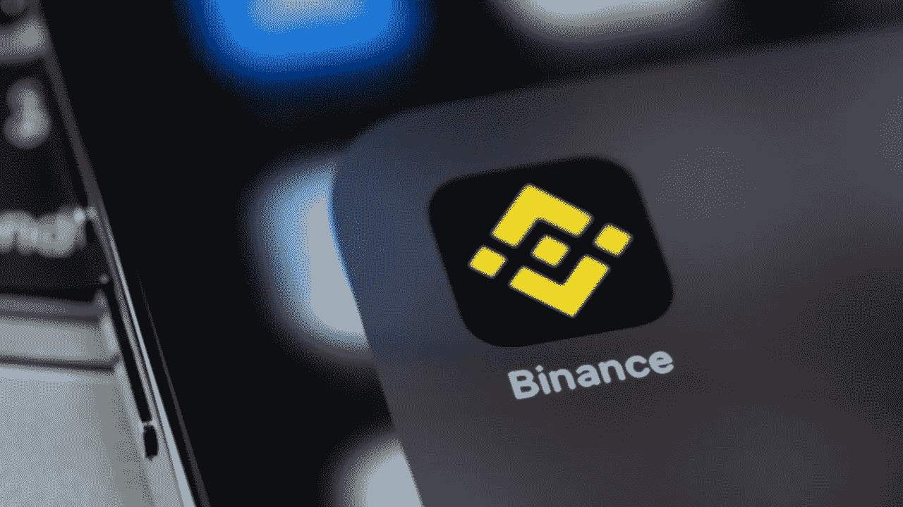

# 启动您的币安 NFT 市场克隆，以鼓动 NFT 平台交易不同的代币

> 原文：<https://medium.com/geekculture/launch-your-binance-nft-marketplace-clone-to-instigate-nft-platform-to-trade-diverse-tokens-373189e4a735?source=collection_archive---------19----------------------->

Fig: Launch Your Binance NFT Marketplace Clone To Instigate NFT Platform To Trade Diverse Tokens

直接来看，数字化企业已经成为摧毁所有基本企业类型的主流类型。“数字化”一词已经涵盖了全球的大部分组件。不管有什么问题，这个特定的术语会影响输注的对象。

不可替代的代币是一种非常突出的商业类型。自其发展以来，这种势在必行的业务类型已经划分了各种界限，目前已经为自己创造了可信的声誉。NFT 市场是一个平台，为多个客户和观众接触和寻找独特的代币铺平了道路。这些平台是建立在一个主要的基础上，区块链。

自从区块链的革新以来，定向平台已经攀上了早期平台梦寐以求的高度。各种各样的区块链技术，如币安、以太坊、多边形等等，都是我们所说的诱惑力量。其中一个独特的区块链站在必要的，我们即将体现更多关于区块链和定向平台；币安 NFT 市场的 [**克隆**](https://www.turnkeytown.com/binance-clone) 是分配到这里来提供你的想法的闪烁平台。

## 了解 NFTs

如前所述，NFT 代表不可替换的令牌。各种数字资产，如艺术、音乐、照片、数字土地等等，都可以成为 NFT。通过将它们铸造成代币，数字资产可以获得比它在现实中管理的价值更多的收入。给观众留下深刻印象的 NFTs 的主要方面是它呈现的所有权。当一个购买者购买了一个独特的代币，他们就获得了这个代币的所有者身份，这个身份是永久的。所有这些信息都存储在区块链内的存储分类账上。这些数据具有最大的安全特性，存储在网络钓鱼活动的内部和外部。

# 为什么币安智能链是最好的区块链？

当我们夸大特定角色扮演者时，你可能会想到一个问题。但是区块链是出类拔萃的，与所有被冷落的和现存的区块链技术相比，它有潜力。这个区块链有一个公司，以太坊。自进化以来，两个区块链都是至高无上的，冲击着所有的后继者。币安为用户的数据提供了最大的安全性。安全是任何平台的主要特征；只有这样，不同的群体才会进入论坛并参与各种行动。币安提供了这一功能，并补充说，该平台对所有活动的收费低于竞争对手。

基于币安的平台增加了用户的流动性，这自然增加了用户的收入流。这也是促使分散的用户发起基于币安的平台开发的主要原因。有了这些令人印象深刻的特点，币安成为了最好的区块链技术。

## 币安 NFT 市场克隆

币安与 NFTs 的融合需要一个托管代币销售的平台。币安 NFT 市场是一个理想的平台，拥有用户启动交易的所有必要功能。币安 NFT 市场的复制品拥有其母版本的所有特征。币安 [NFT 市场克隆](https://annabelledarcie.medium.com/nft-marketplace-development-platform-is-the-future-of-app-development-4f678042531d)允许用户交易各种代币，如艺术品、游戏资产、音乐、视频和其他收藏品。当交易这些资产时，这些代币的所有者或创造者会收到一定比例的版税。所有者在随后出售代币时获得版税，这产生了被动收入。顾名思义，NFT 论坛是币安智能链的升级版，可以根据用户的意愿在任何区块链上开发。平台继承了区块链的多样性，为用户体验模范交易铺平了道路。

# 币安 NFT 市场克隆的发展

区块链和 NFTs 的蓬勃发展正引发社区投入到这个领域并开始他们的冒险。光有愿望是不够的，还需要行动。我们正在谈论币安 NFT 市场克隆的发展。这个币安的克隆版本展示了一个门户，让用户拥有一个令人印象深刻的市场，确保额外的收入。

由于区块链和元素的开发非常复杂，所以很难将平台提升为一个个体。必须任命技术人员来开发这个平台。这就是 NFT 市场开发公司闯入并抓住轮子的地方。论坛中的潜在开发者为币安克隆开发提供支持。

[**NFT 市场开发公司**](https://www.turnkeytown.com/nft-marketplace-development) 以白色标签币安 NFT 市场开发启动币安克隆的升级。这是一个现成的解决方案，开发人员只需做一些小小的动作就可以得到一个潜在的平台。此外，论坛对定制开放；有了这些，开发者给平台增加了各种额外的好处，使它比母版本更有价值。作为平台所有者，客户可以表达他们对平台定制的想法。

## 总结

我们周围当前的发展无疑让我们确信数字化就是未来。适应这些创新并引领连续几年的指数级增长至关重要。NFT 是一个蓬勃发展的领域，它让一大批人认识到了数字资产的好处及其增加收入的能力。我们已经提供了一个像币安这样令人印象深刻的 NFT 市场，这是一个企业家和商业抱负拥有一个有价值的 NFT 市场的正确时间。与最好的 NFT 市场公司取得联系，并获得快速发展。