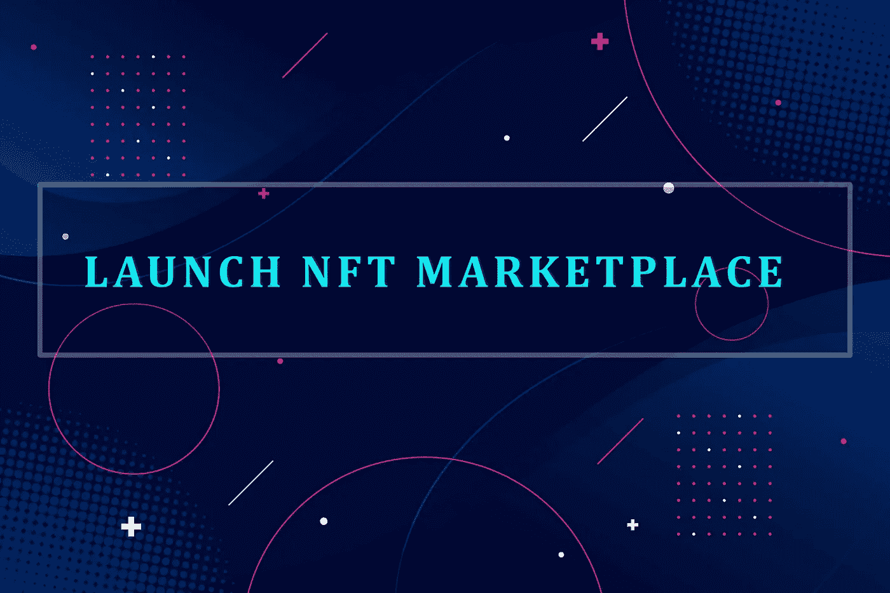

# 使用白标解决方案启动您的新 NFT 市场！

> 原文：<https://medium.com/geekculture/launch-your-new-nft-marketplace-using-a-whitelabel-solution-a4a2d611b56e?source=collection_archive---------14----------------------->

**Image Source: Freepik**

自 2014 年第一款[不可替代代币](https://en.wikipedia.org/wiki/Non-fungible_token)(NFT)推出以来，其受欢迎程度和销量都出现了大幅飙升。尽管它们在婴儿期并不像今天这样受欢迎，但当第一批 NFT 产品在 2017 年至 2018 年发布时，第一次成名就开始了。 [CryptoKitties](https://www.cryptokitties.co/) 、 [CryptoPunks](https://www.larvalabs.com/cryptopunks) 和其他区块链的主要游戏在那段时间上线，我们可以看到它们在五年的时间里变得多么传奇。然后，NFTs 的真正曙光出现在 2021 年，当时世界仍在从全球疫情中复苏，这使得 NFTs 成为许多人的救星。不同种类的 NFT 物品，包括*艺术品、音乐、视频剪辑、迷因、游戏内资产、像素化朋克*，甚至 metaverses 上的虚拟情节，在当时都以价值数千乃至数百万美元的加密货币出售。2021 年的 NFT 繁荣将 NFT 市场从每年 100 万美元的总收入转化为一个季度内数十亿美元的总收入，这是一个相当大的壮举。在这篇博客中，我们将会看到促进 NFT 繁荣的主要因素，以及基于该平台的企业如何取得巨大成功。

## NFT 市场在 2021 年 NFT 繁荣中的作用

尽管名人、游戏 NFT 和基于公用事业的 NFT 产品是 2021 年 NFT 繁荣背后的主要原因，但人们不能忘记推动整个繁荣的总设计师 NFTs 市场。自从第一批受欢迎的 NFT 产品问世以来，这些市场平台就一直存在。但由于没有人真正关心这些虚拟代币，这些平台的角色在大部分时间里都不为人知。

[**NFT 市场**](https://www.blockchainappfactory.com/nft-marketplace-development?utm_source=Medium&utm_medium=Guest+Blog+-+27%2F04%2F2022&utm_campaign=vignesh) 是用户可以交易 NFTs 支持的资产的平台。平台可以是集中式的，也可以是分散式的。尽管这类平台中的典型支付模式是加密货币，但一些企业已经先行一步，集成了支付网关，允许使用加密稳定的硬币、信用卡/借记卡，甚至扁平线转账。

这些 NFT 交易平台可以基于一般的非金融交易平台，也可以基于利基非金融交易平台(出售特定种类的资产)，这两类平台都有很多受欢迎的平台。销售通用 NFT 的市场示例有 **OpenSea、Rarible、Solsea 和 LooksRare** 。著名的[基于利基的 NFT 市场平台](https://www.blockchainappfactory.com/nft-marketplace-development?utm_source=Medium&utm_medium=Guest+Blog+-+27%2F04%2F2022&utm_campaign=vignesh)包括 SuperRare、Nifty Gateway、Sorare、分散地、Axie Infinity、NBA Top Shot 和 CryptoPunks。

## 为什么选择白标解决方案？

如果你想经营一家 [**NFT 市场企业**](https://www.blockchainappfactory.com/white-label-nft-marketplace?utm_source=Medium&utm_medium=Guest+Blog+-+27%2F04%2F2022&utm_campaign=vignesh) ，并且在看到这篇博客的标题后感到疑惑，这一部分是为你准备的。首先，白标解决方案是一个平台，可随时启动，只需您要求的最小更改。在这种情况下，这样一个平台包含了市场有效运作的所有必要特征。由于这种平台已经过广泛的错误测试，所以使用起来是安全的，开发时间越短，意味着开发过程中的经济成本越低。

## 推出白牌 NFT 市场解决方案的流程

**Image Source: Turkeytown**

*   作为第一步，准备好你所有的商业计划。由于您将选择白牌 NFT 市场解决方案，在这种情况下，您不需要对技术要求进行广泛的规划。确定你的利基、目标受众和区块链，因为这些是任何区块链企业需要考虑的最重要的因素。
*   然后，在 NFT 市场软件的前端和后端执行所有您想要的定制。从区块链的先锋公司选择现成的 NFT 市场解决方案是至关重要的。这是因为，有了这样一家公司的产品，根据你的要求更新软件只需要做很少的额外工作。
*   在这之后，在平台上执行一些测试，以确保所有的定制都相应地工作。如果发现错误，排除故障并进行测试，直到平台按预期运行。
*   现在是时候将软件部署到您的服务器上了。然后，向公众推出你的 NFT 市场平台。随着时间的推移，定期升级您的 NFT 市场门户网站，以跟上用户流量并应对任何新的缺陷。

## 我怎样才能从这样的平台中获得利润？

由于 NFT 市场为交易 NFT 资产提供了便利，你可以通过许多方法获得大量利润。你可以对卖家在你的市场上创造他们的 NFT 收取费用。在买方的情况下，你可以在购买 NFTs 时收取费用作为交易费。此外，你可以向卖家收取刊登费，因为这将为你带来巨大的收入，同时卖家可以向更广泛的受众展示他们的 NFT 产品。你也可以收费为平台上的卖家提供营销服务。需要促销的人可以利用你的营销服务将他们的 NFT 商品传播给更多的潜在买家，你也可以获得一些收入。此外，如果您的平台集成了拍卖门户，您可以对拍卖请求、拍卖列表或 NFT 出价收取费用。这种支付可以在短时间内定期为你带来巨额收入。

## 结束前的一些总结性想法

因此，在当前的加密环境下经营 NFT 市场业务可能是一个令人鼓舞的选择，因为自 NFT 繁荣以来，对 NFTs 的理解已经大大提高。此外，为了快速优化情况，使用 [**Whitelabel NFT 市场平台**](https://www.blockchainappfactory.com/white-label-nft-marketplace?utm_source=Medium&utm_medium=Guest+Blog+-+27%2F04%2F2022&utm_campaign=vignesh) 进入公园将是理想的选择，因为这一过程中不涉及大量技术工作。如果你打算通过基于市场的白标解决方案进入广阔的 NFTs 领域，有几家公司可以帮助你完成这个过程。有了这样一家公司的服务，您可以在更短的时间内以更低的成本获得您的平台。因此，启动 NFT 市场是今年最完美的商业想法。