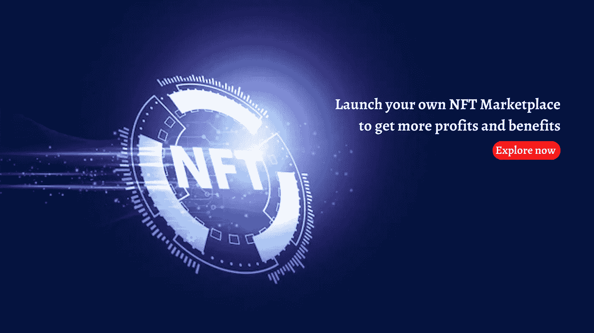

# 启动您自己的 NFT 市场，获取更多利润和利益

> 原文：<https://medium.com/geekculture/launch-your-own-nft-marketplace-to-get-more-profits-and-benefits-c97d1236bc5d?source=collection_archive---------12----------------------->

[**NFT 市场开发**](https://www.cryptocurrencyscript.com/nft-marketplace-development) 是一个价值百万美元的商业网络，在这里，一群不同的 NFT 数字企业家相互协作，将他们的收入提高到新的高度。不可替代代币具有独特的特征和专业知识，被认为在 NFT 市场提供了一系列特殊的解决方案。因此，稳定的投资机会和改善的结果是可能的。NFT 市场的发展是早期采用者商业模式的理想选择，他们希望在数百万美元的收入领域中扬名立万。然而，为了取得这一成功，第一步将是发展 NFT 市场。

## **NFT 市场——简介**

NFT 市场是分散的领域，其功能相当于购买、销售和交易非功能性交易的在线网站。这个市场使用区块链网络，如以太坊、币安智能链等。NFTs 正变得越来越流行，这项技术有望成为加密领域的顶级数字部门。用户可以在 NFT 市场上有效地执行与 NFT 相关的交易。

**NFT 市场发展的好处**

平台的访问者充当 NFTs 的预定义用户。

通过增加不可替代令牌的浏览量，NFT 市场将其作为选择最佳 NFT 的一种方式。

跨链整合到 NFT 市场将通过吸引来自不同区块链的用户来改善 NFT 交易过程。

从市场的加密钱包中可以瞬间铸造 NFT。

## 在开发 NFT 市场时必须考虑的顶级特征

**现场拍卖**

这是一个包括卖家、买家、NFTs 和支付方式信息的功能。它还包括价格、买方报价的数量以及投标时间的可用性。

**过滤器**

过滤器是在市场中导航的一种很好的方式，尤其是当平台上有大量的 NFT 可用时。这允许用户根据类别、支付方式、收藏和列表状态来选择他们偏好的 NFT 收藏品。这将缩短 NFT 选择和购买之间的时间。

**趋势**

NFT 市场包含一些不可读的 NFT，如果它们按照当前的市场趋势显示在平台上，就会获得很高的销售价格。因此，NFT 市场将需要为趋势收藏创建一个单独的部分。因此，用户数据，如平均价格、卖方数据、总供应量和交易率都是可用的。

**上市状态**

列表状态使用户能够有效地选择购买 NFTs。该功能使用户能够快速、轻松地搜索最佳的 NFTs。这是通过启动搜索、排序和过滤过程来实现的。此外，列表状态使卖家更容易浏览平台。因此，在该特征的帮助下，用户将能够确定数字收藏品的验证过程的状态。

**通知**

NFT 市场包括一个快速通知机制，向用户发送包含最新数据和信息的电子邮件。通知主要包含 NFT 到达、即将到来的拍卖和其他信息的实时数据。

**客户支持**

客户服务是 NFT 市场的重要组成部分。该功能允许用户澄清他们在使用平台时遇到的所有技术细节和问题。

## **如何从零开始创建 NFT 市场？**

**为项目创建文档**

NFT 项目的文档是发展 NFT 市场的第一步。大量的文档可能既耗时又复杂，但会节省时间。从长远来看，文档过程对业务非常有益。该文档包含所有的项目白皮书和令牌组学信息。

**UI/UX 设计的创作**

NFT 市场的 UI/UX 组件创建了整个店面和前端功能。用户界面应该简单明了，吸引人。因此，将会有异常多的用户加入该平台。因此，NFT 市场业主的业务呈指数增长。

**开发流程**

谈到 NFT 市场的发展，最重要的一步是发展过程。这是通过雇佣顶级的 NFT 开发公司来实现的。NFT 开发商将提供开发 NFT 市场所需的所有工具。他们设计了平台的一切，从后端到前端结构。在这个阶段，区块链网络和智能合约也被添加到平台中。

**测试运行**

开发 NFT 市场将从各种试运行开始。这些试运行将确定技术缺陷并彻底纠正它们。因此，这是为商业平台创建一个功能齐全的 NFT 市场的重要一步。

## 最后的想法，

zodeak——NFT 市场开发是一项趋势技术，它正在迅速增加企业收入。因为不可燃硬币在 NFT 社会中的价值和受欢迎程度都在迅速增加。此外，区块链平台也激起了投资者的兴趣。因此，现在是企业投资数字空间的绝佳时机。NFT 市场预计在不久的将来会暴涨。