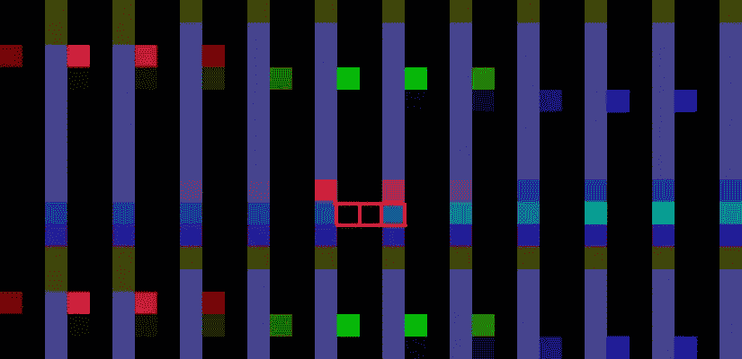
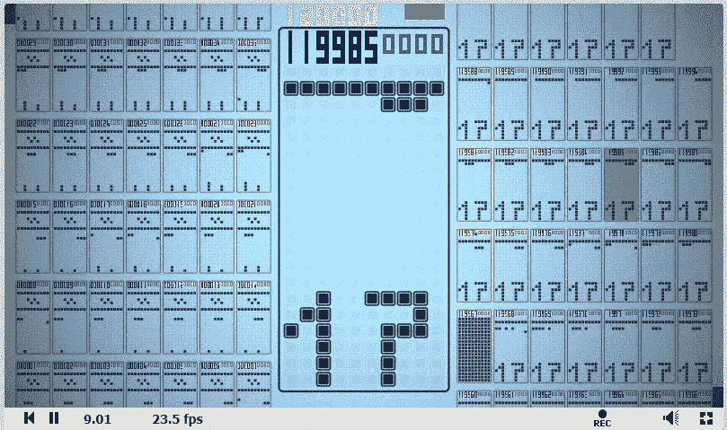
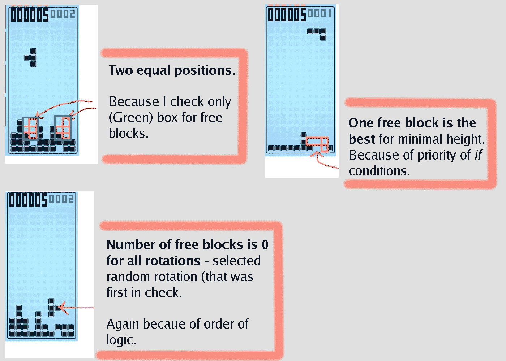
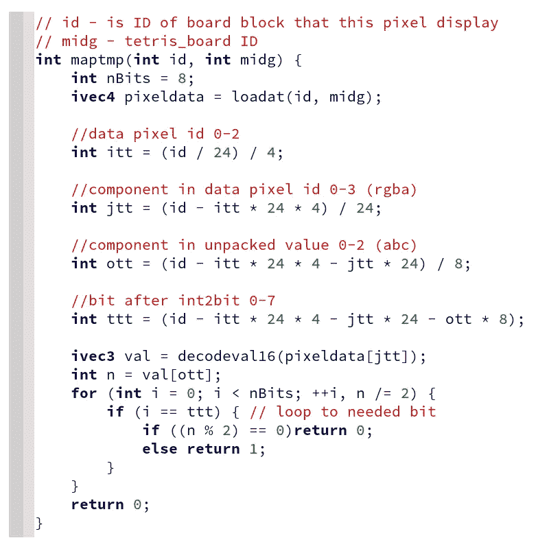
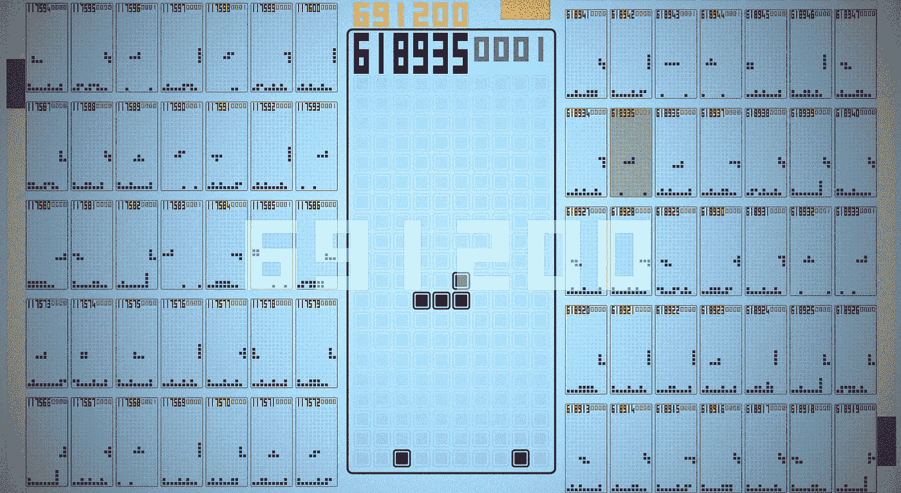
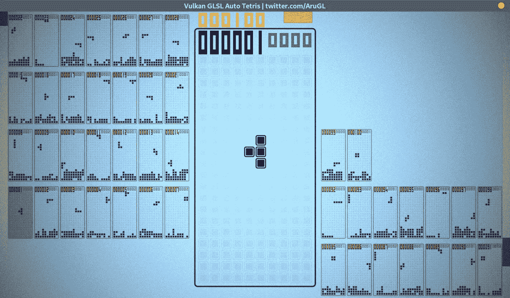

# 在 GPU 上启动 61.9 万个俄罗斯方块，它们的渲染，和一个简单的机器人

> 原文：<https://medium.com/geekculture/launching-619-thousand-tetris-on-gpu-their-rendering-and-a-simple-bot-f2449b607db1?source=collection_archive---------20----------------------->

GLSL Auto Tetris

## **想法:**

为一个着色器(一个帧缓冲纹理)设置最大数量的同时启动的俄罗斯方块**。**

## 下载或启动链接:

*   网页版 *Shadertoy 链接* [**GLSL 汽车俄罗斯方块**](https://www.shadertoy.com/view/3dlSzs) 。
*   **二进制版本**只有 *WIndows* 和 *Linux* 。
    **58Kb** 大小关于——[**demo zoo 门户**](https://demozoo.org/productions/295067/) 链接。

这是 2021 年的更新版。

## **硬件要求**:

着色器应该在每 2015+ Nvidia GPU 上运行良好。
AMD 刚刚更新了他们的 GPU 驱动程序(更新到最新的驱动程序版本，2021 年夏天或更新版本)，这个着色器现在**也可以在 AMD GPUs 上工作**(测试过 Vega8 和 AMD 560)。

## 这是什么:

每个俄罗斯方块以三个像素运行，分辨率为 1920x1080，可同时运行 619200 份。
**俄罗斯方块板和逻辑保存在 3 个像素。**
还做了一个简单的自动播放的 bot。

下面是结果代码如何工作的简短描述。

## 因为这个项目是我的第一个着色器，我可以指出这两个错误:

*   一次计算完整的帧缓冲区纹理，而不是像它应该的那样在小图块中计算。
    这使得无法在低端 GPU 上实时启动模拟。如果你下载或尝试网页版，小心使用超过 100k 的机器人。(超过 100k 可视为对 GPU 的压力测试)
*   在这个项目中，**我只使用了 float** 中可用的 32 位中的 24 位。
    我用 int `0xFFFFFF`不带`uintBitsToFloat`函数。
    **正确的数据(和位)保存方法——看看我之前的博文** [***游戏中的 GPU 着色器***](https://arugl.medium.com/games-in-the-gpu-shaders-a912414b1894) **。** 将保存逻辑从 24 位改为 32 位将允许在 2 个像素而不是 3 个像素中打包俄罗斯方块棋盘。但是大部分的性能下降来自于“逻辑像素”,每帧缓冲区执行更多的“逻辑像素”只会导致更多的性能下降。(我没有改变逻辑，因为这会导致更慢的性能)

# 俄罗斯方块板保存在比特:

桌子“俄罗斯方块”尺寸`[10, 22]` (10 宽，22 高)。
每个单元格可以为空，也可以不为空。
总共需要`22 * 10 = 220`位来存储整个表。
一个“像素”是四个 24 位浮点，**每像素 96 位**。



Visually (debug frame), three pixels are highlighted in red, this is one saved Tetris board.

总共只保存一块俄罗斯方块板使用:
`2 * 96 + 24 + 4`
**两个像素，一个浮点的第三个像素，第二个浮点的第三个像素的 4 位。**

第三个像素 *pixel3.zw* *，*中还有**两个未使用的浮点，它们存储逻辑的状态:**

*   **z** 存储当前块的三个 8 位数字`[a,b,c]`
    — ***a*** 位置，作为该位置在数组 (数组大小 220 位，最大位置 220 小于 0x ff)
    —*中的 ***ID，直到自动下降( ***定时器*******
*   ****向左 _ 检查*，如果可能向左移动，则动作设置为*向左 _ 移动*。
    —**0x ffff*(16 位)当前表的点数，即烧录的行数。****

*在第三个像素的第二个浮点中有 20 位 未被使用。*

## *为什么我们需要动作 id:*

*   *数据存储在三个像素中， ***不可能在一帧中同时检查逻辑和改变数据*** (不执行所有逻辑和在每个像素中加载整个地图，负载会增加十倍)。*
*   *因此， ***数据存储逻辑*** 在每个像素中工作并执行接收到的命令，如*left _****move***，check*left _****check***命令只在一个像素(第三个)中执行。*

## *慢的地方:*

*   *每三个像素(逻辑像素)解压缩整个地图(读取所有三个像素)。*
*   *另外两个像素只解包“自己”(一个像素)来执行存储的动作。*
*   *当动作为 ***burn_line*** 时，加载另一个像素(贴图的一部分)，因为桌子落下来，桌子的下部必须知道上面是什么。*

**

*Debug screenshot with only data-saving logic.*

## *存储算法性能:*

*测试时，将*#定义调试*设为公共，将 *AI 0* 设为公共。*

***我在渲染处理所有 619200 场的时候得到了这个结果** — *10FPS* ，对于 12 万场 *25fps* 。*

**

***The logic of bot that also checks free blocks**, default bot does not do that, read below.*

# *机器人/人工智能逻辑:*

*在截图上，我做了一个更好的逻辑来检查空闲块。
**更好的逻辑**包含到[二进制版本](https://www.pouet.net/prod.php?which=85052)或网页版本[和](https://www.shadertoy.com/view/wsXXzH)源代码阴影链接中。
增加了函数***check _ block _ at _ wh***到缓冲区 A(第 380 行)。
正如你在截图上看到的，逻辑**只检查俄罗斯方块可以被丢弃的一小块“区域”**。
*我无法将它包含在默认的网页版本中，因为带 ANGLE 的网页浏览器无法编译它。从性能上来说，它几乎和默认机器人一样，只是烧完的速度比默认慢一点。**

## *默认 bot 逻辑:*

***逻辑很烂**，bot 一分钟内烧完，最高 60 分。(原始机器人，修改伯恩斯 2-3 倍慢高达 300 点我看到)*

*我还没有能够运行*良好的逻辑*与许多循环，以检查自由空间和完整的地图，计算基于当前块的所有可能的下降的最佳位置…*

***良好的逻辑因为其复杂性而不起作用** —在当前逻辑中再增加一个逻辑循环就会使着色器在我的 GPU 上不起作用。
(显而易见的解决方案——不要一次执行完整的逻辑，也不要将逻辑分离到许多帧，比如每帧只执行一次顶级循环迭代，我在这个项目中没有这样做)*

## *我的机器人逻辑是这样的:*

*所有的逻辑都在源代码*缓冲区 A* 中的 ***AI_pos_gen*** 函数中(第 394 行)。*

## *伪代码:*

```
*loop ( 4 rotation of current block )
{
    loop ( by width of table is 10 )
    {
        IF ( block_can_be_moved_here )
        {
            IF ( current_block_height and position 
                 less than the previous one )
                THEN we remember best block_ID and best_POS
        }
    }
}function block_can_be_moved_here
{
    check in the loop(size of block) 
    that all elements of the map(tetris board)
    are 0 where the elements of block are 1
}*
```

*它有三个简单的循环——他们放置木块以使最终的高度最小。*

*当一个新的块被创建并且 ***返回*** 块开始下落的顶行位置时， ***AI_pos_gen*** 函数仅被调用一次。
***输入*** 是-块 ID。
该函数作用于第三个像素(逻辑)，从其他像素加载全图(俄罗斯方块板)。*

**我觉得这个函数可以很容易的修改成你自己的 bot-logic。**

# *界面/用户界面渲染*

*渲染代码在 ***图像*** 着色器中，UI 逻辑在 ***缓冲区 B*** 源代码中。*

***渲染** —将屏幕分割成小块，在每个小块中绘制，最小负载。*

***加载地图显示的逻辑** —不要把整个地图每个像素都解包，只解包“必要位”(字面意思)，功能码:*

**

*Image shader line 280*

**

## ***滚动时避免像素化:***

*从 43000 开始，浮动的小数部分有所损失， ***将 619000 加到 UV 上进行滚动*** (将有像素而不是表格)将不起作用。*

***所有的滚动被分成一个大块，并旋转成一个圆圈**增加最多 32 个 uv。(图中第 207 行)。
获取相关板卡 ID 也是如此。(图中第 215 行)*

## *编号:*

*黄色——俄罗斯方块棋盘的数量。
大左-当前板的 board_ID。
右边，较小的是当前棋盘的点数。*

**

# *启动和高级选项:*

## *所有版本的控件:*

*鼠标滚动和选择董事会。
和键盘箭头在玩家模式下移动方块。*

## *要在 Shadertoy 上启动 Web 版本:*

*   *如果你在 Windows-launch(*Win+R 热键* ) Chrome 上使用这个命令`chrome.exe --use-angle=gl`*
*   *打开这个 [**GLSL 汽车俄罗斯方块**](https://www.shadertoy.com/view/3dlSzs) 链接*
*   *在 Shadertoy 编辑器中选择*公共选项卡*并删除第 4 行
    *#定义 no_AI**
*   **可选*通常你可以将
    *#define AI 199* 改为 0 或其他自定义值，或者保持不变*
*   *按下文本编辑器下阴影框上的编译按钮*

## *要启动二进制版本:*

*只需从 [**Demozoo 门户**](https://demozoo.org/productions/295067/) 下载即可。镜子[poet](https://www.pouet.net/prod.php?which=85052)。
仅支持 Windows 和 Linux。*

## *该版本有特殊选项:*

*   *暂停的空间。Esc 退出。*
*   *按键 *0 1 2 3* 设置*演示模式*(机器人数量)，默认为 0。
    *额外按键*(警告！)4 到 999k 的僵尸程序。
    *和(不要按！)5(需要 2Gb VRAM)创建 5.5mil bots。(滚动工作正常，板卡 ID 只显示数字的最后 6 位)**

*二进制版本是一个内置着色器的 Vulkan launcher，github [*上的 launcher 源代码 Vulkan-shader toy-launcher*](https://github.com/danilw/vulkan-shadertoy-launcher)。*

*感谢阅读！*