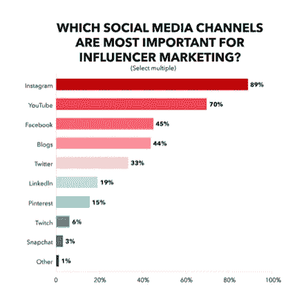
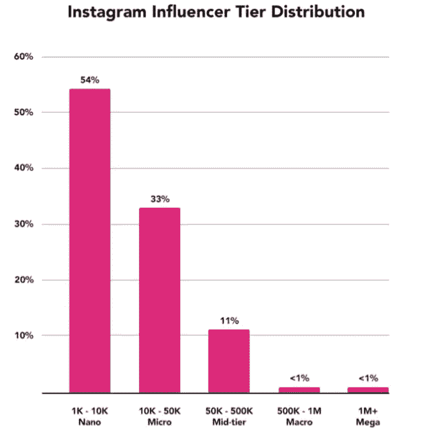
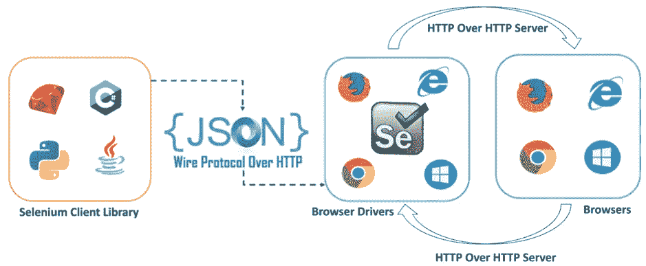
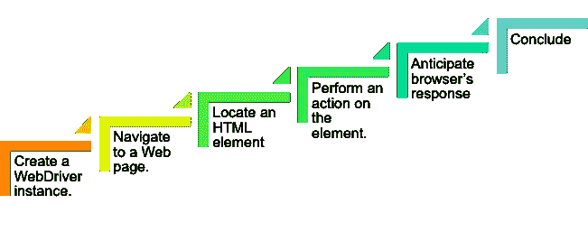
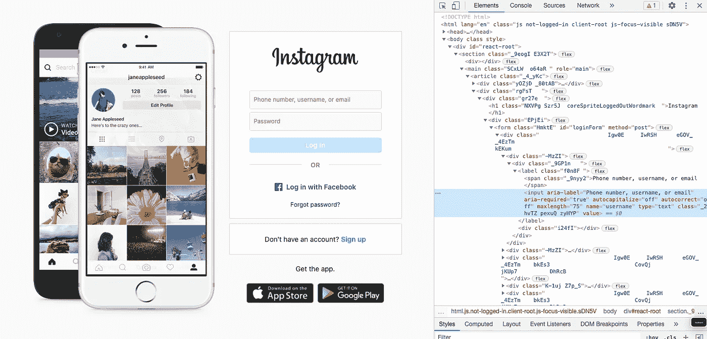

# 在 FB、IG 或 Twitter 上推出一个机器人来推动有机社会增长

> 原文：<https://medium.com/geekculture/launching-a-bot-to-drive-your-organic-social-growth-on-fb-ig-or-twitter-f557ee4f4006?source=collection_archive---------23----------------------->


Bots Bots Everywhere (Source: [https://www.majorel.com/](https://www.majorel.com/))

脸书、Instagram 和 Twitter 的成功催生了一些概念:社交媒体影响者和影响者营销。无论是 Instagram 上的健身教练还是 LinkedIn 上的企业专业人士，人们都在竞相增加自己的观众和粉丝。Instagram 上最成功的有影响力的人通过发布一条帖子就能获得数百万美元的报酬，这些公司希望推广他们的产品。LinkedIn 吸引了谷歌和微软等顶级公司招聘人员的目光，提供了一份高薪工作。影响者通过在这些平台上不断发表评论和帖子来推动追随者的有机社会增长。使用机器人自动执行这些操作来推动指数级的有机增长，可以让这些影响者在游戏中获得下一个竞争优势。

# 谁将从机器人中受益最多？

Instagram 是一个社交媒体巨头。89%的人认为这是影响者营销最重要的渠道。Instagram 超越了 FB、YouTube 和其他平台，因为它易于分享图片——这使得有影响力的人能够接触到利基受众。



Source: Mediakix.com

根据 InfluencerDB 的研究，Instagram 上有 50 万活跃的影响者。



Source: Mediakix.com

拥有超过 50，000 名追随者的影响者——中等、宏观和大型类别影响者——拥有足够的追随者和参与度。435 万名纳米和微型 Instagram 影响者将立即从机器人的帮助中受益最多。

# 机器人的主干

Selenium: 一个自动化 web 应用测试的框架。它由一套工具组成，包括 Selenium IDE、WebDriver 和 Selenium RC。

## Selenium 网络驱动程序:

一组 API，用于与 web 浏览器进行交互，并自动执行浏览器上的用户操作。

## Selenium WebDriver 架构:



Architecture of Selenium WebDriver (Source: Edureka)

**>硒客户端库**

Selenium 支持多种语言，如 Java、Python 等。机器人的代码是用这些语言编写的。

**>HTTP 上的 JSON 有线协议**

它促进了浏览器和 Selenium 中的代码之间的通信。该协议使用 RESTful API 来提供传输机制和定义基于 HTTP 的 web 服务。

**>浏览器驱动**

浏览器驱动程序与相应的浏览器通信。当驱动程序接收到命令时，该命令在浏览器上执行，响应将作为 HTTP 响应发送。

**>浏览器**

Selenium 支持 Firefox、Chrome、IE、Safari 等多种浏览器。

# 走向辉煌的六个简单步骤



Steps for automating web interactions (Source: Image by author)

让我们来实现在 Instagram 上自动登录的步骤:

1.  **创建一个 WebDriver 实例。**

要创建 Firefox 驱动程序的实例，我们可以使用以下命令:

```
import org.openqa.selenium.WebDriver;
import org.openqa.selenium.firefox.FirefoxDriver;
WebDriver driver = new FirefoxDriver();
```

**2。导航到网页。**

要导航到一个给定的网站，比如 Instagram，我们可以使用以下命令:

```
driver.get(“[https://www.instagram.com/](https://www.instagram.com/)");
```

**3。找到 HTML 元素**

要与网页交互，需要找出 HTML 元素在网页上的位置——老实说，这是最难的部分。

转到网站上的元素，单击鼠标右键，然后选择“检查”。它看起来会像这样:



Inspecting webpage. (Source: Image by author)

现在，让我们为这些 web 元素获取定位器。这样做的方法是:

```
driver.findElement(By.X(“Y”));
```

x 可以是(但不限于):

> ClassName:使用类属性来标识对象。
> 
> ID:通过使用“ID”属性来标识元素。
> 
> 名称:名称属性也可以标识一个元素
> 
> 标记名:使用 HTMLtag 定位元素
> 
> xpath: Xpath 用于查询 XML 文档。它可以帮助识别网页上的 web 元素。

y 是您在“检查网页”时看到的值

当 X 和 Y 被识别时，代码行看起来像这样:

```
WebElement usernameElement = driver.findElement(By.name(“username”));WebElement passwordElement = driver.findElement(By.id(“password”));WebElement loginElement = driver.findElement(By.name(“login”));
```

**4。对元素执行操作。**

成功识别元素后，通过调用 WebElement 接口实例上的方法与它们进行交互。一些方法是:

> 输入文本的 sendKeys 方法
> 
> 清除文本的 clear 方法
> 
> 单击按钮的 click 方法

```
usernameElement.sendKeys(“XYX”);passwordElement.sendKeys(“ABC”);loginElement.click();
```

**5。预测浏览器的反应**

单击登录按钮后，等待几秒钟，让您的操作到达服务器，并让服务器做出响应。等待时间是至关重要的，否则，bot 可能会失败，因为下一步的元素不会加载到浏览器中。

虽然有多种方法可以做到这一点，但我们将使用最方便的方法:隐式等待。

```
driver. implicitly_wait(10)
```

**6。结束**

quit 方法退出 web 浏览器、web 驱动程序服务器，并释放驱动程序。

```
driver.quit();
```

> 您可以让机器人执行其他高级操作，如关注另一个用户、评论帖子和喜欢帖子。

# 价值主张

除了节省大量时间和有机增长的追随者，以下是使用社交媒体机器人的好处:

## >打造您的品牌知名度

获得有机追随者可以提高你的品牌认知度，增加产生销售线索和转化的机会——这对一个初创公司的 CEO 来说是无价的。用户可以将他/她的社交媒体账户的关注者重定向到他们的商业网站。

## >真正的积极关注者

在社交媒体上购买关注者是不好的。你买的是没有用户参与度的假账户。机器人吸引真实的人，并使你能够接触到你的领域中的活跃人士，促进用户参与。

## >成为有影响力的人，如果还没有的话

获得大量真正的追随者→公司开始注意到→要求你推广他们的产品→你获得了显著的可信度，你的品牌变得值得信赖→从此吸引更多的追随者。

# 黑暗的真相

机器人可以减轻一些努力。但它不会解决你所有的问题。而且，它会创造一些新的:

## >无定制

你可以让机器人在不同的帖子上发表不同的评论。然而，评论仍然来自你创建的有限集合，并且缺少人们喜欢的定制。

## >负面公关

机器人并不新鲜。人们意识到了它们。如果他们意识到你在使用机器人，你很快就会看到你的参与度下降。

## >你会被禁止

如果社交媒体平台在你的账户上检测到机器人，最有可能的是，你的账户会被封禁。你会失去所有的追随者。

# 这些机器人的下一步是什么？

## >绕过验证码

正如我所说，机器人并不新鲜。在持续的战争中，许多网站都实现了验证码来验证用户和阻止机器人。我们很快就会看到机器学习模型:卷积神经网络(CNN)或递归神经网络(RNN)被用来绕过甚至复杂的验证码，包括数学难题和图像中的文本。

## >检测情绪

机器人像机器一样评论。咄！它将通过从预定义的集合中选择一个语句来发布和评论。在一个悲伤的帖子上评论“那太好了”会让你陷入尴尬的境地。很快，机器人将进化到能够准确识别人类情感，并对评论做出回应。

## >创建您的内容

当机器人获得你的追随者时，你创造你的内容。这有助于你脱颖而出。很快，机器人将被配置为接受你的输入，如照片，并根据你的喜好，使用你的帖子历史来创建一个新的独特的帖子。

# 参考

[1][https://www . big commerce . com/blog/influencer-marketing-statistics/# 10-2020 年最重要的影响者-marketing-statistics](https://www.bigcommerce.com/blog/influencer-marketing-statistics/#10-most-important-influencer-marketing-statistics-for-2020)

[2][https://www . emarketer . com/content/is-every one-on-insta gram-an-influencer](https://www.emarketer.com/content/is-everyone-on-instagram-an-influencer)

希望你觉得这篇文章很有见地。感谢您的阅读。