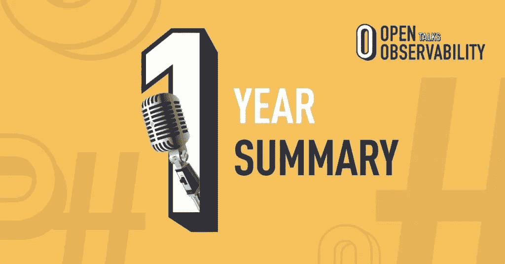

# 在全球疫情发布播客:总结第一年的开放可观察性讨论

> 原文：<https://medium.com/geekculture/launching-a-podcast-in-a-global-pandemic-47d9c4ab4677?source=collection_archive---------55----------------------->

# 播客诞生于全球化的疫情中

开始播客是我在过去一年里做过的最酷的事情之一。

这是疯狂的一年。新冠肺炎全球疫情极大地改变了我们的生活和工作，它让我们被严格的社交距离所束缚，也让我们在技术社区内的互动变得更具挑战性。

当我们头脑风暴如何让社区之火继续燃烧时，我们决定用一个关于开源、DevOps 和可观察性的虚拟会议*来启动 [OpenObservability](https://openobservability.io/) 社区。然后，我们通过每月一期的[播客](https://anchor.fm/openobservability)继续这一努力，以保持这些精彩的聊天定期进行，并让更多的人参与进来。*

坐在这里反思过去的 12 个月，过去一年围绕 OpenObservability 的努力取得了令人惊叹的成果，参与了有意义的对话，涵盖了各种各样的主题，如日志分析、指标监控、分布式跟踪和更大的 OSS 社区的持续发展。

在此期间，我们接待了 Prometheus、Jaeger、OpenTelemetry 和其他项目的维护者和贡献者。我们在现场讨论热点新闻，如 Elasticsearch 的重新许可和 OpenSearch 的推出。其中一些剧集在我们的听众中人气飙升，包括:

*   [优步规模的分布式追踪](https://anchor.fm/openobservability/episodes/Distributed-Tracing-at-Uber-Scale---OpenObservability-TalksS1E4-ekcp71)，讲述优步如何发明和经营耶格的故事，
*   [所有的指标都是错误的，有些是有用的](https://anchor.fm/openobservability/episodes/All-Metrics-Are-Wrong--Some-Are-Useful---OpenObservability-Talks-S1E6-en4bfv)，这暴露了一些关于指标的硬道理，并且
*   [多少可观察性是足够的](https://anchor.fm/openobservability/episodes/How-Much-Observability-Is-Enough----OpenObservability-Talks-S1E9-er730m)，由《经济学人》的专业从业者提供实际建议。

所有这些剧集都可以在[主播](https://anchor.fm/openobservability)、[苹果播客](https://podcasts.apple.com/gb/podcast/openobservability-talks/id1521240652)、 [Spotify](https://open.spotify.com/show/2Dh3iUfPjmdOKZwAppsVNj) 、[谷歌播客](https://podcasts.google.com/feed/aHR0cHM6Ly9hbmNob3IuZm0vcy8yNmVmNTM4Yy9wb2RjYXN0L3Jzcw==)以及其他流行应用上获得。

我们还在 Twitch 和 YouTube 上直播剧集，鼓励听众提出问题和评论。这也给了剧集一个真实的“不插电”体验，因为它是在一次剪辑中完成的，几乎没有任何编辑。我真的很想知道人们是否觉得这种方法有用，或者坚持传统的播客格式是否更好。通过 Twitter [@openobserv](https://twitter.com/openobserv) 或电子邮件 [devrel@logz.io](mailto:devrel@logz.io) 与我们分享您的想法。

总而言之，这对我来说是一次非常令人满意的经历，我真的很感谢所有出现在播客上并参与讨论的人。

就主题而言，我们完成了什么？

# 一年一瞥

在这一年中，我们讨论了许多主题，主要是由开源社区本身的兴趣和更新所驱动的，包括:

## Elasticsearch 重新授权并分支到 OpenSearch

在 1 月[集](https://anchor.fm/openobservability/episodes/Put-the-OPEN-in-Observability-Elasticsearch-and-Kibana-relicensing-and-community-chat---OpenObservability-Talks-S1E8-epl2hp)中，我们报道了**elastic search 和 Kibana** 新闻的重新许可，并讨论了其含义和社区反应，主持人 Tomer Levi 在他的博客中就此话题发表了意见。

在 4 月[集](https://anchor.fm/openobservability/episodes/Put-the-OPEN-in-Observability-Elasticsearch-and-Kibana-relicensing-and-community-chat---OpenObservability-Talks-S1E8-epl2hp)中，我们讨论了 **OpenSearch，Elasticsearch 和 Kibana OSS fork** ，因为它是在测试版中推出的，主持人是 AWS open search 的开发者倡导者凯尔·戴维斯。

# 普罗米修斯和系统度量监控

普罗米修斯和度量监测是今年的另一个热门话题。我们从 Avishai Ish Shalom 那里得到了关于[欺骗性指标的教训](https://anchor.fm/openobservability/episodes/All-Metrics-Are-Wrong--Some-Are-Useful---OpenObservability-Talks-S1E6-en4bfv)，以及来自 Jack Neely 的关于 prometheus 的[应用程序监控技巧](https://anchor.fm/openobservability/episodes/Five-Tips-on-Application-Monitoring-with-Prometheus---OpenObservability-Talks-S1E1-efutj4)。

Matt Schallert 在第[集](https://anchor.fm/openobservability/episodes/Long-Term-Metrics-with-M3-and-Prometheus---OpenObservability-Talks-S1E3-eiocee)中还介绍了 Prometheus 的**长期指标和 M3 开源**项目。

# 分布式跟踪、Jaeger 和 OpenTelemetry

分布式跟踪是可观测性遥测块中的新生事物，自然得到了很多关注。我们[从 Jaeger 维护者和前优步团队成员 Albert Teoh **那里听到了**](https://anchor.fm/openobservability/episodes/Distributed-Tracing-at-Uber-Scale---OpenObservability-TalksS1E4-ekcp71)优步如何大规模发明和使用 Jaeger 开源，并最终将该项目贡献给了 CNCF。我们还与 Jaeger 和 OpenTelemetry 的维护者 Jura ci paix o krhling 一起深入研究了 Jaeger 和 OpenTelemetry。

与 Paul Bruce 谈论 open telemetry(CNCF 遥测数据仪器采集统一框架)的社区发展是另一个伟大的插曲。

在《T21》的一集[中，我们还与普罗米修斯、灭霸、OpenMetrics 和许多其他有趣项目的领导者之一 Bartek Plotka 一起冒险尝试了日志、度量和轨迹之外的新遥测信号。](https://anchor.fm/openobservability/episodes/Interoperability-of-open-source-observability-and-new-signal-in-the-neighborhood--profiling----OpenObservability-Talks-S1E10-evuddd)

# 可观察性

可观察性自然是播客的首要话题，包括讨论多少可观察性是足够的，需要多大的投资，以及如何在《经济学人》的朱哈尔·辛格的《T2》节目中推动其发展。

GigaOM 的高级分析师安迪·图雷(Andy Thurai)就市场前景和趋势的可观察性提供了另一个[视角](https://anchor.fm/openobservability/episodes/An-Observability-chat-with-Andy-Thurai---OpenObservability-Talks-S1E7-eodnd9)。我们还[与 Aspecto 的 Michael Haberman 讨论了](https://anchor.fm/openobservability/episodes/Microservices-Observability-for-Developers-and-Pre-Production---OpenObservability-Talks-S1E5-elodnf)在预生产阶段使用**可观察性。**

完成这一整年的新播客是非常令人满意的，无论是个人还是专业。我非常自豪我们对社区讨论的贡献，以及围绕关键 DevOps、开源和可观察性实践的知识共享。

我感谢我的公司 Logz.io 同意赞助和支持这个播客，特别感谢 Logz.io 的开发者关系团队承担了这个雄心勃勃的项目，他们是:我们的 CTO Jonah Kowall 和 Mike Elsmore。我们一起创造了惊人的东西。

# 新的一年新的想法

对于即将播出的第[集](https://www.youtube.com/watch?v=NYDBj5ctKaw)，我很高兴能够探索 **eBPF** ，这是一项具有巨大潜力的迷人技术，我在之前的对话中提到过，现在将会有一个合适的集。我们特别要讨论的是，对于 Kubernetes 的可观测性，我们是否正在接近零仪器化。在这一集，我将主持来自 Pixie Labs 的 Natalie Serrino，该实验室最近被 New Relic 收购，并在 CNCF 下开源。

现在，当我们规划新一季播客时，最大的问题是“下一步是什么”。这就是我想向你寻求帮助的地方！

你有什么有趣的话题想分享吗？你愿意加入其中一集来谈论你关于开源可观察性和 DevOps 实践和社区的专业话题吗？请在这里填写您的提案，或者在 [openobservability.io](https://openobservability.io/) 上提交 CFP，或者直接通过 Twitter [@openobserv](https://twitter.com/OpenObserv) 联系我 [@horovits](https://twitter.com/horovits) 。

也请分享你的想法和建议，关于我们到目前为止所做的，关于你喜欢的，关于你可能不太喜欢的，以及我们如何使整个努力做得更好。

另外，查看一下 OpenObservability.io 网站，因为它最近进行了一次大规模的改版。

我们正在为下一季制作更多令人兴奋的东西，敬请关注！

感谢您的持续参与和支持。

-Dotan horo vits[@ horo vits](https://twitter.com/horovits)

