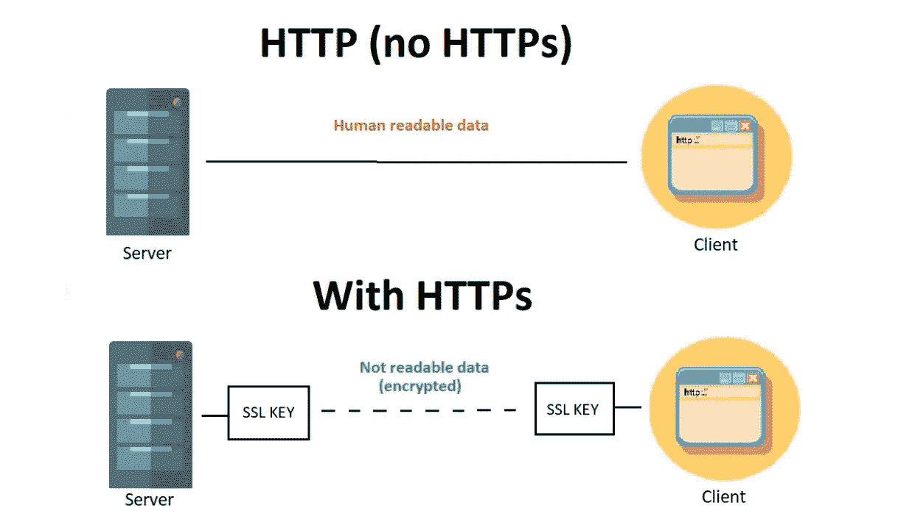
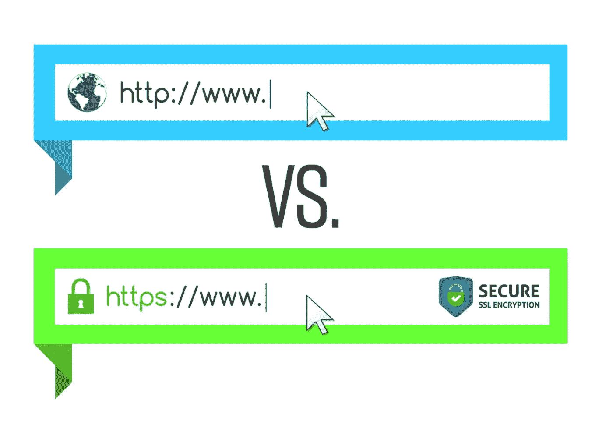
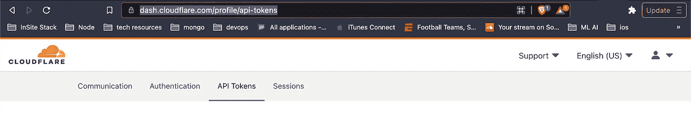
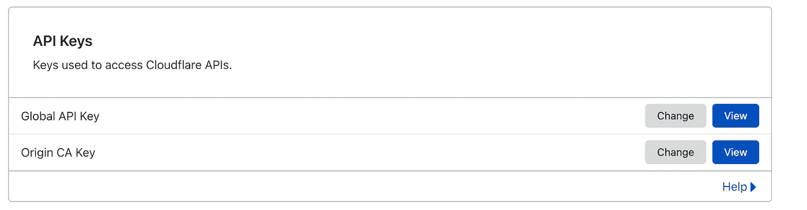

# 启动 cfbot —使用 Cloudflare 实现自动化 TLS 证书管理

> 原文：<https://medium.com/geekculture/launching-cfbot-for-automated-tls-certificate-management-using-cloudflare-a9fc973d29fb?source=collection_archive---------10----------------------->

在将 web 应用程序投入生产时，确保 web 应用程序的流量是最重要(也是最基本)的事情之一。这方面的标准是 SSL / TLS 协议。使用这种方法可以保护两个系统(通常是请求数据的 web 客户端和发送所请求数据的 web 服务器)之间的互联网连接。SSL / TLS 使用加密算法对传输中的数据进行加密，防止黑客在数据通过连接发送时读取数据。



source: [https://www.copahost.com/blog/http-vs-https/](https://www.copahost.com/blog/http-vs-https/)

这个实现 SSL / TLS 的过程需要由一个**认证机构(CA)** 发布加密证书，然后将这些证书部署在 web 服务器中以保护请求。这些证书通常有一个有效期(TTL ),一旦过期，就需要颁发和部署新的证书。如果实施正确，您的网络应用 URL 将显示一个**安全**符号，否则将显示为**不安全**。



source: [https://www.solodev.com/blog/web-design/understanding-http-vs-https-and-why-you-should-switch.stml](https://www.solodev.com/blog/web-design/understanding-http-vs-https-and-why-you-should-switch.stml)

市场上有很多产品可供您实现和管理您的 web 应用程序的 SSL 证书生命周期(包括付费和开源)。Let's Encrypt 是由非营利机构运营的最受欢迎的开源选项之一。Cloudflare (private)是 DNS 管理和安全性的另一个热门选择，我们已经使用他们的服务近 5 年了，没有出现任何问题。他们提供了一个免费层，可以满足我们当前的需求，但有一点除外——SSL 证书在即将到期时需要手动轮换。

如果您使用 Let's Encrypt 作为您的 CA 来颁发证书，有一个解决这个问题的方案叫做 [certbot](https://certbot.eff.org/) ，它大约每 60 天自动更新一次过期的证书。我们希望我们所有的 web 应用程序都有类似的东西，我们可以手动管理部署和保护的方方面面。对于 cloudflare 来说，没有这样的自动化意味着要花费大量的手动工作来跟踪和管理一些理想情况下可以自动化但仍在我们控制之下的东西。最糟糕的是，如果有人忘记及时更新证书，那么应用程序将看到一个不可取的停机时间。

在我们关于这个问题的一次头脑风暴会议期间，我们的一名工程师( [pavan](https://www.linkedin.com/in/itspavan/) )大声疾呼这有多难，并决定要为 cloudflare 开发一个类似于 certbot 的东西，并决定将其命名为 cfbot。我是开源社区的忠实粉丝，在 [Syook](https://www.syook.com) 我们一直提倡尽可能回馈社区，所以我们决定让这个项目成为开源项目，这样其他人也可以从中受益。你可以在这里找到源代码(欢迎投稿！)和这里的发布的包[。现在让我们来看看 cfbot 的运行情况。](https://pkg.go.dev/github.com/syook/cfbot)

在运行 cfbot 之前，请确保您手头有 Cloudflare Origin CA 密钥，该密钥将用于颁发 SSL 证书。它可以在您的 cloudflare 仪表板中的 API 密钥下找到([https://dash.cloudflare.com/profile/api-tokens](https://dash.cloudflare.com/profile/api-tokens))



Where to get the Cloudflare Origin CA key for issuing new SSL certificates

要开始使用 cfbot，您需要将其安装为一个 CLI 应用程序:

```
go get github.com/syook/cfbot
```

运行以下 init 命令来颁发新证书，并设置一个 cron 作业，该作业将自动获取新证书，并在这些证书到期之前撤销旧证书。需要提供以下选项:

*   Cloudflare 原始 CA 密钥/令牌
*   您要为其颁发 SSL 证书的主机名(用逗号分隔)，例如“yoursite.com”，或者如果您想要为某些子域颁发证书，则为“subdomain1.yoursite.com”(在多租户应用程序的情况下)
*   证书有效的有效期(TTL ),以天为单位
*   postrerencecommand(-p flag):一个 CLI 命令，可用于在收到新证书时触发应用程序重新加载等，例如重新加载 nginx，以便它可以使用新证书或根据您的部署设置重新启动 docker 容器(我们使用它来执行 bash 脚本，在这里我们可以使用 CLI 做更多事情)
*   onErrorCommand (-e flag):一个 CLI 命令，可用于触发错误通知，如 slack(我们已经设置了一个 slack 应用程序，然后使用 bash 脚本将错误转移到 slack 应用程序定义的 slack 通道)

```
sudo cfbot --init --auth <cloudflare CA token> --hostnames "*.example.com,example.com"  --validity 7 -p <postRenewCommand (example: nginx -s reload)> -e <onErrorCommand (example: curl slack)>
```

颁发的 SSL 证书将保存在以下目录中供您使用，例如，如果使用 nginx，您需要将此路径添加到端口 443 块，以便将证书应用于所有请求

```
/etc/cfbot/live
```

就是这样。您的应用程序现在是安全的，您的 SSL 证书将自动为您使用 cfbot 设置的域进行管理。

如果你觉得这有帮助，请告诉我，如果你有任何改进的想法或建议，请在这里或 github repo 中留下评论(github 贡献总是受欢迎的！)