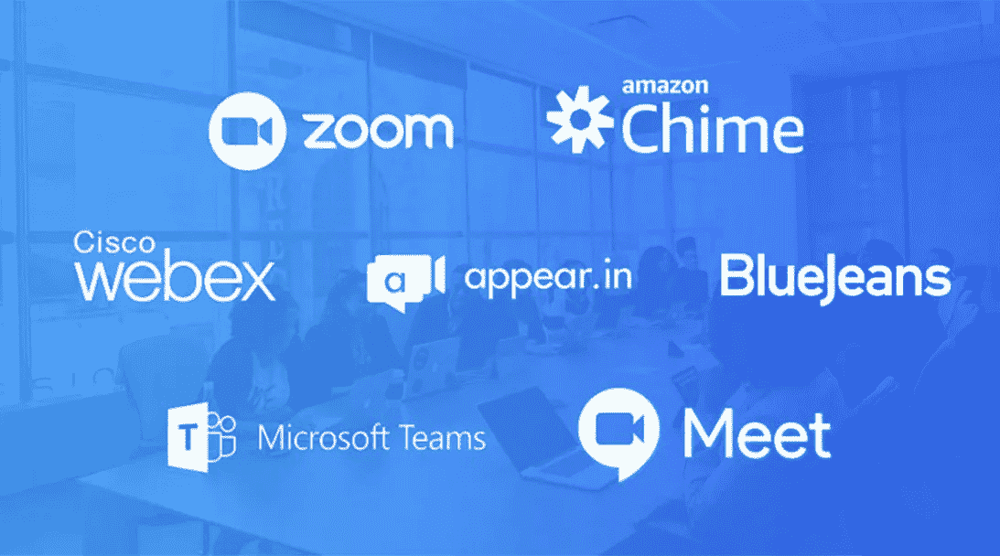
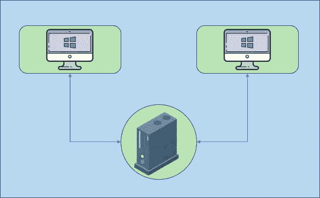
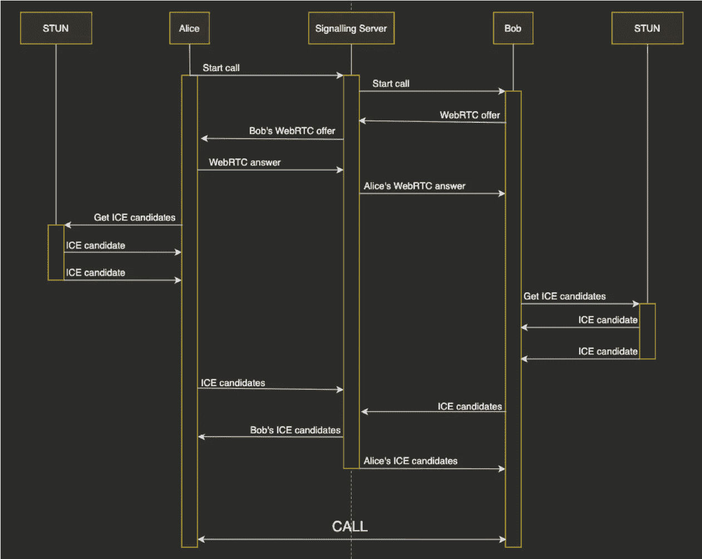
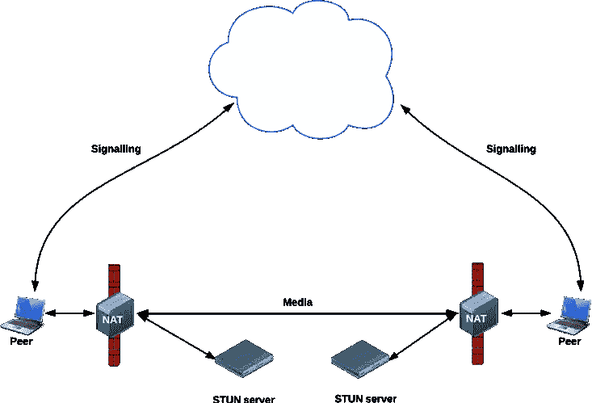
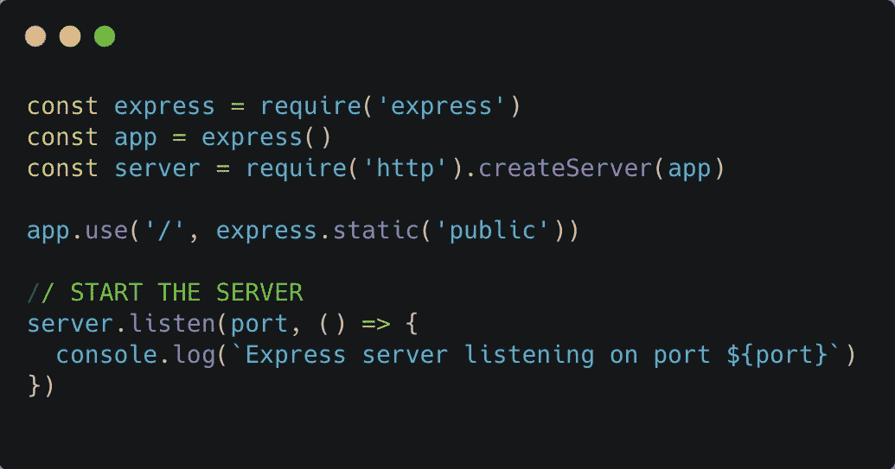
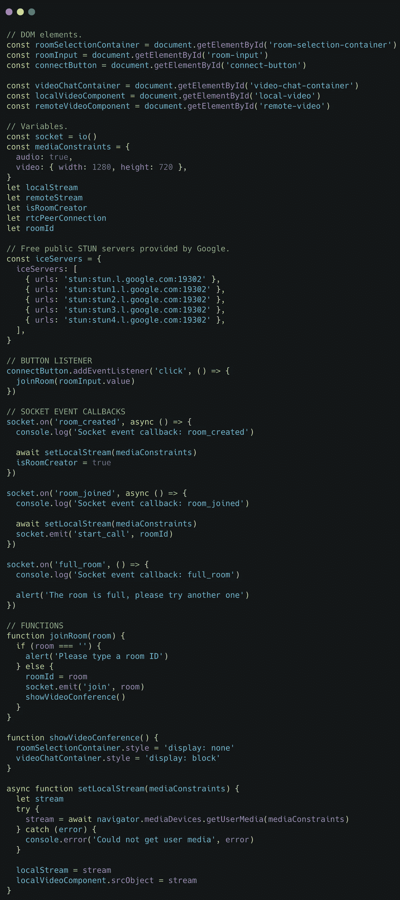
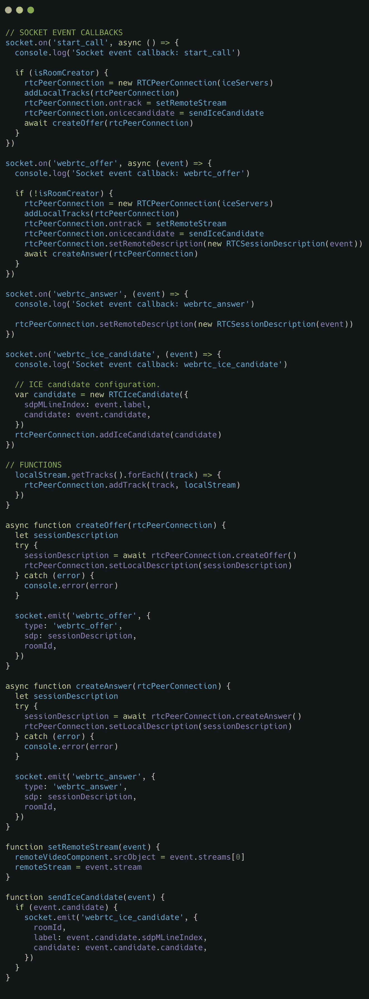
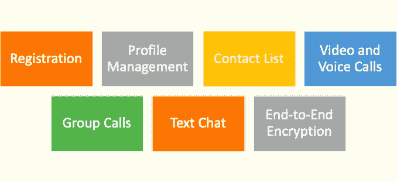
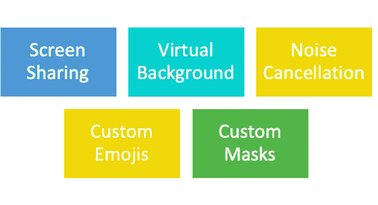

# 启动自己的 Zoom、微软团队或谷歌会议

> 原文：<https://medium.com/geekculture/launching-your-own-zoom-microsoft-teams-or-google-meet-4b63aabaf8f9?source=collection_archive---------14----------------------->

社交距离、在家工作以及疫情期间采取的其他措施使得视频会议应用的需求激增。苹果应用商店和谷歌 Play 商店上有数千个这样的应用。最受欢迎的平台是 Zoom、Cisco Webex、Meet 和 Microsoft Teams。如果你正在寻找创建自己的视频会议平台，那么你来对地方了！

# 介绍背后的技术:向 WebRTC 问好！

WebRTC 技术支持 web 浏览器之间的 p2p 通信，并允许通过 web 交换不同类型的媒体，如视频、音频和数据。

# WebRTC 的三个核心支柱

## A.发信号

传统上，WebSockets 可以用来连接两个客户端，但是需要一个服务器来路由它们的消息，如下所示:

Peer to Peer communication via server (Source: Image by author)

WebRTC 只需要一个服务器来建立客户端的连接——这个过程叫做信令。浏览器收集对等体所需的信息或元数据，然后直接相互通信，如下所示:

Direct Peer-Peer communication (Source: Image by author)

WebRTC 在实现信令消息协议方面提供了灵活性。WebSocket、SIP 和 XMP 是这样做的一些常用方法。

信令过程详述如下:

1.客户发起呼叫。

2.呼叫者使用会话描述协议(SDP)创建要约，并将其发送给接收者。

3.接收者用包含 SDP 描述的应答消息来响应该提议。

4.一旦双方都设置了他们的本地和远程会话描述，包括浏览器的编解码器和元数据，他们就知道用于呼叫的媒体功能。

然而，它们不能连接和交换它们的媒体数据，因为 SDP 不知道外部网络地址转换器、IP 地址以及如何处理端口限制。在这里，交互式连接建立(ICE)进入了画面。

## B.交互式连接建立

ICE 是一种 p2p 网络通信方法，用于交换网络连接信息。ICE 收集 ICE 候选者，它们是一个浏览器可以尝试用来连接到另一个浏览器的 IP 和端口对。并使用协议:NAT 的会话遍历实用程序(STUN)和使用 NAT 周围的中继的遍历(TURN)。

Flow Diagram

1.为了构建 ICE 候选列表，调用浏览器向 STUN 服务器发出一系列请求。

2.STUN 服务器响应并返回公共 IP 地址和端口对

3.调用浏览器通过添加所有配对来创建 ICE 候选列表。

4.一旦浏览器完成收集 ICE 候选项，就通过信令信道将 ICE 候选项传递给接收者的浏览器。

5.现在，接收者的浏览器需要生成一个答案。它遵循与上面相同的步骤:收集冰候选者，等等。，并将 ICE 候选发送到调用浏览器。

6.交换后，将执行一系列连通性检查。

7.每个浏览器中的 ICE 算法从它在另一个浏览器的回答中收到的列表中选取一个候选对，并向它发送一个 STUN 请求。

A.如果有响应，发起浏览器认为验证成功，并将该 IP/端口对视为有效的 ICE 候选。

*   完成对所有对的检查后，浏览器协商并决定使用剩余的有效对之一。
*   一旦选择了一对，媒体就开始在对等体之间流动。

Network architecture with only STUN involved (Source: [https://temasys.io/](https://temasys.io/)))

B.如果浏览器找不到通过连通性检查的一对，它们将向 TURN 发送 STUN 请求以获得媒体中继地址。

*   中继地址是一个公共 IP 地址和端口，用于转发从设置中继地址的浏览器接收的数据包。
*   然后，该中继地址被添加到候选列表中，并通过信令信道进行交换。

Network architecture with TURN and STUN involved (Source: [https://temasys.io/](https://temasys.io/))

WebRTC 栈包括一个 ICE 代理，它负责上述大部分工作。我们只需要实现一个信号机制来交换 SDP，并在发现新的 ICE 候选时一起发送。

# C.蜜蜂

WebRTC 依赖于三个主要的 JavaScript APIs:

*媒体流:*表示设备的媒体流，可以包括音频和视频。

*RTCPeerConnection:* 它允许对等体之间的通信。

*RTCDataChannel:* 实现任意数据的实时通信。

# 让我们实现一个简单的视频聊天

## 计算机网络服务器

创建一个 server.js 文件，该文件将在端口 3000 上运行应用程序，并处理将用于信令的 WebSockets 消息。

Code: Creating server.js to run on port 3000

导入 SocketIO 库并处理客户端发出的消息:

Code: Handling messages emitted by clients

## 客户沟通

将应用运行所需的功能添加到一个 *client.js* 文件中。

首先，客户加入房间(如果没有人加入，则创建房间):

Code: Enabling clients to join a room

注意，调用*navigator . media devices . getuser media*方法来获取客户端的媒体数据。如果一个客户端加入了一个现有的房间(由另一个客户端创建)，媒体交换将按如下方式启动和管理:

Code: Managing media exchanges

两个客户端现在都已连接。他们将能够听到和看到对方。

# 你的产品必须有特色

Features for MYP (Source: Image by author)

## A.登记

*   注册用户重复使用平台的可能性更大。使用脸书登录和谷歌登录启用第三方登录。
*   注册可以是可选的。例如，Zoom 不要求用户注册。用户可以通过另一个用户共享的链接加入电话会议。

## B.档案管理

注册用户需要管理他们的个人数据，包括电子邮件、密码、姓名和其他细节。

## C.联系人列表

*   用户应该能够通过昵称或实名找到平台上的其他用户。
*   考虑与用户的电话簿整合。谷歌联系人 API 是一种方便的方法。但是，请确保获得用户的许可来访问电话簿。

## D.视频和语音通话

*   语音通话是视频会议应用的主要组成部分。打全球电话很贵。应用程序内的语音通话是一种更便宜的选择，可以让用户在飞机上保持联系。
*   通过尽可能优化实时连接，确保视频至少以高清质量传输。

## E.群组通话

*   用户喜欢组织小组会议。所以，把那个给他们。定义可以加入单个呼叫的用户的阈值数量。
*   为会议主持人开发功能，如静音/取消静音用户，邀请和禁止。

## F.文本聊天

有时，用户位于网络较差的区域或正在开会。然后，文字聊天变得比语音或视频通话更方便。

## G.端到端加密

*   确保对话是加密的—邮件在发件人的设备上加密，仅在收件人的设备上解密，这样其他人就无法阅读邮件。
*   AES-256 和 HMAC-SHA256 等协议将确保视频会议平台的安全。

# 要考虑的高级功能

Advance features for implementation (Source: Image by author)

## A.屏幕共享

对于教程、演示、提供处方等非常有用。可以通过 WebRTC 实现。

## B.虚拟背景

有趣但实用的功能。帮助用户隐藏他们凌乱的房间，或者看起来像是在接来自埃菲尔铁塔的电话！

## C.噪声消除

谁不讨厌重要视频会议期间的背景噪音——不管是嘈杂的电视声还是背景中的狗叫声。深度学习算法可以将用户的声音从背景中分离出来，并抑制背景声音。

## D.自定义表情符号

个性化体验是一种趋势。每个人都有“内幕”笑话，用户希望在聊天中使用它们。定制贴纸/表情包将提升用户体验。

## E.自定义遮罩

AR 特效增添个性。Snapchat 首先推出了面具，它们很快在任何使用前置摄像头的应用程序中流行起来。

# **赚钱策略**

Source: Google Image

现在，你已经建立了自己的平台，你正在寻求将你的产品货币化。以下几点值得考虑:

## A.广告

在视频会议的情况下，广告不能在通话过程中集成。但是，可以显示促销横幅。不可错过的广告可能会在通话结束时显示——尽管这可能会惹恼用户。

## B.付费电话

国际电话可以付费。例如，Skype 提供比漫游费用更便宜的特定国家的通话费率。更便宜的国际电话将吸引用户。

## C.免费增值

视频通话等基本功能必须免费。但是，可以设置通话时间或通话参与人数的限制。例如，Zoom 提供长达 40 分钟的免费会议，有 100 名与会者。如果用户需要更大更长的会议，Zoom 上提供不同的计划。

## D.付费贴纸

不仅能创收，还能娱乐用户。每个人都喜欢有趣和有创意的贴纸。用户会很乐意为高质量的贴纸支付合理的价格。

希望你觉得这篇文章很有见地。感谢您的阅读。