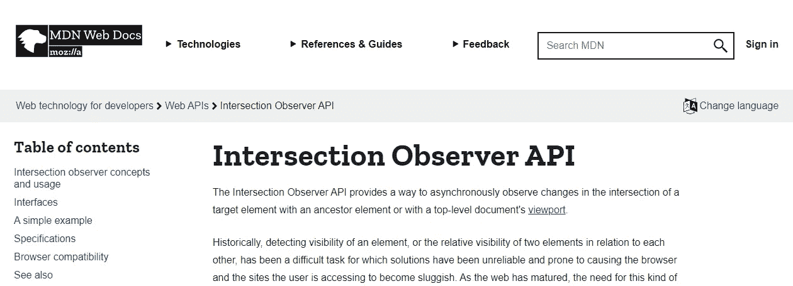

# 用 React.js 和 IntersectionObserverApi 延迟加载图像

> 原文：<https://medium.com/geekculture/lazy-loading-images-with-react-js-and-intersectionobserverapi-6cd7bbe97969?source=collection_archive---------19----------------------->

网络速度很快。比如超快。我的意思是，你可以在几秒钟内(取决于你的连接)与世界的另一端通话。

但是像往常一样，东西跑得越快，用户就希望它跑得越快。

不幸的是，网站最好的部分也是加载最慢的部分:**图片**。

Web 开发者已经 devevoped(哈…你懂了吗？)各种各样的方法来极大地改善加载图像的用户体验。用得最多的是**懒人装。**

# 什么是懒装？

正如我们所说，图像对网站来说非常重要。但在它真正出现在视口中之前，这并不重要。如果在这篇文章的结尾有一张图片，你们中的大多数人可能都不会看到那张图片(这是一种聪明的方式来自动批评我无聊的写作风格),所以你们中的大多数人不应该花时间去下载那张图片。延迟加载就是这样:除非图像确实在视窗中，否则不会下载。



过去，开发人员在滚动事件中添加监听器来检查图像是否在视窗中，但是现在我们有了更好的方法: **IntersectionObservers！**

# 交叉点观察器是如何工作的？

这个新的 API 让你*观察*一个元素，并在每次它与视窗的交集发生变化时触发一个回调(是的，当元素离开视窗时你也会得到一个事件)。它是如何工作的？很简单:

我们首先声明一个新的交叉点观察器。这里我们必须指定回调和一些选项:

```
const options = {};
const observer = new IntersectionObserver((entries, obs) => {
    for (const entry of entries) {
        //entry.boundingClientRect
        //entry.intersectionRatio
        //entry.intersectionRect
        //entry.isIntersecting
        //entry.rootBounds
        //entry.target
        //entry.time
    }
}, options);
```

我们可以暂时跳过选项，看看回调。它接受两个参数:

**条目**:这是这个观察者观察的 dom 的每个元素的列表。每个条目将具有以下属性:

*   boundingClientRect:viewport 中 visibile 元素周围的 reactagle
*   intersectionRatio:组件在视口中的可见程度
*   isIntersecting:非常简单明了…如果元素与视口相交，则为 true，否则为 false
*   rootBounds:如果在选项中声明了根元素，则使用根元素
*   目标:元素本身
*   时间:记录交叉点的时间

**Obs:** 这是观察者本身，它可以用来在一个“观察”触发后改变观察者的行为。

这个 API 基本上可以帮助我们在一个对象进入或离开视图时运行一些代码。

*注意:交叉点观察器 api 的一个小警告是，第一次每个被观察的元素将触发回调，即使它在屏幕之外。*

# 好的，但是如何应用 react 呢？

现在我们有了所有这些信息，我们可以很容易地用 React 编写一个可重用的组件，只在图像进入视窗时加载它。让我们看看这个类，稍后我们将讨论它是如何工作的:

```
import React, { useEffect, useRef, useState } from 'react';
import placeholder from '../imgs/placeholder.png';const LazyImg = props => {
    const [inView, setInView] = useState(false);
    const placeholderRef = useRef();
    useEffect(() => {
        const observer = new IntersectionObserver((entries, obs) => {
        for (const entry of entries) {
            if (entry.isIntersecting) {
                setInView(true);
                obs.disconnect();
            }
        }
   }, {});
    observer.observe(placeholderRef.current);
    return () => {
        observer.disconnect();
    }
}, []);return (
    inView ?  : 
)
};
export default LazyImg;
```

让我们看看它是如何工作的:这个组件将使用一个状态变量:inView。还将使用 ref 来引用占位符 imgs(这只是我们将在资产中拥有的透明图像)。当组件第一次安装时被初始化为 false，它将显示占位符图像，其属性与传递给 img 标记的属性相同。然后，useEffect 将运行，并创建一个 IntersectionObserver 来观察占位符图像。回调也非常简单:无论何时调用回调，它都会遍历每个条目(我们可以确定它只是一个占位符元素)，并检查它是否与视口相交。如果是，将把视图中的状态设置为 true，然后断开观察器(这样它就不会再次触发)。最后，use effect 将返回一个函数(将在 onUnmount 上调用该函数来断开观察者的连接。

如果您使用这个组件而不是简单的标签，您可以很容易地检查浏览器中的网络选项卡，以查看它实际上只在图像出现时才请求下载图像。

# 结论和一个小小的额外提示

如果您想在完全不影响用户体验的情况下为用户节省加载时间和移动数据，请随意使用该组件。

*额外提示:您可以使用传递给交叉点观察器的选项来微调交叉点观察器的工作方式。一个可能的选项是如果“根边距”…通过设置一个负的底部边距，你可以在图片进入视图之前开始加载图片，这样当用户到达图片时，它可能已经被加载了。*