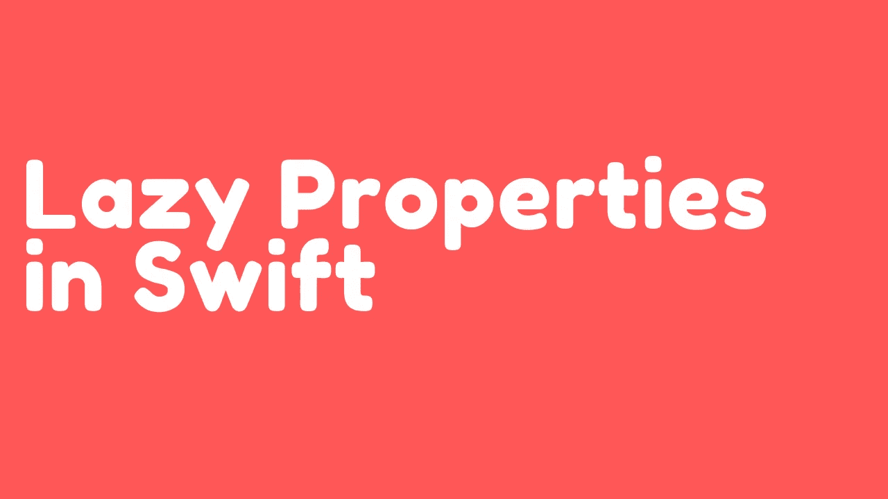

# Swift 中的惰性属性

> 原文：<https://medium.com/geekculture/lazy-properties-in-swift-bc35de8fc154?source=collection_archive---------32----------------------->

Swift 语言允许您创建几种不同类型的属性，包括计算属性、属性观察器甚至惰性属性。在本文中，我们将了解惰性属性如何为耗时的计算提供性能优势。

# 履行

让我们来考虑一个场景，我们负责为考试出题目。考试结构是…