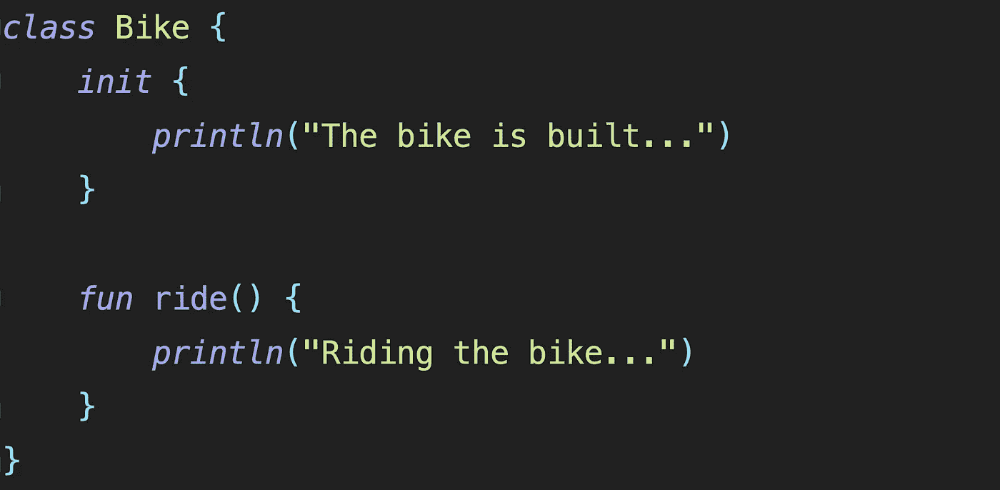
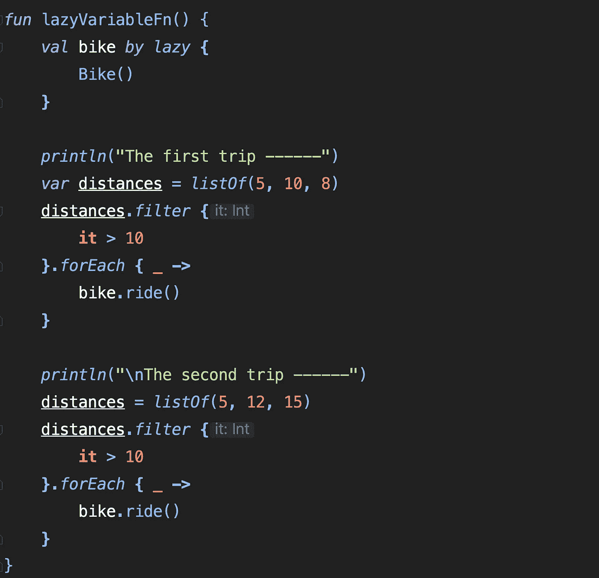

# kotlin 中的惰性变量

> 原文：<https://medium.com/geekculture/lazy-variables-in-kotlin-bdaca76ccedb?source=collection_archive---------15----------------------->

# lazy 关键字允许我们仅在需要时创建/初始化实际的对象。

让我们来看看下面的课程

现在，我们想要构建自行车，即仅当行程距离大于 10 时才创建自行车对象。否则，我们根本不想创建自行车对象。

这就是使用 **lazy** 关键字可以达到的效果，如下所示-

在上面的函数中，我们使用 lazy 关键字创建了 bike 变量。

如果我们看到，**第一次旅行没有任何大于 10** 的距离，因此**我们不想创建自行车对象**本身。

然而在第二次旅行中，由于距离大于 10 即 12，**我们想要创建自行车对象**并骑自行车。

让我们看看输出是什么-

程序输出和我们预期的一模一样。

这里要注意的另一件事是，当距离变为 12 时，lazy 关键字只初始化自行车一次，当距离变为 15 时，它不再初始化自行车。

这就是 kotlin 中惰性变量的工作方式。

该关键字在初始化**大型数据库对象**时很有用。关键字允许我们仅在需要时初始化它们。

对于**高效的内存管理**，这是一个有用的操作符。