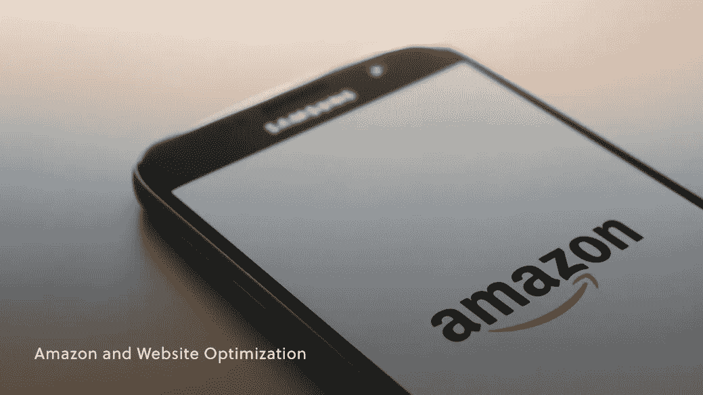
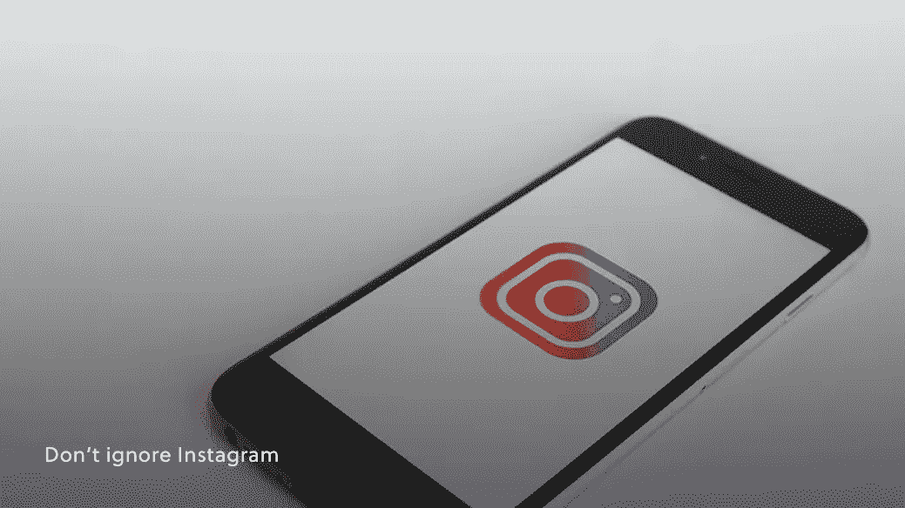

# 电子商务领域的领先品牌及其正确做法

> 原文：<https://medium.com/geekculture/leading-brands-in-e-com-and-what-theyre-doing-right-62b646b99597?source=collection_archive---------44----------------------->

## 电子商务领域的领先品牌

在电子商务领域取得成功可能是一项艰巨的挑战。这不再是一个全新的领域，但是每天都有不同的策略和利基被挖掘出来。随着小品牌似乎在一夜之间获得主流成功，像亚马逊、T2、谷歌这样的跨国巨头以不同的方式占据主导地位，很难知道 T4 应该向谁学习，T6 应该从成功故事中吸取什么。

幸运的是，我们已经为您完成了这项艰巨的工作！有大量的例子要看，还有成百上千的教训要学，但是我们挑选了三个有用的知识来帮助你更好地导航电子商务的成功之旅。

让我们来看看这些电子商务品牌以及它们做得对的地方。

# 亚马逊和网站优化

很难与亚马逊这样的巨头相提并论，但即使这种规模不可复制，也不意味着没有重要的经验可以借鉴。作为全球最大的电商平台， [*亚马逊的*成功](https://muchneeded.com/amazon-statistics/)实在不容质疑。

虽然这一成功背后有丰富的基础设施网络，但一个关键因素很容易脱颖而出:网站。

*亚马逊的*网站不仅仅是一个巨大的电子商务平台，它也是网站设计和优化的一个不可思议的壮举。从技术速度和搜索引擎优化到更直观的审美选择，一切都在发挥作用。

首先，该网站易于查看，甚至更容易导航，具有友好和宽容的用户体验。您可以轻松浏览类别和产品，只需轻轻一点，就可以在购物车中添加和删除商品，而不会中断您的浏览体验，也不会觉得要花钱直到结账。

**网站不仅易于导航，而且*亚马逊*向你展示了你*想要*和*需要*看到的一切，以便将你的舒适和兴趣转化为销售。**

[图像清晰显示](https://www.amberengine.com/blog-content/the-psychology-of-product-imagery-in-e-commerce?utm_source=blog&utm_medium=referral&utm_campaign=medium-blogs)，用户生成的内容(UGC)在评论和问题中随时可用。能够看到顾客的这些意见就在产品旁边公开展示，这是让用户在购物时感到舒适的一个重要工具。所有这些因素加在一起，使得亚马逊的网站成为一个值得尊敬的例子。

# 苹果和品牌忠诚度

至少可以说是有争议的，*苹果*在建立强大而忠诚的消费者基础方面立即成为了最好和最重要的例子之一。尽管批评家们开玩笑说新的 iPhones 每年都一样但更贵，*苹果*的粉丝和用户不断回来，使*苹果*不仅是一个巨大的在线品牌，而且是世界上最大的科技品牌之一。

创造这种水平的品牌忠诚度当然说起来容易做起来难，虽然很多人很快就将苹果忠诚度归结为地位，但我们想从不同的角度来关注这个问题:*激励*。

**苹果在很多方面都做得很好，以维持其在全球的地位和受欢迎程度，其中之一就是非常善于让客户完全忠于该品牌。这就是苹果生态系统对其消费者群体如此有用的原因。**

在苹果的生态系统中，用户享受着他们的设备之间的无缝集成，从手机到平板电脑到电脑到耳机和扬声器。其他科技公司也在这种兼容水平上做了类似的尝试，但没有一家真正接近。

这意味着，如果你买了一个苹果产品，下次你买任何种类的科技产品，你都有再次购买苹果产品的兼容性激励。这个小而巧妙的细节解释了如何试用新的 iPhone 可以迅速变成一个苹果主题的办公室甚至家，这是单靠品牌无法实现的。

这里的要点是激励是强大的。每个品牌和每个市场都有不同的方式来创造这种需求，想想星巴克的忠诚度计划。

# 不要忽视 Instagram

当谈到在线营销时，很明显忽视 Instagram 是一个很大的错误。特别是随着该平台继续大步迈向全球最大的市场之一，如果没有专门的 Instagram 活动或努力，很难找到任何领先或受欢迎的电子商务品牌。

**利用 Instagram 进行营销取得巨大成功的一部分，其实是前面两点的结合:*用户体验*和*忠诚度*。**

就网站而言，它非常容易导航，而且非常醒目——通过设计。随着最近购物技术的集成，购买和访问商店的能力被嵌入到其余的内容中。这意味着营销活动远没有在其他平台上那么具有破坏性和令人不安。

如果亚马逊的一键式购物很方便，想象一下甚至不用离开你的社交媒体滚动购物。

另一个关键因素是接近忠诚，或者换句话说，影响者的力量。

无论是名人还是名人，影响者都是拥有大量活跃追随者的个人，他们可以直接向愿意倾听的人群推广产品和服务。与建立对品牌的忠诚度相比，与有影响力的人合作是一种很好的方式来利用个性为自己建立的忠诚度。

由于这些和许多其他原因，难怪 Instagram 在最近的电子商务活动中变得越来越有影响力。

建立一个成功的电子商务品牌可能是一个艰难的过程，但如果你熟悉可以让你在竞争中领先的工具和实践，这可能会不那么困难。查看 Amber Engine 博客,了解更多关于电子商务、市场营销以及为任何企业建立成功的在线形象的信息。