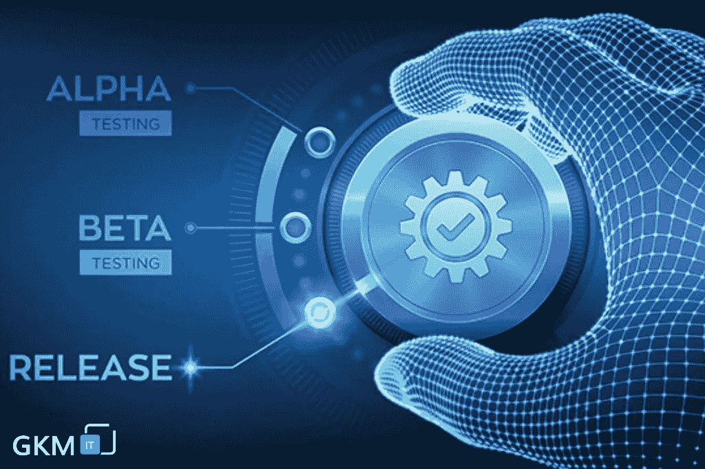

# 了解人工智能和人工智能在软件测试工作中的影响

> 原文：<https://medium.com/geekculture/learn-about-the-impact-of-ai-and-ml-in-software-testing-jobs-9921c7856066?source=collection_archive---------33----------------------->

软件测试在过去的几十年里不断发展。在 20 世纪 80 年代和 90 年代，公司意识到他们应该有一个独立的 QA 团队来发现软件中的缺陷。在软件构建的后期阶段呈现缺陷是不公平的。这会给开发者留下他们构建了完美软件的印象。因此，独立的质量保证工作就产生了。

早期的测试是手工测试，当时公司没有任何自动化的这类工具，开发方法论是瀑布方法论。在这种方法中，开发人员工作 6-8 个月，构建一个产品，然后将其提交给测试人员。测试人员在后期阶段发现 bug，然后将它们发送回开发团队来修复 bug。修复 bug 后，开发团队将其送回重新测试。这个过程发生在软件 QA 测试的早期，有些公司仍然遵循同样的程序。

在 20 世纪 90 年代末和 2003 年，软件测试服务公司开始寻找软件工具来帮助测试人员快速、轻松地执行测试。QA 自动化工具就是这样产生的。它帮助人工测试人员对回归测试用例以及冒烟测试进行测试。自动化在测试人员单调的工作中帮助很大，并帮助他们关注更多的功能测试用例和功能。

许多自动化工具应运而生，如硒，QTP，WinRunner，测试完成等。许多公司在 IT 服务项目和基于产品的项目中给软件测试人员机会，并在指定的人工和自动化测试人员中雇佣他们担任 QA 角色。

**人工智能和机器学习在软件测试工作中的作用**

人工智能、机器学习和机器人流程自动化(RPA)正在成为当前时代广泛接受的技术。

与未来几十年相比，软件测试中的技术进步和即将到来的新技术正在软件行业中占据巨大的位置。专家预测，到 2021 年，人工智能和相关技术将通过大量软件包出现在软件行业，并改变工作的角色，成为我们日常生活的一部分。根据一些专家的说法，很快，人工智能和相关技术将取代软件行业的手工工作或人类。

如果我们谈论 QA 工作，像 AI 和 ML 这样的技术将取代人工软件测试人员。很快，人工智能工具将接管市场，并在开发人员编写代码的同时开始纠正代码。人工智能在测试中带来了更多的创新，这带来了速度和准确性的提高。很快，AI 和 ML 将更多地集成到 QA 和自动化测试中。自动化测试的优点是速度非常快，可以更快地解决问题。为了创建更精确的测试框架，架构实验和研究正在进行。

在手动和测试自动化行业，它可能会减缓 QA 的机会。人工智能将很快取代人工干预。嗯，不知何故，这些观点可能看起来是正确的，但在一些情况下不实用。去除所有的人类干预并不容易，但是是的，在一些地方，这是可能的。一些专家认为，软件测试专业人员可能会有过渡角色，将转向人工智能、机器学习和数据科学产品测试工程师。

质量分析师需要学习新技能，提升自己的技能，以适应不断变化的技术。QA 专业人士担心人工智能/人工智能将很快取代他们的工作。QA 专业人员与其害怕，不如学习新技术，学习 AI/ML/数据科学。它将帮助测试人员成为专业人员，并且在将来，他们可以使用这些应用程序进行测试。在未来，QA 的工作将需要使用最新技术进行测试的知识。专家认为人工智能将使测试变得更容易，这将证明对 QA 专业人员有好处。

**人工智能在软件测试中的作用**

软件开发中的敏捷方法带来了测试自动化的兴起。它使团队能够交付健壮且无错误的软件。在手动测试的情况下，它仅限于业务验收测试。测试自动化和开发运维帮助敏捷团队通过 CI/CD 管道交付无故障、无错误的 SaaS/云部署。在软件测试中，AI 扮演着认知自动化、推理、机器学习、自然语言处理和分析的角色。认知自动化利用了各种技术方法，如文本分析、语义技术、数据挖掘、自然语言处理和机器学习。最好的例子是 RPA(机器人过程自动化)，它连接了 AI 和认知计算。

**人工智能如何改变传统的测试方式**

*   自动化视觉验证
*   自动编写测试用例
*   减少基于人工智能的测试
*   提高可靠性

**总结-**

基于人工智能的测试减少了总体测试成本、时间、错误和脚本。这难道不是一个公司的愿望吗？毫无疑问，AI 和 ML 是软件行业的游戏规则改变者，并将很快成为市场上的一种趋势。是软件测试团队转向基于人工智能的测试和管理方法的时候了。如果你有任何疑问，想分享你的自动化测试经验，请联系我们或在下面的评论区分享你的经验。