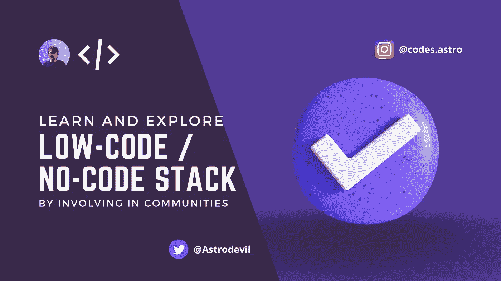
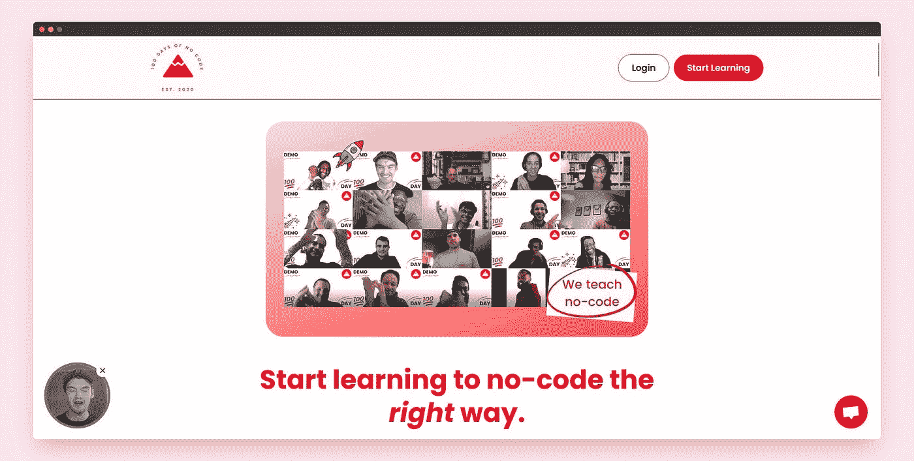
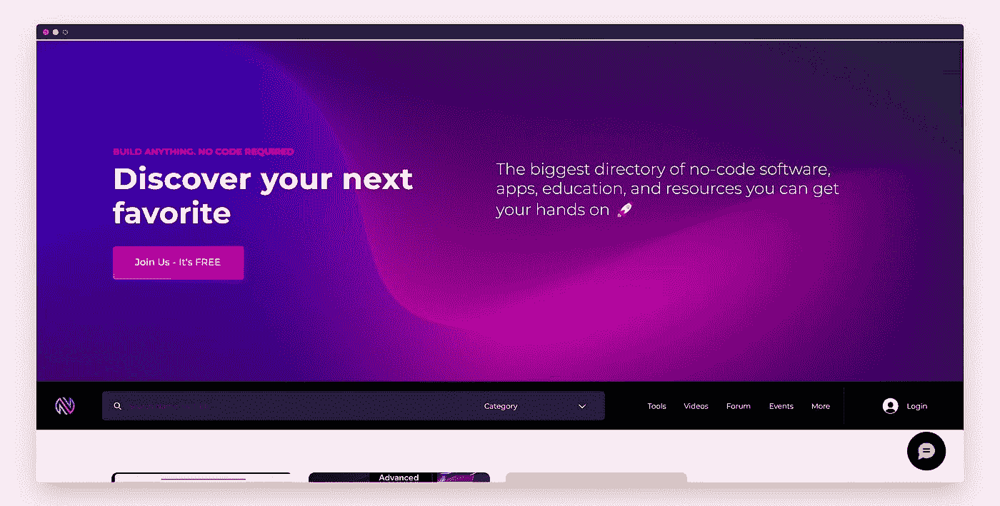
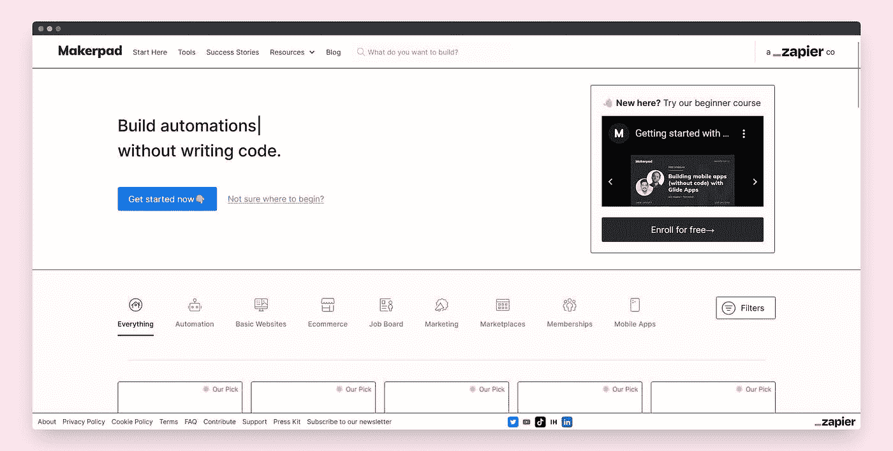
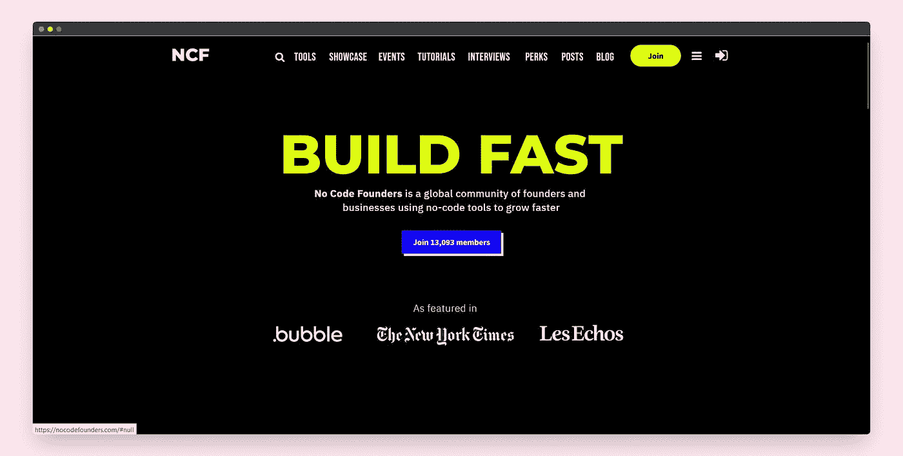
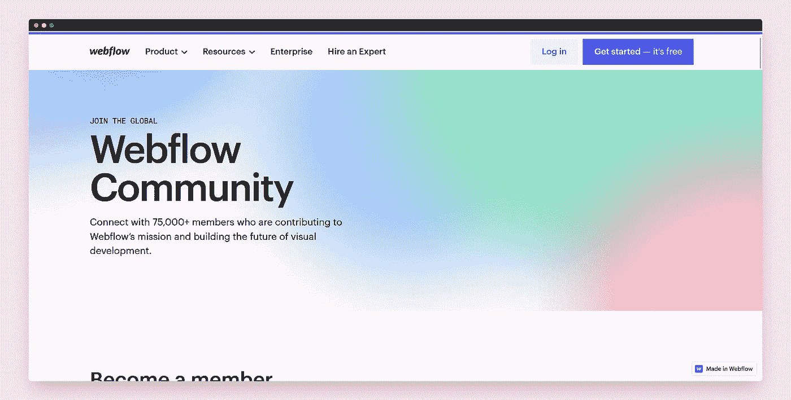
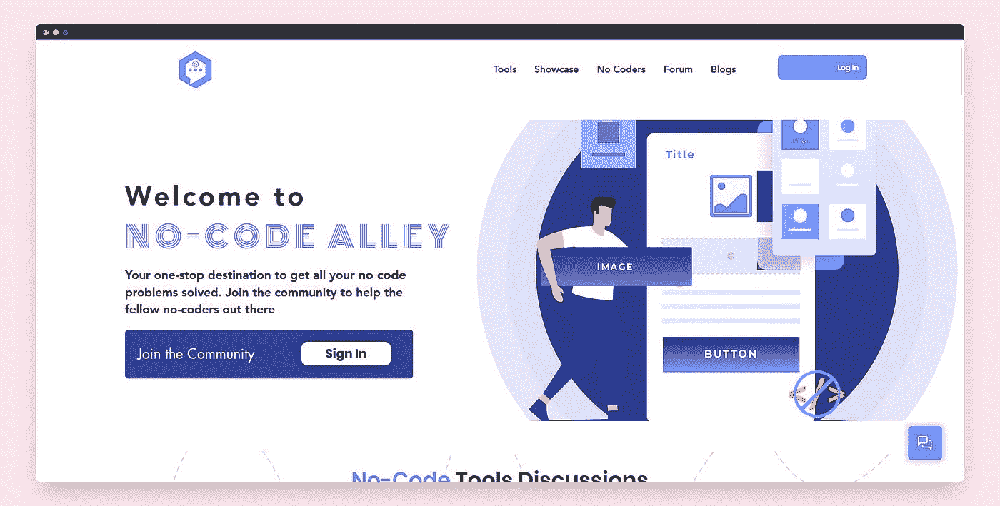
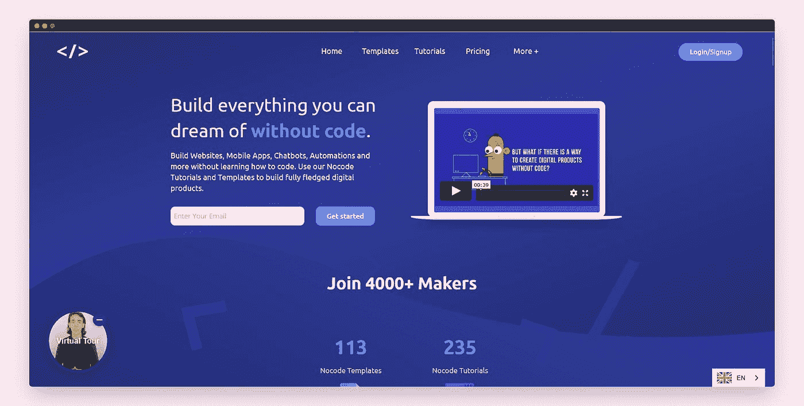
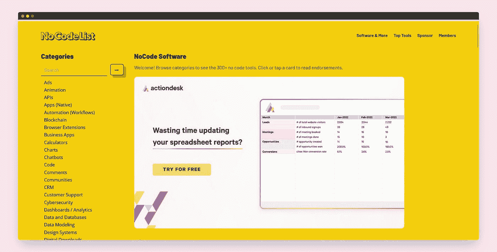
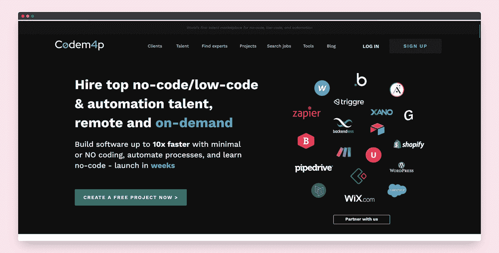

# 通过参与这些社区来学习和探索低代码/无代码堆栈

> 原文：<https://medium.com/geekculture/learn-and-explore-low-code-no-code-stack-by-involving-in-these-communities-30a408cb1bd5?source=collection_archive---------12----------------------->

我敢肯定，你们都熟悉全栈、MERN 栈以及许多与开发相关的类似技术栈。但是我不会谈论它，因为已经有很多内容了。我将告诉你关于**“无代码/低代码堆栈”**技术的新趋势，以及你如何通过参与相关社区来掌握这项新技术。

# 什么是低码/无码栈？

这个技术栈只不过是针对软件开发的不同阶段或过程的低代码/无代码工具和平台的完整知识。比如规划、设计、构建、部署和发布一个全功能的产品。这是一个新的趋势，许多开发人员正在这个领域工作，新的平台正在围绕低代码出现，如 ideal 或 Zapier。如果你不是技术出身，也不想深入研究编码，你可以考虑学习这种低代码/无代码技术栈，创造奇迹。

> *如果你不了解低码/无码。看我关于它的文章。* [*此处*](https://blog.flycode.com/say-no-to-coding-introduction-to-low-code-no-code)
> 
> *如果想了解一些低代码/无代码的工具和平台。看我关于它的文章。* [*此处*](https://astrodevil.hashnode.dev/40-no-codelow-code-tools-and-resources-for-developers-in-2022)

# 通过参与这些社区来探索低代码/无代码堆栈

如你所知，社区在技术领域非常重要，因为它在许多方面都有帮助。社区是找到正确解决方案的最佳场所，你将了解到网络的真正含义，这不仅仅是在 Twitter 上关注彼此和在 LinkedIn 上联系。社区也有助于提高你的技术熟练程度和许多其他好东西。比如找工作，帮你选择正确的步骤。社区可以是免费的也可以是付费的。

来看看一些不错的低代码/无代码社区。

# 1. [100 天无代码](https://www.100daysofnocode.com/)

《无代码 100 天》是全球无代码学习者的集合。来自不同背景的人们聚集在这个地方学习、交流和分享他们的知识。它拥有 5000 多名学习者，他们将自己的想法付诸实践。在每天 30 分钟的时间里，你可以在一些有趣且有帮助的小课程的帮助下，从头开始学习如何使用无代码。免费和付费会员都可以。

# 2. [NoCodeDevs](https://www.nocodedevs.com/)

最大的无代码工具、应用程序和资源集合。在 NoCodeDevs 社区中，企业主可能会找到新的技巧和方法来实现他们的想法，而无需编写代码，并与其他制造商联系，在创建过程中互相帮助。加入这个由 20，000 多名非技术创始人、300 多个工具目录和 150 多个教程组成的社区。还组织现场研讨会和活动。

# 3. [Makerpad](https://www.makerpad.co/)

本·托塞尔(Ben Tossell)在 2019 年创立了 Makerpad 社区，它致力于为创建应用程序和网站、管理在线业务以及自动化操作提供无代码教育，无需编写代码。Makerpad 可以免费注册，但是为了使用高级功能，您必须购买会员计划。Makerpad 社区的成员也可以公开他们的专业资料，以吸引那些为他们的无代码项目寻求专业帮助的客户。

# 4. [NoCodeFounders](https://nocodefounders.com/)

这是一个为没有技术背景的创新者、制造者、个体企业家和商业人士服务的著名在线网络。超过 13，000 人参与其中。成员参加在线聚会和活动，在那里他们建立新的关系，并获得关于最佳无代码平台的知识。你必须一次性支付 99 美元才能注册成为高级用户。会员资格包括访问 Slack 社区、解锁过滤器、独家教程以及对无代码领域无与伦比的洞察力。

# 5. [Webflow 社区](https://webflow.com/community)

与 75，000 多名正在开发视觉开发未来并为 Webflow 做出贡献的成员联系。联系各种规模和行业的企业家、产品和项目经理、企业主、设计师、创始人、营销人员和开发人员。Webflow 是一个低代码的网站构建器。

# 6.[核酸](https://www.nucode.co/)

Nucode 是一个创造者和发明家的社区。总共有将近 7000 名成员。可以免费学习使用 Webflow、Glide、Bubble 之类的工具！任何人都可以在这个神奇的空间里一起成长和学习。当你提交你的知识时，你的创作伙伴可以根据他们的经验向你提供建议。你可以给其他非程序员设置一个挑战，让他们为具有挑战性的情况创建应用程序，以便在学习之外促进竞争意识。

# 7.[无码小巷](https://www.nocodealley.com/)

非代码开发人员可以在非代码巷建立的讨论板上联系，解决他们的业务问题。您可以发现顶级的无代码产品、它们的应用和有用的提示。此外，还有像 Stack Overflow 这样的特定论坛，在那里您可以发布特定的查询，并从其他非编码人员那里获得响应。

# 8. [Nocode HQ](https://nocodehq.com/)

Nocode HQ 社区提供了一个网络，开发者可以在这里讨论行业面临的问题，并一起寻找创新的解决方案。该平台提供的学习环境包括循序渐进的课程、模板和专家会议。通过建立一个具有社交媒体功能的网络，你可以与创造类似物品的人联系，以获得帮助和反馈。

加入是免费的，它让你获得一些资源和在社区中的一席之地。此外，你可以选择高级会员，每月支付 29 美元。高级会员可以访问无限的教程、高级模板和免费的 Nocode 会话。

# 9.[无名模](https://nocodelist.co/)

构建你自己的无代码产品所需的工具和资源都由无代码列表集中在一个地方。无代码列表也不包括可以帮助您创建无代码商品或服务的代码代理。无数其他无代码论坛、渠道、博客、教程、课程、网站等。都包含在他们的资源区域中。如果你注册了，每周五会有四个新工具发送到你的收件箱。

# 10.[代号 m4p](https://codemap.io/)

希望雇佣专家、公司和独立自由职业者的客户可以通过这个网络联系。如果你是一个不编码的人，想为受人尊敬的企业工作，这是你的地方。您还可以与您的同行互动，展示您的工作，学习并获得反馈。您还可以参加高端活动、专业资源、专家会议以及关于各种工具的讨论。

为自动化、无代码、低代码和远程工作雇佣最好的人员。开发软件的速度提高了 10 倍，自动化任务，并通过学习无代码在几周内启动。

希望这篇文章对你有所帮助！如果你知道其他一些社区，请在[**Twitter**](https://mobile.twitter.com/Astrodevil_)**上告诉我。**

## 如果你❤️我的内容！在推特[上联系我](https://mobile.twitter.com/Astrodevil_)或者通过[给我买一辆 Coffee☕](https://www.buymeacoffee.com/Astrodevil) 来支持我