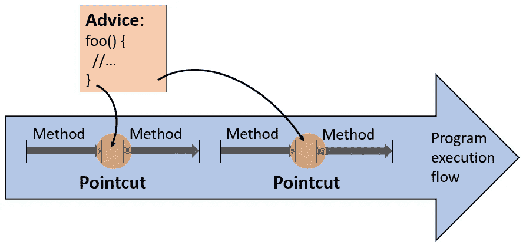

# 通过例子学习面向方面编程

> 原文：<https://medium.com/geekculture/learn-aspect-oriented-programming-by-example-eb67cbd78c25?source=collection_archive---------1----------------------->


这个故事通过学习**具体例子**，为你提供了一个学习[面向方面编程](https://en.wikipedia.org/wiki/Aspect-oriented_programming)的好方法。特别是，我将通过实现 **4 个方面**来展示 **SpringBoot AOP** 。

**目录:**

*   **什么是方面？**
*   **@Cacheable:** 一个标准的春季建议
*   **日志休息调用**(带有自定义特征)
*   **性能监控**(带 AOP)
*   **重试机制**(带 AOP)

如果你想跳过冗长的描述，只看具体的代码，我可以满足你:

[](https://github.com/pmgysel/aop-examples) [## pmgysel/AOP-示例

### 大多数人都知道面向对象编程和函数式编程。但是面向方面的编程呢…

github.com](https://github.com/pmgysel/aop-examples) 

# 什么是方面？

因此，对于 Spring AOP 的概述，有一些很好的资源，包括这篇 [Baeldung 文章](https://www.baeldung.com/spring-aop)和[官方 Spring AOP 文档](https://docs.spring.io/spring-framework/docs/5.0.0.RELEASE/spring-framework-reference/core.html#aop)。但是因为我们不想专注于无聊的理论，而是保持事情的实用性，这里有一个关于 AOP 如何工作的非常简短的总结:



Aspect Oriented Programming — Overview

在本教程中，我们将需要以下术语:

*   **建议**:实现日志或缓存等常见任务的方法
*   **切入点**:一个模式表达式，它匹配应该调用您的建议的位置
*   **方面**:建议加切入点表达式
*   **Bonus — Join point** :代码中代表切入点候选对象的所有地方

# 标准的春季建议

让我们从简单的开始，考虑一个已经由 [Spring](https://spring.io/) 实现的建议，即 [@Cacheable annotation](https://docs.spring.io/spring-framework/docs/current/javadoc-api/org/springframework/cache/annotation/Cacheable.html) 。假设您的 web 服务必须计算斐波纳契数列的数字。

> 如果你不知道什么是斐波纳契数列:它是从 0 和 1 开始的数列，每个连续的数字是前两个数字的和。

我们在一个 [@Service](https://docs.spring.io/spring-framework/docs/current/javadoc-api/org/springframework/stereotype/Service.html) 类中实现了斐波那契计算:

接下来，我们在我们的 [REST](https://en.wikipedia.org/wiki/Representational_state_transfer) 控制器中使用这个服务类:

我们的实现是递归的，因此相当慢。那么，如何让你的 web 服务更快呢？一种方法是使用更快的算法，但是让我们用 Spring 的特性来解决这个问题。该注释在后台创建一个缓存，存储所有以前的结果。我们必须做的就是给我们的方法添加`@Cacheable`注释:

现在我们准备通过向`http://localhost:8080/api/fibonacci/40`发送一个 REST 请求来测试我们的缓存机制。我试图在自己的笔记本电脑上计算第 40 个斐波那契数列，结果如下:

*   第一次休息呼叫:1902 毫秒
*   第二次休息呼叫:1 毫秒

相当不错的结果🤙😎

我想提的最后一件事是:为了激活 Spring 的可缓存特性，你必须将`@EnableCaching`添加到一个`@Configuration`类中。

# 使用自定义方面记录 REST 调用

这很简单，对吧？因此，让我们转到一个更高级的用例:现在我们创建一个定制的方面！

我们的目标是**在每次调用某个 REST 方法的时候创建一条日志消息。因为我们可能想在未来的 REST 方法中加入这个功能，所以我们想在**方面**中推广这个任务:**

第一行定义了[切入点表达式](https://docs.spring.io/spring-framework/docs/5.0.0.RELEASE/spring-framework-reference/core.html#aop-pointcuts)，后续方法代表[建议](https://docs.spring.io/spring-framework/docs/5.0.0.RELEASE/spring-framework-reference/core.html#aop-advice)。让我们逐一分析这两个问题:

切入点 :
切入点表达式定义了我们的通知插入的位置。在我们的例子中，方面在每个带有`@LogMehtodName`注释的方法之前**被应用。注意`@LogMethodName`是我们的**自定义注释**，我们将其用作切入点标记。**

**建议** :
建议方法是一种逻辑，它将许多不同对象共有的任务一般化。在我们的例子中，通知会找到原始方法的名称及其调用参数，并将它们记录到控制台中。

有了我们的方面，还需要三行额外的代码来让一切正常工作:

*   首先，向我们的`fibonacci()`方法添加标记`@LogMethodName`
*   其次，我们必须将`@Aspect`添加到包含我们方面的类中
*   第三，在任何一个`@Configuration`类中用`@EnableAspectJAutoProxy`启用 Spring 的方面扫描

就是这样，我们已经执行了自己的建议！🙌我们来做个测试吧！我们向 web 服务发出一个 REST 请求来计算第 40 个斐波那契数，并查看控制台输出:

```
Method [fibonacci] gets called with parameters [40]
```

不言而喻，如果您必须跟踪应用程序中的 bug，这样的日志消息会有很大的帮助。

# 使用 AOP 进行性能监控

在前面的例子中，我们在之前使用了一个类型为[@的切入点表达式——这里，通知在实际方法之前运行。让我们换个方式，围绕](https://docs.spring.io/spring-framework/docs/5.0.0.RELEASE/spring-framework-reference/core.html#aop-advice-before)切入点实现一个[@。这样的通知部分在目标方法之前运行，部分在目标方法之后运行。](https://docs.spring.io/spring-framework/docs/5.0.0.RELEASE/spring-framework-reference/core.html#aop-ataspectj-around-advice)

我们现在的目标是**监控任何 REST 调用**的执行时间。让我们继续以一种通用的方式实现监控需求，即一个方面:

**切入点** :
像以前一样，我们创建一个新的定制注释`@MonitorTime`来标记我们的切入点。

**建议** :
一个`@Around`方面应该有一个类型为 [ProceedingJoinPoint](https://javadoc.io/doc/org.aspectj/aspectjweaver/latest/org/aspectj/lang/ProceedingJoinPoint.html) 的参数。这个类型有一个`proceed()`方法，它触发实际目标方法的执行。所以在我们的建议中，我们首先以毫秒为单位查询当前时间。在目标方法被执行后，我们再次测量当前时间，从那里我们可以计算时差。

让我们继续用`@MonitorTime`注释标记我们的目标方法:

到目前为止，我们的 REST 方法已经附加了相当多的切入点标记😉不管怎样，让我们继续测试我们的性能监控特性。和以前一样，我们计算第 40 个斐波那契数:

```
Method [fibonacci] gets called with parameters [40]
Execution took [1902ms]
```

如您所见，这个特殊的 REST 调用花费了 1902ms。有了这个方面，你肯定是一个高级 AOP 程序员了！💪

# AOP 的重试机制

分布式系统可能会遇到并发问题。一个这样的例子是当两个 web 服务实例同时试图访问数据库中的相同记录时。通常，这种锁定问题可以通过重试操作来解决。这里唯一的要求是运算是幂等的。

让我们继续创建一个方面，让**透明地重试一个操作，直到它成功**:

**切入点** :
我们的建议会绕过任何带有自定义注释`@RetryOperation`的方法。

**建议** :
在`try`语句中，我们运行目标方法。这个方法可能会抛出一个`RuntimeException`。如果发生这种情况，我们增加`numAttempts`计数器，并简单地重新运行目标方法。一旦目标方法成功，我们就退出通知。

出于演示的目的，让我们创建一个 REST 方法来存储一个字符串。这种方法有 50%的几率会失败:

由于我们的`@RetryOperation`注释，上述方法将被重试，直到成功。此外，我们使用我们的`@LogMethodName`注释，所以我们可以看到每个方法调用。让我们继续测试我们的新 REST 端点；为此，我们向`http://localhost:8080/api/storeData?data=hello-world`发出一个 REST 请求。

```
Method [storeData] gets called with parameters [hello-world]
Method [storeData] gets called with parameters [hello-world]
Method [storeData] gets called with parameters [hello-world]
Pretend everything went fine
```

在上面的例子中，操作失败了 2 次，直到第三次尝试才成功。

# 结论

恭喜你，你是一个专业的 AOP 程序员 now🥳🚀你可以在我的 Github repo 上找到一个全面运行的 web 服务:

[](https://github.com/pmgysel/aop-examples) [## pmgysel/AOP-示例

### 大多数人都知道面向对象编程和函数式编程。但是面向方面的编程呢…

github.com](https://github.com/pmgysel/aop-examples) 

非常感谢您的阅读，如果您有任何问题或反馈，请留下评论！😄

首次发布于[开发至](https://dev.to/pmgysel/learn-aspect-oriented-programming-by-example-m8o)。