# 通过玩游戏学习 CSS👾

> 原文：<https://medium.com/geekculture/learn-css-by-playing-games-cf70a79a38?source=collection_archive---------2----------------------->

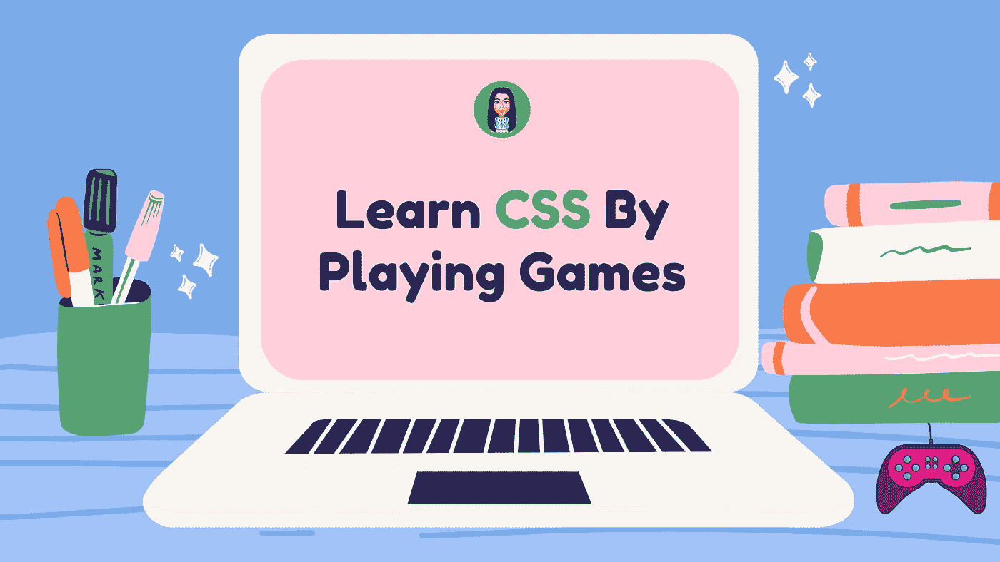

learn css by playing games

学习 CSS 有时会是令人沮丧的经历。学习编码最棒的一点是，擅长编码的人碰巧也有技能制作教其他人编码的游戏。

这里有一些游戏可以帮助你掌握 CSS。

# 1. [Flexbox Froggy](http://flexboxfroggy.com/)

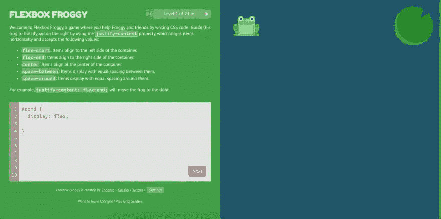

这个游戏是关于 Flexbox 的，它涵盖了 flex 属性，如`align-items`、`justify-content`、`align-content`、`flex-direction`、`align-self`、`flex-wrap`、`flex-flow`以及 24 个不同级别的顺序。

是的，最后一关有点挑战性😉

# 2. [Flexbox 僵尸](https://mastery.games/flexboxzombies/)

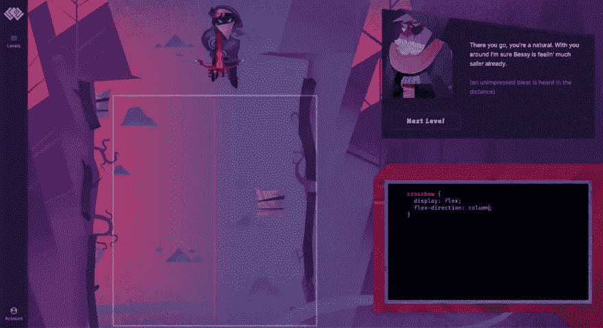

在这里，我们使用 Flexbox 来定位英雄的十字弓，并在游戏中打击僵尸和生存。
每一部分都解开了部分情节，让你对新的 flexbox 概念有了专业知识，并提出了僵尸生存挑战，迫使你巩固你的新技能，就像你的生命取决于它一样。

# 3. [Flexbox 防御](http://www.flexboxdefense.com/)

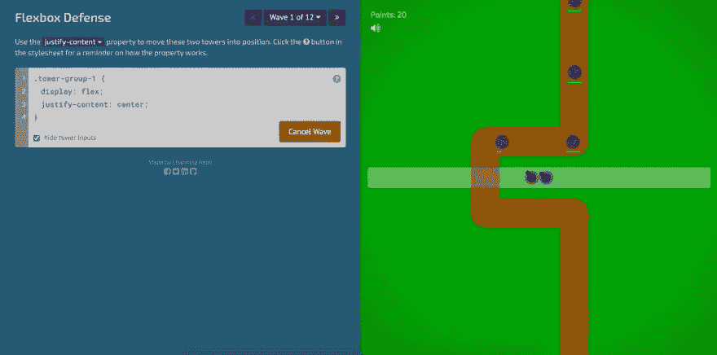

Flexbox defense 基于经典的塔防游戏，但是为了放置我们的物品，我们编写了 CSS 指令。我们使用主容器上的 justify-content 属性将单个塔移动到有效位置。

# 4.[网格花园](https://cssgridgarden.com/)

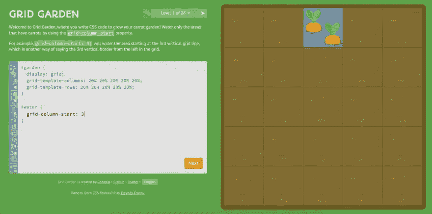

网格花园游戏有 28 个级别，从容易的难度开始，逐渐增加。使用各种网格属性来浇灌和种植你的胡萝卜园。网格花园有一个代码编辑器和可视区域，所以你可以立即看到你的结果。

# 5. [CSS 之战](https://cssbattle.dev/)

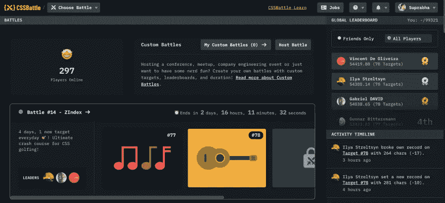

CSS Battle 是一个在线挑战，而不是一个实际的 CSS 练习游戏，目标是编写 HTML 和 CSS 代码，以尽可能少的代码复制给定的目标图像。这个游戏不断更新新的挑战。它有一个全球排名系统，并能够重新播放每个挑战，所以你可以提高自己的成绩。

# 6. [CSS 食客](https://flukeout.github.io/)

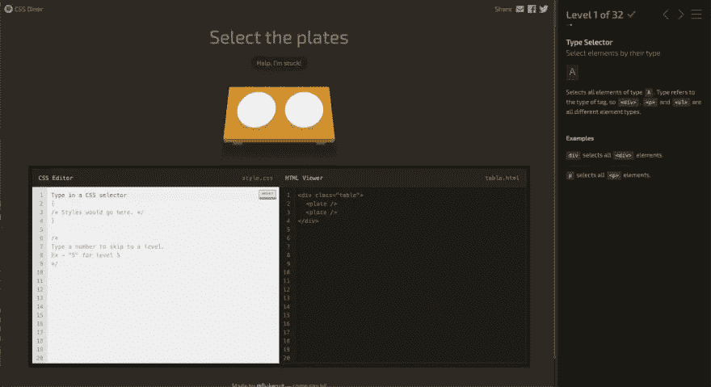

CSS Diner webapp 非常有趣，对所有技能水平的开发者都有真正的教育意义。你将经历 26 个不同难度的关卡。前几级教授核心基础知识，如元素选择器和类选择器。在后面的级别中，您将使用一些高级概念，如:only-of-type 和:not(x)。

# 7. [CodePip](https://codepip.com/)

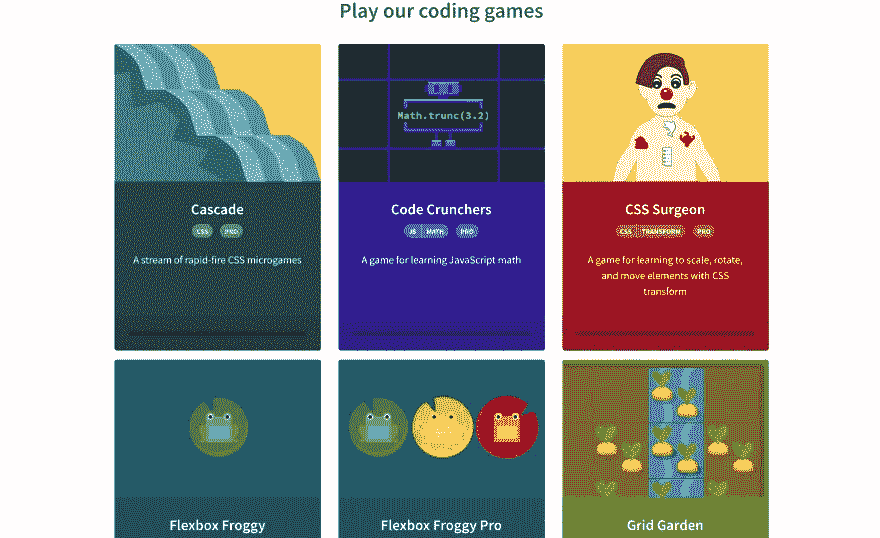

我们已经检查了 Grid Garden 和 Flexbox Froggy，您已经看到了一些 CodePip 的工作示例。
这只是他们提供的两个免费游戏。如果你在他们的网站上注册了一个专业帐户，他们也有从一般 CSS 审查到 JavaScript 的游戏。

# 8. [CodeMonkey](https://www.playcodemonkey.com/)

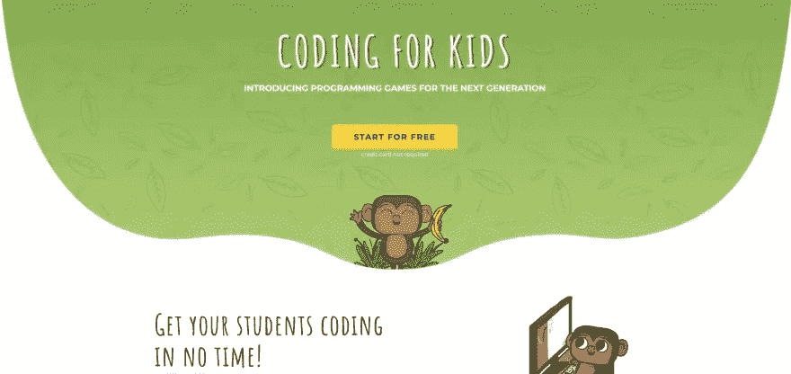

CodeMonkey 使用 CoffeeScript(一种真正的编程语言)教授编码，教你用 HTML5 构建自己的游戏。它的目标是为孩子编写代码，但对成年人来说肯定也很有趣。

# 9.[编码名称](https://www.codingame.com/start)

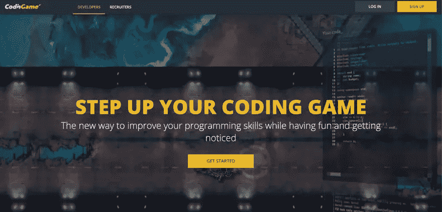

CodinGame 提供有趣的免费游戏来帮助学习超过 25 种编程语言，包括 JavaScript、Ruby 和 PHP。CodinGame 的一大好处是你可以和朋友或同事一起玩，还可以参加国际编码比赛。

# 10.[代码战斗](https://codecombat.com/)

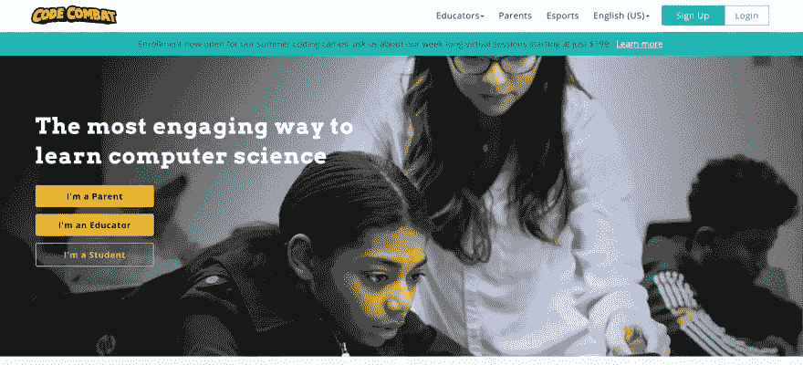

学习 Python，JavaScript，CoffeeScript，或者 Lua 游戏脚本语言。在初级地牢级别，你将根据游戏旁边的教程使用一些基本命令来移动你的英雄通过游戏。

# 使用纯 CSS 的游戏🔖

# 1.[路线图](http://victordarras.fr/cssgame)

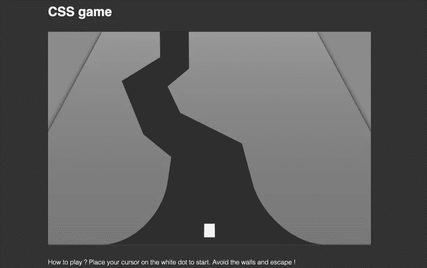

解决这个小游戏需要技巧和速度，只用 CSS 和 HTML 做的。这不是直接教授 CSS，但是查看源代码可以学到很多关于剪辑路径、变换和使用@keyframes 的动画！

# 2.[嘉年华](https://codepen.io/una/pen/NxZaNr)

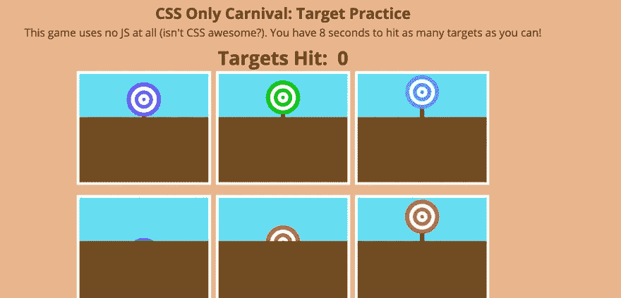

你只有 8 秒钟击中所有目标！一个不错的使用复选框和 CSS 动画的 CSS 小游戏。

# 3.[维修工人](https://serviceworkies.com/)

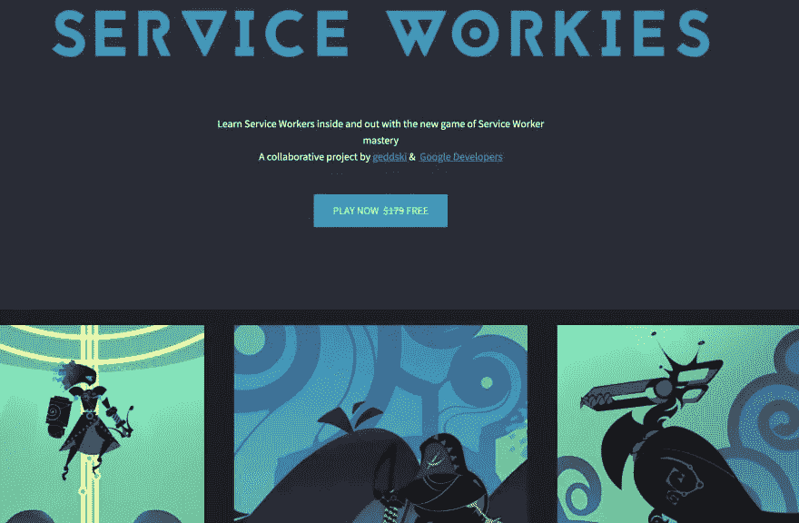

在这次冒险中，你将学会如何避免 PWA 陷阱。你将提升自己的技能，并与服务人员一起成长。也许甚至可以杀死几个世纪以来一直困扰着贫穷的乡村工人的野兽！需要注册。

# 4.[展开](https://rupl.github.io/unfold/)

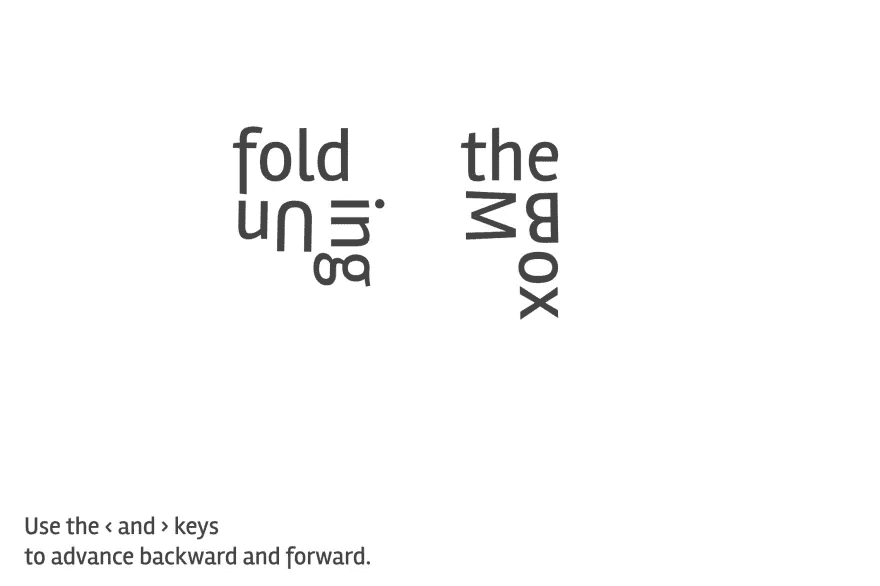

这不完全是一个游戏，而是一个关于 CSS 3D 变换的互动演示。试一试吧，这不无聊😂，纯 CSS 做出来的动画真的很牛逼。

# 付费游戏🤑

# [网格生物](https://gridcritters.com/)

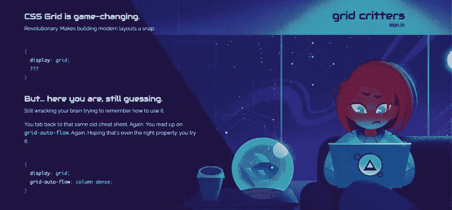

你掌握 CSS 网格的旅程从神秘的格里德罗斯星球开始。你的任务是使用你船上强大的网格工具拯救外星生物免于灭绝。需要注册。

🌟[推特](https://twitter.com/suprabhasupi) |👩🏻‍💻 [suprabha.me](https://www.suprabha.me/) |🌟 [Instagram](https://www.instagram.com/suprabhasupi/)