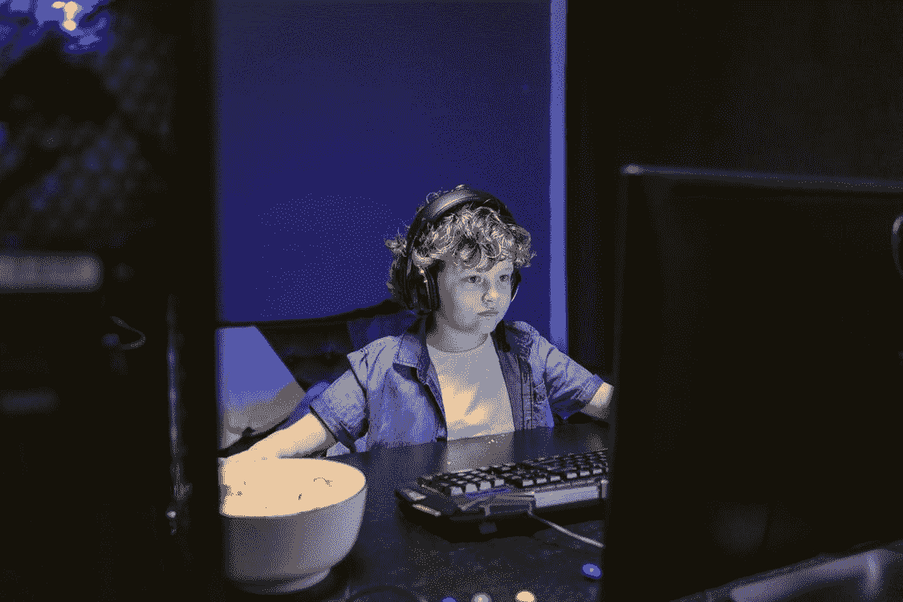

# 如何通过玩来学习 Git

> 原文：<https://medium.com/geekculture/learn-git-now-by-playing-around-70896d76fbab?source=collection_archive---------24----------------------->

## 哦，我的天啊！

Photo by [Tima Miroshnichenko](https://www.pexels.com/@tima-miroshnichenko?utm_content=attributionCopyText&utm_medium=referral&utm_source=pexels) from [Pexels](https://www.pexels.com/photo/food-light-man-people-7047302/?utm_content=attributionCopyText&utm_medium=referral&utm_source=pexels)

有 Git 初学者。哦，我的天啊！今天学习 Git 的一个游戏。

这是一个互动游戏，可以让你学到 Git 的基础知识。*如何？通过可视化所有的 Git 动作，Git 新手开始应用。*

下面是**我的天啊**的工作原理。以及我个人对每个游戏部分的看法。