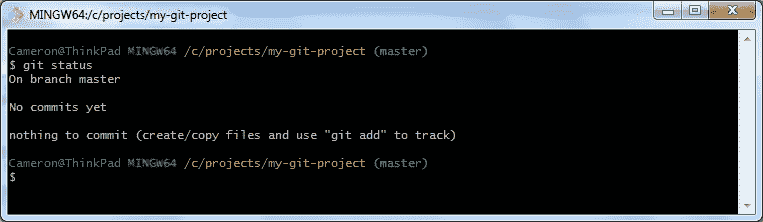
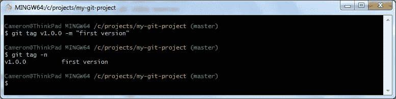

# 开始使用 Git 的 7 个 Git 命令

> 原文：<https://medium.com/geekculture/learn-git-with-7-basic-commands-for-beginners-ded3cb535672?source=collection_archive---------2----------------------->

Git 是最广泛使用和流行的版本控制系统之一，用于维护软件源代码。一旦您开始与多个团队成员一起处理大型项目，就必须使用版本控制。本文将通过在本地机器上创建一个 git 存储库来演示基本的 git 命令。


Photo by [Valentin Wechsler](https://unsplash.com/@valentinw?utm_source=medium&utm_medium=referral) on [Unsplash](https://unsplash.com?utm_source=medium&utm_medium=referral)

# 先决条件

为了阅读本文并在阅读时运行命令，您需要在您的机器上安装 Git Bash。这里可以下载 Git [。在本文发表时，使用的是 Git for windows 的最新稳定版本，即 2.30.1 版。](https://git-scm.com/download/)

首先打开 git bash 终端，导航到通常存储项目源代码的目录。我机器上的那个目录几乎总是 */c/projects/* 。下面的命令将创建并把您移动到我们将使用 git 的目录中。

```
$ cd /c/projects         ## move to directory projects are stored
$ mkdir my-git-project   ## create directory for git project
$ cd my-git-project      ## move into the git project directory
```

# git 初始化

使用 git 时需要知道的第一个命令是 **git init** 。这个命令将在它运行的目录中初始化 git 存储库。命令运行后，出现一个隐藏目录，*。git* 目录，开始跟踪存储库中的所有文件、变更、分支和标签。您可以通过使用带有 **-a** 标志的 **ls** 命令来查看目录。

```
$ git init ## initialize git repository
$ ls -a    ## list files and sub directories, including hidden
```

# git 状态

您可以使用 status 命令查看本地存储库的当前状态。当您运行 **git status** 时，您可以看到分支的名称，以及存储库中文件的任何更改。当您在初始化没有文件的存储库之后运行该命令时，您将看到以下语句。



Git Bash — Empty initialized repository status

# git 添加

要开始跟踪存储库中的新文件，首先创建它们或将它们放入目录中，然后将它们添加到存储库中进行跟踪。我们用 **git add** 命令来做这件事。Git 不会跟踪空目录，所以为了跟踪最终将被使用的目录，一个常见的做法是添加一个*。gitkeep* 文件到那个目录。我们可以使用 **touch** 命令在存储库的根目录中完成这项工作。

```
$ touch .gitkeep    ## create a keep file for committing directory
$ git add .gitkeep  ## add specific file to tracking in repository
$ git status        ## view current state of repository
```

**添加**命令不仅将暂存新文件进行跟踪，还将获取要跟踪的现有文件中的任何更改。

# git 提交

现在 keep 文件已经准备好进行跟踪，我们可以在第一次提交时将更改提交到存储库中。在命令中使用 **-m** 标志允许您向提交添加一条消息。

```
$ git commit -m "first commit, add keep file"
```

当文件已经在存储库中被跟踪时，不必使用 add 命令专门添加它；您可以在消息后添加一个特定的文件，或者使用**-一个**标志，它将添加所有被跟踪文件中的所有更改。我们现在不需要使用这些命令，它们看起来像下面的语句。

```
$ git commit -m "message" file.ext ## commit specific tracked file
$ git commit -am "message"         ## commit all tracked file
```

# git 检验

源代码管理中的一个重要概念是在一个分支中处理特性，一旦完成，就将这些变更合并回主分支。当您初始化您的项目时，默认情况下，您被放在*主*分支中。

当您想要切换到不同的分支时，您可以使用 **git checkout** 命令。如果您想转移到一个新的分支，您可以使用带有 **-b** 标志的 **checkout** 命令。

```
$ git checkout -b my-new-branch ## create and move to new branch
```

进入分支后，您可以添加新文件或对现有文件进行更改，并将它们提交到该分支。然后，如果您必须处理另一个特性，您可以切换到那个特性分支，并保持您现有的工作独立。

# git 合并

当你完成了一个功能，你将把它合并回主分支。在本文中，它将是*主*分支，一些团队可能会合并到*开发*或*登台*分支，然后在正式发布后才合并到*主*。无论哪种方式，都是使用 merge 命令完成的。当您合并一个分支时，您从一个分支中取出所有提交，并将它们移动到另一个分支中。

为了将我们的分支 *my-new-branch* 合并到 *master* 分支中，我们将创建一个空的 *README* 文件，将该文件提交到新的分支中，然后将该分支合并到 *master* 中。

当您合并分支时，您将位于您正在引入新提交的分支上。在*自述文件*创建并提交后，移回*主*分支，以便从 *my-new-branch* 引入提交。

```
$ touch README.md               ## create empty readme
$ git add README.md             ## stage readme for tracking
$ git commit -m "commit readme" ## commit readme to branch
$ git checkout master           ## move back to master branch
$ git merge my-new-branch       ## merge branch into master
```

# git 标签

既然您已经将您的分支合并到主分支中，我们可以在我们的项目中用一个版本来标记最近的提交。为此，使用**添加标签**命令，为了添加消息，使用 **-m** 标志。然后，您可以使用 **-n** 标志查看所有标签和消息。



Git Bash — Create first git tag then list all tags with messages

在这种情况下进行标记有点矫枉过正，因为存储库中只有两次提交，但是一旦您开始将代码发布到不同的环境，标记就变得非常关键。

# 结论

对于一些人来说，开始使用 Git 可能会令人生畏。如果你慢慢来，开始使用 Git 进行源代码控制，甚至在你是唯一程序员的小项目上，你会慢慢地在你的团队职业生涯中掌握 Git 的窍门。关于使用 git 的更多信息，您可以运行 **help** 命令。

```
$ git help git ## launch git documentation in your browser
```

希望这篇文章有助于鼓励您更经常地使用 Git。编程快乐！