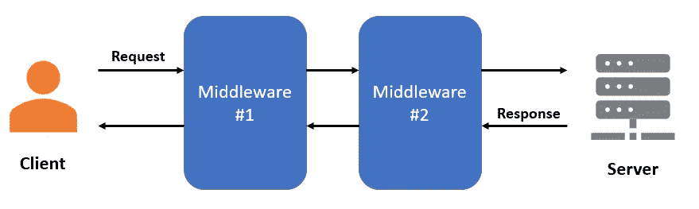
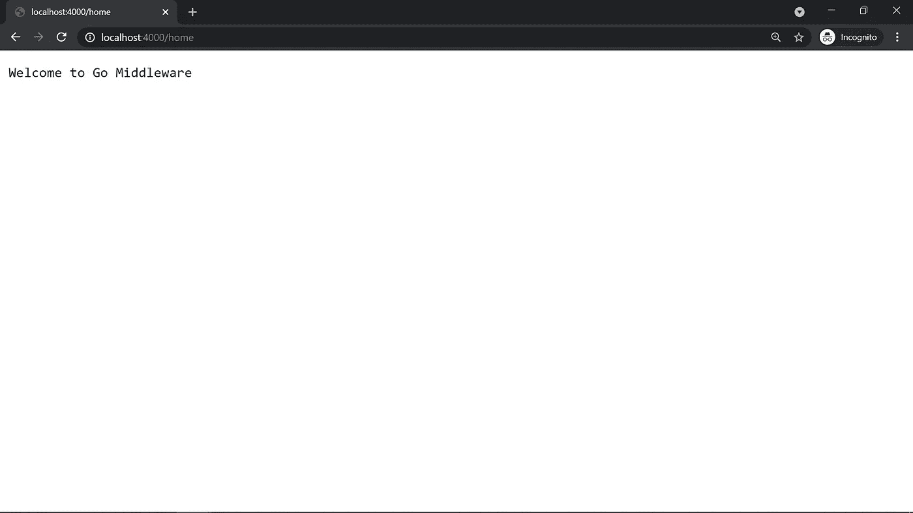
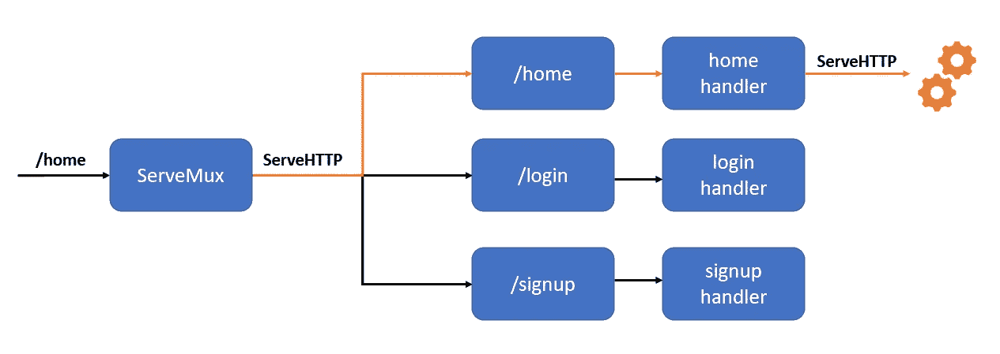
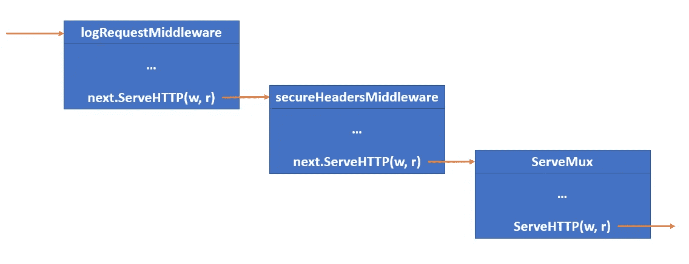
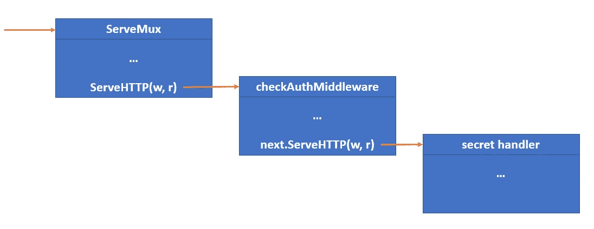
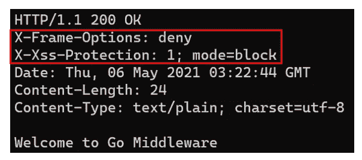

# 通过例子学习围棋中间件

> 原文：<https://medium.com/geekculture/learn-go-middlewares-by-examples-da5dc4a3b9aa?source=collection_archive---------11----------------------->

## 通过中间件集中和重用通用功能


Photo by [Elaine Casap](https://unsplash.com/@ecasap?utm_source=unsplash&utm_medium=referral&utm_content=creditCopyText) on Unsplash

中间件是后端工程中最重要的概念之一。它们是独立的、可重复使用的软件，将不同的系统连接在一起。

在 web 开发中，在客户机和服务器之间放置一个或多个中间件是很常见的。这实质上在数据和用户界面之间建立了一座桥梁。

每个中间件独立地作用于 HTTP 请求或响应。一个中间件的输出可以是另一个中间件的输入。这就形成了一个中间件链。



Two middlewares between client and server

为什么选择中间件？在 web 应用程序中，中间件允许我们在每个请求或响应上**集中和重用**通用功能。例如，您可以拥有一个记录每个 HTTP 请求的中间件。

要设计 Go 中间件，我们必须遵循一定的规则和模式。本文将向您介绍 Go 中间件的概念，并为一个简单的应用程序创建两个这样的中间件。

我假设您已经安装了 Go，并且熟悉 Go 的接口、结构和`[http](https://golang.org/pkg/net/http/)`包。

我们开始吧！🏃

# 入门指南

让我们首先创建一个目录来存放我们的 mini Go 项目。打开您的终端，导航到您喜欢的位置并运行下面的命令。这将创建我们名为`go-middleware`的根目录。

```
$ mkdir go-middleware
```

然后，进入目录并创建一个`main.go`文件。

```
$ cd go-middleware
$ touch main.go
```

是时候开始编码了！打开您的代码编辑器，让我们添加一些样板代码来启动一个基本的 Go HTTP 服务器。

A simple HTTP server

我已经用`http.NewServeMux()`函数声明了一个新的[serve mux](https://golang.org/pkg/net/http/#ServeMux)(Go 术语中的路由器)。然后，我将`home`函数注册为**处理程序**，用于处理对`/home`路由的任何 HTTP 请求。最后，我用定制路由器在 [localhost:4000](http://localhost:4000/) 启动了一个 HTTP 服务器。

一旦你完成了，在终端，运行`go run main.go`并在你最喜欢的浏览器中访问 [localhost:4000/home](http://localhost:4000/home) 。您应该会看到如下响应。



A simple response at /home

完美！顺便提一下，您可能会注意到一些 Go 教程从不声明自定义的 ServeMux。相反，他们使用 Go 的 **DefaultServeMux** 如下。

DefaultServeMux in main.go

注意，`home`函数是直接用`http.HandleFunc`注册的。在幕后，Go 在`http`包中创建一个 DefaultServeMux 对象作为默认路由器，并向其中添加处理程序。

上面的代码有效，而且看起来更简单。但是，*不是一个好的实践*，因为 DefaultServeMux 是`http`包中的一个全局变量。任何第三方包都可以给它添加恶意处理程序，这就引入了**安全风险**。


Photo by [Artem Maltsev](https://unsplash.com/@art_maltsev?utm_source=unsplash&utm_medium=referral&utm_content=creditCopyText) on Unsplash

反正我跑题了。我们继续吧。

# 处理程序和服务 HTTP

在我们开始创建 Go 中间件之前，了解一些理论对我们是有好处的。特别是，w 的*帽子到底是一个* ***的经手人*** *在走？*

在 Go 中，处理程序只是一个满足`[http.Handler](https://golang.org/pkg/net/http/#Handler)`接口的对象(struct)。

```
type Handler interface {
    ServeHTTP(ResponseWriter, *Request)
}
```

当我们使用`[http.HandleFunc](https://golang.org/pkg/net/http/#ServeMux.HandleFunc)`将`home`函数注册为处理程序时，Go 使用`ServeHTTP`方法将我们的函数转换为处理程序。这个`ServeHTTP`方法简单的说就是*调用我们原来的* `*home*` *函数*。

为了演示，你可以想象 Go 做如下事情。

A Go handler with ServeHTTP method

同时，ServeMux 对象(无论是默认的还是自定义的)也是一个`http.Handler`。当它接收到一个 HTTP 请求时，它执行它的 ServeHTTP 方法，该方法用适当的处理程序匹配 URL 请求路径。

如果匹配，ServeMux 继续调用处理程序的`ServeHTTP`方法，并将请求传递给它。然后，处理程序执行其路由处理逻辑并返回响应。

在某种程度上，你可以把 Go 的应用程序路由想象成*一串处理程序，一个接一个地调用* `*ServeHTTP*` *方法。*



A chain of ServeHTTP calls

因此，为了适应这个链，Go 中间件必须表现得像一个处理程序。它在通过调用处理程序的`ServeHTTP`方法向**下一个处理程序**传递请求之前执行一些逻辑！

# Go 中间件的模式

通过使用上一节中介绍的思想，我们最终可以展示 Go 中间件是什么样子的。Go 中间件的标准模式如下。

The standard pattern of a Go middleware

上面的代码片段中发生了很多事情。我们来分解一下。

1.  `goMiddleware`是一个接受`http.Handler`类型的`next`参数并返回另一个`http.Handler`的函数。
2.  在`goMiddleware`内部创建了一个函数`f`。它接受两个类型为`http.ResponseWriter`和`*http.Request`的参数，这是一个*典型处理函数*的签名。
3.  中间件逻辑包含在`f`中。
4.  `f`通过调用处理程序的`ServeHTTP`方法将请求传递给`next`处理程序。
5.  `f`通过`[http.HandlerFunc](https://golang.org/pkg/net/http/#HandlerFunc)`适配器转换并作为`http.Handler`返回。
6.  返回的`f`在`next`处理程序上形成一个 [**闭包**](https://tour.golang.org/moretypes/25#:~:text=Go%20functions%20may%20be%20closures,%22bound%22%20to%20the%20variables.&text=Each%20closure%20is%20bound%20to%20its%20own%20sum%20variable.) 。因此，即使被`goMiddleware`返回，它仍然可以访问局部`next`变量。

实际上，显式创建函数`f`并不常见。相反，我们简单地将一个匿名函数*传递给`http.HandlerFunc`并返回它。*

Pass an anonymous handler function to HandlerFunc

如果上面的代码片段看起来令人困惑，请不要担心。随着我们为我们的应用程序创建和可视化一些定制中间件，这一点会变得更加清楚。

主要的要点是 Go 中间件是一个函数，**接受请求链中的下一个处理程序**作为参数。它**返回一个处理程序**，它在执行链中的下一个处理程序之前执行一些逻辑。

# 创建 Go 中间件

> 我们将要创建的中间件将基于亚历克斯·爱德华兹的书[让我们开始](https://lets-go.alexedwards.net/)。

万岁！现在我们知道了正确的概念和理论，从这里开始事情会容易得多。在本节中，我们将尝试创建两个中间件，一个用于**记录 HTTP 请求**，另一个用于**添加基本安全响应头**。

回到您的终端，确保您仍然在项目目录中，并运行下面的命令。

```
$ touch middleware.go
```

这就创建了`middleware.go`来容纳我们将要创建的两个 Go 中间件。打开你的代码编辑器，让我们开始编码吧！

Source: [Let’s Go](https://lets-go.alexedwards.net/) by Alex Edwards

`logRequestMiddleware`将网络地址、协议版本、HTTP 方法和请求 URL 记录到标准输出中。这些信息可以在 Go 的`[http.Request](https://golang.org/pkg/net/http/#Request)`对象中找到。

`secureHeadersMiddleware`在响应中设置两个安全头([X-XSS-保护](https://developer.mozilla.org/en-US/docs/Web/HTTP/Headers/X-XSS-Protection)和[X-帧-选项](https://developer.mozilla.org/en-US/docs/Web/HTTP/Headers/X-Frame-Options))来防御 XSS 和点击劫持攻击。

在我们在`main.go`注册我们的中间件之前，重要的是要知道你的中间件的**定位**会影响你的应用程序的行为。

特别是，如果我们想要一个中间件**处理每一个 HTTP 请求**，我们应该把它**放在 ServeMux** 之前。换句话说，我们需要将 ServeMux 处理程序作为参数传递给我们的中间件。

这种中间件的一个例子是我们刚刚创建的用于记录请求的中间件。


Middleware before ServeMux

另一方面，如果我们想要一个中间件**作用于特定的路由**，我们需要将它们**放在 ServeMux** 之后。为此，我们将单独的路由处理程序作为参数传递给中间件。

保护私有路由的认证中间件就是一个例子。


Middleware after ServeMux

我们希望每个请求都记录在我们的简单应用程序中，每个响应都用基本的安全头进行设置。因此，两个中间件都应该放在 ServeMux 之前*。*

让我们在`main.go`注册我们的中间件如下。

Add middlewares at line 14

注意我们是如何用 ServeMux 链接中间件的。`mux`是一个处理程序，它作为参数传递给`secureHeadersMiddleware`。这将返回另一个处理程序，该处理程序被传递到`logRequestMiddleware`中。

从视觉上看，请求流如下所示。



Middlewares to ServeMux to route handler

为了展示中间件定位的第二种类型，我将使用一个*假设场景*。比方说，在未来的某个地方，我们添加了一个`/private`路由和一个处理函数`secret`。

创建了一个名为`checkAuthMiddleware`的中间件来保护该路由免受未授权的访问。要将这个中间件只注册到`/private`路由，我们可以做如下事情。

```
mux.Handle("/private", checkAuthMiddleware(http.HandlerFunc(secret)))
```

再次，`http.HandlerFunc`将`secret`函数转换为`http.Handler`。这作为参数传递给`checkAuthMiddleware`。请注意，我们使用了`[mux.Handle](https://golang.org/pkg/net/http/#Handle)`而不是`mux.HandleFunc`，因为我们直接使用了`http.Handler`。



ServeMux to middleware to secret handler

# 快速测试

让我们测试一下，看看我们的应用程序是否如预期的那样正常工作。

我将使用[**curl**](https://curl.se/)**从终端发送 HTTP 请求并查看响应。应该预装在 Linux 和 macOS 机器上。否则，你可以从[这里](https://curl.se/download.html)下载安装。**

**如果你一直跟着做，在终端用`Ctrl+C`关闭你的服务器。然后，用`go run`命令再次启动。**

```
$ go run .
```

**打开另一个终端窗口运行我们的 curl 命令。首先，我们将测试 HTTP 请求是否被正确记录。您可以使用下面的命令向 [localhost:4000/home](http://localhost:4000/home) 发送 GET 请求。**

```
$ curl -X GET localhost:4000/home
```

**在启动服务器的终端窗口中，您应该会看到如下日志。请注意，您的网络地址将与我的不同。**

****

**A request log**

**完美！现在，为了测试我们的第二个中间件，我们在上面的 curl 命令中添加了一个`-i`标志。这使得 curl 向我们显示响应头。**

```
$ curl -i -X GET localhost:4000/home
```

**运行该命令后，您应该会看到如下内容。**

****

**Curl response**

**您看到 X-Frame-Options 和 X-Xss-Protection 标题了吗？**

# **最后的想法**

**如果你成功了，拍拍自己的肩膀！你已经学会了开始使用 Go 中间件所需的所有基础知识。**

**最后一点，你可能会注意到我们的应用程序不能很好地适应中间件的数量。随着中间件链越来越长，它将越来越难维护。**

**幸运的是，有第三方软件包可以帮助我们管理中间件。其中一个叫做[爱丽丝](https://github.com/justinas/alice)。我将把它留给你去检验它是如何工作的。**

**我叫 Jonathan，是东南亚发展最快的电子商务公司之一 [Shopee](https://careers.shopee.sg/about) 的后端软件工程师。Shopee 正以前所未有的速度扩张，我们正在寻找聪明的工程人才加入我们！**

**如果你是一名工程师，想要在快节奏的环境中大规模交付软件，那么 Shopee 是你的理想之地。如果你想更多地了解这家公司和我们的职位，请随时在这里留言或在 [LinkedIn](https://www.linkedin.com/in/jonathanseow5177/) 上找到我。**

**和平！✌️**