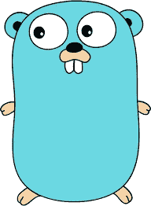

# 去吧——这一切是如何开始的

> 原文：<https://medium.com/geekculture/learn-go-part-1-the-beginning-723746f2e8b0?source=collection_archive---------10----------------------->

Go 编程语言的起源回顾

Image by [Domas](https://pixabay.com/users/Domas-2021972/?utm_source=link-attribution&utm_medium=referral&utm_campaign=image&utm_content=1194456) from [Pixabay](https://pixabay.com/?utm_source=link-attribution&utm_medium=referral&utm_campaign=image&utm_content=1194456)

# 介绍

2020 年 11 月，编程语言 Go 迎来了它的 11 岁生日。尽管围棋自诞生以来已经走过了漫长的道路，但与同行相比，它在许多领域仍被视为新人。这篇文章试图回顾和回忆 Go 的旅程是如何开始的，并提供对其设计目标和一些功能的快速浏览。稍后，我们将在随后的文章中更深入地探讨 Go。

***目标受众***

*这篇文章是为那些相对来说刚接触 Go 编程语言的人准备的。如果你已经熟悉围棋，那么，这可能是一次记忆之旅。:-)*

# 起源故事

围棋的故事始于 2007 年下半年的谷歌。来自谷歌的三位先生——罗伯特·格里斯默、罗布·派克和肯·汤普森——试图解决他们面临的一些工程挑战。由于其运营规模，谷歌面临着不同于许多其他组织的工程挑战。三人组确定使用哪种编程语言的选择标准集中在三个主要考虑因素上:*高效的编译、高效的执行和易于编程。*

尽管他们评估了许多现有的语言，但他们找不到任何一种语言能提供他们所有的三个主要考虑因素。这种认识促使他们考虑创造一种新的编程语言。于是，发展围棋的种子就种下了。

该设计始于 2007 年 9 月，是谷歌的一个 20%项目。随着事情的进展，许多其他人也加入了进来。2008 年 1 月，初始编译器的工作开始了。该语言于 2009 年 11 月开源。又过了几年，在 2012 年 3 月发布了第一个稳定版本的 Go。于是，围棋的故事开始了，一直延续至今。

**吉祥物**

如今，没有吉祥物，编程语言还能存在吗？那会有点无聊，不是吗？别担心，那也包括在内。围棋也有吉祥物，叫地鼠。有趣的是，吉祥物的最初版本是由雷尼·弗伦奇在围棋诞生之前很久创造的。吉祥物后来被改编为围棋项目。更多关于 Go Gopher 发展的细节可以在[这里](https://blog.golang.org/gopher)找到。这本身就是一本有趣的读物。

Go Gopher (Image courtesy: golang.org)

**Go 还是 Golang？**

你可能听说过 *Go* 也被称为 *Golang* 。为了澄清事实，这种语言的官方名称是 **Go** (而不是 *Golang* )。你可能会疑惑:如果是这样的话，为什么有时候会叫 *Golang* ？好吧，当需要注册一个 Go 域名的时候，创建者们面临着仅仅用 *go 获得域名的挑战。因此，*golang.org*被选中，这使得许多人也把这种语言叫做 *Golang* 。*

*(在撰写本文的初稿时，go dot org 有一小段时间可供出售。什么是有价值的提议？“低于七位数的价格”)。*

# 设计目标

当 Go 处于设计阶段时，它的设计者心中有几个目标。这些目标是基于他们试图实现的目标和从他们在其他语言评估中看到的缺点中学习而确定的。

## 简单

首先也是最重要的，目标是一种简洁明了的简单语言。将关键字保持在最低限度是达到同样目的的手段之一。为了降低复杂性，需要一个没有类型层次结构的轻量级类型系统。隐式转换被有意地排除在外。有人认为，接口和实现之间的严格分离将使事情变得更加简单。组合优先于继承是另一个偏好。

## 规模

支持大规模编程是主要目标之一。这有两个方面:

***系统规模* :** 对并发性的更大支持是必须具备的，高效的进程级通信机制以及编译速度也是所期望的。

***工程规模:*** 目标是为大型团队编写和维护的大型代码库开发一种语言。

## 支持现代硬件

当时可用的许多语言- *C/C++，Java，Python* 等等。-是在现代硬件出现之前设计的。*(现代硬件，在这里指多核 CPU，联网硬件&分布式系统。)*。Go 是专门为利用现代硬件而设计的。

## 编码效率

当涉及到编写代码时，编程的容易性是期望的方面之一；类似于动态语言，如 JavaScript 或 Python。但是，当谈到效率时，人们倾向于使用类似于静态类型的编译语言，如 C、c++或 Java。

## 安全

***类型安全*** *:* 没有人喜欢类型问题在生产环境中运行时突然出现。因此，类型安全非常重要。

***内存安全****:**也没人喜欢内存问题。所以，安全处理记忆的能力也很重要。*

## *更好的运行时间*

*目标是具有高效、无延迟垃圾收集的运行时环境。除此之外，他们希望有内置的字符串、映射和线程内通信的通信通道。*

## *更好的包装模式*

*一个好的包模型对保持代码库的可维护性大有帮助。显式声明依赖项是一个目标，这也有助于缩短构建时间。*

# *围棋里有什么？*

*上面提到的设计目标为 Go 的特性奠定了基础。他们在着手构建这种语言后取得了什么成就？*

*总之，他们能够建立一种对人类来说简单而对机器来说高效的语言。让我们再探索一下。*

## ***人类角度***

*这种语言有一个简单、简洁的语法，只有 25 个关键字。更少的关键字意味着运行时的复杂性更低。基本语法大部分是 C-family，也有一些来自 Pascal、Modula 和 Oberon 的声明和包的灵感。静态链接的二进制方法进一步降低了运行时的复杂性。*

*内置的并发结构允许程序员以更简单的方式编写多线程应用程序。Go 使用一种不同的方法叫做 *goroutines，*是轻量级线程，用于多线程。 *goroutines* 之间的通信和同步通过称为*通道*的类型化线程安全机制来处理；对通用地图、数组和切片的内置支持也改善了编码体验。*

## ***机器角度***

*围棋程序被编译成机器代码。这显著提高了性能，因为不涉及中间层，如虚拟机。作为一种垃圾收集语言，程序员不用担心内存管理。内存安全机制，如 nil 引用、运行时边界检查和变量的默认初始化在运行时会有所帮助。接口用于实现组合。*

## ***总体***

*这些选择的结果导致了像 C++或 Java(没有任何 VM)这样的静态类型和编译语言，在许多方面感觉像 JavaScript 或 Python 一样轻量级和动态的。*

# *围棋里没有什么？*

*是不是说围棋什么都有了？当然不是。设计者对不包括什么做了一些选择。*

*Go 没有子类，也不支持继承。它采用了一种不同寻常的面向对象编程方法，允许任何*类型*上的方法，而不仅仅是类。这不需要任何形式的基于类型的继承，比如子类化。*

*没有*构造函数*或者*析构函数*。没有与错误处理相关的控制结构，类似于 *try-catch-finally* 范例。它没有*指针算法*、*注释*或隐式数值转换。此外，还有一些缺失的功能。*

*嗯（表示踌躇等）..听起来不太让人放心，不是吗。让我们试着理解它背后的基本原理。*

# *为什么遗漏了一些功能？*

*在正常情况下，大多数语言都希望添加尽可能多的功能。但是，在 Go 的情况下，正如你在上面看到的，许多功能都被忽略了。那是有意的选择。这样做有很多原因。*

## ***透明度***

*其中一个主要方面是，清晰度被认为是一个关键特征。读代码的时候，要清楚程序会做什么。写代码的时候，要明确怎么让程序做你想做的事情。有时这意味着写得更清楚一点，而不是调用一个晦涩的函数。*

## ***事半功倍***

*更多的功能不一定意味着更好的语言。在围棋中，“少即是多”*

*(虽然*泛型*目前还不可用，但是有一个已经被 Go 团队接受的提议，在以后的版本中引入泛型。更多详情，请参考此处的[和](https://github.com/golang/go/issues/43651)。)*

# *Go vs 其他语言*

*当你想为你的下一个产品/项目选择一种编程语言时，与其他语言做一个比较是必要的。让我们试试这样做。*

*请注意，*这是一个很高层次的比较*。一个详细的比较将保证一篇文章本身。因此，在这里，我们将尝试讨论几个主要方面。*

## ***vs C/C++***

*与 C/C++相比，Go 具有显式的依赖关系。不允许循环依赖。不需要头文件。这些文件被编译成一个二进制文件。垃圾收集器管理内存清理活动。存储器总是用默认值初始化(*调零*)。虽然存在指针，但没有指针算法。Go 没有构造函数和析构函数。字符串、切片和地图是语言的一部分。*

## ***vs Java***

*对 Java 最常见的抱怨之一是它的冗长。与 Java 相比，Go 不那么冗长。没有类似 JVM 的机制。因为 Go 是从一开始就考虑到并发性而设计的，所以对并发性的支持要好得多。代替*线程，* Go 使用了另一种叫做 *goroutines* 的机制，可以认为是一种轻量级线程。 *goroutines* 之间的通信通过*通道*处理。与 Java 不同，Go 有指针。*函数*被认为是类型，这允许*函数*以类似于任何其他类型的方式使用；Java 允许从*方法*返回单个结果；但是，Go 允许从一个*函数*返回多个值。(注意，Go 既有*函数*又有*方法*。Java 的*方法*在 Go 中的对应是 f*function*。Go 中的*方法*与*函数*不同。)*

## ***vs Python***

*Go 是静态类型语言，Python 是动态类型的。由于这个性质，Go 提供了类型安全。它是编译语言，不像 Python 是解释语言。由于同样的原因，它要快得多。与 Python 不同，Go 内置了对并发的支持。*

# *我们可以用 Go 构建什么？*

*有许多我们可以使用 Go 的用例。*

*Go 的主要用途是开发云和网络服务。几个最著名的例子是[*Docker*](https://github.com/docker/docker-ce)[*Kubernetes*](https://github.com/kubernetes/kubernetes)[*Istio*](https://github.com/istio/istio)*和*[*Prometheus*](https://github.com/prometheus/prometheus)。*

*另一个大放异彩的领域是 *DevOps* & *现场可靠性工程*。在 Go 中构建这样的工具可以提供更好的性能。*

*许多著名的命令行界面(CLI)也是使用 Go 编写的。两个例子是 [*kubectl*](https://github.com/kubernetes/kubectl) *和*[*GitHub CLI*](https://github.com/cli/cli)。*

*您也可以使用 Go 进行 web 开发。它对 HTTP/2 等协议、MySQL 和 PostgreSQL 等数据库都有很好的支持。(虽然你可以在 Go 中开发 web UI，但就我个人而言，我不建议那样做。)*

# *围棋现在站在哪一边？*

*围棋现在在业内进展如何？CNCF(云原生计算基金会)75%以上的项目都是用 Go 编写的。TIOBE 两次宣布 Go 为年度编程语言*:2009 年和 2016 年。尽管 Go 最初是作为一种“*系统*语言设计的，但它现在已经成熟为一种“*通用*语言。**

## *谁使用围棋*

*为你的产品选择语言时，要考虑的一个方面是行业的广泛采用。就 Go 而言，它自诞生以来已经走过了漫长的道路，并获得了良好的行业采用水平。Go 用户的完整列表可以在[这里](https://github.com/golang/go/wiki/GoUsers)找到。*

# *探索更多*

*如果你想了解更多，这里有一个有用的链接列表:*

*   *[学围棋](https://learn.go.dev/)*
*   *[去旅游](https://tour.golang.org/welcome/1)*
*   *[去游乐场](https://play.golang.org/)*
*   *[案例分析](https://go.dev/solutions#case-studies)*
*   *用例:[云](https://go.dev/solutions/cloud/)， [CLI](https://go.dev/solutions/clis/) ， [Web 开发](https://go.dev/solutions/webdev/)&[devo PS/站点可靠性工程](https://go.dev/solutions/devops/)*

*感谢您阅读至此。下次再见，*快乐编码*！*

# *参考*

*我强烈建议您仔细阅读本文使用的参考资料。它对 Go 的起源故事、设计目标和特性集提供了更多的见解。下面提到了其中的一些。*

*   *[https://golang.org/](https://golang.org/)*
*   *[https://golang.org/ref/spec](https://golang.org/ref/spec)*
*   *[https://golang.org/ref/mem](https://golang.org/ref/mem)*
*   *[https://golang.org/doc/faq](https://golang.org/doc/faq)*
*   *[https://golang.org/doc/effective_go.html](https://golang.org/doc/effective_go.html)*
*   *[https://talks.golang.org](https://talks.golang.org)*
*   *[https://talks.golang.org/2016/applicative.slide](https://talks.golang.org/2016/applicative.slide)*
*   *https://talks.golang.org/2012/splash.article*
*   *【https://talks.golang.org/2012/goforc.slide *
*   *[https://go.dev/](https://go.dev/)*
*   *[https://github.com/golang](https://github.com/golang)*
*   *[https://github.com/golang/go/wiki/GoUsers](https://github.com/golang/go/wiki/GoUsers)*
*   *[http://command center . blogspot . com/2012/06/less-is-exponentially-more . html](http://commandcenter.blogspot.com/2012/06/less-is-exponentially-more.html)*

**免责声明:请注意，这里表达的观点或意见是我个人的，不代表任何组织。**