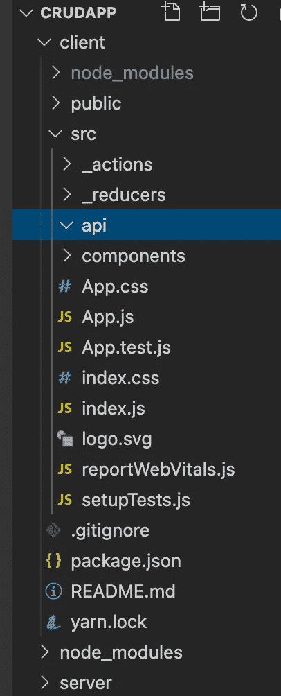
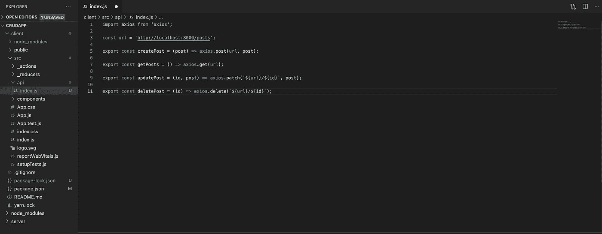
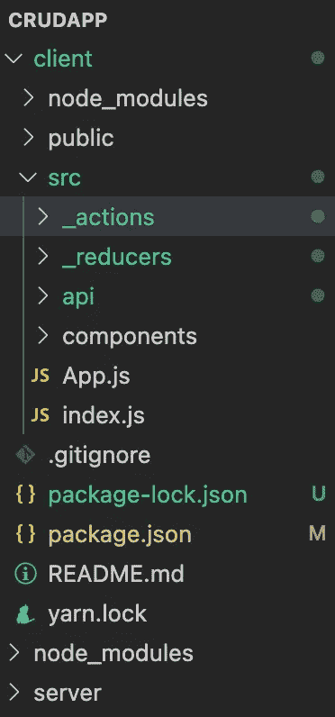

# 了解如何使用 Node 构建全栈应用程序。Js 和 2021 年的 React 第二部分(前端)

> 原文：<https://medium.com/geekculture/learn-how-to-build-a-full-stack-application-using-node-js-and-react-in-2021-part-two-front-end-bfa2665ffaf4?source=collection_archive---------7----------------------->


Photo by [James Harrison](https://unsplash.com/@jstrippa?utm_source=medium&utm_medium=referral) on [Unsplash](https://unsplash.com?utm_source=medium&utm_medium=referral)

第一部分可以在这里找到: [**第一部分:后端**](/swlh/learn-how-to-build-a-full-stack-application-using-node-js-and-react-in-2021-part-1-121fa6762a69)

*很抱歉花了很长时间来写第二部分，忙于生活和学校。*

让我们回顾一下:在第一部分中，我们开始组织我们的后端，并为前端和后端安装一些包。

我们还创建了几个 API 端点，组成了我们的 crud 应用程序。在第一部分中，我们还将 MongoDB 数据库连接到我们的应用程序，并使用 postman 测试了它的可用性。

**第一步:前端文件夹/文件结构**

在我们的客户端中，转到 src 文件夹，在那里创建以下文件夹:

api，

_ 操作，

_ 还原剂，

成分



此时，我们的客户端文件夹应该看起来像这样。

**第二步:连接我们的后端和前端**

在 api 文件夹中创建一个名为 index.js 的文件。

我们需要在 index.js 文件中做的第一件事是导入 axios。

```
import axios from 'axios';
```

现在，让我们创建一个名为 url 的新变量，并将我们的 localhost:8000 地址分配给它。

```
const url = 'http://localhost:8000/posts';
```

让我们变得更有趣一点。

我们将创建四个函数，每个函数代表一个后端调用。

第一个函数将触发创建操作。

```
export const createPost = (post) => axios.post(url, post);
```

让我们再深入一点，了解一下这里发生了什么。

**出口。**

在 JavaScript 中，有两种类型的导出，命名导出和默认导出。上述函数依赖于命名导出。

在我们的 index.js 文件中，当一个文件包含一些需要导出的函数时，命名导出非常有用。使用默认导出，我们将导出一个函数。

**箭头功能。**

这里我们使用 arrow 函数的简写版本，我们的 arrow 函数将接受一个参数，即提交表单时发送的帖子。

**axios**

axios 是一个 js 库，它帮助我们向后端发送请求和从后端接收请求。

axios 提供给我们的大多数函数都是异步的，所以在某些时候，我们需要使用 async/await，但我们不会在这里使用它，而是在 _actions 文件夹中使用它。

axios.post 接受两个参数，一个 url 和它应该发送给后端的内容。

我们将设置的下一个 crud 操作是 read 或 get。

```
export const getPosts = () => axios.get(url);
```

这里我们只是告诉 axios 向后端发送一个 get 请求。

接下来的两个操作是更新和删除。让我们来处理更新。

```
export const updatePost = (id, post) => axios.patch(`${url}/${id}`, post);
```

我们的 updatePost 函数接受两个参数，id 和 Post。一旦我们有了 id，我们告诉 axios 向给定的 id 发出一个补丁请求。这个动作会把文章的新内容发送到后端。

最后，删除

```
export const deletePost = (id) => axios.delete(`${url}/${id}`);
```

我们的 deletePost 函数将只接受一个参数 id。一旦我们获得了 id，我们将告诉 axios 向特定的 id 发出删除请求。

我们的 index.js 文件应该类似于下面这样。



第三步:让我们谈几分钟 redux。

在第一部分中，我简单地提到了 Redux，但是现在是时候正式介绍 Redux 以及为什么需要它了。请记住，Redux 根本不是必需的，但使用它是个好主意。看，有了 react，我们有了一个概念，比如道具传递。
对于简单的应用程序，传递道具完全没问题，可能是比 Redux 更好的选择，但当我们开始处理 API 和构建深度嵌套的组件时，传递道具变得复杂，我们往往会犯更多的错误，导致我们的应用程序更频繁地崩溃。

Redux 有四个主要概念，动作、reducers、分派和存储。

行动就像我们想要传递的信息。这些消息通常是对象。我们的消息需要两样东西，一个类型和有效载荷。Type 让 Redux 知道我们将消息发送给谁，而有效负载是消息本身。在示例代码中，我们使用了动作创建器，它们是返回我们动作的简单函数。

把减压器想象成一个储存容器。我们的 reducer 是一个接受两个参数的函数，初始状态(它可以是数组、对象、数字或字符串，尽管建议使用对象或数组)和动作。基于动作类型，我们可以确定我们想要对状态中的内容做什么。

Dispatch 用于调度我们的动作。

商店是维系一切的纽带。我们商店接收减速器，并根据派单从行动中获得的信息。商店告诉我们的减压器做什么。

让我们看一个 redux 的简单例子。

```
import {createStore} from 'redux'// reducerconst reducer = (state=[], action) => {switch(action.type) {case "SAY": 

    return [...state, action.payload]

 default:return state;}// storeconst store = createStore(reducer);// action creatorfunction sayHello = {type: "SAY",payload: "Hello"}// dispatchstore.dispatch(sayHello());}
```

让我们来分析这段代码。首先，我们需要导入我们的 createStore。之后，我们创建我们的 reducer，它将有一个空数组和动作的状态。

在我们的 reducer 中，我们有一个 switch 语句，它将根据 action.type 来决定需要激活哪个 case。

我们将减速器分配给商店。

我们有一个 action creator，它是一个简单的函数，返回一个带有类型和有效载荷的对象。

最后，我们有调度，将触发我们的行动创造者。

如果你想了解更多关于 redux 的知识，一定要查阅官方文档。

**边注:我们的代码将与示例代码略有不同，因为我们将使用 react-redux 和 thunk。**

**第四步:创建一些动作。**

因为我们在项目中使用 redux，所以从动作开始是明智的。让我们在 _actions 内部创建一个名为 posts.js 的新文件。

我们的行动将与我们的 api 携手并进。让我们从首先导入我们的 API 开始。

```
import * as api from '../api/index';
```

星号(*)告诉我们的应用程序，我们希望从 index.js 文件中导入所有内容，新名称将是 api。

让我们创建第一个函数，它将是一个 curried 函数。Curried 函数有点棘手，因为我们现在处理的是嵌套函数。在我们的例子中，我们有一个 createPost 函数，它接受一个参数 Post。然后，我们将第二个函数嵌套在 createPost 中，这是一个接受单个参数 dispatch 的异步函数。

```
export const createPost = (post) => async (dispatch) => {const { data } = await api.createPost(post);dispatch({ type: 'POST', payload: data });}
```

既然这已经不碍事了。让我们深入了解一下。我们的函数将做两件事。首先，它需要从我们的 api 中析构数据。析构是非常有用的，因为我们正在检索特定的信息，并在同一时间分配它。

我们正在做的第二件事是设置我们的调度，以便在别处调用 createPost 函数时执行。

**边注:要了解更多 curried 函数，请查看此** [**stackoverflow 问题**](https://stackoverflow.com/questions/36314/what-is-currying) **。**

**要了解更多关于析构的知识，请查看本指南，作者为**[**dmitripavlutin**](https://dmitripavlutin.com/javascript-object-destructuring/)**。**

下一个函数将专注于获取我们到目前为止创建的每个帖子，

```
export const getPosts = () => async (dispatch) => {const {data} = await api.getPosts();dispatch({ type: 'GET', payload: data})}
```

如你所见，我们这里有一个模式。唯一真正改变的是我们的 API 调用和类型。

最后两个功能是更新和删除。

```
export const updatePost = (id,post) => async (dispatch) => {const {data} = await api.updatePost(id,post);dispatch({ type: 'UPDATE', payload: id})}export const deletePost = (id) => async (dispatch) => {const { data } = await api.deletePost(id);dispatch({ type: 'DELETE', payload: data });}
```

更新和删除都需要我们有一个 id，稍后我们会得到这个 id。

好了，现在我们完成了动作的创建。该去我们的减速器了。

**步骤 5:创建我们的缩减器。**

在 reducer 中，folder 创建两个文件，index.js 和 posts.js。

首先，我们将处理 posts.js 文件，然后处理 index.js。

让我们从创建一个简单的函数开始

```
export default (posts=[], action) => {}
```

还记得我提到的命名和默认导出吗？这里我们使用默认导出。从这里开始，它只是一个接受两个参数的基本函数，默认状态和动作。

现在，让我们添加一个 switch 语句。

```
export default (posts = [], action) => {switch (action.type) {}}
```

我们的 switch 语句将观察它将从 action.type 中得到什么。是的，这里是连接，action.type 得到任何 dispatch({type:'something'})给它的东西。

到目前为止相当标准。

让我们添加一个默认案例和第一个案例。

```
export default (posts = [], action) => {switch (action.type) {case 'POST':return [...posts, action.payload];default:return posts;}}
```

使用 redux，我们总是需要返回某种状态，如果没有提供 case 或者有一个错别字，默认的 case 就会进入并返回未改变的状态。总是有一个默认的情况下，返回您的不变的状态。这样可以省去你的头痛。

好，我们的第一个案例，那里发生了什么。

当我们想给数组添加东西的时候，我们通常会使用 push 方法，但是 redux 不建议使用 push，因为它被认为是可变的，或者说白了，它会改变我们的数组。

在 redux 中，我们从不希望修改我们的状态，而是希望用一个包含新项的全新数组来改变它。这个概念有点棘手，我花了一段时间才理解。我强烈推荐你们阅读一篇由 [**到**](https://www.toptal.com/javascript/immutability-in-javascript-using-redux) 的文章。

好吧，你可能会问这三个点是什么？说真的，这很神奇。他们被称为传播算子。发生的事情是，这三个点克隆了我们的状态，并在末尾添加了有效负载，所以现在我们有了一个名为 posts 的新数组，其中包含了我们新添加的项。我想你可能会喜欢读这篇 [**StackOverflow 回答**](https://stackoverflow.com/a/31049016) 。

让我们完成剩下的案子。

```
export default (posts = [], action) => {switch (action.type) {case 'POST':return [...posts, action.payload];case 'GET':return action.payload;case 'UPDATE':return posts.map(post => post._id === action.payload._id ?   action.payload : post);case 'DELETE':return posts.filter(post => post._id !== action.payload);default:return posts;}}
```

我们添加了 get、update 和 delete。我们的 get case 返回我们的有效载荷。对于我们的更新，我们使用 map 遍历我们的数组，找到一个与 id 匹配的 post，如果找到匹配，我们就用我们的有效负载替换它。如果找不到匹配，我们就让帖子保持原样。最后，我们使用过滤器删除。

map 和 filter 都返回新的数组，所以它们被认为是不可变的。

在开始使用 react 之前，我们先来看看 reducer 文件夹中的 index.js 文件，并在其中添加几行代码。

```
import { combineReducers } from 'redux';import posts from './posts';export default combineReducers({posts})
```

快速排练。我们正在从 redux 进口组合减速机。组合减速器帮助我们处理多个减速器。我们进口我们的邮政减速器，并通过组合减速器出口。

我们正式完成了减速器部分。让我们开始使用 react。

**第六步:一些反应清理**

从 src 文件夹中删除所有不属于我们创建的文件夹的文件。这次清除后幸存的两个文件是 App.js 和 index.js。

您的 src 文件夹应该如下所示:



让我们继续打扫卫生吧。

转到主 index.js 文件，粘贴以下内容:

```
import React from 'react';import ReactDOM from 'react-dom';import App from './App';ReactDOM.render(<React.StrictMode><App /></React.StrictMode>,document.getElementById('root'));
```

我们为这个特别的项目去掉了很多不必要的线，

现在，打开 App.js，删除所有内容并粘贴以下内容。

```
import React from 'react'function App() {return (<></>);}export default App;
```

我做这个小清洗的原因是我喜欢从头开始工作。

**第 7 步:让我们创建一些组件。**

在 components 文件夹中，创建两个新文件夹 form 和 posts。

在 form 文件夹中，创建一个 Form.js 文件，确保 f 是大写的，它会告诉 react 它正在处理一个组件。

在 Form.js 文件中粘贴以下代码。

```
import React from 'react'import { useForm } from 'react-hook-form';export default function Form() {const { register, handleSubmit } = useForm();return (<>
<form><div><input type="text" name="author" placeholder="Author" {...register('author')} /></div><div><input type="text" name="title" placeholder="Title" {...register('title')} /></div><div><input type="text" name="article" placeholder="article" {...register('article')} /></div><button type="submit">Submit</button></form></>)}
```

首先，我们导入 react 和 useForm 钩子，帮助我们处理表单。随后，我们创建一个简单的 react 组件，并向其中添加一个简单的 HTML 表单和一些输入字段。ref={register}是必需的，因为它告诉 react-hook-form 查看字段捕获，无论用户在其中键入什么，都不需要我们跟踪更改。**巨大的省时器**。

转到 App.js 并导入表单组件。您的 App.js 现在应该是这样的。

```
import React from 'react'import Form from './components/form/Form';function App() {return (<><Form /></>);}export default App;
```

要在 web 浏览器中查看我们的应用程序，请确保您的后端和 react 都在运行。

快速提醒:在服务器文件夹里面运行 **nodemon app.js** 在客户端文件夹里面运行 **npm start** 。

在这一点上，我们应该有一个美丽的形式，应该是这样的:


显然，我们正在这里建造下一个脸书。

第八步:让我们把 redux 和 react 连接起来

打开主 index.js 文件并粘贴以下内容:

```
import React from 'react';import ReactDOM from 'react-dom';import App from './App';import { Provider } from 'react-redux';import { createStore, applyMiddleware, compose } from 'redux';import Thunk from 'redux-thunk';import reducer from './_reducers/index';const store = createStore(reducer, compose(applyMiddleware(Thunk)))ReactDOM.render(<React.StrictMode><Provider store={store}><App /></Provider></React.StrictMode>,document.getElementById('root'));
```

好了，让我们理解一下我们在这里做了什么。我们导入了 Provider、createStore、applyMiddleware、compose、Thunk 和 Store。

这个提供者是 react-redux 提供给我们的，当同时使用 react 和 redux 时，它的全部工作就是让我们的生活变得更容易。

CreateStore 非常简单明了。它为我们创造了一个商店。

Compose 允许我们使用多个 redux 增强器。applyMiddleware 是一个增强器，它让我们可以使用中间件，而 Thunk 是一个我们计划使用的中间件。

还记得之前我们是如何使用 curried 函数的吗？多亏了 Thunk，这在 redux 中成为可能。

**第 9 步:让我们继续构建组件**

转到 App.js 并添加以下内容:

```
import React, { useEffect } from 'react'import Form from './components/form/Form';import { useDispatch } from 'react-redux';import { getPosts } from './_actions/posts';function App() {const dispatch = useDispatch();useEffect(() => {dispatch(getPosts);}, [dispatch])return (<><Form /></>);}export default App;
```

我们在 App.js 中添加了一些东西，以使我们的应用程序更好。首先，我们导入了 useEffect，然后导入了 useDispatch，最后，我们导入了 getPosts 操作。

useEffect hook 非常酷，因为它可以让我们在用户访问网站时从数据库中获取所有发布的内容。

useEffect 的工作方式是，当有人访问带有 useEffect 挂钩的页面时，数据将在第一次加载时可用。[]告诉 useEffect 只在[]中的特定项目发生变化时更新，在我们的例子中，是它的调度。

**步骤 10:让我们继续处理我们的 Form.js 文件**

回到表单组件，让它执行一些操作，例如，向我们的数据库发送数据。

我们的新 Form.js 文件应该如下所示:

```
import React from 'react';import { useForm } from 'react-hook-form';import { createPost } from '../../_actions/posts';import { useDispatch } from 'react-redux';export default function Form() {const { register, handleSubmit, reset } = useForm();const dispatch = useDispatch()const onSubmit = (data) => {dispatch(createPost(data))reset()}return (<><form onSubmit={handleSubmit(onSubmit)}><div><input type="text" name="author" placeholder="Author" {...register('author')} /></div><div><input type="text" name="title" placeholder="Title" {...register('title')}/></div><div><input type="text" name="article" placeholder="article" {...register('article')} /></div><button type="submit">Submit</button></form></>)}
```

将旧的 Form.js 文件与更新后的版本进行比较时，有几件事应该引起我们的注意。

首先，我们有了一些新的进口产品，现在我们应该已经熟悉了。

```
import { createPost } from '../../_actions/posts';import { useDispatch } from 'react-redux';
```

第一个导入为我们获取动作，第二个导入为我们获取调度挂钩。不言自明。

下一行是我们正在使用的 useDispatch 钩子。

```
const dispatch = useDispatch();
```

我们的 Form.js 文件中有另一个新东西，它是一个名为 onSubmit 的函数。这个函数使得表单可以在 react 中使用..

我们来解剖一下这个小函数。

```
const onSubmit = (data) => {dispatch(createPost(data))reset()}
```

我们的 onSubmit 函数只接受一个参数。这个论点将被称为数据。

在我们的 onSubmit 中，我们将做两件事，分派一个在数据库中创建新帖子的动作，并清除输入字段。

您可能会问，它如何知道如何清除字段以及数据来自哪里？

清除字段非常简单，只需在我们的 useForm 钩子上添加另一个名为 reset 的键。

```
const { register, handleSubmit, reset } = useForm();
```

现在，我们的数据通过 ref={register}来自我们的输入字段。它被传递给我们的 handleSubmit 函数，该函数接受我们的 onSubmit 函数。这有点令人困惑，但确实有效。

简而言之，当用户提交表单时，会发生一些事情。首先，我们获取 register 中所有字段的值和名称。然后，我们的 register 函数将所有字段作为 onSubmit 函数获得的数据传递给 handleSubmit 函数。最后，我们现在拥有的数据被传递给我们的 createPost 操作，该操作告诉我们的后端在我们的数据库中创建一个新的帖子，最后，一旦我们完成，reset 函数被执行，我们的字段被清除

我强烈推荐你阅读[**react-hook-form API**](https://react-hook-form.com/api/)，因为它有一些有价值的信息，坦白地说，它是我最近遇到的最好的文档之一。

**第 11 步:让我们显示一些我们提交的数据**

如果您已经按照本教程学习了这么久，那么您应该已经有了一个向数据库提交数据的工作表单。是时候拿回我们的数据并展示给世界了。

在我们的组件文件夹中，应该有一个名为 posts 的文件夹，如果没有这个文件夹，就创建它。

在我们的 posts 文件夹中，创建一个名为 Posts.js 的文件，同时创建另一个名为 post 的文件夹。在 post 文件夹中，创建一个名为 Post.js 的文件。

这样做是为了组织，不要那样看着我。

让我们再次开始编码。

打开 Post.js 文件，确保它在 Post 文件夹中。在 Post.js 文件中，创建一个新的 react 组件。

我们的 Post 组件将接受一些属性，如作者、标题、文章和 createAt。

Post.js 应该是这样的:

```
import React from 'react'export default function Post({author, title, article, createAt}) {return (<></>)}
```

很好，让我们用一个 div 填充组件，一个 h1 用于标题，一个 h3 用于文章，一个 p 标记用于作者，一个 span 标记用于保存日期。

此时，我们的 Post.js 文件应该类似于下面这样:

```
import React from 'react'export default function Post({author, title, article, createAt}) {return (<><div><p>Author: {author}</p><h1>{title}</h1><h3>{article}</h3><span>{createAt}</span></div></>)}
```

我们已经完成了 Post 组件。是时候进入我们的文章部分了。

**步骤 11.5:继续…**

在 Posts.js 内部，导入 react 并使用 Post.js 的前一个模板(没有我们的 HTML 标签的那个)设置它。

在我们继续之前，使用 **npm i dayjs** 安装 dayjs。Dayjs 是一个帮助我们显示日期的 JavaScript 库。

将以下导入添加到 Posts.js 文件中:

```
import { useSelector } from 'react-redux';import Post from './post/Post';import * as dayjs from 'dayjs';import relativeTime from 'dayjs/plugin/relativeTime';dayjs.extend(relativeTime);
```

我没有包括 React 导入，因为我假设您已经有了它。

让我们深入研究一下新的进口产品。

首先，我们有一个用户选择器。

```
import { useSelector } from 'react-redux';
```

UseSelector 帮助我们从特定的缩减器中检索数据(状态),在我们的例子中，这个缩减器是 posts。

接下来我们有一天。

```
import * as dayjs from 'dayjs';
```

如前所述，dayjs 是一个 JavaScript 库，它帮助我们显示人类可以理解的日期。仅供参考，dayjs 不仅仅是显示日期。要了解这个库的更多信息，请阅读他们的 [***文档***](https://day.js.org/) ***。***

最后两行是不言自明的。relativeTime import 导入一个插件，使用 extends 的 dayjs 可以用它来显示相对日期。

是时候用我们的进口货了。

我们将使用的第一个导入是我们的 useSelector 钩子。它的工作方式是接受一个返回我们状态的回调函数。之后，我们将它返回的值赋给一个变量。

大概是这样的:

```
const posts = useSelector(state => state.posts)
```

我们的 posts 变量现在保存一个数组，因为我们的状态是一个数组。

此时，我们将简单地遍历我们的帖子并填充 Post 组件，对于这个循环，我们将使用 map。

这应该是最终产品。

```
{posts.map(post => {return (<Post key={post._id} author={post.author} title={post.title} article={post.article} createAt={dayjs(post.createdAt).format('MM/DD/YYYY')}/>)})}
```

让我们把它分成有意义的部分。

首先，我们使用 map 遍历 posts 变量。每个数组索引保存一个 post 对象，该对象依次保存我们的作者、标题、文章和创建日期。然后，我们将这个单独的对象作为单独的道具传递给我们的 Post 组件。

伙计们，我们已经完成了一半，我们有一个半生不熟的应用程序，从数据库中添加和显示数据。是时候添加更新和删除等其他功能了。

**第 12 步:更新我们的数据**

伙计们，我们的半成品应用程序已经完成了一半，现在可以添加和显示来自数据库的数据。是时候添加更新和删除等剩余功能了。

我们先从 App.js 开始，在 App.js 内部，导入 useState hook，给它分配一个状态，0 就可以了。

您的导入语句应该如下所示:

```
import React, {useState, useEffect } from 'react'
```

您的使用状态应该如下所示:

```
const [id, setId] = useState(0)
```

让我们进一步更新我们的 App.js 文件。更新以下内容:

```
<Form setId={setId} getId={id}/><Posts setId={setId}/>
```

我们在上面所做的只是简单地传递我们的状态(id ),并赋予 Posts 和 Form 为我们改变状态的能力。

导航到您的 Posts.js 组件，让我们为它提供一些支持。

更新以下内容:

```
export default function Posts() {
```

对此:

```
export default function Posts({setId}) {
```

另外，让我们更新我们的

我们的循环是这样的:

```
{posts.map(post => {return (<Post key={post._id} author={post.author} title={post.title} article={post.article} createAt={dayjs(post.createdAt).format('MM/DD/YYYY')}/>)})}
```

对此:

```
{posts.map(post => {return (<Post key={post._id} setId={setId} postId={post._id} author={post.author} title={post.title} article={post.article} createAt={dayjs(post.createdAt).format('MM/DD/YYYY')}/>)})}
```

我们已经将 setId 属性传递给了 Post.js 组件，并将单个帖子 Id 传递给了 post id 属性。

现在，打开您的 Post.js 组件并添加两个 HTML 按钮，一个用于更新，另一个用于删除。另外，传递我们添加的属性，比如 setId 和 postId。

这两个按钮都将处理 onClick，所以也要添加它。您的更新按钮应该是这样的:

```
<button onClick={() => {setId(postId)}}>Update</button>
```

我们稍后将处理删除按钮。

转到 Form.js 组件，让我们给它添加一些东西。

首先，我们需要导入 useEffect。我们还需要导入 useSelector，并且不要忘记导入我们的 updatePost 操作。

同样，将 setId 和 getId 传递给 Form。

在 useForm 中，添加另一个名为 setValue 的属性。setValue 帮助我们在用户单击 update 时捕获更新的数据。

在 useForm 挂钩下添加以下内容:

```
const post = useSelector(state => state.posts.find((post) => post._id === getId ? post: null ))
```

useSelector 在这里做的是查找一个帖子。如果它找到一个 post，它会把它赋给我们的 post 变量。如果没有，它将把 null 传递给我们的 post 变量。

让我们使用 useEffect。添加以下代码:

```
useEffect(() => {if (getId !== 0) {let keys = Object.keys(post);keys.forEach((key) => setValue(key, post[key]))}}, [getId, post ,setValue])
```

这里很酷的一点是，useEffect 只有在我们有 id 的情况下才会执行。如果我们不这样做，什么都不会发生。但是如果我们有一个 id，我们首先需要找到所有的关键字，比如作者、标题、文章和创建日期。之后，我们将使用 forEach 遍历每个键，并使用从 useForm 获得的 setValue 为输入字段赋值。

另一个需要注意的是方括号内的项目。他们的工作是告诉 useEffect 只在其中一个发生变化时执行。

最后，让我们更新 onSubmit 函数。我们新的 onSubmit 应该是这样的:

```
const onSubmit = (data) => {if (getId === 0) {dispatch(createPost(data))reset()} else {dispatch(updatePost(getId, data))reset()setId(0)}}
```

我们使用条件语句来检查是否有 id。如果我们有一个 id，updatePost 将被调度。如果我们没有 id，createPost 将被调度。

我们最终的 Form.js 应该是这样的:

```
import React, {useEffect} from 'react';import { useForm } from 'react-hook-form';import { createPost, updatePost } from '../../_actions/posts';import { useDispatch } from 'react-redux';import {useSelector} from 'react-redux'export default function Form({setId, getId}) {const { register, handleSubmit, reset, setValue } = useForm();const post = useSelector(state => state.posts.find((post) => post._id === getId ? post: null ))const dispatch = useDispatch()useEffect(() => {if (getId !== 0) {let keys = Object.keys(post);keys.forEach((key) => setValue(key, post[key]))}}, [getId, post, setValue])const onSubmit = (data) => {if (getId === 0) {dispatch(createPost(data))reset()} else {dispatch(updatePost(getId, data))reset()
setId(0)}}return (<><form onSubmit={handleSubmit(onSubmit)}><div><input type="text" name="author" placeholder="Author" {...register('author')} /></div><div><input type="text" name="title" placeholder="Title" {...register('title')} /></div><div><input type="text" name="article" placeholder="article" {...register('article')} /></div><button type="submit">Submit</button></form></>)}
```

好了，伙计们，我只想说所有的艰苦工作都快完成了！我们最不想包含的是 crud 应用程序的删除部分。

**第十三步:删除按钮**

还记得我说过我们会回到删除按钮，是时候了。

打开您的 Post.js 组件，导入 useDispatch，同时导入我们的 deletePost 操作。

在您的 delete 按钮中，添加一个 onClick prop，并告诉它调度 deletePost 操作。

您的删除按钮应该如下所示:

```
<button onClick={() => {dispatch(deletePost(postId))}}>Delete</button>
```

最终的 Post.js 组件应该如下所示:

```
import React from 'react'import {useDispatch} from 'react-redux'import {deletePost} from '../../../_actions/posts'export default function Post({setId, author, title, article, createAt, postId}) {const dispatch = useDispatch()return (<><div><p>Author: {author}</p><h1>{title}</h1><h3>{article}</h3><span>{createAt}</span><div><button onClick={() => {setId(postId)}}>Update</button><button onClick={() => {dispatch(deletePost(postId))}}>Delete</button></div></div></>)}
```

**第 14 步:测试我们的应用**

恭喜各位，你们刚刚学会了如何使用 MERN 堆栈构建一个完整的堆栈应用程序。

[**链接到回购**](https://github.com/elisvcodes/medium-post)

如果你觉得这个教程有用，你可以为它鼓掌，或者如果你有任何问题，你可以在 [Linkedin](https://www.linkedin.com/in/elisvcodes/) 或 [Twitter](https://twitter.com/elisvcodes) 上找到我。