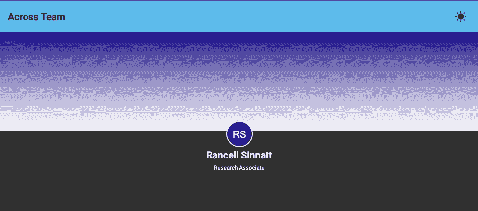
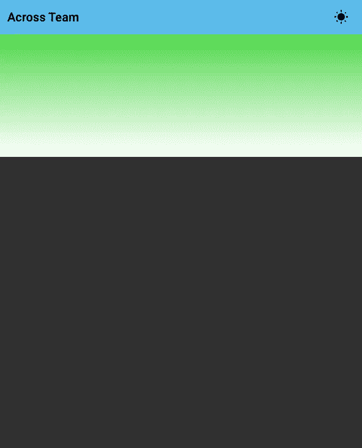
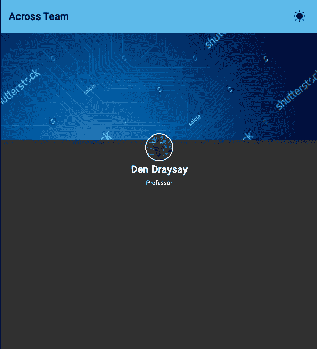

# 了解如何立即为您的 Web 应用程序创建自定义占位符图像

> 原文：<https://medium.com/geekculture/learn-how-to-create-custom-placeholder-images-for-your-web-app-in-no-time-314f76a72615?source=collection_archive---------11----------------------->



图像占位符对于任何应用程序来说都是非常重要的，尽管有很多虚拟 API 也是如此。很多时候，我发现自己不想依赖这些可能是为了稳定，成本或交通等。因此，有时我们最终会对所有个人资料使用相同的通用占位符，我觉得这很无聊。所以我放了这个小教程来帮助用户快速设置自定义的占位符图片。

这里，我们将使用 canvas 创建一个带有姓名首字母的占位符个人资料图片和一个带有相同颜色的渐变标题图像占位符，如果图像不在数据库中，则在**角度应用程序**中使用。

在这里，我们将讨论以下主题:

*   概观
*   生成随机颜色
*   生成反转颜色
*   生成标题样式
*   生成个人资料图像

## 概观

我将在本演示中使用的示例 API 响应。

```
// Sample JSON respponse for user Data
{
 "id": 1,
 "firstName": "Den",
 "lastName": "Draysay",
 "role": "Professor",
 "profileImg": null,
 "headerImg": null
}// user interface defined for type
export interface User {
    firstName: string;
    lastName: string;
    role?: string;
    profileImg?: string;
    headerImg?: string;
    color?: string;
}
```

创建一个角度组件“用户轮廓”，服务“颜色”和“用户”和管道“轮廓图像”。

在用户配置文件组件中，我们可以创建一个类型为 user 的变量用户配置文件来存储来自 API onInit 的响应。

```
import { Component, OnInit } from '@angular/core';
import { ActivatedRoute } from '@angular/router';
import { User } from 'src/app/models/user';
import { UserService } from 'src/app/services/user.service';@Component({
    selector: 'at-user-profile',
    templateUrl: './user-profile.component.html',
    styleUrls: ['./user-profile.component.scss'],
})export class UserProfileComponent implements OnInit {
    public userProfile!: User;
    public userId!: string;constructor(
        private readonly userService: UserService,
        private readonly route: ActivatedRoute,
    ) { }public async ngOnInit(): Promise<void> {
        await this.route.params.subscribe(params =>
            this.userId = params['userId']
        )
        await this.fetchUserData();
    }private fetchUserData(): void {            
        this.userService.fetchUserData(this.userId).
            subscribe((data: User)=> {
                this.userProfile = data;
            });
    }
}
```

用户服务将用于进行 HTTP 调用。

```
import { HttpClient } from '@angular/common/http';
import { Injectable } from '@angular/core';
import { Observable } from 'rxjs';
import { User } from '../models/user';@Injectable({
    providedIn: 'root'
})
export class UserService {
    private readonly baseUrl = `http://localhost:3000`;constructor(
        private readonly http: HttpClient
    ) { }public fetchUserData(userId: string): Observable<User> {
        return this.http.get<User>(`${this.baseUrl}/users/${userId}`);
    }
}
```

## 生成随机颜色

我们的第一步是获取占位符图像中使用的随机颜色。因此，我们将在服务中创建一个方法，返回有效的十六进制代码。

```
public generateRandomColorCode(): string {
    const hex = Math.floor(Math.random()*16777215).toString(16);
    const randomColorCode = hex.toString().length < 6 ?
        this.generateRandomColorCode() : `#${hex}`;
    return randomColorCode ;
}
```

现在，我们可以使用这个方法为在 user-profile 组件中获取的用户配置文件设置颜色。

在 fetchUserData 中。订阅我们可以在构造函数中注入颜色服务后调用这个服务。

如果我们希望在用户未来登录时保持相同的颜色，我们可以将随机生成的颜色与用户详细信息一起保存到数据库中，或者如果我们每次用户访问时都需要新的颜色，我们可以调用此方法。

```
// to use a new color every time
this.userProfile.color = this.color.generateRandomColorCode();
// to use same color every time
this.userProfile.color = this.userProfile.color ?
    this.userProfile.color :
    this.color.generateRandomColorCode();
```

## 生成反转颜色

我们还需要一个方法，可以给我们一个黑色或白色的基础上十六进制颜色，我们必须打印在个人资料图片或创建标题渐变的缩写。

我们可以在颜色服务中创建这个方法。

```
public getInvertedColor(hex: string): string{
    if (hex.indexOf('#') === 0) {
        hex = hex.slice(1);
    }const r = parseInt(hex.slice(0, 2), 16),
          g = parseInt(hex.slice(2, 4), 16),
          b = parseInt(hex.slice(4, 6), 16);return (r * 0.299 + g * 0.587 + b * 0.114) > 186 ? 
        '#000000' :
        '#FFFFFF';
}
```

> 注意:此方法可以改进，以提供与十六进制颜色相反的各种颜色，从而生成渐变，并且有条件地使用标志仅输出轮廓图片字体的黑色和白色。点击[这里](https://stackoverflow.com/questions/35969656/how-can-i-generate-the-opposite-color-according-to-current-color)获取详细信息。

## 生成标题样式

现在，我们可以在颜色服务中创建一个方法，或者创建一个自定义管道，这取决于您的用例，但基本逻辑是相同的，我们需要一个方法来根据用户配置文件为我们提供 CSS 样式。

因此，考虑到用户可能已经上传了标题图像，因此在这些情况下，我们必须显示该图像，如果用户没有标题图像，我们将根据我们为用户生成的随机颜色生成线性渐变。

```
public getHeaderStyles(user: User): any {
    let headerBkg: any;
    if (user.profile.headerImg) {
        headerBkg = {
           'background-image': `url('${user.headerImg}')`,
           'background-size': 'cover',
        }
    } else {
        const secondaryColor = this.getInvertedColor(user.profile.color || '');
        headerBkg = {
        'background': `linear-gradient(${user.profile.color}, ${secondaryColor})`,
        }
    }
return headerBkg;
}
```

user-profile.component.html

```
<div
    class="user-profile-cover"
    [ngStyle]= "headerBkg"
></div>
```

用户配置文件.组件. scss

```
.user-profile{
    &-cover{
        height: 20%;
    }
}
```

user-profile.component.ts

创建一个变量

```
public headerBkg!: any;
```

将随机颜色分配给 userProfile.color 属性后，将 CSS 样式分配给创建的变量

```
this.headerBkg = this.color.getHeaderStyles(this.userProfile);
```

现在，如果没有标题图像，您应该有一个随机颜色的标题占位符；如果提供了标题图像，您应该有一个图像。


If the header image is present.



if no Header image

## 生成个人资料图像

现在到了有趣的部分，如果用户没有提供的话，生成一个样本轮廓图片。

我将使用自定义管道纵断面图像。

profile-image.pipe.ts

```
import { Pipe, PipeTransform } from '@angular/core';
import { User } from 'src/app/models/user';
import { ColorService } from '../util/color.service';@Pipe({
    name: 'profileImage'
})export class ProfileImagePipe implements PipeTransform {constructor(private readonly color: ColorService){}transform(user: User): string {
        if(user.profile.profileImg){
            return user.profile.profileImg;
        }const canvas = document.createElement('canvas');
    canvas.style.display = 'none';
    canvas.width = 50;
    canvas.height = 50;
    document.body.appendChild(canvas);const context = canvas.getContext('2d');
    context!.fillStyle = user?.profile.color || '';
    context!.beginPath();
    context!.arc(canvas.width/2, canvas.height/2, canvas.height/2, 0, Math.PI * 2);
    context!.fill();
    context!.font = '20px Arial';
    context!.fillStyle = this.color.getInvertedColor(user.profile.color || '');
    const initials = this.getInitials(
        user.profile.firstName,
        user.profile.lastName);context?.fillText(initials, canvas.width/4.5, canvas.height/1.5);const data = canvas.toDataURL();
    document.body.removeChild(canvas);
    return data;
}private getInitials(firstName: any, lastName: any): string {
        return firstName.charAt(0).toUpperCase() +          lastName.charAt(0).toUpperCase();
    }}
```

> 注意:现在我们可以在 img 的 src 属性的 html 中直接使用这个管道，或者在 user profile 组件中创建一个变量，并使用管道转换方法将 src 值存储在该变量中。

user-profile.component.html

```
<!--Header-->
<div
    class="user-profile-cover"
    [ngStyle]= "headerBkg"
></div>
<div class="user-profile-info">
   <!--profile Image-->
    <div class="user-profile-info-img">
        
   </div><h2 class="user-profile-info__name">{{fullName}}</h2>
   <h5 class="user-profile-info__role">{{userProfile.role}}</h5>
</div>
```

用户配置文件.组件. scss

```
.user-profile {
    &-cover {
       height: 20%;
    }&-info { 
       display: flex;
       flex-direction: column;
       align-items: center;
       &-img {
           display: flex;
           justify-content: center;
           &__img {
                margin-top: -20px;
                border: #fff 2px solid;
                border-radius: 50%;
                width: 50px;
                height: 50px;
           }
       }
       &__name{
            margin: 0;
       }
       &__role{
            margin: 0;
       }
   }
}
```

所有这些编码完成后，您应该完成了，应该有一个标题图像和配置文件图像的占位符样本，如果用户没有提供，如果用户提供图像，那么应该显示图像而不是占位符。



If the user provides images.


If the user does not provide images

感谢您的阅读，如果您有任何问题或建议，请在评论中联系我。